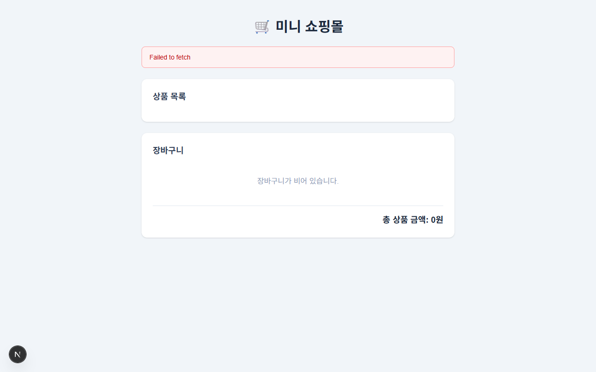

# Next.js 및 FastAPI 기반 미니 장바구니 애플리케이션

- 과목: 풀스택 웹 개발
- 날짜: 2026-08-19
- 태그: next.js, fastapi, sqlite, react, python, typescript

## 설명

Next.js 프론트엔드와 FastAPI 백엔드, SQLite 데이터베이스를 연동하여 구축한 미니 쇼핑몰 장바구니 프로젝트입니다. 백엔드에서는 Pydantic을 활용한 데이터 검증과 SQLite를 통한 상품 및 장바구니 영속성을 관리하며, 중복 상품 추가 시 수량 자동 증가와 수량 변경, 장바구니 전체 비우기와 같은 REST API 엔드포인트를 제공합니다. 프론트엔드에서는 React의 상태 관리 및 비동기 Fetch API를 활용하여 상품 목록과 장바구니 데이터를 실시간으로 동기화하고 총 결제 금액을 자동 계산합니다. Tailwind CSS를 활용해 반응형 UI를 구성하고 개발 서버 및 백엔드 로그 확인까지 포함된 풀스택 실습 과제입니다.

## 원본 파일

업로드한 프로젝트의 원본 파일 28개가 폴더 구조 그대로 [source/](./source/)에 보관되어 있습니다.

- [backend/.gitignore](./source/backend/.gitignore)
- [backend/database.py](./source/backend/database.py)
- [backend/main.py](./source/backend/main.py)
- [backend/requirements.txt](./source/backend/requirements.txt)
- [backend/shop.db](./source/backend/shop.db)
- [backend/uvicorn.log](./source/backend/uvicorn.log)
- [frontend/.env.local](./source/frontend/.env.local)
- [frontend/.gitignore](./source/frontend/.gitignore)
- [frontend/AGENTS.md](./source/frontend/AGENTS.md)
- [frontend/app/favicon.ico](./source/frontend/app/favicon.ico)
- [frontend/app/globals.css](./source/frontend/app/globals.css)
- [frontend/app/layout.tsx](./source/frontend/app/layout.tsx)
- [frontend/app/page.tsx](./source/frontend/app/page.tsx)
- [frontend/CLAUDE.md](./source/frontend/CLAUDE.md)
- [frontend/devserver.log](./source/frontend/devserver.log)
- [frontend/eslint.config.mjs](./source/frontend/eslint.config.mjs)
- [frontend/next-env.d.ts](./source/frontend/next-env.d.ts)
- [frontend/next.config.ts](./source/frontend/next.config.ts)
- [frontend/package.json](./source/frontend/package.json)
- [frontend/postcss.config.mjs](./source/frontend/postcss.config.mjs)
- [frontend/public/file.svg](./source/frontend/public/file.svg)
- [frontend/public/globe.svg](./source/frontend/public/globe.svg)
- [frontend/public/next.svg](./source/frontend/public/next.svg)
- [frontend/public/vercel.svg](./source/frontend/public/vercel.svg)
- [frontend/public/window.svg](./source/frontend/public/window.svg)
- [frontend/README.md](./source/frontend/README.md)
- [frontend/tsconfig.json](./source/frontend/tsconfig.json)
- [README.md](./source/README.md)

## 코드

<details>
<summary><strong>frontend/eslint.config.mjs</strong> — Next.js 및 TypeScript 프로젝트의 코드 스타일과 품질 검사를 위해 ESLint 규칙 및 예외 경로를 설정한 파일입니다.</summary>

```javascript
import { defineConfig, globalIgnores } from "eslint/config";
import nextVitals from "eslint-config-next/core-web-vitals";
import nextTs from "eslint-config-next/typescript";

const eslintConfig = defineConfig([
  ...nextVitals,
  ...nextTs,
  // Override default ignores of eslint-config-next.
  globalIgnores([
    // Default ignores of eslint-config-next:
    ".next/**",
    "out/**",
    "build/**",
    "next-env.d.ts",
  ]),
]);

export default eslintConfig;
```

</details>

<details>
<summary><strong>frontend/next-env.d.ts</strong> — Next.js 타입 스크립트 지원을 위한 전역 타입 선언 및 개발용 경로 참조 파일입니다.</summary>

```typescript
/// <reference types="next" />
/// <reference types="next/image-types/global" />
import "./.next/dev/types/routes.d.ts";
import "./.next/dev/types/root-params.d.ts";

// NOTE: This file should not be edited
// see https://nextjs.org/docs/app/api-reference/config/typescript for more information.
```

</details>

<details>
<summary><strong>frontend/next.config.ts</strong> — Next.js 프레임워크의 빌드 및 사용자 정의 설정을 정의하기 위한 TypeScript 세팅 파일입니다.</summary>

```typescript
import type { NextConfig } from "next";

const nextConfig: NextConfig = {
  /* config options here */
};

export default nextConfig;
```

</details>

<details>
<summary><strong>frontend/package.json</strong> — 프론트엔드 애플리케이션의 패키지명, 버전을 비롯해 Next.js, React, Tailwind CSS 등의 의존성 및 스크립트를 정의한 구성 파일입니다.</summary>

```json
{
  "name": "frontend",
  "version": "0.1.0",
  "private": true,
  "scripts": {
    "dev": "next dev",
    "build": "next build",
    "start": "next start",
    "lint": "eslint"
  },
  "dependencies": {
    "next": "16.3.1",
    "react": "19.2.8",
    "react-dom": "19.2.8"
  },
  "devDependencies": {
    "@tailwindcss/postcss": "^4",
    "@types/node": "^20",
    "@types/react": "^19",
    "@types/react-dom": "^19",
    "eslint": "^9",
    "eslint-config-next": "16.3.1",
    "tailwindcss": "^4",
    "typescript": "^5"
  }
}
```

</details>

<details>
<summary><strong>frontend/postcss.config.mjs</strong> — Tailwind CSS 스타일링 처리를 위해 PostCSS 플러그인 모듈을 등록한 구성 파일입니다.</summary>

```javascript
const config = {
  plugins: {
    "@tailwindcss/postcss": {},
  },
};

export default config;
```

</details>

<details>
<summary><strong>frontend/tsconfig.json</strong> — TypeScript 컴파일러의 경로 별칭(@/*), 모듈 해석 방식, strict 모드 등의 옵션을 설정한 파일입니다.</summary>

```json
{
  "compilerOptions": {
    "target": "ES2017",
    "lib": ["dom", "dom.iterable", "esnext"],
    "allowJs": true,
    "skipLibCheck": true,
    "strict": true,
    "noEmit": true,
    "esModuleInterop": true,
    "module": "esnext",
    "moduleResolution": "bundler",
    "resolveJsonModule": true,
    "isolatedModules": true,
    "jsx": "react-jsx",
    "incremental": true,
    "plugins": [
      {
        "name": "next"
      }
    ],
    "paths": {
      "@/*": ["./*"]
    }
  },
  "include": [
    "next-env.d.ts",
    "**/*.ts",
    "**/*.tsx",
    ".next/types/**/*.ts",
    ".next/dev/types/**/*.ts",
    "**/*.mts"
  ],
  "exclude": ["node_modules"]
}
```

</details>

<details>
<summary><strong>frontend/app/globals.css</strong> — Tailwind CSS 가져오기 선언 및 라이트/다크 모드 변수와 기본 테마 설정을 담고 있는 전역 CSS 스타일시트입니다.</summary>

```css
@import "tailwindcss";

:root {
  --background: #ffffff;
  --foreground: #171717;
}

@theme inline {
  --color-background: var(--background);
  --color-foreground: var(--foreground);
  --font-sans: var(--font-geist-sans);
  --font-mono: var(--font-geist-mono);
}

@media (prefers-color-scheme: dark) {
  :root {
    --background: #0a0a0a;
    --foreground: #ededed;
  }
}

body {
  background: var(--background);
  color: var(--foreground);
  font-family: Arial, Helvetica, sans-serif;
}
```

</details>

<details>
<summary><strong>frontend/app/layout.tsx</strong> — Google Geist 폰트를 적용하고 페이지 공통 HTML 구조 및 메타데이터를 정의하는 루트 레이아웃 컴포넌트입니다.</summary>

```typescript
import type { Metadata } from "next";
import { Geist, Geist_Mono } from "next/font/google";
import "./globals.css";

const geistSans = Geist({
  variable: "--font-geist-sans",
  subsets: ["latin"],
});

const geistMono = Geist_Mono({
  variable: "--font-geist-mono",
  subsets: ["latin"],
});

export const metadata: Metadata = {
  title: "미니 쇼핑몰",
  description: "Next.js + FastAPI + SQLite 미니 장바구니 실습",
};

export default function RootLayout({ children }: LayoutProps<"/">) {
  return (
    <html
      lang="en"
      className={`${geistSans.variable} ${geistMono.variable} h-full antialiased`}
    >
      <body className="min-h-full flex flex-col">{children}</body>
    </html>
  );
}
```

</details>

<details>
<summary><strong>frontend/app/page.tsx</strong> — 상품 목록 및 장바구니 조회, 장바구니 담기, 수량 조절, 삭제, 전체 비우기 등의 인터랙션과 총금액 계산 로직을 담은 메인 페이지 컴포넌트입니다.</summary>

```typescript
"use client";

import { useEffect, useState, useCallback } from "react";

const API_URL = process.env.NEXT_PUBLIC_API_URL || "http://localhost:8000";

type Product = {
  id: number;
  name: string;
  price: number;
};

type CartItem = {
  id: number;
  product_id: number;
  name: string;
  price: number;
  quantity: number;
};

function formatWon(value: number) {
  return value.toLocaleString("ko-KR") + "원";
}

export default function Home() {
  const [products, setProducts] = useState<Product[]>([]);
  const [cart, setCart] = useState<CartItem[]>([]);
  const [loading, setLoading] = useState(true);
  const [error, setError] = useState<string | null>(null);

  const loadProducts = useCallback(async () => {
    const res = await fetch(`${API_URL}/products`);
    if (!res.ok) throw new Error("상품 목록을 불러오지 못했습니다.");
    setProducts(await res.json());
  }, []);

  const loadCart = useCallback(async () => {
    const res = await fetch(`${API_URL}/cart`);
    if (!res.ok) throw new Error("장바구니를 불러오지 못했습니다.");
    setCart(await res.json());
  }, []);

  useEffect(() => {
    (async () => {
      try {
        await Promise.all([loadProducts(), loadCart()]);
      } catch (e) {
        setError(e instanceof Error ? e.message : "알 수 없는 오류가 발생했습니다.");
      } finally {
        setLoading(false);
      }
    })();
  }, [loadProducts, loadCart]);

  async function handleAddToCart(productId: number) {
    try {
      const res = await fetch(`${API_URL}/cart`, {
        method: "POST",
        headers: { "Content-Type": "application/json" },
        body: JSON.stringify({ product_id: productId, quantity: 1 }),
      });
      if (!res.ok) throw new Error("장바구니 추가에 실패했습니다.");
      await loadCart();
    } catch (e) {
      setError(e instanceof Error ? e.message : "알 수 없는 오류가 발생했습니다.");
    }
  }

  async function handleDelete(cartId: number) {
    try {
      const res = await fetch(`${API_URL}/cart/${cartId}`, { method: "DELETE" });
      if (!res.ok) throw new Error("삭제에 실패했습니다.");
      await loadCart();
    } catch (e) {
      setError(e instanceof Error ? e.message : "알 수 없는 오류가 발생했습니다.");
    }
  }

  async function handleQuantityChange(cartId: number, nextQuantity: number) {
    if (nextQuantity < 1) return;
    try {
      const res = await fetch(`${API_URL}/cart/${cartId}`, {
        method: "PATCH",
        headers: { "Content-Type": "application/json" },
        body: JSON.stringify({ quantity: nextQuantity }),
      });
      if (!res.ok) throw new Error("수량 변경에 실패했습니다.");
      await loadCart();
    } catch (e) {
      setError(e instanceof Error ? e.message : "알 수 없는 오류가 발생했습니다.");
    }
  }

  async function handleClearCart() {
    try {
      const res = await fetch(`${API_URL}/cart/clear`, { method: "DELETE" });
      if (!res.ok) throw new Error("장바구니 비우기에 실패했습니다.");
      await loadCart();
    } catch (e) {
      setError(e instanceof Error ? e.message : "알 수 없는 오류가 발생했습니다.");
    }
  }

  const totalPrice = cart.reduce((sum, item) => sum + item.price * item.quantity, 0);

  return (
    <div className="min-h-screen bg-slate-100 py-10 px-4">
      <div className="mx-auto max-w-2xl space-y-6">
        <h1 className="text-center text-3xl font-bold text-slate-800">
          🛒 미니 쇼핑몰
        </h1>

        {error && (
          <div className="rounded-lg border border-red-300 bg-red-50 px-4 py-3 text-sm text-red-700">
            {error}
          </div>
        )}

        {loading ? (
          <p className="text-center text-slate-500">불러오는 중...</p>
        ) : (
          <>
            {/* 상품 목록 */}
            <section className="rounded-xl bg-white p-6 shadow-sm">
              <h2 className="mb-4 text-lg font-semibold text-slate-700">
                상품 목록
              </h2>
              <ul className="divide-y divide-slate-100">
                {products.map((product) => (
                  <li
                    key={product.id}
                    className="flex items-center justify-between py-3"
                  >
                    <span className="font-medium text-slate-800">
                      {product.name}
                    </span>
                    <div className="flex items-center gap-4">
                      <span className="text-slate-600">
                        {formatWon(product.price)}
                      </span>
                      <button
                        onClick={() => handleAddToCart(product.id)}
                        className="rounded-lg bg-blue-600 px-3 py-1.5 text-sm font-medium text-white hover:bg-blue-700"
                      >
                        장바구니 담기
                      </button>
                    </div>
                  </li>
                ))}
              </ul>
            </section>

            {/* 장바구니 */}
            <section className="rounded-xl bg-white p-6 shadow-sm">
              <div className="mb-4 flex items-center justify-between">
                <h2 className="text-lg font-semibold text-slate-700">
                  장바구니
                </h2>
                {cart.length > 0 && (
                  <button
                    onClick={handleClearCart}
                    className="rounded-lg border border-slate-300 px-3 py-1.5 text-sm font-medium text-slate-600 hover:bg-slate-50"
                  >
                    장바구니 비우기
                  </button>
                )}
              </div>

              {cart.length === 0 ? (
                <p className="py-6 text-center text-slate-400">
                  장바구니가 비어 있습니다.
                </p>
              ) : (
                <ul className="divide-y divide-slate-100">
                  {cart.map((item) => (
                    <li
                      key={item.id}
                      className="flex flex-wrap items-center justify-between gap-2 py-3"
                    >
                      <span className="font-medium text-slate-800">
                        {item.name}
                      </span>
                      <span className="text-slate-600">
                        {formatWon(item.price)}
                      </span>
                      <div className="flex items-center gap-2">
                        <button
                          onClick={() =>
                            handleQuantityChange(item.id, item.quantity - 1)
                          }
                          className="h-7 w-7 rounded border border-slate-300 text-slate-600 hover:bg-slate-50"
                        >
                          −
                        </button>
                        <span className="w-6 text-center">
                          {item.quantity}
                        </span>
                        <button
                          onClick={() =>
                            handleQuantityChange(item.id, item.quantity + 1)
                          }
                          className="h-7 w-7 rounded border border-slate-300 text-slate-600 hover:bg-slate-50"
                        >
                          +
                        </button>
                      </div>
                      <button
                        onClick={() => handleDelete(item.id)}
                        className="rounded-lg bg-red-50 px-3 py-1.5 text-sm font-medium text-red-600 hover:bg-red-100"
                      >
                        삭제
                      </button>
                    </li>
                  ))}
                </ul>
              )}

              <div className="mt-4 border-t border-slate-200 pt-4 text-right text-lg font-semibold text-slate-800">
                총 상품 금액: {formatWon(totalPrice)}
              </div>
            </section>
          </>
        )}
      </div>
    </div>
  );
}
```

</details>

<details>
<summary><strong>backend/database.py</strong> — SQLite DB 연결 관리, products 및 cart 테이블 생성, 초기 상품 데이터 시딩(노트북, 키보드 등)을 수행하는 데이터베이스 모듈입니다.</summary>

```python
import sqlite3
from pathlib import Path

DB_PATH = Path(__file__).parent / "shop.db"

# 초기 상품 데이터 (실습 PDF 기준)
INITIAL_PRODUCTS = [
    ("노트북", 1_200_000),
    ("키보드", 80_000),
    ("마우스", 40_000),
    ("헤드셋", 100_000),
]


def get_connection():
    conn = sqlite3.connect(DB_PATH)
    conn.row_factory = sqlite3.Row
    return conn


def init_db():
    conn = get_connection()
    cur = conn.cursor()

    # products 테이블
    cur.execute(
        """
        CREATE TABLE IF NOT EXISTS products (
            id INTEGER PRIMARY KEY AUTOINCREMENT,
            name TEXT NOT NULL,
            price INTEGER NOT NULL
        )
        """
    )

    # cart 테이블
    cur.execute(
        """
        CREATE TABLE IF NOT EXISTS cart (
            id INTEGER PRIMARY KEY AUTOINCREMENT,
            product_id INTEGER NOT NULL,
            quantity INTEGER NOT NULL DEFAULT 1,
            FOREIGN KEY (product_id) REFERENCES products (id)
        )
        """
    )

    # 상품이 비어있으면 초기 데이터 삽입
    cur.execute("SELECT COUNT(*) FROM products")
    count = cur.fetchone()[0]
    if count == 0:
        cur.executemany(
            "INSERT INTO products (name, price) VALUES (?, ?)", INITIAL_PRODUCTS
        )

    conn.commit()
    conn.close()
```

</details>

<details>
<summary><strong>backend/main.py</strong> — FastAPI 애플리케이션 정의, CORS 설정, 데이터 요청 Pydantic 모델 및 상품/장바구니 관련 CRUD REST API 라우터가 포함된 메인 파일입니다.</summary>

```python
from fastapi import FastAPI, HTTPException
from fastapi.middleware.cors import CORSMiddleware
from pydantic import BaseModel

from database import get_connection, init_db

app = FastAPI(title="미니 장바구니 API")

# Next.js(개발 서버, 기본 3000번 포트)에서의 요청을 허용
app.add_middleware(
    CORSMiddleware,
    allow_origins=["*"],
    allow_credentials=True,
    allow_methods=["*"],
    allow_headers=["*"],
)


@app.on_event("startup")
def on_startup():
    init_db()


# ---------- 요청 바디 스키마 ----------
class CartAddRequest(BaseModel):
    product_id: int
    quantity: int = 1


class CartUpdateRequest(BaseModel):
    quantity: int


# ---------- 상품 목록 ----------
@app.get("/products")
def get_products():
    conn = get_connection()
    rows = conn.execute("SELECT id, name, price FROM products").fetchall()
    conn.close()
    return [dict(row) for row in rows]


# ---------- 장바구니 조회 ----------
@app.get("/cart")
def get_cart():
    conn = get_connection()
    rows = conn.execute(
        """
        SELECT cart.id AS id,
               products.id AS product_id,
               products.name AS name,
               products.price AS price,
               cart.quantity AS quantity
        FROM cart
        JOIN products ON cart.product_id = products.id
        ORDER BY cart.id
        """
    ).fetchall()
    conn.close()
    return [dict(row) for row in rows]


# ---------- 장바구니에 상품 추가 ----------
@app.post("/cart")
def add_to_cart(item: CartAddRequest):
    conn = get_connection()
    cur = conn.cursor()

    # 상품 존재 확인
    product = cur.execute(
        "SELECT id FROM products WHERE id = ?", (item.product_id,)
    ).fetchone()
    if product is None:
        conn.close()
        raise HTTPException(status_code=404, detail="상품을 찾을 수 없습니다.")

    # 도전과제 Lv.2: 이미 장바구니에 있는 상품이면 수량만 증가
    existing = cur.execute(
        "SELECT id, quantity FROM cart WHERE product_id = ?", (item.product_id,)
    ).fetchone()

    if existing:
        cur.execute(
            "UPDATE cart SET quantity = quantity + ? WHERE id = ?",
            (item.quantity, existing["id"]),
        )
    else:
        cur.execute(
            "INSERT INTO cart (product_id, quantity) VALUES (?, ?)",
            (item.product_id, item.quantity),
        )

    conn.commit()
    conn.close()
    return {"message": "장바구니에 추가되었습니다."}


# ---------- 장바구니 상품 수량 변경 (도전과제 Lv.1) ----------
@app.patch("/cart/{cart_id}")
def update_cart_item(cart_id: int, item: CartUpdateRequest):
    if item.quantity < 1:
        raise HTTPException(status_code=400, detail="수량은 1 이상이어야 합니다.")

    conn = get_connection()
    cur = conn.cursor()
    existing = cur.execute("SELECT id FROM cart WHERE id = ?", (cart_id,)).fetchone()
    if existing is None:
        conn.close()
        raise HTTPException(status_code=404, detail="장바구니 항목을 찾을 수 없습니다.")

    cur.execute("UPDATE cart SET quantity = ? WHERE id = ?", (item.quantity, cart_id))
    conn.commit()
    conn.close()
    return {"message": "수량이 변경되었습니다."}


# ---------- 장바구니 비우기 (도전과제 Lv.3) ----------
@app.delete("/cart/clear")
def clear_cart():
    conn = get_connection()
    conn.execute("DELETE FROM cart")
    conn.commit()
    conn.close()
    return {"message": "장바구니를 비웠습니다."}


# ---------- 장바구니 상품 삭제 ----------
@app.delete("/cart/{cart_id}")
def delete_cart_item(cart_id: int):
    conn = get_connection()
    cur = conn.cursor()
    existing = cur.execute("SELECT id FROM cart WHERE id = ?", (cart_id,)).fetchone()
    if existing is None:
        conn.close()
        raise HTTPException(status_code=404, detail="장바구니 항목을 찾을 수 없습니다.")

    cur.execute("DELETE FROM cart WHERE id = ?", (cart_id,))
    conn.commit()
    conn.close()
    return {"message": "삭제되었습니다."}
```

</details>

## 코드 파일

- [eslint.config.mjs](./code/1787121038465-666839191.mjs)
- [next-env.d.ts](./code/1787121038466-17921276.ts)
- [next.config.ts](./code/1787121038466-765409044.ts)
- [package.json](./code/1787121038468-402772024.json)
- [postcss.config.mjs](./code/1787121038468-727336421.mjs)
- [tsconfig.json](./code/1787121038469-314702338.json)
- [globals.css](./code/1787121038470-455909445.css)
- [layout.tsx](./code/1787121038470-435890710.tsx)
- [page.tsx](./code/1787121038471-409152085.tsx)
- [database.py](./code/1787121038472-60184006.py)
- [main.py](./code/1787121038473-72768624.py)

## 이미지

 (대표)


## 실행 결과

```
Next.js 및 FastAPI 실행 후 http://localhost:3000 접속 시 초기 상품 4종(노트북, 키보드, 마우스, 헤드셋) 목록이 노출되며, [장바구니 담기] 클릭 시 장바구니 목록에 추가되고 수량 조절 및 삭제에 따라 총 금액이 즉시 재계산되어 표시됩니다.
```



## 첨부파일

- [README.md](./attachments/1787121038456-377895550.md)
- [.env.local](./attachments/1787121038457-801987965.local)
- [.gitignore](./attachments/1787121038458-593391088)
- [AGENTS.md](./attachments/1787121038459-491166371.md)
- [CLAUDE.md](./attachments/1787121038460-557813095.md)
- [devserver.log](./attachments/1787121038460-444461645.log)
- [README.md](./attachments/1787121038461-650826257.md)
- [.gitignore](./attachments/1787121038462-795575632)
- [requirements.txt](./attachments/1787121038463-919172946.txt)
- [shop.db](./attachments/1787121038464-26964801.db)
- [uvicorn.log](./attachments/1787121038464-242503622.log)

## 배운 점

Next.js 클라이언트 컴포넌트에서 비동기 fetch를 통해 FastAPI REST API를 호출하고 데이터를 상태로 관리하여 실시간 연동하는 방법을 배웠습니다. 또한 SQLite와 FastAPI를 연동하여 CRUD 로직을 작성하고 CORS 미들웨어 구성 및 데이터베이스 초기 시딩 방식을 학습했습니다.

## 어려웠던 점

프론트엔드와 백엔드 서버 간의 포트 번호 충돌을 해결하고 CORS 설정을 맞추는 과정에 신경을 써야 했습니다. 또한 장바구니 담기 시 기존 상품 유무에 따라 수량을 업데이트할지 새로 추가할지 분기 처리하는 백엔드 SQL 로직 구현에 주의가 필요했습니다.

---
_Study Archive에서 자동 생성됨 · 마지막 수정: 2026-08-19T06:30:38.500Z_