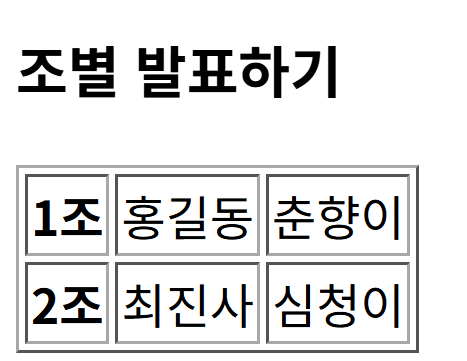
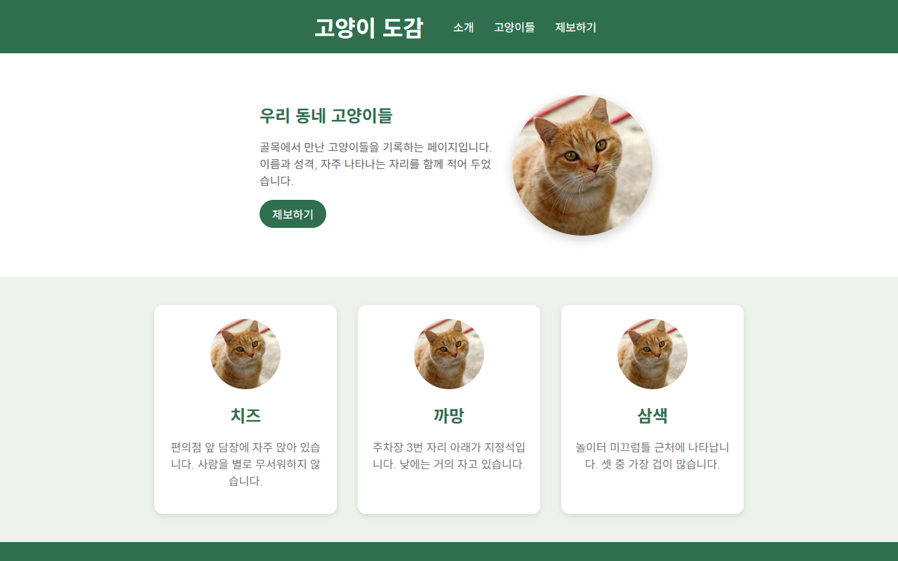
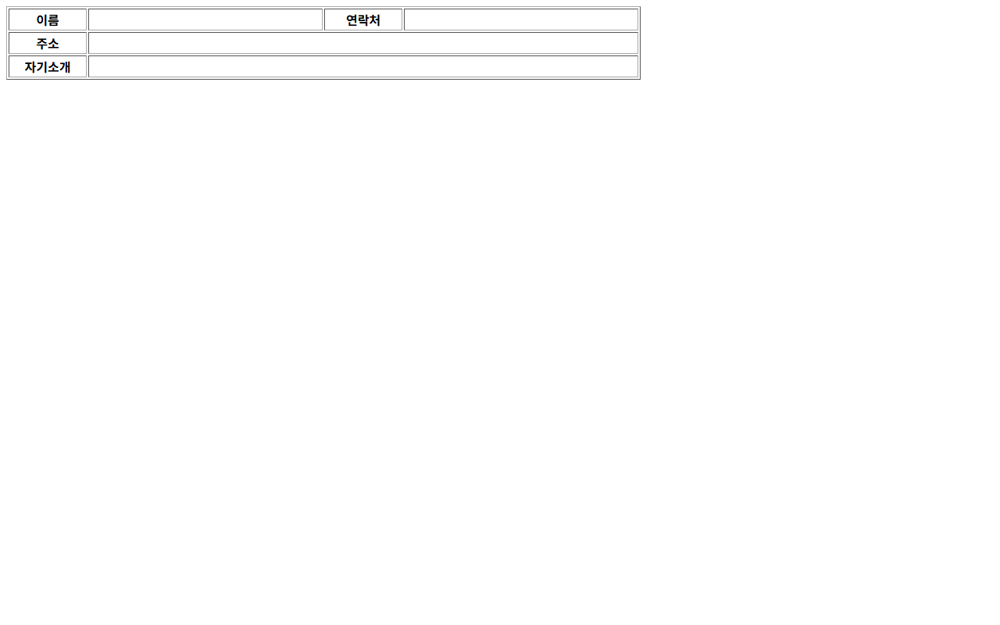
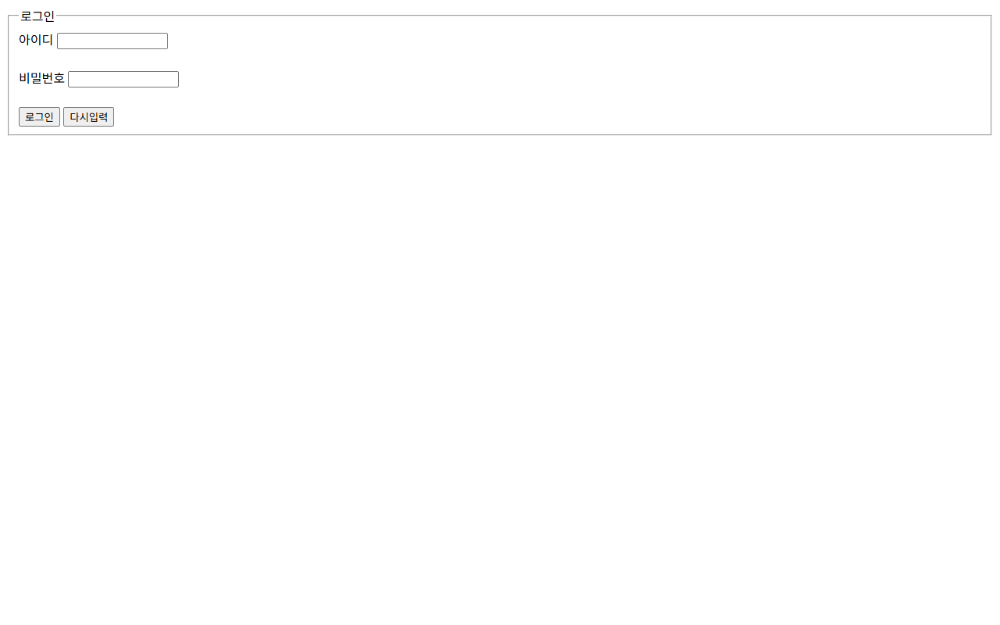

# 웹 퍼블리싱 기초 실습 및 문서 자동화 검증 스크립트 모음

- 과목: 웹개발
- 날짜: 2026-08-19
- 태그: html, css, javascript, python, 웹퍼블리싱

## 설명

본 과제 모음은 HTML5, CSS3, JavaScript를 활용한 웹 퍼블리싱 실습 과제들과 Office 문서(DOCX, PPTX 등)의 XML 구조를 검증 및 처리하는 Python 스크립트로 구성되어 있습니다. 회원가입 폼, 시간표, 수강신청, 프로필 카드, 쇼핑몰 메인 페이지 등 다양한 웹 레이아웃과 서식 요소를 단계별로 구현해보는 내용이 포함되어 있습니다. 또한 파이썬을 기반으로 한 DOCX 주석 추가, 변경사항 추적 및 XML 스키마 검증 도구가 포함되어 있어 웹 UI 제작과 파일 데이터 자동화 처리 기법을 다각도로 실습할 수 있습니다. 전반적으로 HTML 태그와 CSS 스타일링 규칙, JavaScript DOM 조작 기법 및 스크립트 기반 문서 검증 방식을 포괄적으로 습득할 수 있도록 설계되었습니다.

## 원본 파일

업로드한 프로젝트의 원본 파일 108개가 폴더 구조 그대로 [source/](./source/)에 보관되어 있습니다.

- [0804/images.jpg](./source/0804/images.jpg)
- [0804/index.html](./source/0804/index.html)
- [0806/index.html](./source/0806/index.html)
- [1_2/index.html](./source/1_2/index.html)
- [1_2/resume.html](./source/1_2/resume.html)
- [1_2/signup.html](./source/1_2/signup.html)
- [1_3/index.html](./source/1_3/index.html)
- [1_3/styles.css](./source/1_3/styles.css)
- [1_4/image.jpg](./source/1_4/image.jpg)
- [1_4/index.html](./source/1_4/index.html)
- [1_5/image.jpg](./source/1_5/image.jpg)
- [1_5/index.html](./source/1_5/index.html)
- [내부스타일시트/index.html](./source/%EB%82%B4%EB%B6%80%EC%8A%A4%ED%83%80%EC%9D%BC%EC%8B%9C%ED%8A%B8/index.html)
- [내부스타일시트/style.css](./source/%EB%82%B4%EB%B6%80%EC%8A%A4%ED%83%80%EC%9D%BC%EC%8B%9C%ED%8A%B8/style.css)
- [수강신청/index.html](./source/%EC%88%98%EA%B0%95%EC%8B%A0%EC%B2%AD/index.html)
- [수강신청/index2.html](./source/%EC%88%98%EA%B0%95%EC%8B%A0%EC%B2%AD/index2.html)
- [시간표/index.html](./source/%EC%8B%9C%EA%B0%84%ED%91%9C/index.html)
- [시간표/index2.html](./source/%EC%8B%9C%EA%B0%84%ED%91%9C/index2.html)
- [회원가입/cancel.jpg](./source/%ED%9A%8C%EC%9B%90%EA%B0%80%EC%9E%85/cancel.jpg)
- [회원가입/form.html](./source/%ED%9A%8C%EC%9B%90%EA%B0%80%EC%9E%85/form.html)
- [회원가입/index.html](./source/%ED%9A%8C%EC%9B%90%EA%B0%80%EC%9E%85/index.html)
- [회원가입/okay.jpg](./source/%ED%9A%8C%EC%9B%90%EA%B0%80%EC%9E%85/okay.jpg)
- [colspan_rowspan/index.html](./source/colspan_rowspan/index.html)
- [font/index.html](./source/font/index.html)
- [form/index.html](./source/form/index.html)
- [form/index2.html](./source/form/index2.html)
- [login/index.html](./source/login/index.html)
- [navigation/index.html](./source/navigation/index.html)
- [project2/form.html](./source/project2/form.html)
- [project2/index.html](./source/project2/index.html)
- [project2/photo.jpg](./source/project2/photo.jpg)
- [table생성/화면 캡처 2026-08-14 134446.png](./source/table%EC%83%9D%EC%84%B1/%ED%99%94%EB%A9%B4%20%EC%BA%A1%EC%B2%98%202026-08-14%20134446.png)
- [table생성/index.html](./source/table%EC%83%9D%EC%84%B1/index.html)
- [testing/.agents/skills/docx/LICENSE.txt](./source/testing/.agents/skills/docx/LICENSE.txt)
- [testing/.agents/skills/docx/scripts/__init__.py](./source/testing/.agents/skills/docx/scripts/__init__.py)
- [testing/.agents/skills/docx/scripts/accept_changes.py](./source/testing/.agents/skills/docx/scripts/accept_changes.py)
- [testing/.agents/skills/docx/scripts/comment.py](./source/testing/.agents/skills/docx/scripts/comment.py)
- [testing/.agents/skills/docx/scripts/merge_runs.py](./source/testing/.agents/skills/docx/scripts/merge_runs.py)
- [testing/.agents/skills/docx/scripts/office/helpers/__init__.py](./source/testing/.agents/skills/docx/scripts/office/helpers/__init__.py)
- [testing/.agents/skills/docx/scripts/office/helpers/pptx_chart.py](./source/testing/.agents/skills/docx/scripts/office/helpers/pptx_chart.py)
- [testing/.agents/skills/docx/scripts/office/helpers/pptx_slide.py](./source/testing/.agents/skills/docx/scripts/office/helpers/pptx_slide.py)
- [testing/.agents/skills/docx/scripts/office/helpers/pptx_theme.py](./source/testing/.agents/skills/docx/scripts/office/helpers/pptx_theme.py)
- [testing/.agents/skills/docx/scripts/office/schemas/ecma/fouth-edition/opc-contentTypes.xsd](./source/testing/.agents/skills/docx/scripts/office/schemas/ecma/fouth-edition/opc-contentTypes.xsd)
- [testing/.agents/skills/docx/scripts/office/schemas/ecma/fouth-edition/opc-coreProperties.xsd](./source/testing/.agents/skills/docx/scripts/office/schemas/ecma/fouth-edition/opc-coreProperties.xsd)
- [testing/.agents/skills/docx/scripts/office/schemas/ecma/fouth-edition/opc-digSig.xsd](./source/testing/.agents/skills/docx/scripts/office/schemas/ecma/fouth-edition/opc-digSig.xsd)
- [testing/.agents/skills/docx/scripts/office/schemas/ecma/fouth-edition/opc-relationships.xsd](./source/testing/.agents/skills/docx/scripts/office/schemas/ecma/fouth-edition/opc-relationships.xsd)
- [testing/.agents/skills/docx/scripts/office/schemas/ISO-IEC29500-4_2016/dml-chart.xsd](./source/testing/.agents/skills/docx/scripts/office/schemas/ISO-IEC29500-4_2016/dml-chart.xsd)
- [testing/.agents/skills/docx/scripts/office/schemas/ISO-IEC29500-4_2016/dml-chartDrawing.xsd](./source/testing/.agents/skills/docx/scripts/office/schemas/ISO-IEC29500-4_2016/dml-chartDrawing.xsd)
- [testing/.agents/skills/docx/scripts/office/schemas/ISO-IEC29500-4_2016/dml-diagram.xsd](./source/testing/.agents/skills/docx/scripts/office/schemas/ISO-IEC29500-4_2016/dml-diagram.xsd)
- [testing/.agents/skills/docx/scripts/office/schemas/ISO-IEC29500-4_2016/dml-lockedCanvas.xsd](./source/testing/.agents/skills/docx/scripts/office/schemas/ISO-IEC29500-4_2016/dml-lockedCanvas.xsd)
- [testing/.agents/skills/docx/scripts/office/schemas/ISO-IEC29500-4_2016/dml-main.xsd](./source/testing/.agents/skills/docx/scripts/office/schemas/ISO-IEC29500-4_2016/dml-main.xsd)
- [testing/.agents/skills/docx/scripts/office/schemas/ISO-IEC29500-4_2016/dml-picture.xsd](./source/testing/.agents/skills/docx/scripts/office/schemas/ISO-IEC29500-4_2016/dml-picture.xsd)
- [testing/.agents/skills/docx/scripts/office/schemas/ISO-IEC29500-4_2016/dml-spreadsheetDrawing.xsd](./source/testing/.agents/skills/docx/scripts/office/schemas/ISO-IEC29500-4_2016/dml-spreadsheetDrawing.xsd)
- [testing/.agents/skills/docx/scripts/office/schemas/ISO-IEC29500-4_2016/dml-wordprocessingDrawing.xsd](./source/testing/.agents/skills/docx/scripts/office/schemas/ISO-IEC29500-4_2016/dml-wordprocessingDrawing.xsd)
- [testing/.agents/skills/docx/scripts/office/schemas/ISO-IEC29500-4_2016/pml.xsd](./source/testing/.agents/skills/docx/scripts/office/schemas/ISO-IEC29500-4_2016/pml.xsd)
- [testing/.agents/skills/docx/scripts/office/schemas/ISO-IEC29500-4_2016/shared-additionalCharacteristics.xsd](./source/testing/.agents/skills/docx/scripts/office/schemas/ISO-IEC29500-4_2016/shared-additionalCharacteristics.xsd)
- [testing/.agents/skills/docx/scripts/office/schemas/ISO-IEC29500-4_2016/shared-bibliography.xsd](./source/testing/.agents/skills/docx/scripts/office/schemas/ISO-IEC29500-4_2016/shared-bibliography.xsd)
- [testing/.agents/skills/docx/scripts/office/schemas/ISO-IEC29500-4_2016/shared-commonSimpleTypes.xsd](./source/testing/.agents/skills/docx/scripts/office/schemas/ISO-IEC29500-4_2016/shared-commonSimpleTypes.xsd)
- [testing/.agents/skills/docx/scripts/office/schemas/ISO-IEC29500-4_2016/shared-customXmlDataProperties.xsd](./source/testing/.agents/skills/docx/scripts/office/schemas/ISO-IEC29500-4_2016/shared-customXmlDataProperties.xsd)
- [testing/.agents/skills/docx/scripts/office/schemas/ISO-IEC29500-4_2016/shared-customXmlSchemaProperties.xsd](./source/testing/.agents/skills/docx/scripts/office/schemas/ISO-IEC29500-4_2016/shared-customXmlSchemaProperties.xsd)
- [testing/.agents/skills/docx/scripts/office/schemas/ISO-IEC29500-4_2016/shared-documentPropertiesCustom.xsd](./source/testing/.agents/skills/docx/scripts/office/schemas/ISO-IEC29500-4_2016/shared-documentPropertiesCustom.xsd)
- [testing/.agents/skills/docx/scripts/office/schemas/ISO-IEC29500-4_2016/shared-documentPropertiesExtended.xsd](./source/testing/.agents/skills/docx/scripts/office/schemas/ISO-IEC29500-4_2016/shared-documentPropertiesExtended.xsd)
- [testing/.agents/skills/docx/scripts/office/schemas/ISO-IEC29500-4_2016/shared-documentPropertiesVariantTypes.xsd](./source/testing/.agents/skills/docx/scripts/office/schemas/ISO-IEC29500-4_2016/shared-documentPropertiesVariantTypes.xsd)
- [testing/.agents/skills/docx/scripts/office/schemas/ISO-IEC29500-4_2016/shared-math.xsd](./source/testing/.agents/skills/docx/scripts/office/schemas/ISO-IEC29500-4_2016/shared-math.xsd)
- [testing/.agents/skills/docx/scripts/office/schemas/ISO-IEC29500-4_2016/shared-relationshipReference.xsd](./source/testing/.agents/skills/docx/scripts/office/schemas/ISO-IEC29500-4_2016/shared-relationshipReference.xsd)
- [testing/.agents/skills/docx/scripts/office/schemas/ISO-IEC29500-4_2016/sml.xsd](./source/testing/.agents/skills/docx/scripts/office/schemas/ISO-IEC29500-4_2016/sml.xsd)
- [testing/.agents/skills/docx/scripts/office/schemas/ISO-IEC29500-4_2016/vml-main.xsd](./source/testing/.agents/skills/docx/scripts/office/schemas/ISO-IEC29500-4_2016/vml-main.xsd)
- [testing/.agents/skills/docx/scripts/office/schemas/ISO-IEC29500-4_2016/vml-officeDrawing.xsd](./source/testing/.agents/skills/docx/scripts/office/schemas/ISO-IEC29500-4_2016/vml-officeDrawing.xsd)
- [testing/.agents/skills/docx/scripts/office/schemas/ISO-IEC29500-4_2016/vml-presentationDrawing.xsd](./source/testing/.agents/skills/docx/scripts/office/schemas/ISO-IEC29500-4_2016/vml-presentationDrawing.xsd)
- [testing/.agents/skills/docx/scripts/office/schemas/ISO-IEC29500-4_2016/vml-spreadsheetDrawing.xsd](./source/testing/.agents/skills/docx/scripts/office/schemas/ISO-IEC29500-4_2016/vml-spreadsheetDrawing.xsd)
- [testing/.agents/skills/docx/scripts/office/schemas/ISO-IEC29500-4_2016/vml-wordprocessingDrawing.xsd](./source/testing/.agents/skills/docx/scripts/office/schemas/ISO-IEC29500-4_2016/vml-wordprocessingDrawing.xsd)
- [testing/.agents/skills/docx/scripts/office/schemas/ISO-IEC29500-4_2016/wml.xsd](./source/testing/.agents/skills/docx/scripts/office/schemas/ISO-IEC29500-4_2016/wml.xsd)
- [testing/.agents/skills/docx/scripts/office/schemas/ISO-IEC29500-4_2016/xml.xsd](./source/testing/.agents/skills/docx/scripts/office/schemas/ISO-IEC29500-4_2016/xml.xsd)
- [testing/.agents/skills/docx/scripts/office/schemas/mce/mc.xsd](./source/testing/.agents/skills/docx/scripts/office/schemas/mce/mc.xsd)
- [testing/.agents/skills/docx/scripts/office/schemas/microsoft/wml-2010.xsd](./source/testing/.agents/skills/docx/scripts/office/schemas/microsoft/wml-2010.xsd)
- [testing/.agents/skills/docx/scripts/office/schemas/microsoft/wml-2012.xsd](./source/testing/.agents/skills/docx/scripts/office/schemas/microsoft/wml-2012.xsd)
- [testing/.agents/skills/docx/scripts/office/schemas/microsoft/wml-2018.xsd](./source/testing/.agents/skills/docx/scripts/office/schemas/microsoft/wml-2018.xsd)
- [testing/.agents/skills/docx/scripts/office/schemas/microsoft/wml-cex-2018.xsd](./source/testing/.agents/skills/docx/scripts/office/schemas/microsoft/wml-cex-2018.xsd)
- [testing/.agents/skills/docx/scripts/office/schemas/microsoft/wml-cid-2016.xsd](./source/testing/.agents/skills/docx/scripts/office/schemas/microsoft/wml-cid-2016.xsd)
- [testing/.agents/skills/docx/scripts/office/schemas/microsoft/wml-sdtdatahash-2020.xsd](./source/testing/.agents/skills/docx/scripts/office/schemas/microsoft/wml-sdtdatahash-2020.xsd)
- [testing/.agents/skills/docx/scripts/office/schemas/microsoft/wml-symex-2015.xsd](./source/testing/.agents/skills/docx/scripts/office/schemas/microsoft/wml-symex-2015.xsd)
- [testing/.agents/skills/docx/scripts/office/soffice.py](./source/testing/.agents/skills/docx/scripts/office/soffice.py)
- [testing/.agents/skills/docx/scripts/office/validate.py](./source/testing/.agents/skills/docx/scripts/office/validate.py)
- [testing/.agents/skills/docx/scripts/office/validators/__init__.py](./source/testing/.agents/skills/docx/scripts/office/validators/__init__.py)
- [testing/.agents/skills/docx/scripts/office/validators/base.py](./source/testing/.agents/skills/docx/scripts/office/validators/base.py)
- [testing/.agents/skills/docx/scripts/office/validators/docx.py](./source/testing/.agents/skills/docx/scripts/office/validators/docx.py)
- [testing/.agents/skills/docx/scripts/office/validators/pptx.py](./source/testing/.agents/skills/docx/scripts/office/validators/pptx.py)
- [testing/.agents/skills/docx/scripts/office/validators/redlining.py](./source/testing/.agents/skills/docx/scripts/office/validators/redlining.py)
- [testing/.agents/skills/docx/scripts/templates/comments.xml](./source/testing/.agents/skills/docx/scripts/templates/comments.xml)
- [testing/.agents/skills/docx/scripts/templates/commentsExtended.xml](./source/testing/.agents/skills/docx/scripts/templates/commentsExtended.xml)
- [testing/.agents/skills/docx/scripts/templates/commentsExtensible.xml](./source/testing/.agents/skills/docx/scripts/templates/commentsExtensible.xml)
- [testing/.agents/skills/docx/scripts/templates/commentsIds.xml](./source/testing/.agents/skills/docx/scripts/templates/commentsIds.xml)
- [testing/.agents/skills/docx/scripts/templates/people.xml](./source/testing/.agents/skills/docx/scripts/templates/people.xml)
- [testing/.agents/skills/docx/SKILL.md](./source/testing/.agents/skills/docx/SKILL.md)
- [testing/2025_하반기_AI_도구_인기_보고서.docx](./source/testing/2025_%ED%95%98%EB%B0%98%EA%B8%B0_AI_%EB%8F%84%EA%B5%AC_%EC%9D%B8%EA%B8%B0_%EB%B3%B4%EA%B3%A0%EC%84%9C.docx)
- [testing/2025_하반기_AI_도구_인기_보고서.html](./source/testing/2025_%ED%95%98%EB%B0%98%EA%B8%B0_AI_%EB%8F%84%EA%B5%AC_%EC%9D%B8%EA%B8%B0_%EB%B3%B4%EA%B3%A0%EC%84%9C.html)
- [testing/2025_하반기_AI_도구_인기_보고서.md](./source/testing/2025_%ED%95%98%EB%B0%98%EA%B8%B0_AI_%EB%8F%84%EA%B5%AC_%EC%9D%B8%EA%B8%B0_%EB%B3%B4%EA%B3%A0%EC%84%9C.md)
- [testing/2025_하반기_AI_도구_인기_보고서.pdf](./source/testing/2025_%ED%95%98%EB%B0%98%EA%B8%B0_AI_%EB%8F%84%EA%B5%AC_%EC%9D%B8%EA%B8%B0_%EB%B3%B4%EA%B3%A0%EC%84%9C.pdf)
- [testing/index.html](./source/testing/index.html)
- [testing/script.js](./source/testing/script.js)
- [testing/skills-lock.json](./source/testing/skills-lock.json)
- [testing/style.css](./source/testing/style.css)
- [text-align/index.html](./source/text-align/index.html)
- [text-decoration/bigc.html](./source/text-decoration/bigc.html)
- [text-decoration/index.html](./source/text-decoration/index.html)
- [type_number,range/index.html](./source/type_number%2Crange/index.html)
- [type_radio,checkbox/index.html](./source/type_radio%2Ccheckbox/index.html)
- [ul,li/index.html](./source/ul%2Cli/index.html)

## 코드

<details>
<summary><strong>회원가입/form.html</strong> — 사용자로부터 아이디, 비밀번호, 이름, 우편번호, 휴대전화 번호, 이메일 등의 신원 정보를 입력받는 회원가입 양식 페이지입니다. 테이블 구조를 사용해 입력 항목을 정렬하였으며 required 및 maxlength 속성을 적용했습니다.</summary>

```html
<!DOCTYPE html>
<head>
    <meta charset="UTF-8">
    <title>회원가입 페이지</title>
</head>
<body>
    <h2> 회원가입 </h2>
    <a href="index.html"> 뒤로 </a>
    <form>
        <table>
            <tr>
                <td>아이디</td>
                <td colspan="3"><input type="text" required></td>
            </tr>
            <tr>
                <td>비밀번호</td>
                <td colspan="3"><input type="password" required></td>
            </tr>
            <tr>
                <td></td>
                <td colspan="3">
                    <input type="password" placeholder="비밀번호 재확인" required>
                </td>
            </tr>
            <tr>
                <td>이름</td>
                <td colspan="3"><input type="text" value="신재환" maxlength="4"> </td>
                <tr>
                    <td>우편번호</td>
                    <td colspan="2"><input type="text" maxlength="5"></td>
                    <td><button>검색</button></td>
                </tr>
                <tr>
                    <td>휴대전화</td>
                    <td>
                        <select>
                            <option>011</option>
                            <option>016</option>
                            <option>018</option>
                            <option selected>010</option>
                        </select>
                    </td>
                    <td><input type="text" size="4" required></td>
                    <td><input type="text" size="4" required></td>
                </tr>
                <tr> 
                    <td>이메일</td>
                    <td colspan="3"><input type="email" required></td>
                </tr>
                <tr>
                    <td>생년월일</td>
                    <td colspan="3"><input type="radio" name="birth">양
                                    <input type="radio" name="birth">음</td>
                </tr>
                <tr>
                    <td></td>
                    <td><select><option>1998</option>
                            <option>1999</option>
                            <option selected>2000</option>
                            <option>2001</option>
                            <option>2002</option>
                    </select>년</td>
                    <td><input type="number" min="1" max="12" step="1" value="9">월</td>
                    <td><input type="number" min="1" max="31" step="1" value="1">일</td>
                </tr>
                <tr>
                    <td colspan="4"><input type="checkbox">이메일을 수신합니다.</td>
                </tr>
                <tr>
                    <td colspan="2"><button type="reset">
                        </button></td>
                    <td colspan="2"><button type="submit">
                        </button></td>
                </tr>
            </tr>
        </table>
    </form>
</body>
```

</details>

<details>
<summary><strong>회원가입/index.html</strong> — 회원가입 모듈의 메인 안내 페이지입니다. 학번과 이름을 표시하며 버튼 클릭 시 상세 회원가입 양식(form.html)으로 이동할 수 있도록 구현되어 있습니다.</summary>

```html
<!DOCTYPE html>
<head>
    <meta charset="UTF-8">
    <title> 회원가입 페이지</title>

</head>
<body>
    <h1>12345 신재환</h1>
    <a href="form.html">
        <button> 회원가입 하기</button>
    </a>
</body>
</html>
```

</details>

<details>
<summary><strong>시간표/index.html</strong> — 기본적인 table 태그 구조를 사용하여 요일별, 교시별 수업 정보를 표시하는 시간표 UI입니다. <th>와 <td> 태그를 이용해 깔끔한 표 항목을 구성했습니다.</summary>

```html
<!doctype html>
<html>
   <head>
       <meta charset="utf-8">
       <title> </title>
   </head>
   <body>
    
    <table border="1">
        <caption> 시간표 </caption>
        </th>
        <tr>
            <th> 시간 </th>
            <th> 월 </th>
            <th> 화 </th>
            <th> 수 </th>
            <th> 목 </th>
            <th> 금 </th>
        </tr>

        
        <tr>
            <th> 1교시 </th>
            <td> 국어 </td>
            <td> 역사 </td>
            <td> 수학 </td>
            <td> 미술 </td>
            <td> 영어 </td>
        </tr>

        <tr>
            <th> 2교시 </th>
            <td> 음악 </td>
            <td> 과학 </td>
            <td> 영어 </td>
            <td> 체육 </td>
            <td> 사회 </td>

        </tr>

        <tr>   
            <th> 3교시 </th>
            <td> 수학 </td>
            <td> 국어 </td>
            <td> 역사 </td>
            <td> 과학 </td>
            <td> 수학 </td> 
        </tr>
    </table>
   </body>
</html>
```

</details>

<details>
<summary><strong>시간표/index2.html</strong> — thead와 tbody 구분을 적용하여 시맨틱한 표 구조를 학습할 수 있도록 작성된 시간표 페이지입니다. captions 태그와 p 태그를 포함하여 구조화된 HTML 표 구성을 실습합니다.</summary>

```html
<!doctype html>
<html>
    <head>
       <meta charset="utf-8">
       <title> colspan,rowspan </title>
    </head>
    <body>
    <table border="1">
    <caption> 시 간 표</caption>
    <p> 시 간 표 p 태그 </p>
    <thead>
      <tr>
        <th>시간</th>
        <th>월</th>
        <th>화</th>
        <th>수</th>
        <th>목</th>
        <th>금</th>
      </tr>
    </thead>
    <tbody>
      <tr>
        <th>1교시</th>
        <td>국어</td>
        <td>역사</td>
        <td>수학</td>
        <td>미술</td>
        <td>영어</td>
      </tr>
      <tr>
        <th>2교시</th>
        <td>음악</td>
        <td>과학</td>
        <td>영어</td>
        <td>체육</td>
        <td>사회</td>
      </tr>
      <tr>
        <th>3교시</th>
        <td>수학</td>
        <td>국어</td>
        <td>역사</td>
        <td>과학</td>
        <td>수학</td>
      </tr>
    </tbody>
   </table>
    </body>
</html>
```

</details>

<details>
<summary><strong>수강신청/index.html</strong> — fieldset과 legend 태그를 이용하여 수강과목, 신청자 정보, 교재 및 재료 주문 입력을 그룹화한 수강신청 폼 화면입니다. readonly, autofocus, min, max, step 등 다양한 input 속성을 실습합니다.</summary>

```html
<!doctype html>
<html>
    <head>
       <meta charset="utf-8">
       <title> 수강신청 </title>
    </head>
    <body>
        <form action="study.jsp" method="post">
            <fieldset id="subject">
                <legend>수강과목</legend>
                <ul>
                    <li>
                        <label class="reg" for="sub.j">프로그래밍(초급)</label>
                        <input type="text" id="sub.j" value="오전 13:00~15:00" readonly>
                    </li>
                </ul>
            </fieldset>
            <fieldset id="register">
                <legend> 신청자 </legend>
                <ul>
                    <li>
                        <label class="reg" for="uid">학번</label>
                        <input type="text" id="uid" placeholder="5자리 숫자로 입력" maxlength="5" required>
                    </li>
                    <li>
                        <label class="reg" for="uname">이름</label>
                        <input type="text" id="uname" autofocus required>
                    </li>
                </ul>
            </fieldset>
            <fieldset>
                <legend> 교재 및 재료 주문 </legend>
                <ul>
                    <li>
                        <label class="reg" for="book"> 교재 </label>
                        <input type="number" id="book" value="1" min="1" max="3">
                    </li>
                    <li>
                        <label class="reg" for="group"> 재료 </label>
                        <input type="number" id="group" value="5" min="5" max="50" step="3">
                    </li>
                </ul>
                <button type="submit" value="submit">신청하기</button>
                <button type="reset" value="reset">재작성</button>
            </fieldset>

            <select id="class">
                <optgroup label="공과대학">
                    <option value="arch" selected>건축공학과</option>
                    <option value="mech" selected>기계공학과</option>
                    <option value="elec" selected>전기공학과</option>
                    <option value="computer" selected>컴퓨터공학과</option>
                </optgroup>
                <optgroup label="인문대학">
                    <option value="korean" selected>국어국문학과</option>
                    <option value="english" selected>영어영문학과</option>
                    <option value="history" selected>역사학과</option>
                </optgroup>
            </select>
        </form>
    </body>
```

</details>

<details>
<summary><strong>수강신청/index2.html</strong> — datalist 태그를 활용해 사용자가 관심 분야를 직접 입력하거나 제공된 선택 목록 중에서 빠르게 고를 수 있도록 지원하는 웹 폼 예제입니다.</summary>

```html
<body>
<form>
<fieldset>
<legend>관심분야를 선택하세요</legend>
<ul>
<li>
<span class="reg">관심분야</span>
<label for="interest"></label>
<input type="text" id="interest" list="choices">
<datalist id="choices">
<option value="baseball" label="야구"></option>
<option value="football" label="축구"></option>
<option value="basketball" label="농구"></option>
<option value="volleyball" label="배구"></option>
<option value="golf" label="골프"></option>
</datalist>
</li>
</ul>
</fieldset>
</form>
</body>
```

</details>

<details>
<summary><strong>내부스타일시트/index.html</strong> — 외부 style.css 파일 연동 및 인라인 CSS 속성을 혼합하여 텍스트 스타일과 항산화 효능 관련 텍스트를 구성한 HTML 문서입니다.</summary>

```html
<!DOCTYPE html>
<head>
    <meta charset="UTF-8">
    <title> 내부 스타일 시트 </title>
    <link href="style.css" rel="stylesheet" type="text/css">
</head>
<body>
   <body>
    <h1>블루베리와 항산화 효능</h1>
    <p style="color:blue;"> 히비스커스는 항산화제인 폴리페놀이 포함</p>
    <p>매사츄세츠 보스톤에 있는 USDA 노화에 관한 인류 영양 연구센터 (the USDA Human Nutrition Research Center on Aging) 의 자료에 의하면 히비스커스는 항산화 작용이 뛰어난 차라고 합니다.  </p>
</body>
```

</details>

<details>
<summary><strong>내부스타일시트/style.css</strong> — 리스트 요소의 글자 색상과 불릿 스타일(square)을 변경하도록 작성된 CSS 스타일시트 파일입니다.</summary>

```css
/ul{
            color:aqua;
            list-style-type: square;
    }
/
```

</details>

<details>
<summary><strong>ul,li/index.html</strong> — 순서가 없는 리스트(ul)와 순서가 있는 리스트(ol)를 중첩 사용하여 가족여행 일지를 순번 형식으로 표현한 연습 예제입니다.</summary>

```html
<!doctype html>
<html>
   <head>
       <meta charset="utf-8">
       <title> 리스트 활용하기 </title>
   </head>
   <body>
    <h3> 가족여행 일지 </h3> 
    <ul>
        <ol type="a">
            <li> 서울 </li>
            <li> 부산 </li>
            <li> 대구 </li>
        </ol>
    </ul>
    <ul>
        <ol type="a" start="3">
            <li> 서울 </li>
            <li> 부산 </li>
            <li> 대구 </li>
        </ol>
    </ul>   
   </body>
</html>
```

</details>

<details>
<summary><strong>type_radio,checkbox/index.html</strong> — 라디오 버튼, 체크박스, 색상 선택기(color) 등 다양한 타입의 input 요소들을 사용하여 학년 선택, 관심 분야 지정 및 취향 조사를 구성한 폼 예제입니다.</summary>

```html
<!doctype html>
<html>
    <head>
       <meta charset="utf-8">
       <title> 타입_넘버, 레인지 </title>
    </head>
    <body>
        <form>
            <fieldset>
                <legend>학년</legend>
                <p>해당 학년을 선택하세요</p>
                <label><input type="radio" name="grade" value="1">1학년</label>
                <label><input type="radio" name="grade" value="2">2학년</label>
                <label><input type="radio" name="grade" value="3">3학년</label>
            </fieldset>
            <fieldset>
                <legend>관심 분야</legend>
                <p>관심분야를 선택하세요</p>
                <label><input type="checkbox" name="enjoy" value="music">음악</label>
                <label><input type="checkbox" name="enjoy" value="math">수학</label>
                <label><input type="checkbox" name="enjoy" value="sport">운동</label>
            </fieldset>
            <fieldset>
                <legend>취향조사</legend>
                <label>선호색상 <input type="color" value="#ff0000">    </label>
            </fieldset>
        </form>
    </body>
</html>
```

</details>

<details>
<summary><strong>type_number,range/index.html</strong> — 숫자 입력(number)과 범주 슬라이더(range) 스타일의 input 타입을 활용하여 주문 인원수와 등급을 설정할 수 있도록 작성된 웹 페이지입니다.</summary>

```html
<!doctype html>
<html>
    <head>
       <meta charset="utf-8">
       <title> 타입_넘버, 레인지 </title>
    </head>
    <body>
        <form>
            <fieldset>
                <legend> 주문 현황 </legend>
                <ul> 
                    <li>
                        <label class="reg" for="mem">인원</label>
                        <input type="number" id="mem" value="1" min="0" max="10" step="2">
                    </li>
                    <li>
                        <label class = "reg" for="step">등급<small>(하,중,상)</small></label>
                        <input type="range" id="step" value="1" min="1" max="3">
                    </li>
                </ul>
            </fieldset>
        </form>
    </body>
</html>
```

</details>

<details>
<summary><strong>text-decoration/bigc.html</strong> — CSS의 text-transform 속성을 사용하여 영문 텍스트를 대문자로 변환하거나 첫 글자만 대문자로 변환하는 스타일 규칙을 연습하는 파일입니다.</summary>

```html
<style>
  .trans1 {text-transform:uppercase; }  /* 대문자로 */
  .trans2 {text-transform:capitalize; }  /* 첫글자만 대문자로 */
</style>

 <h1>Have to study</h1>
  <ul>
    <li class="trans1">html</li>
    <li class="trans1">css</li>
    <li class="trans2">javascript</li>
  </ul>
```

</details>

<details>
<summary><strong>text-decoration/index.html</strong> — text-decoration 속성을 활용해 링크의 밑줄을 제거하거나 취소선(line-through) 효과를 부여하여 텍스트 교정 상태를 표현한 예제입니다.</summary>

```html
<style>
    a{
        text-decoration: none;
    }
    .edited{
        text-decoration: line-through;
    }

</style>
<h2>토마토</h2>
<p> [<a href="https://www.naver.com" target="_blank">외부 링크</a>]</p>
<p> 토마토는 비타민 A, C가 풍부한 <span class="edited">과일이다</span> 채소다.</p>
```

</details>

<details>
<summary><strong>text-align/index.html</strong> — text-align 속성을 통해 텍스트의 왼쪽 정렬, 중앙 정렬, 오른쪽 정렬, 양쪽 정렬(justify)을 각각 적용해 비교하는 CSS 실습 파일입니다.</summary>

```html
<style>
    .align-left{text-align: left;}
    .align-center{text-align: center;}
    .align-right{text-align: right;}
    .align-justify{text-align: justify;}

</style>
<p class="align-left"> 가나다라마바사 .....</p>
<p class="align-center"> 가나다라마바사 .....</p>
<p class="align-right"> 가나다라마바사 .....</p>
<p class="align-justify"> 가나다라마바사 .....</p>
```

</details>

<details>
<summary><strong>testing/2025_하반기_AI_도구_인기_보고서.html</strong> — 2025년 하반기 인기 AI 도구 관련 조사 내용을 인쇄 및 문서 출력용 스타일(@page, CSS)을 적용하여 깔끔하게 레이아웃한 리포트 HTML 문서입니다.</summary>

```html
<!doctype html>
<html lang="ko">
<head>
<meta charset="utf-8">
<title>2025년 하반기 AI 도구 인기 보고서</title>
<style>
  @page { size: A4; margin: 20mm 18mm; }
  body {
    font-family: "Malgun Gothic", "Segoe UI", Arial, sans-serif;
    color: #1a1a1a;
    line-height: 1.7;
    font-size: 11.5pt;
    max-width: 760px;
    margin: 0 auto;
  }
  h1 { font-size: 20pt; border-bottom: 3px solid #2b6cb0; padding-bottom: 8px; margin-top: 0; }
  h2 { font-size: 15pt; color: #1a4d8f; border-bottom: 1px solid #ddd; padding-bottom: 4px; margin-top: 28px; }
  h3 { font-size: 12.5pt; color: #2b6cb0; margin-top: 20px; }
  table {
    border-collapse: collapse;
    width: 100%;
    margin: 14px 0;
    font-size: 10pt;
  }
  th, td {
    border: 1px solid #ccc;
    padding: 6px 9px;
    text-align: left;
    vertical-align: top;
  }
  th { background-color: #2b6cb0; color: #fff; }
  tr:nth-child(even) { background-color: #f5f8fb; }
  blockquote {
    border-left: 4px solid #2b6cb0;
    margin: 10px 0;
    padding: 4px 14px;
    color: #444;
    background: #f5f8fb;
    font-size: 10.5pt;
  }
  a { color: #1a4d8f; text-decoration: none; word-break: break-all; }
  img { max-width: 100%; border: 1px solid #ddd; border-radius: 4px; margin: 8px 0; page-break-inside: avoid; }
  em { color: #555; font-size: 9.5pt; display: block; margin-top: -4px; }
  hr { border: none; border-top: 1px solid #ccc; margin: 24px 0; }
  code { background: #f0f0f0; padding: 1px 5px; border-radius: 3px; }
  ol, ul { padding-left: 22px; }
  li { margin-bottom: 6px; }
</style>
</head>
<body>
<h1>2025년 하반기 가장 인기 있었던 AI 도구 조사 보고서</h1>
<blockquote>
<p>조사 기간: 2026년 8월 작성 · 대상 시점: 2025년 7월~12월 (2025 H2)</p>
</blockquote>
<h2>1. 조사 개요 및 방법론</h2>
<p>"가장 인기 있었던 AI 도구"는 단일 지표로 판단하기 어렵기 때문에, 아래와 같이 <strong>다각도 조사 방법</strong>을 설계했다.</p>
<table>
<thead>
<tr>
<th>조사 축</th>
<th>사용한 데이터</th>
<th>대표 출처</th>
</tr>
</thead>
<tbody>
<tr>
<td>웹 트래픽</td>
<td>월간 방문 수, 순위 변동</td>
<td><a href="https://www.similarweb.com/blog/marketing/seo/most-used-ai/">Similarweb</a></td>
</tr>
<tr>
<td>사용자 규모</td>
<td>주간/월간 활성 사용자 수(WAU/MAU)</td>
<td>각 사 공식 발표, <a href="https://sqmagazine.co.uk/chatgpt-claude-gemini-perplexity-statistics/">SQ Magazine</a></td>
</tr>
<tr>
<td>앱 인기도</td>
<td>앱스토어 순위·다운로드 수</td>
<td><a href="https://www.techcrunch.com/2026/01/29/openais-sora-app-is-struggling-after-its-stellar-launch/">TechCrunch</a>, <a href="https://www.tomsguide.com/ai/sora-2-is-coming-to-android-heres-when-you-can-download-it">Tom's Guide</a></td>
</tr>
<tr>
<td>업계 종합 리포트</td>
<td>소비자 앱 Top 100 랭킹</td>
<td><a href="https://a16z.com/100-gen-ai-apps-6/">a16z Top 100 Gen AI Apps</a></td>
</tr>
<tr>
<td>개발자 도구 시장</td>
<td>유료 사용자 수, 만족도 서베이</td>
<td><a href="https://www.ideaplan.io/blog/ai-coding-assistant-market-share-2026">IdeaPlan</a>, JetBrains 서베이</td>
</tr>
<tr>
<td>대중 관심도</td>
<td>검색어 트렌드</td>
<td><a href="https://searchengineland.com/google-year-in-search-2025-trending-queries-465630">Google Year in Search 2025</a></td>
</tr>
</tbody>
</table>
<p>카테고리는 ① 범용 AI 챗봇/어시스턴트, ② AI 코딩 도구, ③ 이미지·영상 생성 AI 세 가지로 나누어 조사했다.</p>
<h2>2. 카테고리별 조사 결과</h2>
<h3>2-1. 범용 AI 챗봇 · 어시스턴트</h3>
<table>
<thead>
<tr>
<th>도구</th>
<th>2025 H2 핵심 지표</th>
<th>특이 동향</th>
</tr>
</thead>
<tbody>
<tr>
<td><strong>ChatGPT</strong></td>
<td>주간 활성 사용자 약 8억 명(2월 4억→10월경 2배 증가)</td>
<td>여전히 웹 트래픽 기준 1위, a16z 기준 Claude보다 약 30배 큰 규모</td>
</tr>
<tr>
<td><strong>Gemini</strong></td>
<td>월간 활성 사용자 6.5억 명(2025.11), 연간 트래픽 성장률 548%</td>
<td>8월 'Nano Banana' 이미지 모델 공개 후 9월(+46%), 12월(+28%) 급성장</td>
</tr>
<tr>
<td><strong>DeepSeek</strong></td>
<td>월 방문 약 7.9억 회</td>
<td>중국발 저비용 모델로 글로벌 상위권 유지</td>
</tr>
<tr>
<td><strong>Claude</strong></td>
<td>기업 고객 30만 개 이상, 연 100만 달러 이상 지출 기업 500개 이상</td>
<td>일반 소비자 트래픽은 상대적으로 작지만 B2B·개발자층에서 강세</td>
</tr>
<tr>
<td><strong>Perplexity</strong></td>
<td>Similarweb 종합 순위 182위(2025.12, 전월대비 -15)</td>
<td>검색 대체형 AI로 꾸준한 마니아층 확보</td>
</tr>
</tbody>
</table>
<p><em><a href="https://searchengineland.com/google-year-in-search-2025-trending-queries-465630">Google Year in Search 2025</a>에 따르면 전 세계 검색어 기준으로는 'Gemini'가 AI 카테고리 1위를 차지했다.</em></p>
<h3>2-2. AI 코딩 도구</h3>
<table>
<thead>
<tr>
<th>도구</th>
<th>규모/매출</th>
<th>만족도</th>
</tr>
</thead>
<tbody>
<tr>
<td><strong>GitHub Copilot</strong></td>
<td>유료 구독자 470만 명(전년 대비 +75%)</td>
<td>대기업(1만 명+) 도입률 56%</td>
</tr>
<tr>
<td><strong>Cursor</strong></td>
<td>ARR 20억 달러, 유료 사용자 100만 명 이상</td>
<td>스타트업 채택률 높음</td>
</tr>
<tr>
<td><strong>Claude Code</strong></td>
<td>스타트업 75%가 주력 도구로 선택</td>
<td>JetBrains 설문 '가장 선호하는 도구' 46% (Cursor 19%, Copilot 9%)</td>
</tr>
</tbody>
</table>
<p>출처: <a href="https://www.ideaplan.io/blog/ai-coding-assistant-market-share-2026">IdeaPlan 시장 점유율 리포트</a>, <a href="https://www.neura.market/directories/cursor/blog/devto-3493354">Neura Market 분석</a></p>
<h3>2-3. 이미지·영상 생성 AI</h3>
<p>2025년 하반기 가장 극적인 변화가 있었던 분야다.</p>
<ul>
<li><strong>Nano Banana (Google Gemini 2.5 Flash Image)</strong>: 8월 공개 직후 LMSYS Chatbot Arena에서 Midjourney·Flux를 제치고 1위. 이 인기에 힘입어 Gemini 앱이 다운로드 1위에 올랐고, 9월 다운로드가 전월 대비 45% 증가했다. (<a href="https://chromeunboxed.com/google-outlines-the-best-nano-banana-ai-image-trends-from-2025/">ChromeUnboxed</a>)</li>
<li><strong>Sora 2 (OpenAI)</strong>: 9월 30일 출시 후 48시간 만에 미국 iOS 앱스토어 1위(다운로드 16.4만 건), 5일 만에 100만 다운로드. 다만 초기 열풍 이후 11월 190만, 12월 150만 건으로 성장세가 둔화됐다. (<a href="https://www.techcrunch.com/2026/01/29/openais-sora-app-is-struggling-after-its-stellar-launch/">TechCrunch</a>)</li>
</ul>
<h2>3. 종합 순위: a16z Top 100 Gen AI Apps</h2>
<p>업계에서 가장 널리 인용되는 <a href="https://a16z.com/100-gen-ai-apps-6/">a16z Top 100 Gen AI Consumer Apps</a> 6판 기준 웹/모바일 상위 순위는 다음과 같다.</p>
<table>
<thead>
<tr>
<th>순위</th>
<th>웹(방문 기준)</th>
<th>모바일(MAU 기준)</th>
</tr>
</thead>
<tbody>
<tr>
<td>1</td>
<td>ChatGPT</td>
<td>ChatGPT</td>
</tr>
<tr>
<td>2</td>
<td>Gemini</td>
<td>Gemini</td>
</tr>
<tr>
<td>3</td>
<td>Claude</td>
<td>CapCut (MAU 7.36억)</td>
</tr>
<tr>
<td>4</td>
<td>Perplexity</td>
<td>Canva</td>
</tr>
<tr>
<td>5</td>
<td>DeepSeek</td>
<td>Character.AI</td>
</tr>
<tr>
<td>6</td>
<td>Canva</td>
<td>Copilot</td>
</tr>
<tr>
<td>7</td>
<td>Midjourney</td>
<td>DeepSeek</td>
</tr>
<tr>
<td>8</td>
<td>Character.AI</td>
<td>Grok</td>
</tr>
<tr>
<td>9</td>
<td>Suno</td>
<td>Meta AI</td>
</tr>
<tr>
<td>10</td>
<td>ElevenLabs</td>
<td>Perplexity</td>
</tr>
</tbody>
</table>
<p><br />
<em>a16z, "The Top 100 Gen AI Consumer Apps" 웹 상위 50위 리스트</em></p>
<p><br />
<em>a16z, "The Top 100 Gen AI Consumer Apps" 모바일 상위 50위 리스트</em></p>
<h2>4. 결론</h2>
<p>지표별로 결론이 조금씩 달라진다.</p>
<ol>
<li><strong>절대 규모 1위 — ChatGPT</strong>: 주간 활성 사용자 약 8억 명, 웹 트래픽·앱 순위 모두 부동의 1위로 종합 AI 도구 시장의 지배적 위치가 흔들리지 않았다.</li>
<li><strong>화제성·성장률 1위 — Google Gemini (Nano Banana)</strong>: 8월 이미지 생성 모델 공개 이후 트래픽이 연간 548% 성장, 9월·12월 폭발적 스파이크를 보이며 하반기 가장 드라마틱한 반전을 만들었다. <a href="https://searchengineland.com/google-year-in-search-2025-trending-queries-465630">Google Year in Search</a>에서도 전 세계 검색어 1위를 차지했다.</li>
<li><strong>바이럴 임팩트 1위 — Sora 2</strong>: 출시 초반 파급력은 역대 최고 수준이었으나 지속성은 약했다.</li>
<li><strong>개발자 도구 부문</strong>: 사용자 수는 Copilot, 매출은 Cursor, 만족도는 Claude Code가 앞서는 3강 체제가 형성됐다.</li>
</ol>
<p><strong>종합하면, "누적 사용자·트래픽" 기준으로는 ChatGPT가 여전히 가장 인기 있는 AI 도구였지만, "2025년 하반기를 대표하는 사건"의 관점에서는 Google Gemini의 Nano Banana 이미지 생성 기능이 가장 큰 화제와 성장을 만들어낸 도구였다</strong>고 정리할 수 있다.</p>
<h2>5. 참고 자료 (전체 출처)</h2>
<ul>
<li><a href="https://www.similarweb.com/blog/marketing/seo/most-used-ai/">Similarweb - Top AI Tools 2025</a></li>
<li><a href="https://a16z.com/100-gen-ai-apps-6/">a16z - The Top 100 Gen AI Consumer Apps (6th Edition)</a></li>
<li><a href="https://sqmagazine.co.uk/chatgpt-claude-gemini-perplexity-statistics/">SQ Magazine - ChatGPT vs Claude vs Gemini vs Perplexity Statistics</a></li>
<li><a href="https://www.shopifreaks.com/openai-is-closing-in-on-1-billion-weekly-active-chatgpt-users-seven-months-behind-schedule-as-gemini-and-claude-take-share/">Shopifreaks - OpenAI closing in on 1 billion WAU</a></li>
<li><a href="https://www.ideaplan.io/blog/ai-coding-assistant-market-share-2026">IdeaPlan - AI Coding Assistant Market Share 2026</a></li>
<li><a href="https://chromeunboxed.com/google-outlines-the-best-nano-banana-ai-image-trends-from-2025/">ChromeUnboxed - Nano Banana AI Image Trends 2025</a></li>
<li><a href="https://www.techcrunch.com/2026/01/29/openais-sora-app-is-struggling-after-its-stellar-launch/">TechCrunch - OpenAI's Sora app struggling after stellar launch</a></li>
<li><a href="https://searchengineland.com/google-year-in-search-2025-trending-queries-465630">Search Engine Land - Google Year in Search 2025</a></li>
<li><a href="https://x.com/Similarweb/status/2009276764225253594">Similarweb X(Twitter) - December 2025 Gen AI rankings</a></li>
</ul>
<hr />
<p><em>본 보고서는 공개된 트래픽 분석 리포트, 업계 서베이, 언론 보도를 종합한 2차 조사 자료이며, 특정 기업의 공식 통계와는 다소 차이가 있을 수 있다.</em></p>
</body>
</html>
```

</details>

<details>
<summary><strong>testing/index.html</strong> — School Shop 온라인 쇼핑몰의 메인 메타 UI 화면으로, 헤더 네비게이션, 이미지 슬라이더, 상품 목록 영역 등을 갖춘 종합 웹 페이지입니다.</summary>

```html
<!DOCTYPE html>
<html lang="ko">
<head>
<meta charset="UTF-8">
<meta name="viewport" content="width=device-width, initial-scale=1.0">
<title>School Shop | 온라인 쇼핑몰</title>
<link rel="stylesheet" href="style.css">
</head>
<body>

  <!-- ===== 상단 헤더 ===== -->
  <header class="header">
    <div class="header-inner">
      <a href="#" class="logo" data-target="home">School Shop</a>

      <nav class="nav">
        <ul>
          <li><a href="#" class="nav-link active" data-target="home">홈</a></li>
          <li><a href="#" class="nav-link" data-target="school">학교소개</a></li>
          <li><a href="#" class="nav-link" data-target="products">상품목록</a></li>
        </ul>
      </nav>

      <div class="auth-buttons">
        <button class="btn btn-outline" id="loginBtn">로그인</button>
        <button class="btn btn-filled" id="signupBtn">회원가입</button>
      </div>
    </div>
  </header>

  <main>
    <!-- ===== 홈 (메인) 화면 ===== -->
    <section id="home" class="page active">
      <div class="slider">
        <div class="slides" id="slides">
          <div class="slide slide1">
            <div class="slide-text">
              <h2>신학기 맞이 특별 할인</h2>
              <p>학교 굿즈부터 학용품까지, 지금 만나보세요</p>
            </div>
          </div>
          <div class="slide slide2">
            <div class="slide-text">
              <h2>인기 상품 모음전</h2>
              <p>학생들이 가장 많이 찾는 베스트 아이템</p>
            </div>
          </div>
          <div class="slide slide3">
            <div class="slide-text">
              <h2>신상품 입고 안내</h2>
              <p>이번 주 새롭게 들어온 상품을 확인해보세요</p>
            </div>
          </div>
        </div>

        <button class="slider-btn prev" id="prevBtn">&#10094;</button>
        <button class="slider-btn next" id="nextBtn">&#10095;</button>

        <div class="slider-dots" id="sliderDots">
          <span class="dot active" data-index="0"></span>
          <span class="dot" data-index="1"></span>
          <span class="dot" data-index="2"></span>
        </div>
      </div>

      <div class="intro-section">
        <h2 class="section-title">School Shop에 오신 것을 환영합니다</h2>
        <div class="intro-cards">
          <div class="intro-card">
            <div class="intro-icon">🚚</div>
            <h3>빠른 배송</h3>
            <p>주문 후 1~2일 내 빠르게 배송해드려요</p>
          </div>
          <div class="intro-card">
            <div class="intro-icon">🎓</div>
            <h3>학교 공식 굿즈</h3>
            <p>학교와 함께 만든 정품 상품만 판매합니다</p>
          </div>
          <div class="intro-card">
            <div class="intro-icon">💳</div>
            <h3>간편 결제</h3>
            <p>다양한 결제 수단으로 편리하게 구매하세요</p>
          </div>
        </div>
      </div>
    </section>

    <!-- ===== 학교소개 화면 ===== -->
    <section id="school" class="page">
      <div class="content-wrap">
        <h2 class="section-title">학교소개</h2>
        <p class="school-desc">
          저희 학교는 학생 중심의 교육 환경을 바탕으로 창의적이고 도전적인 인재를 양성하고 있습니다.
          다양한 동아리 활동과 교류 프로그램을 통해 학생들이 마음껏 꿈을 펼칠 수 있도록 지원하며,
          School Shop은 이러한 학교 생활을 더욱 풍성하게 만들어줄 공식 상품을 판매하는 온라인 쇼핑몰입니다.
        </p>
      </div>
    </section>

    <!-- ===== 상품목록 화면 ===== -->
    <section id="products" class="page">
      <div class="product-layout">
        <div class="product-main">
          <h2 class="section-title">상품목록</h2>
          <div class="product-grid" id="productGrid"></div>
        </div>

        <!-- 장바구니 패널 -->
        <aside class="cart-panel">
          <h3 class="cart-title">🛒 장바구니</h3>
          <ul class="cart-list" id="cartList">
            <li class="cart-empty" id="cartEmpty">담은 상품이 없습니다.</li>
          </ul>
          <div class="cart-summary">
            <div class="cart-total-row">
              <span>총 수량</span>
              <span id="cartTotalQty">0</span>
            </div>
            <div class="cart-total-row cart-total-price">
              <span>총 금액</span>
              <span><span id="cartTotalPrice">0</span>원</span>
            </div>
            <button class="btn btn-filled cart-order-btn">주문하기</button>
          </div>
        </aside>
      </div>
    </section>
  </main>

  <footer class="footer">
    <p>&copy; 2026 School Shop. All rights reserved.</p>
  </footer>

  <script src="script.js"></script>
</body>
</html>
```

</details>

<details>
<summary><strong>testing/script.js</strong> — 쇼핑몰 메인 페이지의 탭 전환, 이미지 자동 슬라이드 쇼 및 버튼 클릭 이벤트를 제어하는 JavaScript 동작 로직 파일입니다.</summary>

```javascript
/* =========================================================
   1. 페이지(메뉴) 전환
   ========================================================= */
const navLinks = document.querySelectorAll(".nav-link, .logo");
const pages = document.querySelectorAll(".page");

function showPage(target) {
  pages.forEach((page) => {
    page.classList.toggle("active", page.id === target);
  });
  document.querySelectorAll(".nav-link").forEach((link) => {
    link.classList.toggle("active", link.dataset.target === target);
  });
  window.scrollTo({ top: 0, behavior: "smooth" });
}

navLinks.forEach((link) => {
  link.addEventListener("click", (e) => {
    e.preventDefault();
    const target = link.dataset.target;
    if (target) showPage(target);
  });
});

/* =========================================================
   2. 로그인 / 회원가입 버튼 (데모용 알림)
   ========================================================= */
document.getElementById("loginBtn").addEventListener("click", () => {
  alert("로그인 화면으로 이동합니다. (데모)");
});
document.getElementById("signupBtn").addEventListener("click", () => {
  alert("회원가입 화면으로 이동합니다. (데모)");
});

/* =========================================================
   3. 메인 화면 이미지 자동 슬라이드
   ========================================================= */
const slidesEl = document.getElementById("slides");
const dots = document.querySelectorAll(".dot");
const prevBtn = document.getElementById("prevBtn");
const nextBtn = document.getElementById("nextBtn");

const totalSlides = dots.length;
let currentSlide = 0;
let slideTimer = null;

function goToSlide(index) {
  currentSlide = (index + totalSlides) % totalSlides;
  slidesEl.style.transform = `translateX(-${currentSlide * (100 / totalSlides)}%)`;
  dots.forEach((dot, i) => dot.classList.toggle("active", i === currentSlide));
}

function startAutoSlide() {
  slideTimer = setInterval(() => goToSlide(currentSlide + 1), 3500);
}

function resetAutoSlide() {
  clearInterval(slideTimer);
  startAutoSlide();
}

nextBtn.addEventListener("click", () => {
  goToSlide(currentSlide + 1);
  resetAutoSlide();
});

prevBtn.addEventListener("click", () => {
  goToSlide(currentSlide - 1);
  resetAutoSlide();
});

dots.forEach((dot) => {
  dot.addEventListener("click", () => {
    goToSlide(Number(dot.dataset.index));
    resetAutoSlide();
  });
});

goToSlide(0);
startAutoSlide();

/* =========================================================
   4. 상품 목록 데이터 생성 (5개 x 6줄 = 30개)
   ========================================================= */
const PRODUCT_ICONS = ["👕", "🎒", "📓", "🖊️", "☕", "🧢", "🧸", "🔑", "📚", "🍫"];
const PRODUCT_COLORS = [
  "#2f6fed", "#ff7a59", "#2ec4b6", "#a55eea",
  "#ff9f1a", "#26c6da", "#ef476f", "#06d6a0",
  "#5c7cfa", "#f76707",
];

const products = Array.from({ length: 30 }, (_, i) => {
  const idx = i + 1;
  return {
    id: idx,
    name: `학교 굿즈 상품 ${idx}`,
    price: 5000 + (i % 10) * 1500,
    icon: PRODUCT_ICONS[i % PRODUCT_ICONS.length],
    color: PRODUCT_COLORS[i % PRODUCT_COLORS.length],
  };
});

const productGrid = document.getElementById("productGrid");

function renderProducts() {
  productGrid.innerHTML = products
    .map(
      (p) => `
      <div class="product-card">
        <div class="product-thumb" style="background:${p.color}">${p.icon}</div>
        <div class="product-info">
          <div class="product-name">${p.name}</div>
          <div class="product-price">${p.price.toLocaleString()}원</div>
          <button class="product-add-btn" data-id="${p.id}">담기</button>
        </div>
      </div>`
    )
    .join("");
}

renderProducts();

/* =========================================================
   5. 장바구니 로직
   ========================================================= */
const cart = []; // { id, name, price, icon, qty }

const cartListEl = document.getElementById("cartList");
const cartTotalQtyEl = document.getElementById("cartTotalQty");
const cartTotalPriceEl = document.getElementById("cartTotalPrice");

function addToCart(productId) {
  const product = products.find((p) => p.id === productId);
  if (!product) return;

  const existing = cart.find((item) => item.id === productId);
  if (existing) {
    existing.qty += 1;
  } else {
    cart.push({ ...product, qty: 1 });
  }
  renderCart();
}

function changeQty(productId, delta) {
  const item = cart.find((i) => i.id === productId);
  if (!item) return;
  item.qty += delta;
  if (item.qty <= 0) {
    removeFromCart(productId);
    return;
  }
  renderCart();
}

function removeFromCart(productId) {
  const index = cart.findIndex((i) => i.id === productId);
  if (index !== -1) cart.splice(index, 1);
  renderCart();
}

function renderCart() {
  if (cart.length === 0) {
    cartListEl.innerHTML = `<li class="cart-empty" id="cartEmpty">담은 상품이 없습니다.</li>`;
  } else {
    cartListEl.innerHTML = cart
      .map(
        (item) => `
        <li class="cart-item" data-id="${item.id}">
          <div class="cart-item-info">
            <div class="cart-item-name">${item.icon} ${item.name}</div>
            <div class="cart-item-price">${(item.price * item.qty).toLocaleString()}원</div>
          </div>
          <div class="cart-item-qty">
            <button class="qty-btn qty-minus" data-id="${item.id}">-</button>
            <span>${item.qty}</span>
            <button class="qty-btn qty-plus" data-id="${item.id}">+</button>
          </div>
          <button class="cart-item-remove" data-id="${item.id}">&times;</button>
        </li>`
      )
      .join("");
  }

  const totalQty = cart.reduce((sum, item) => sum + item.qty, 0);
  const totalPrice = cart.reduce((sum, item) => sum + item.price * item.qty, 0);

  cartTotalQtyEl.textContent = totalQty;
  cartTotalPriceEl.textContent = totalPrice.toLocaleString();
}

/* 상품 담기 버튼 클릭 (이벤트 위임) */
productGrid.addEventListener("click", (e) => {
  const btn = e.target.closest(".product-add-btn");
  if (!btn) return;
  addToCart(Number(btn.dataset.id));
});

/* 장바구니 수량 변경 / 삭제 (이벤트 위임) */
cartListEl.addEventListener("click", (e) => {
  const id = Number(e.target.dataset.id);
  if (!id) return;

  if (e.target.classList.contains("qty-plus")) {
    changeQty(id, 1);
  } else if (e.target.classList.contains("qty-minus")) {
    changeQty(id, -1);
  } else if (e.target.classList.contains("cart-item-remove")) {
    removeFromCart(id);
  }
});

/* 주문하기 버튼 (데모용) */
document.querySelector(".cart-order-btn").addEventListener("click", () => {
  if (cart.length === 0) {
    alert("장바구니에 담긴 상품이 없습니다.");
    return;
  }
  alert("주문이 완료되었습니다! (데모)");
});

renderCart();
```

</details>

<details>
<summary><strong>testing/skills-lock.json</strong> — 에이전트 스킬 설정 및 소스 버전 관리를 위한 JSON 의존성 잠금 파일입니다.</summary>

```json
{
  "version": 1,
  "skills": {
    "docx": {
      "source": "anthropics/skills",
      "sourceType": "github",
      "skillPath": "skills/docx/SKILL.md",
      "computedHash": "3b8f8cf1ca7a427607c78312655e95e21b5f8f2b06a1aad4dc5554cc90eb095c"
    }
  }
}
```

</details>

<details>
<summary><strong>testing/style.css</strong> — School Shop 쇼핑몰 전체의 컴포넌트, 네비게이션 바, 슬라이더 영역의 레이아웃과 디자인을 정의하는 CSS 메인 스타일시트입니다.</summary>

```css
/* ==================== 공통 ==================== */
* {
  margin: 0;
  padding: 0;
  box-sizing: border-box;
}

body {
  font-family: "Malgun Gothic", "Apple SD Gothic Neo", "Segoe UI", sans-serif;
  color: #222;
  background-color: #f7f8fa;
  line-height: 1.5;
}

a {
  text-decoration: none;
  color: inherit;
}

ul {
  list-style: none;
}

.btn {
  cursor: pointer;
  border-radius: 6px;
  padding: 8px 18px;
  font-size: 14px;
  font-weight: 600;
  border: 2px solid transparent;
  transition: all 0.2s ease;
}

.btn-outline {
  background: #fff;
  border-color: #2f6fed;
  color: #2f6fed;
}
.btn-outline:hover {
  background: #eaf1ff;
}

.btn-filled {
  background: #2f6fed;
  color: #fff;
}
.btn-filled:hover {
  background: #1d54c9;
}

.section-title {
  font-size: 24px;
  font-weight: 700;
  margin-bottom: 24px;
  text-align: center;
}

/* ==================== 헤더 / 상단바 ==================== */
.header {
  position: sticky;
  top: 0;
  z-index: 100;
  background: #fff;
  box-shadow: 0 2px 8px rgba(0, 0, 0, 0.06);
}

.header-inner {
  max-width: 1200px;
  margin: 0 auto;
  display: flex;
  align-items: center;
  justify-content: space-between;
  padding: 16px 24px;
}

.logo {
  font-size: 22px;
  font-weight: 800;
  color: #2f6fed;
  letter-spacing: -0.5px;
}

.nav ul {
  display: flex;
  gap: 32px;
}

.nav-link {
  font-size: 16px;
  font-weight: 600;
  color: #444;
  padding: 8px 4px;
  position: relative;
}

.nav-link::after {
  content: "";
  position: absolute;
  left: 0;
  bottom: -4px;
  width: 0%;
  height: 2px;
  background: #2f6fed;
  transition: width 0.2s ease;
}

.nav-link:hover,
.nav-link.active {
  color: #2f6fed;
}

.nav-link:hover::after,
.nav-link.active::after {
  width: 100%;
}

.auth-buttons {
  display: flex;
  gap: 10px;
}

/* ==================== 페이지 전환 ==================== */
.page {
  display: none;
}

.page.active {
  display: block;
}

/* ==================== 슬라이더 ==================== */
.slider {
  position: relative;
  width: 100%;
  height: 420px;
  overflow: hidden;
}

.slides {
  display: flex;
  width: 300%;
  height: 100%;
  transition: transform 0.6s ease-in-out;
}

.slide {
  width: 33.3333%;
  height: 100%;
  display: flex;
  align-items: center;
  justify-content: center;
  text-align: center;
}

.slide1 {
  background: linear-gradient(135deg, #2f6fed, #6aa6ff);
}
.slide2 {
  background: linear-gradient(135deg, #ff7a59, #ffb199);
}
.slide3 {
  background: linear-gradient(135deg, #2ec4b6, #7fe0d6);
}

.slide-text {
  color: #fff;
  text-shadow: 0 2px 6px rgba(0, 0, 0, 0.25);
}

.slide-text h2 {
  font-size: 34px;
  margin-bottom: 12px;
}

.slide-text p {
  font-size: 16px;
}

.slider-btn {
  position: absolute;
  top: 50%;
  transform: translateY(-50%);
  background: rgba(255, 255, 255, 0.35);
  border: none;
  color: #fff;
  font-size: 20px;
  width: 42px;
  height: 42px;
  border-radius: 50%;
  cursor: pointer;
  transition: background 0.2s ease;
}

.slider-btn:hover {
  background: rgba(255, 255, 255, 0.6);
}

.slider-btn.prev {
  left: 20px;
}

.slider-btn.next {
  right: 20px;
}

.slider-dots {
  position: absolute;
  bottom: 18px;
  left: 50%;
  transform: translateX(-50%);
  display: flex;
  gap: 10px;
}

.dot {
  width: 10px;
  height: 10px;
  border-radius: 50%;
  background: rgba(255, 255, 255, 0.5);
  cursor: pointer;
  transition: background 0.2s ease;
}

.dot.active {
  background: #fff;
}

/* ==================== 홈 소개 카드 ==================== */
.intro-section {
  max-width: 1200px;
  margin: 60px auto;
  padding: 0 24px;
}

.intro-cards {
  display: grid;
  grid-template-columns: repeat(3, 1fr);
  gap: 24px;
}

.intro-card {
  background: #fff;
  border-radius: 12px;
  padding: 32px 20px;
  text-align: center;
  box-shadow: 0 2px 10px rgba(0, 0, 0, 0.06);
}

.intro-icon {
  font-size: 36px;
  margin-bottom: 12px;
}

.intro-card h3 {
  font-size: 18px;
  margin-bottom: 8px;
}

.intro-card p {
  font-size: 14px;
  color: #666;
}

/* ==================== 학교소개 ==================== */
.content-wrap {
  max-width: 900px;
  margin: 60px auto;
  padding: 0 24px;
}

.school-desc {
  font-size: 16px;
  color: #444;
  background: #fff;
  padding: 32px;
  border-radius: 12px;
  box-shadow: 0 2px 10px rgba(0, 0, 0, 0.06);
}

/* ==================== 상품목록 레이아웃 ==================== */
.product-layout {
  max-width: 1400px;
  margin: 40px auto;
  padding: 0 24px;
  display: flex;
  gap: 28px;
  align-items: flex-start;
}

.product-main {
  flex: 1;
  min-width: 0;
}

/* 한 줄에 5개, 6줄 = 30개 상품 */
.product-grid {
  display: grid;
  grid-template-columns: repeat(5, 1fr);
  gap: 20px;
}

.product-card {
  background: #fff;
  border-radius: 10px;
  overflow: hidden;
  box-shadow: 0 2px 8px rgba(0, 0, 0, 0.06);
  display: flex;
  flex-direction: column;
  transition: transform 0.15s ease, box-shadow 0.15s ease;
}

.product-card:hover {
  transform: translateY(-4px);
  box-shadow: 0 6px 16px rgba(0, 0, 0, 0.12);
}

.product-thumb {
  height: 120px;
  display: flex;
  align-items: center;
  justify-content: center;
  font-size: 32px;
  color: #fff;
}

.product-info {
  padding: 12px;
  display: flex;
  flex-direction: column;
  gap: 6px;
  flex: 1;
}

.product-name {
  font-size: 14px;
  font-weight: 600;
  color: #222;
}

.product-price {
  font-size: 14px;
  font-weight: 700;
  color: #2f6fed;
}

.product-add-btn {
  margin-top: auto;
  background: #2f6fed;
  color: #fff;
  border: none;
  border-radius: 6px;
  padding: 8px 0;
  font-size: 13px;
  font-weight: 600;
  cursor: pointer;
  transition: background 0.2s ease;
}

.product-add-btn:hover {
  background: #1d54c9;
}

/* ==================== 장바구니 패널 ==================== */
.cart-panel {
  width: 300px;
  flex-shrink: 0;
  background: #fff;
  border-radius: 10px;
  box-shadow: 0 2px 10px rgba(0, 0, 0, 0.06);
  padding: 20px;
  position: sticky;
  top: 96px;
  max-height: calc(100vh - 120px);
  display: flex;
  flex-direction: column;
}

.cart-title {
  font-size: 18px;
  margin-bottom: 14px;
}

.cart-list {
  flex: 1;
  overflow-y: auto;
  display: flex;
  flex-direction: column;
  gap: 10px;
  margin-bottom: 14px;
  max-height: 380px;
}

.cart-empty {
  color: #999;
  font-size: 13px;
  text-align: center;
  padding: 24px 0;
}

.cart-item {
  display: flex;
  justify-content: space-between;
  align-items: center;
  gap: 8px;
  padding: 10px;
  border: 1px solid #eee;
  border-radius: 8px;
}

.cart-item-info {
  flex: 1;
  min-width: 0;
}

.cart-item-name {
  font-size: 13px;
  font-weight: 600;
  white-space: nowrap;
  overflow: hidden;
  text-overflow: ellipsis;
}

.cart-item-price {
  font-size: 12px;
  color: #2f6fed;
  font-weight: 700;
  margin-top: 2px;
}

.cart-item-qty {
  display: flex;
  align-items: center;
  gap: 6px;
}

.qty-btn {
  width: 22px;
  height: 22px;
  border: 1px solid #ddd;
  background: #fafafa;
  border-radius: 4px;
  cursor: pointer;
  font-size: 13px;
  line-height: 1;
}

.qty-btn:hover {
  background: #eee;
}

.cart-item-remove {
  background: none;
  border: none;
  color: #bbb;
  font-size: 16px;
  cursor: pointer;
  line-height: 1;
}

.cart-item-remove:hover {
  color: #ff5c5c;
}

.cart-summary {
  border-top: 1px solid #eee;
  padding-top: 14px;
}

.cart-total-row {
  display: flex;
  justify-content: space-between;
  font-size: 14px;
  color: #555;
  margin-bottom: 6px;
}

.cart-total-price {
  font-size: 16px;
  font-weight: 700;
  color: #222;
  margin-bottom: 14px;
}

.cart-order-btn {
  width: 100%;
}

/* ==================== 푸터 ==================== */
.footer {
  text-align: center;
  padding: 24px;
  color: #999;
  font-size: 13px;
}

/* ==================== 반응형 ==================== */
@media (max-width: 1100px) {
  .product-grid {
    grid-template-columns: repeat(3, 1fr);
  }
  .product-layout {
    flex-direction: column;
  }
  .cart-panel {
    width: 100%;
    position: static;
  }
}

@media (max-width: 640px) {
  .nav ul {
    gap: 16px;
  }
  .product-grid {
    grid-template-columns: repeat(2, 1fr);
  }
  .intro-cards {
    grid-template-columns: 1fr;
  }
}
```

</details>

<details>
<summary><strong>testing/.agents/skills/docx/scripts/accept_changes.py</strong> — LibreOffice 매크로 및 CLI 명령을 연동하여 Word 문서 내의 모든 추적된 변경사항을 자동으로 승인 처리하는 Python 스크립트입니다.</summary>

```python
"""Accept all tracked changes in a DOCX file using LibreOffice.

Requires LibreOffice (soffice) to be installed.
"""

import argparse
import logging
import shutil
import subprocess
from pathlib import Path

from office.soffice import get_soffice_env

logger = logging.getLogger(__name__)

LIBREOFFICE_PROFILE = "/tmp/libreoffice_docx_profile"
MACRO_DIR = f"{LIBREOFFICE_PROFILE}/user/basic/Standard"

ACCEPT_CHANGES_MACRO = """<?xml version="1.0" encoding="UTF-8"?>
<!DOCTYPE script:module PUBLIC "-//OpenOffice.org//DTD OfficeDocument 1.0//EN" "module.dtd">
<script:module xmlns:script="http://openoffice.org/2000/script" script:name="Module1" script:language="StarBasic">
    Sub AcceptAllTrackedChanges()
        Dim document As Object
        Dim dispatcher As Object

        document = ThisComponent.CurrentController.Frame
        dispatcher = createUnoService("com.sun.star.frame.DispatchHelper")

        dispatcher.executeDispatch(document, ".uno:AcceptAllTrackedChanges", "", 0, Array())
        ThisComponent.store()
        ThisComponent.close(True)
    End Sub
</script:module>"""


def accept_changes(
    input_file: str,
    output_file: str,
) -> tuple[None, str]:
    input_path = Path(input_file)
    output_path = Path(output_file)

    if not input_path.exists():
        return None, f"Error: Input file not found: {input_file}"

    if not input_path.suffix.lower() == ".docx":
        return None, f"Error: Input file is not a DOCX file: {input_file}"

    try:
        output_path.parent.mkdir(parents=True, exist_ok=True)
        shutil.copy2(input_path, output_path)
    except Exception as e:
        return None, f"Error: Failed to copy input file to output location: {e}"

    if not _setup_libreoffice_macro():
        return None, "Error: Failed to setup LibreOffice macro"

    cmd = [
        "soffice",
        "--headless",
        f"-env:UserInstallation=file://{LIBREOFFICE_PROFILE}",
        "--norestore",
        "vnd.sun.star.script:Standard.Module1.AcceptAllTrackedChanges?language=Basic&location=application",
        str(output_path.absolute()),
    ]

    try:
        result = subprocess.run(
            cmd,
            capture_output=True,
            text=True,
            timeout=30,
            check=False,
            env=get_soffice_env(),
        )
    except subprocess.TimeoutExpired:
        return (
            None,
            f"Successfully accepted all tracked changes: {input_file} -> {output_file}",
        )

    if result.returncode != 0:
        return None, f"Error: LibreOffice failed: {result.stderr}"

    return (
        None,
        f"Successfully accepted all tracked changes: {input_file} -> {output_file}",
    )


def _setup_libreoffice_macro() -> bool:
    macro_dir = Path(MACRO_DIR)
    macro_file = macro_dir / "Module1.xba"

    if macro_file.exists() and "AcceptAllTrackedChanges" in macro_file.read_text():
        return True

    if not macro_dir.exists():
        subprocess.run(
            [
                "soffice",
                "--headless",
                f"-env:UserInstallation=file://{LIBREOFFICE_PROFILE}",
                "--terminate_after_init",
            ],
            capture_output=True,
            timeout=10,
            check=False,
            env=get_soffice_env(),
        )
        macro_dir.mkdir(parents=True, exist_ok=True)

    try:
        macro_file.write_text(ACCEPT_CHANGES_MACRO)
        return True
    except Exception as e:
        logger.warning(f"Failed to setup LibreOffice macro: {e}")
        return False


if __name__ == "__main__":
    parser = argparse.ArgumentParser(
        description="Accept all tracked changes in a DOCX file"
    )
    parser.add_argument("input_file", help="Input DOCX file with tracked changes")
    parser.add_argument(
        "output_file", help="Output DOCX file (clean, no tracked changes)"
    )
    args = parser.parse_args()

    _, message = accept_changes(args.input_file, args.output_file)
    print(message)

    if "Error" in message:
        raise SystemExit(1)
```

</details>

<details>
<summary><strong>testing/.agents/skills/docx/scripts/comment.py</strong> — DOCX 파일 또는 압축 해제된 Word 폴더에 새로운 코멘트/주석 XML 요소를 자동으로 생성하여 삽입하는 파이썬 스크립트입니다.</summary>

```python
"""Add comments to a DOCX document.

Accepts either an unpacked directory OR a .docx/.dotx file directly.

Usage:
    # Against an unpacked directory (writes satellite files in place)
    python comment.py unpacked/ "Comment text"
    python comment.py unpacked/ "Reply text" --parent 0

    # Against a .docx directly (extracts, writes satellite files, rezips)
    python comment.py contract.docx "This cap is too low" -o annotated.docx
    python comment.py contract.docx "Comment" --id 5      # explicit ID

The comment ID is auto-assigned (max existing + 1) unless --id is given.
Plain text is XML-escaped automatically; if you pass already-escaped text
(e.g. &amp;, &#x2019;) use --raw to skip escaping.

After running, add markers to word/document.xml so the comment is visible:
  <w:commentRangeStart w:id="N"/>
  ... commented content ...
  <w:commentRangeEnd w:id="N"/>
  <w:r><w:rPr><w:rStyle w:val="CommentReference"/></w:rPr><w:commentReference w:id="N"/></w:r>
"""

import argparse
import random
import shutil
import sys
import tempfile
import zipfile
from datetime import datetime, timezone
from pathlib import Path

import defusedxml.minidom
from xml.parsers.expat import ExpatError
from xml.sax.saxutils import escape as xml_escape

from office.helpers import opc_target, rezip as _rezip, safe_extract as _safe_extract

TEMPLATE_DIR = Path(__file__).parent / "templates"
NS = {
    "w": "http://schemas.openxmlformats.org/wordprocessingml/2006/main",
    "w14": "http://schemas.microsoft.com/office/word/2010/wordml",
    "w15": "http://schemas.microsoft.com/office/word/2012/wordml",
    "w16cid": "http://schemas.microsoft.com/office/word/2016/wordml/cid",
    "w16cex": "http://schemas.microsoft.com/office/word/2018/wordml/cex",
}

COMMENT_XML = """\
<w:comment w:id="{id}" w:author="{author}" w:date="{date}" w:initials="{initials}">
  <w:p w14:paraId="{para_id}" w14:textId="77777777">
    <w:r>
      <w:rPr><w:rStyle w:val="CommentReference"/></w:rPr>
      <w:annotationRef/>
    </w:r>
    <w:r>
      <w:rPr>
        <w:color w:val="000000"/>
        <w:sz w:val="20"/>
        <w:szCs w:val="20"/>
      </w:rPr>
      <w:t xml:space="preserve">{text}</w:t>
    </w:r>
  </w:p>
</w:comment>"""

COMMENT_MARKER_TEMPLATE = """
Add to word/document.xml (markers must be direct children of w:p, never inside w:r):
  <w:commentRangeStart w:id="{cid}"/>
  <w:r>...</w:r>
  <w:commentRangeEnd w:id="{cid}"/>
  <w:r><w:rPr><w:rStyle w:val="CommentReference"/></w:rPr><w:commentReference w:id="{cid}"/></w:r>"""

REPLY_MARKER_TEMPLATE = """
Nest markers inside parent {pid}'s markers (direct children of w:p, never inside w:r):
  <w:commentRangeStart w:id="{pid}"/><w:commentRangeStart w:id="{cid}"/>
  <w:r>...</w:r>
  <w:commentRangeEnd w:id="{cid}"/><w:commentRangeEnd w:id="{pid}"/>
  <w:r><w:rPr><w:rStyle w:val="CommentReference"/></w:rPr><w:commentReference w:id="{pid}"/></w:r>
  <w:r><w:rPr><w:rStyle w:val="CommentReference"/></w:rPr><w:commentReference w:id="{cid}"/></w:r>"""

SMART_QUOTE_ENTITIES = {
    "“": "&#x201C;",
    "”": "&#x201D;",
    "‘": "&#x2018;",
    "’": "&#x2019;",
}


def _generate_hex_id() -> str:
    return f"{random.randint(0, 0x7FFFFFFE):08X}"


def _encode_smart_quotes(text: str) -> str:
    for char, entity in SMART_QUOTE_ENTITIES.items():
        text = text.replace(char, entity)
    return text


def _append_xml(xml_path: Path, root_tag: str, content: str) -> None:
    dom = defusedxml.minidom.parseString(xml_path.read_text(encoding="utf-8"))
    root = dom.getElementsByTagName(root_tag)[0]
    ns_attrs = " ".join(f'xmlns:{k}="{v}"' for k, v in NS.items())
    wrapper_dom = defusedxml.minidom.parseString(f"<root {ns_attrs}>{content}</root>")
    for child in wrapper_dom.documentElement.childNodes:  
        if child.nodeType == child.ELEMENT_NODE:
            root.appendChild(dom.importNode(child, True))
    output = _encode_smart_quotes(dom.toxml(encoding="UTF-8").decode("utf-8"))
    xml_path.write_text(output, encoding="utf-8")


def _find_para_id(comments_path: Path, comment_id: int) -> str | None:
    dom = defusedxml.minidom.parseString(comments_path.read_text(encoding="utf-8"))
    for c in dom.getElementsByTagName("w:comment"):
        if c.getAttribute("w:id") == str(comment_id):
            for p in c.getElementsByTagName("w:p"):
                if pid := p.getAttribute("w14:paraId"):
                    return pid
    return None


def _next_comment_id(comments_path: Path) -> int:
    if not comments_path.exists():
        return 0
    dom = defusedxml.minidom.parseString(comments_path.read_text(encoding="utf-8"))
    ids = []
    for c in dom.getElementsByTagName("w:comment"):
        try:
            ids.append(int(c.getAttribute("w:id")))
        except ValueError:
            pass
    return (max(ids) + 1) if ids else 0


def _get_next_rid(rels_path: Path) -> int:
    dom = defusedxml.minidom.parseString(rels_path.read_text(encoding="utf-8"))
    max_rid = 0
    for rel in dom.getElementsByTagName("Relationship"):
        rid = rel.getAttribute("Id")
        if rid and rid.startswith("rId"):
            try:
                max_rid = max(max_rid, int(rid[3:]))
            except ValueError:
                pass
    return max_rid + 1


def _has_relationship(rels_path: Path, target: str) -> bool:
    dom = defusedxml.minidom.parseString(rels_path.read_text(encoding="utf-8"))
    return any(
        rel.getAttribute("Target") == target
        for rel in dom.getElementsByTagName("Relationship")
    )


def _has_content_type(ct_path: Path, part_name: str) -> bool:
    dom = defusedxml.minidom.parseString(ct_path.read_text(encoding="utf-8"))
    return any(
        o.getAttribute("PartName") == part_name
        for o in dom.getElementsByTagName("Override")
    )


_COMMENT_RELS = [
    ("http://schemas.openxmlformats.org/officeDocument/2006/relationships/comments", "comments.xml"),
    ("http://schemas.microsoft.com/office/2011/relationships/commentsExtended", "commentsExtended.xml"),
    ("http://schemas.microsoft.com/office/2016/09/relationships/commentsIds", "commentsIds.xml"),
    ("http://schemas.microsoft.com/office/2018/08/relationships/commentsExtensible", "commentsExtensible.xml"),
]
_COMMENT_OVERRIDES = [
    ("/word/comments.xml", "application/vnd.openxmlformats-officedocument.wordprocessingml.comments+xml"),
    ("/word/commentsExtended.xml", "application/vnd.openxmlformats-officedocument.wordprocessingml.commentsExtended+xml"),
    ("/word/commentsIds.xml", "application/vnd.openxmlformats-officedocument.wordprocessingml.commentsIds+xml"),
    ("/word/commentsExtensible.xml", "application/vnd.openxmlformats-officedocument.wordprocessingml.commentsExtensible+xml"),
]


def _ensure_comment_relationships(unpacked_dir: Path) -> None:
    rels_path = unpacked_dir / "word" / "_rels" / "document.xml.rels"
    if not rels_path.exists():
        return
    dom = defusedxml.minidom.parseString(rels_path.read_text(encoding="utf-8"))
    root = dom.documentElement
    comment_types = {rel_type for rel_type, _ in _COMMENT_RELS}
    existing = set()
    for rel in dom.getElementsByTagName("Relationship"):
        if rel.getAttribute("Type") not in comment_types:
            continue
        part = opc_target(
            rel.getAttribute("Target"),
            "word/document.xml",
            rel.getAttribute("TargetMode"),
        )
        if part is not None:
            existing.add(part)
    next_rid = _get_next_rid(rels_path)
    changed = False
    for rel_type, target in _COMMENT_RELS:
        if opc_target(target, "word/document.xml") in existing:
            continue
        rel = dom.createElement("Relationship")
        rel.setAttribute("Id", f"rId{next_rid}")
        rel.setAttribute("Type", rel_type)
        rel.setAttribute("Target", target)
        root.appendChild(rel)  
        next_rid += 1
        changed = True
    if changed:
        rels_path.write_bytes(dom.toxml(encoding="UTF-8"))


def _ensure_comment_content_types(unpacked_dir: Path) -> None:
    ct_path = unpacked_dir / "[Content_Types].xml"
    if not ct_path.exists():
        return
    dom = defusedxml.minidom.parseString(ct_path.read_text(encoding="utf-8"))
    root = dom.documentElement
    existing = {
        o.getAttribute("PartName")
        for o in dom.getElementsByTagName("Override")
    }
    changed = False
    for part_name, content_type in _COMMENT_OVERRIDES:
        if part_name in existing:
            continue
        override = dom.createElement("Override")
        override.setAttribute("PartName", part_name)
        override.setAttribute("ContentType", content_type)
        root.appendChild(override)  
        changed = True
    if changed:
        ct_path.write_bytes(dom.toxml(encoding="UTF-8"))


def add_comment(
    unpacked_dir: Path | str,
    text: str,
    comment_id: int | None = None,
    author: str = "Claude",
    initials: str = "C",
    parent_id: int | None = None,
    raw: bool = False,
) -> tuple[int, str, str]:
    unpacked_dir = Path(unpacked_dir)
    if not raw:
        text = xml_escape(text)
    author = xml_escape(author, {'"': "&quot;"})
    initials = xml_escape(initials, {'"': "&quot;"})
    word = unpacked_dir / "word"
    if not word.exists():
        raise FileNotFoundError(f"{word} not found (not an unpacked .docx?)")

    comments = word / "comments.xml"
    if comment_id is None:
        comment_id = _next_comment_id(comments)

    parent_para = None
    if parent_id is not None:
        parent_para = _find_para_id(comments, parent_id) if comments.exists() else None
        if not parent_para:
            raise ValueError(f"parent comment {parent_id} not found")

    para_id, durable_id = _generate_hex_id(), _generate_hex_id()
    ts = datetime.now(timezone.utc).strftime("%Y-%m-%dT%H:%M:%SZ")

    if not comments.exists():
        shutil.copy(TEMPLATE_DIR / "comments.xml", comments)
    _ensure_comment_relationships(unpacked_dir)
    _ensure_comment_content_types(unpacked_dir)
    _append_xml(
        comments,
        "w:comments",
        COMMENT_XML.format(
            id=comment_id, author=author, date=ts, initials=initials,
            para_id=para_id, text=text,
        ),
    )

    ext = word / "commentsExtended.xml"
    if not ext.exists():
        shutil.copy(TEMPLATE_DIR / "commentsExtended.xml", ext)
    if parent_para is not None:
        _append_xml(
            ext, "w15:commentsEx",
            f'<w15:commentEx w15:paraId="{para_id}" w15:paraIdParent="{parent_para}" w15:done="0"/>',
        )
    else:
        _append_xml(
            ext, "w15:commentsEx",
            f'<w15:commentEx w15:paraId="{para_id}" w15:done="0"/>',
        )

    ids = word / "commentsIds.xml"
    if not ids.exists():
        shutil.copy(TEMPLATE_DIR / "commentsIds.xml", ids)
    _append_xml(
        ids, "w16cid:commentsIds",
        f'<w16cid:commentId w16cid:paraId="{para_id}" w16cid:durableId="{durable_id}"/>',
    )

    extensible = word / "commentsExtensible.xml"
    if not extensible.exists():
        shutil.copy(TEMPLATE_DIR / "commentsExtensible.xml", extensible)
    _append_xml(
        extensible, "w16cex:commentsExtensible",
        f'<w16cex:commentExtensible w16cex:durableId="{durable_id}" w16cex:dateUtc="{ts}"/>',
    )

    action = "reply" if parent_id is not None else "comment"
    return comment_id, para_id, f"Added {action} id={comment_id} (paraId={para_id})"


def main() -> None:
    p = argparse.ArgumentParser(description="Add a comment to a DOCX (directory or .docx file).")
    p.add_argument("input", help="Unpacked DOCX directory OR a .docx/.dotx file")
    p.add_argument("text", help="Comment text (plain text; XML-escaped automatically)")
    p.add_argument("--raw", action="store_true",
                   help="Treat text as pre-escaped XML (skip automatic escaping)")
    p.add_argument("--id", type=int, dest="comment_id",
                   help="Comment ID (default: auto-assign as max existing + 1)")
    p.add_argument("--author", default="Claude", help="Author name")
    p.add_argument("--initials", default="C", help="Author initials")
    p.add_argument("--parent", type=int, help="Parent comment ID (makes this a reply)")
    p.add_argument("-o", "--output",
                   help="Output .docx path (only used when input is a .docx; default: overwrite input)")
    args = p.parse_args()

    src = Path(args.input)

    try:
        if src.is_dir():
            if args.output:
                print("Warning: --output ignored for directory input", file=sys.stderr)
            cid, _, msg = add_comment(
                src, args.text, comment_id=args.comment_id,
                author=args.author, initials=args.initials,
                parent_id=args.parent, raw=args.raw,
            )
            print(msg)
        elif src.is_file() and src.suffix.lower() in (".docx", ".dotx"):
            out = Path(args.output) if args.output else src
            with tempfile.TemporaryDirectory() as tmp:
                tmp_path = Path(tmp)
                with zipfile.ZipFile(src) as zf:
                    _safe_extract(zf, tmp_path)
                cid, _, msg = add_comment(
                    tmp_path, args.text, comment_id=args.comment_id,
                    author=args.author, initials=args.initials,
                    parent_id=args.parent, raw=args.raw,
                )
                _rezip(tmp_path, out)
            print(msg)
            print(f"Wrote {out} (comment defined; add markers to word/document.xml to make it visible)")
        else:
            print(f"Error: {src} is neither a directory nor a .docx/.dotx file", file=sys.stderr)
            sys.exit(1)
    except (FileNotFoundError, ValueError, zipfile.BadZipFile, ExpatError) as e:
        print(f"Error: {e}", file=sys.stderr)
        sys.exit(1)

    if args.parent is not None:
        print(REPLY_MARKER_TEMPLATE.format(pid=args.parent, cid=cid))
    else:
        print(COMMENT_MARKER_TEMPLATE.format(cid=cid))


if __name__ == "__main__":
    main()
```

</details>

<details>
<summary><strong>testing/.agents/skills/docx/scripts/merge_runs.py</strong> — Word XML 문서 내부의 인접한 동일 서깃 Text Run(<w:r>) 엘리먼트들을 하나로 병합하여 문서 검색 및 대체를 단순화해주는 Python 유틸리티입니다.</summary>

```python
"""Merge adjacent identically-formatted runs in a DOCX.

Word fragments paragraph text across many <w:r> elements (revision ids,
spell-check markers, editing history), which makes find-and-replace on
word/document.xml unreliable — the string you're looking for is split
across runs. This coalesces adjacent runs whose formatting (<w:rPr>) is
identical, strips rsid attributes and proofErr markers, and consolidates the
text elements — <w:t>, and <w:delText> for text inside a tracked deletion.

Rendering is unchanged. The text you search is what Word draws, which is not
always the bytes in the file: an element without xml:space="preserve" has its
edge whitespace trimmed before it reaches the page, so `<w:t>Hello </w:t>`
followed by `<w:t>world</w:t>` reads "Helloworld" and merges to exactly that.

Runs in two different <w:ins>/<w:del> wrappers are never merged: that would
rewrite tracked-change structure, collapsing separate revisions into one.

Only word/document.xml is processed (not headers, footers, or footnotes).

Usage:
    python merge_runs.py unpacked/                  # after unzip, before editing
    python merge_runs.py document.docx              # rewrite in place
    python merge_runs.py document.docx -o out.docx
"""


import argparse
import sys
import tempfile
import zipfile
from pathlib import Path

import defusedxml.minidom

from office.helpers import XML_SPACE, rendered_text, rezip, safe_extract

WORDML_NS = "http://schemas.openxmlformats.org/wordprocessingml/2006/main"


def merge_runs(input_dir: str) -> tuple[int, str]:
    doc_xml = Path(input_dir) / "word" / "document.xml"

    if not doc_xml.exists():
        return 0, f"Error: {doc_xml} not found"

    try:
        dom = defusedxml.minidom.parseString(doc_xml.read_text(encoding="utf-8"))
        root = dom.documentElement
        run_names = _run_tag_names(root)

        _remove_elements(root, "proofErr")

        runs = _find_runs(root, run_names)
        _strip_rsid_attrs(runs)

        merge_count = 0
        for container in {run.parentNode for run in runs}:
            merge_count += _merge_runs_in(container, run_names)

        doc_xml.write_bytes(dom.toxml(encoding="UTF-8"))
        return merge_count, f"Merged {merge_count} runs"

    except Exception as e:
        return 0, f"Error: {e}"


def _is_element(node, tag: str) -> bool:
    name = node.localName or node.tagName
    return name == tag or name.endswith(f":{tag}")


def _run_tag_names(root) -> set[str]:
    names = set()
    for attr in root.attributes.values():
        if attr.value == WORDML_NS:
            if attr.name == "xmlns":
                names.add("r")
            elif attr.name.startswith("xmlns:"):
                names.add(attr.name.split(":", 1)[1] + ":r")
    return names or {"w:r", "r"}


def _find_elements(root, tag: str) -> list:
    results = []

    def traverse(node):
        if node.nodeType == node.ELEMENT_NODE:
            if _is_element(node, tag):
                results.append(node)
            for child in node.childNodes:
                traverse(child)

    traverse(root)
    return results


def _find_runs(root, run_names: set[str]) -> list:
    return [e for e in _find_elements(root, "r") if _is_run(e, run_names)]


def _get_child(parent, tag: str):
    return next(iter(_get_children(parent, tag)), None)


def _get_children(parent, tag: str) -> list:
    return [
        child
        for child in parent.childNodes
        if child.nodeType == child.ELEMENT_NODE and _is_element(child, tag)
    ]


def _is_adjacent(elem1, elem2) -> bool:
    node = elem1.nextSibling
    while node:
        if node == elem2:
            return True
        if node.nodeType == node.ELEMENT_NODE:
            return False
        if node.nodeType == node.TEXT_NODE and node.data.strip(XML_SPACE):
            return False
        node = node.nextSibling
    return False


def _remove_elements(root, tag: str):
    for elem in _find_elements(root, tag):
        if elem.parentNode:
            elem.parentNode.removeChild(elem)


def _strip_rsid_attrs(runs: list):
    for run in runs:
        for attr in list(run.attributes.values()):
            if "rsid" in attr.name.lower():
                run.removeAttribute(attr.name)


def _merge_runs_in(container, run_names: set[str]) -> int:
    merge_count = 0
    run = _first_child_run(container, run_names)

    while run:
        while True:
            next_elem = _next_element_sibling(run)
            if next_elem and _is_run(next_elem, run_names) and _can_merge(run, next_elem):
                _merge_run_content(run, next_elem)
                container.removeChild(next_elem)
                merge_count += 1
            else:
                break

        _consolidate_text(run)
        run = _next_sibling_run(run, run_names)

    return merge_count


def _first_child_run(container, run_names: set[str]):
    for child in container.childNodes:
        if child.nodeType == child.ELEMENT_NODE and _is_run(child, run_names):
            return child
    return None


def _next_element_sibling(node):
    sibling = node.nextSibling
    while sibling:
        if sibling.nodeType == sibling.ELEMENT_NODE:
            return sibling
        sibling = sibling.nextSibling
    return None


def _next_sibling_run(node, run_names: set[str]):
    sibling = node.nextSibling
    while sibling:
        if sibling.nodeType == sibling.ELEMENT_NODE:
            if _is_run(sibling, run_names):
                return sibling
        sibling = sibling.nextSibling
    return None


def _is_run(node, run_names: set[str]) -> bool:
    return node.tagName in run_names


def _can_merge(run1, run2) -> bool:
    rpr1 = _get_child(run1, "rPr")
    rpr2 = _get_child(run2, "rPr")

    if (rpr1 is None) != (rpr2 is None):
        return False
    if rpr1 is None:
        return True
    return rpr1.toxml() == rpr2.toxml()  


def _merge_run_content(target, source):
    for child in list(source.childNodes):
        if child.nodeType == child.ELEMENT_NODE:
            name = child.localName or child.tagName
            if name != "rPr" and not name.endswith(":rPr"):
                target.appendChild(child)


def _element_text(elem) -> str:
    return "".join(
        child.data
        for child in elem.childNodes
        if child.nodeType in (child.TEXT_NODE, child.CDATA_SECTION_NODE)
    )


def _has_preserve(elem) -> bool:
    return elem.getAttribute("xml:space") == "preserve"


def _rendered_text(elem) -> str:
    return rendered_text(_element_text(elem), _has_preserve(elem))


def _consolidate_text(run):
    for tag in ("t", "delText"):
        _consolidate_text_elements(run, tag)


def _consolidate_text_elements(run, tag: str):
    t_elements = _get_children(run, tag)

    for i in range(len(t_elements) - 1, 0, -1):
        curr, prev = t_elements[i], t_elements[i - 1]

        if _is_adjacent(prev, curr):
            merged = _rendered_text(prev) + _rendered_text(curr)
            had_preserve = _has_preserve(prev) or _has_preserve(curr)

            new_text = run.ownerDocument.createTextNode(merged)
            for node in list(prev.childNodes):
                if node.nodeType in (node.TEXT_NODE, node.CDATA_SECTION_NODE):
                    prev.removeChild(node)
                else:
                    run.insertBefore(node, curr)
            prev.appendChild(new_text)
            for node in list(curr.childNodes):
                if node.nodeType not in (node.TEXT_NODE, node.CDATA_SECTION_NODE):
                    run.insertBefore(node, curr)

            if merged != merged.strip(XML_SPACE) or had_preserve:
                prev.setAttribute("xml:space", "preserve")
            elif prev.hasAttribute("xml:space"):
                prev.removeAttribute("xml:space")

            run.removeChild(curr)


def _merge_or_die(path: Path) -> str:
    _, msg = merge_runs(str(path))
    if msg.startswith("Error"):
        print(msg, file=sys.stderr)
        sys.exit(1)
    return msg


def main() -> None:
    p = argparse.ArgumentParser(
        description="Merge adjacent identically-formatted runs in a DOCX (directory or .docx file)."
    )
    p.add_argument("input", help="Unpacked DOCX directory OR a .docx/.dotx file")
    p.add_argument(
        "-o", "--output",
        help="Output .docx path (only valid when input is a .docx; default: overwrite input)",
    )
    args = p.parse_args()

    src = Path(args.input)

    try:
        if src.is_dir():
            if args.output:
                p.error("--output is only valid for .docx input; directory input is modified in place")
            print(_merge_or_die(src))
        elif src.is_file() and src.suffix.lower() in (".docx", ".dotx"):
            out = Path(args.output) if args.output else src
            with tempfile.TemporaryDirectory() as tmp:
                tmp_path = Path(tmp)
                with zipfile.ZipFile(src) as zf:
                    safe_extract(zf, tmp_path)
                msg = _merge_or_die(tmp_path)
                rezip(tmp_path, out)
            print(f"{msg}; wrote {out}")
        else:
            print(f"Error: {src} is neither a directory nor a .docx/.dotx file", file=sys.stderr)
            sys.exit(1)
    except (OSError, ValueError, zipfile.BadZipFile) as e:
        print(f"Error: {e}", file=sys.stderr)
        sys.exit(1)


if __name__ == "__main__":
    main()
```

</details>

<details>
<summary><strong>testing/.agents/skills/docx/scripts/office/soffice.py</strong> — 샌드박스 환경에서 LibreOffice(soffice) 프로세스를 안정적으로 실행하고 프로필 환경변수를 설정하는 파이썬 지원 모듈입니다.</summary>

```python
"""
Helper for running LibreOffice (soffice) in environments where AF_UNIX
sockets may be blocked (e.g., sandboxed VMs).  Detects the restriction
at runtime and applies an LD_PRELOAD shim if needed.

Usage:
    from office.soffice import run_soffice

    result = run_soffice(["--headless", "--convert-to", "pdf", "input.docx"])

Call soffice through run_soffice, not through subprocess with get_soffice_env():
the env dict carries the shim but names no user profile, and a non-root sandbox
cannot bootstrap the default one -- soffice aborts with "User installation could
not be completed" and converts nothing. get_soffice_env() stays public for the
callers that build their own argv (they must pass -env:UserInstallation too).
"""

import contextlib
import os
import socket
import subprocess
import tempfile
from collections.abc import Iterable
from pathlib import Path


def get_soffice_env() -> dict:
    env = os.environ.copy()
    env["SAL_USE_VCLPLUGIN"] = "svp"

    if _needs_shim():
        shim = _ensure_shim()
        env["LD_PRELOAD"] = str(shim)

    return env


def run_soffice(args: Iterable[str], **kwargs) -> subprocess.CompletedProcess:
    args = list(args)
    with contextlib.ExitStack() as stack:
        if not any(str(a).startswith("-env:UserInstallation") for a in args):
            profile = stack.enter_context(
                tempfile.TemporaryDirectory(prefix="lo_profile_", ignore_cleanup_errors=True)
            )
            args = [f"-env:UserInstallation={Path(profile).as_uri()}"] + args
        return subprocess.run(["soffice"] + args, env=get_soffice_env(), **kwargs)


_SHIM_SO = Path(tempfile.gettempdir()) / "lo_socket_shim.so"


def _needs_shim() -> bool:
    try:
        s = socket.socket(socket.AF_UNIX, socket.SOCK_STREAM)
        s.close()
        return False
    except OSError:
        return True


def _ensure_shim() -> Path:
    if _SHIM_SO.exists():
        return _SHIM_SO

    src = Path(tempfile.gettempdir()) / "lo_socket_shim.c"
    src.write_text(_SHIM_SOURCE)
    subprocess.run(
        ["gcc", "-shared", "-fPIC", "-o", str(_SHIM_SO), str(src), "-ldl"],
        check=True,
        capture_output=True,
    )
    src.unlink()
    return _SHIM_SO


_SHIM_SOURCE = r"""
#define _GNU_SOURCE
#include <dlfcn.h>
#include <errno.h>
#include <signal.h>
#include <stdio.h>
#include <stdlib.h>
#include <sys/socket.h>
#include <unistd.h>

static int (*real_socket)(int, int, int);
static int (*real_socketpair)(int, int, int, int[2]);
static int (*real_listen)(int, int);
static int (*real_accept)(int, struct sockaddr *, socklen_t *);
static int (*real_close)(int);
static int (*real_read)(int, void *, size_t);

/* Per-FD bookkeeping (FDs >= 1024 are passed through unshimmed). */
static int is_shimmed[1024];
static int peer_of[1024];
static int wake_r[1024];            /* accept() blocks reading this */
static int wake_w[1024];            /* close()  writes to this      */
static int listener_fd = -1;        /* FD that received listen()    */

__attribute__((constructor))
static void init(void) {
    real_socket     = dlsym(RTLD_NEXT, "socket");
    real_socketpair = dlsym(RTLD_NEXT, "socketpair");
    real_listen     = dlsym(RTLD_NEXT, "listen");
    real_accept     = dlsym(RTLD_NEXT, "accept");
    real_close      = dlsym(RTLD_NEXT, "close");
    real_read       = dlsym(RTLD_NEXT, "read");
    for (int i = 0; i < 1024; i++) {
        peer_of[i] = -1;
        wake_r[i]  = -1;
        wake_w[i]  = -1;
    }
}

/* ---- socket ---------------------------------------------------------- */
int socket(int domain, int type, int protocol) {
    if (domain == AF_UNIX) {
        int fd = real_socket(domain, type, protocol);
        if (fd >= 0) return fd;
        /* socket(AF_UNIX) blocked – fall back to socketpair(). */
        int sv[2];
        if (real_socketpair(domain, type, protocol, sv) == 0) {
            if (sv[0] >= 0 && sv[0] < 1024) {
                is_shimmed[sv[0]] = 1;
                peer_of[sv[0]]    = sv[1];
                int wp[2];
                if (pipe(wp) == 0) {
                    wake_r[sv[0]] = wp[0];
                    wake_w[sv[0]] = wp[1];
                }
            }
            return sv[0];
        }
        errno = EPERM;
        return -1;
    }
    return real_socket(domain, type, protocol);
}

/* ---- listen ---------------------------------------------------------- */
int listen(int sockfd, int backlog) {
    if (sockfd >= 0 && sockfd < 1024 && is_shimmed[sockfd]) {
        listener_fd = sockfd;
        return 0;
    }
    return real_listen(sockfd, backlog);
}

/* ---- accept ---------------------------------------------------------- */
int accept(int sockfd, struct sockaddr *addr, socklen_t *addrlen) {
    if (sockfd >= 0 && sockfd < 1024 && is_shimmed[sockfd]) {
        /* Block until close() writes to the wake pipe. */
        if (wake_r[sockfd] >= 0) {
            char buf;
            real_read(wake_r[sockfd], &buf, 1);
        }
        errno = ECONNABORTED;
        return -1;
    }
    return real_accept(sockfd, addr, addrlen);
}

/* ---- close ----------------------------------------------------------- */
int close(int fd) {
    if (fd >= 0 && fd < 1024 && is_shimmed[fd]) {
        int was_listener = (fd == listener_fd);
        is_shimmed[fd] = 0;

        if (wake_w[fd] >= 0) {              /* unblock accept() */
            char c = 0;
            write(wake_w[fd], &c, 1);
            real_close(wake_w[fd]);
            wake_w[fd] = -1;
        }
        if (wake_r[fd] >= 0) { real_close(wake_r[fd]); wake_r[fd]  = -1; }
        if (peer_of[fd] >= 0) { real_close(peer_of[fd]); peer_of[fd] = -1; }

        if (was_listener)
            _exit(0);                        /* conversion done – exit */
    }
    return real_close(fd);
}
"""


if __name__ == "__main__":
    import sys
    result = run_soffice(sys.argv[1:])
    sys.exit(result.returncode)
```

</details>

<details>
<summary><strong>testing/.agents/skills/docx/scripts/office/validate.py</strong> — Office XML 문서들이 XSD 스키마 규칙을 준수하는지 검증하고 잘못된 구문을 자동 복구해주는 메인 실행 파이썬 파일입니다.</summary>

```python
"""
Command line tool to validate Office document XML files against XSD schemas and tracked changes.

Usage:
    python validate.py <path> [--original <original_file>] [--auto-repair] [--author NAME]

The first argument can be either:
- An unpacked directory containing the Office document XML files
- A packed Office file (.docx/.pptx/.xlsx or .dotx/.potx/.xltx template) which will be unpacked to a temp directory

Auto-repair fixes:
- paraId/durableId values that exceed OOXML limits
- Missing xml:space="preserve" on w:t elements with whitespace
"""

import argparse
import sys
import tempfile
import zipfile
from pathlib import Path

import defusedxml.ElementTree as ET
from defusedxml.common import DefusedXmlException

from helpers import OOXML_FAMILY, rezip, safe_extract
from validators import DOCXSchemaValidator, PPTXSchemaValidator, RedliningValidator

WORD_NS = "http://schemas.openxmlformats.org/wordprocessingml/2006/main"


def _fail(message: str):
    print(f"Error: {message}", file=sys.stderr)
    sys.exit(2)


def _has_tracked_changes(unpacked_dir: Path) -> bool:
    document = unpacked_dir / "word" / "document.xml"
    if not document.is_file():
        return False
    try:
        root = ET.parse(document).getroot()
    except (ET.ParseError, DefusedXmlException):
        return False  
    tracked = {f"{{{WORD_NS}}}ins", f"{{{WORD_NS}}}del"}
    return any(elem.tag in tracked for elem in root.iter())


def main():
    parser = argparse.ArgumentParser(description="Validate Office document XML files")
    parser.add_argument(
        "path",
        help="Path to unpacked directory or packed Office file (.docx/.pptx/.xlsx or .dotx/.potx/.xltx)",
    )
    parser.add_argument(
        "--original",
        required=False,
        default=None,
        help="Path to original file (.docx/.pptx/.xlsx or .dotx/.potx/.xltx). If omitted, all XSD errors are reported and redlining validation is skipped.",
    )
    parser.add_argument(
        "-v",
        "--verbose",
        action="store_true",
        help="Enable verbose output",
    )
    parser.add_argument(
        "--auto-repair",
        action="store_true",
        help="Automatically repair common issues (hex IDs, whitespace preservation). "
        "Modifies the input in place: repairs to a packed file are written back to it.",
    )
    parser.add_argument(
        "--author",
        default=None,
        help="The name you are redlining under. Passing it turns on the "
        "tracked-change check: any text differing from --original without a "
        "<w:ins>/<w:del> recording it is reported. Untracked edits carry no "
        "author, so the check covers them whoever made them — the name marks "
        "the run as redlining work and is not used to filter. Requires "
        "--original; docx only.",
    )
    args = parser.parse_args()

    if args.author is not None and not args.original:
        _fail("--author requires --original")

    path = Path(args.path)
    if not path.exists():
        _fail(f"{path} does not exist")

    original_file = None
    if args.original:
        original_file = Path(args.original)
        if not original_file.is_file():
            _fail(f"{original_file} is not a file")
        if original_file.suffix.lower() not in OOXML_FAMILY:
            _fail(f"{original_file} must be one of: {', '.join(sorted(OOXML_FAMILY))}")

    family = OOXML_FAMILY.get((original_file or path).suffix.lower())
    if family is None:
        _fail(
            f"Cannot determine file type from {path}. Use --original or provide one of: {', '.join(sorted(OOXML_FAMILY))}."
        )

    if args.author is not None and family != "docx":
        _fail(f"--author only applies to docx files, not {family}")

    packed_file = None
    temp_dir_ctx = None
    if path.is_file() and path.suffix.lower() in OOXML_FAMILY:
        packed_file = path
        temp_dir_ctx = tempfile.TemporaryDirectory()
        unpacked_dir = Path(temp_dir_ctx.name)
        try:
            with zipfile.ZipFile(path, "r") as zf:
                safe_extract(zf, unpacked_dir)
        except (zipfile.BadZipFile, ValueError, OSError) as e:
            _fail(f"cannot unpack {path}: {e}")
    else:
        if not path.is_dir():
            _fail(f"{path} is not a directory or Office file")
        unpacked_dir = path

    match family:
        case "docx":
            validators = [
                DOCXSchemaValidator(unpacked_dir, original_file, verbose=args.verbose),
            ]
            if args.author is not None:
                validators.append(
                    RedliningValidator(unpacked_dir, original_file, verbose=args.verbose)  
                )
            elif original_file and _has_tracked_changes(unpacked_dir):
                print(
                    "Note: this document has tracked changes; they were not "
                    "checked against the original (pass --author to check)."
                )
        case "pptx":
            validators = [
                PPTXSchemaValidator(unpacked_dir, original_file, verbose=args.verbose),
            ]
        case "xlsx":
            exts = ", ".join(k for k, v in sorted(OOXML_FAMILY.items()) if v == "xlsx")
            print(
                f"No XSD schema validation is performed for xlsx-family files ({exts}). "
                "For formula-error checking, use scripts/recalc.py instead."
            )
            sys.exit(0)
        case _:
            print(f"Error: Validation not supported for file type {family}")
            sys.exit(1)

    if args.auto_repair:
        total_repairs = sum(v.repair() for v in validators)
        if total_repairs:
            print(f"Auto-repaired {total_repairs} issue(s)")
            if packed_file is not None:
                rezip(unpacked_dir, packed_file)
                print(f"Wrote repaired file to {packed_file}")

    success = all([v.validate() for v in validators])

    if temp_dir_ctx is not None:
        temp_dir_ctx.cleanup()

    if success:
        print("All validations PASSED!")

    sys.exit(0 if success else 1)


if __name__ == "__main__":
    main()
```

</details>

<details>
<summary><strong>testing/.agents/skills/docx/scripts/office/validators/base.py</strong> — Office 스키마 검증기들의 공통 기반 로직 및 ID 중복 검사 규칙이 정의된 베이스 클래스 모듈입니다.</summary>

```python
"""
Base validator with common validation logic for document files.
"""

import re
from pathlib import Path

import defusedxml.minidom
from functools import lru_cache

import lxml.etree

from helpers import safe_extract


@lru_cache(maxsize=None)
def _load_schema(schema_path: str):
    with open(schema_path, "rb") as xsd_file:
        xsd_doc = lxml.etree.parse(
            xsd_file, parser=lxml.etree.XMLParser(), base_url=schema_path
        )
    return lxml.etree.XMLSchema(xsd_doc)

class BaseSchemaValidator:

    IGNORED_VALIDATION_ERRORS = [
        "hyphenationZone",
        "purl.org/dc/terms",
    ]

    UNIQUE_ID_REQUIREMENTS = {
        "comment": ("id", "file"),  
        "commentrangestart": ("id", "file"),  
        "commentrangeend": ("id", "file"),  
        "bookmarkstart": ("id", "file"),  
        "bookmarkend": ("id", "file"),  
        "sldid": ("id", "file"),  
        "sldmasterid": ("id", "global"),  
        "sldlayoutid": ("id", "global"),  
        "cm": ("authorid", "file"),  
        "sheet": ("sheetid", "file"),  
        "definedname": ("id", "file"),  
        "cxnsp": ("id", "file"),  
        "sp": ("id", "file"),  
        "pic": ("id", "file"),  
        "grpsp": ("id", "file"),  
    }

    EXCLUDED_ID_CONTAINERS = {
        "sectionlst",  
    }

    ELEMENT_RELATIONSHIP_TYPES = {}

    SCHEMA_MAPPINGS = {
        "word": "ISO-IEC29500-4_2016/wml.xsd",  
        "ppt": "ISO-IEC29500-4_2016/pml.xsd",  
        "xl": "ISO-IEC29500-4_2016/sml.xsd",  
        "[Content_Types].xml": "ecma/fouth-edition/opc-contentTypes.xsd",
        "app.xml": "ISO-IEC29500-4_2016/shared-documentPropertiesExtended.xsd",
        "core.xml": "ecma/fouth-edition/opc-coreProperties.xsd",
        "custom.xml": "ISO-IEC29500-4_2016/shared-documentPropertiesCustom.xsd",
        ".rels": "ecma/fouth-edition/opc-relationships.xsd",
        "people.xml": "microsoft/wml-2012.xsd",
        "commentsIds.xml": "microsoft/wml-cid-2016.xsd",
        "commentsExtensible.xml": "microsoft/wml-cex-2018.xsd",
        "commentsExtended.xml": "microsoft/wml-2012.xsd",
        "chart": "ISO-IEC29500-4_2016/dml-chart.xsd",
        "theme": "ISO-IEC29500-4_2016/dml-main.xsd",
        "drawing": "ISO-IEC29500-4_2016/dml-main.xsd",
    }

    MC_NAMESPACE = "http://schemas.openxmlformats.org/markup-compatibility/2006"
    XML_NAMESPACE = "http://www.w3.org/XML/1998/namespace"

    PACKAGE_RELATIONSHIPS_NAMESPACE = (
        "http://schemas.openxmlformats.org/package/2006/relationships"
    )
    OFFICE_RELATIONSHIPS_NAMESPACE = (
        "http://schemas.openxmlformats.org/officeDocument/2006/relationships"
    )
    CONTENT_TYPES_NAMESPACE = (
        "http://schemas.openxmlformats.org/package/2006/content-types"
    )

    MAIN_CONTENT_FOLDERS = {"word", "ppt", "xl"}

    OOXML_NAMESPACES = {
        "http://schemas.openxmlformats.org/officeDocument/2006/math",
        "http://schemas.openxmlformats.org/officeDocument/2006/relationships",
        "http://schemas.openxmlformats.org/schemaLibrary/2006/main",
        "http://schemas.openxmlformats.org/drawingml/2006/main",
        "http://schemas.openxmlformats.org/drawingml/2006/chart",
        "http://schemas.openxmlformats.org/drawingml/2006/chartDrawing",
        "http://schemas.openxmlformats.org/drawingml/2006/diagram",
        "http://schemas.openxmlformats.org/drawingml/2006/picture",
        "http://schemas.openxmlformats.org/drawingml/2006/spreadsheetDrawing",
        "http://schemas.openxmlformats.org/drawingml/2006/wordprocessingDrawing",
        "http://schemas.openxmlformats.org/wordprocessingml/2006/main",
        "http://schemas.openxmlformats.org/presentationml/2006/main",
        "http://schemas.openxmlformats.org/spreadsheetml/2006/main",
        "http://schemas.openxmlformats.org/officeDocument/2006/sharedTypes",
        "http://www.w3.org/XML/1998/namespace",
    }

    def __init__(self, unpacked_dir, original_file=None, verbose=False):
        self.unpacked_dir = Path(unpacked_dir).resolve()
        self.original_file = Path(original_file) if original_file else None
        self.verbose = verbose

        self.schemas_dir = Path(__file__).parent.parent / "schemas"

        patterns = ["*.xml", "*.rels"]
        self.xml_files = [
            f for pattern in patterns for f in self.unpacked_dir.rglob(pattern)
        ]

        if not self.xml_files:
            print(f"Warning: No XML files found in {self.unpacked_dir}")

    def validate(self):
        raise NotImplementedError("Subclasses must implement the validate method")

    def repair(self) -> int:
        return self.repair_whitespace_preservation()

    def repair_whitespace_preservation(self) -> int:
        repairs = 0

        for xml_file in self.xml_files:
            try:
                content = xml_file.read_text(encoding="utf-8")
                dom = defusedxml.minidom.parseString(content)
                pending = []  

                for elem in dom.getElementsByTagName("*"):
                    local_name = elem.tagName.rsplit(":", 1)[-1]
                    if local_name in ("t", "delText", "instrText", "delInstrText"):
                        text = "".join(
                            child.data
                            for child in elem.childNodes
                            if child.nodeType in (child.TEXT_NODE, child.CDATA_SECTION_NODE)
                        )
                        ws = (" ", "\t", "\n", "\r")
                        if text and (text.startswith(ws) or text.endswith(ws)):
                            if elem.getAttribute("xml:space") != "preserve":
                                elem.setAttribute("xml:space", "preserve")
                                text_preview = repr(text[:30]) + "..." if len(text) > 30 else repr(text)
                                pending.append(f"  Repaired: {xml_file.name}: Added xml:space='preserve' to {elem.tagName}: {text_preview}")

                if pending:
                    xml_file.write_bytes(dom.toxml(encoding="UTF-8"))
                    for message in pending:
                        print(message)
                    repairs += len(pending)

            except Exception:
                pass

        return repairs

    def validate_xml(self):
        errors = []

        for xml_file in self.xml_files:
            try:
                lxml.etree.parse(str(xml_file))
            except lxml.etree.XMLSyntaxError as e:
                errors.append(
                    f"  {xml_file.relative_to(self.unpacked_dir)}: "
                    f"Line {e.lineno}: {e.msg}"
                )
            except Exception as e:
                errors.append(
                    f"  {xml_file.relative_to(self.unpacked_dir)}: "
                    f"Unexpected error: {str(e)}"
                )

        if errors:
            print(f"FAILED - Found {len(errors)} XML violations:")
            for error in errors:
                print(error)
            return False
        else:
            if self.verbose:
                print("PASSED - All XML files are well-formed")
            return True

    def validate_namespaces(self):
        errors = []

        for xml_file in self.xml_files:
            try:
                root = lxml.etree.parse(str(xml_file)).getroot()
                declared = set(root.nsmap.keys()) - {None}  

                for attr_val in [
                    v for k, v in root.attrib.items() if k.endswith("Ignorable")
                ]:
                    undeclared = set(attr_val.split()) - declared
                    errors.extend(
                        f"  {xml_file.relative_to(self.unpacked_dir)}: "
                        f"Namespace '{ns}' in Ignorable but not declared"
                        for ns in undeclared
                    )
            except lxml.etree.XMLSyntaxError:
                continue

        if errors:
            print(f"FAILED - {len(errors)} namespace issues:")
            for error in errors:
                print(error)
            return False
        if self.verbose:
            print("PASSED - All namespace prefixes properly declared")
        return True

    def validate_unique_ids(self):
        errors = []
        global_ids = {}  

        for xml_file in self.xml_files:
            try:
                root = lxml.etree.parse(str(xml_file)).getroot()
                file_ids = {}  

                mc_elements = root.xpath(
                    ".//mc:AlternateContent", namespaces={"mc": self.MC_NAMESPACE}
                )
                for elem in mc_elements:
                    elem.getparent().remove(elem)

                for elem in root.iter():
                    if not hasattr(elem, "tag") or callable(elem.tag):
                        continue
                    tag = (
                        elem.tag.split("}")[-1].lower()
                        if "}" in elem.tag
                        else elem.tag.lower()
                    )

                    if tag in self.UNIQUE_ID_REQUIREMENTS:
                        in_excluded_container = any(
                            ancestor.tag.split("}")[-1].lower() in self.EXCLUDED_ID_CONTAINERS
                            for ancestor in elem.iterancestors()
                        )
                        if in_excluded_container:
                            continue

                        attr_name, scope = self.UNIQUE_ID_REQUIREMENTS[tag]

                        id_value = None
                        for attr, value in elem.attrib.items():
                            attr_local = (
                                attr.split("}")[-1].lower()
                                if "}" in attr
                                else attr.lower()
                            )
                            if attr_local == attr_name:
                                id_value = value
                                break

                        if id_value is not None:
                            if scope == "global":
                                if id_value in global_ids:
                                    prev_file, prev_line, prev_tag = global_ids[
                                        id_value
                                    ]
                                    errors.append(
                                        f"  {xml_file.relative_to(self.unpacked_dir)}: "
                                        f"Line {elem.sourceline}: Global ID '{id_value}' in <{tag}> "
                                        f"already used in {prev_file} at line {prev_line} in <{prev_tag}>"
                                    )
                                else:
                                    global_ids[id_value] = (
                                        xml_file.relative_to(self.unpacked_dir),
                                        elem.sourceline,
                                        tag,
                                    )
                            elif scope == "file":
                                key = (tag, attr_name)
                                if key not in file_ids:
                                    file_ids[key] = {}

                                if id_value in file_ids[key]:
                                    prev_line = file_ids[key][id_value]
                                    errors.append(
                                        f"  {xml_file.relative_to(self.unpacked_dir)}: "
                                        f"Line {elem.sourceline}: Duplicate {attr_name}='{id_value}' in <{tag}> "
                                        f"(first occurrence at line {prev_line})"
                                    )
                                else:
                                    file_ids[key][id_value] = elem.sourceline

            except (lxml.etree.XMLSyntaxError, Exception) as e:
                errors.append(
                    f"  {xml_file.relative_to(self.unpacked_dir)}: Error: {e}"
                )

        if errors:
            print(f"FAILED - Found {len(errors)} ID uniqueness violations:")
            for error in errors:
                print(error)
            return False
        else:
            if self.verbose:
                print("PASSED - All required IDs are unique")
            return True

    def validate_file_references(self):
        errors = []

        rels_files = list(self.unpacked_dir.rglob("*.rels"))

        if not rels_files:
            if self.verbose:
                print("PASSED - No .rels files found")
            return True

        all_files = []
        for file_path in self.unpacked_dir.rglob("*"):
            if (
                file_path.is_file()
                and file_path.name != "[Content_Types].xml"
                and not file_path.name.endswith(".rels")
            ):  
                all_files.append(file_path.resolve())

        all_referenced_files = set()

        if self.verbose:
            print(
                f"Found {len(rels_files)} .rels files and {len(all_files)} target files"
            )

        for rels_file in rels_files:
            try:
                rels_root = lxml.etree.parse(str(rels_file)).getroot()

                rels_dir = rels_file.parent

                referenced_files = set()
                broken_refs = []

                for rel in rels_root.findall(
                    ".//ns:Relationship",
                    namespaces={"ns": self.PACKAGE_RELATIONSHIPS_NAMESPACE},
                ):
                    target = rel.get("Target")
                    if rel.get("TargetMode") == "External":
                        continue
                    if target and not target.startswith(
                        ("http", "mailto:")
                    ):  
                        if target.startswith("/"):
                            target_path = self.unpacked_dir / target.lstrip("/")
                        elif rels_file.name == ".rels":
                            target_path = self.unpacked_dir / target
                        else:
                            base_dir = rels_dir.parent
                            target_path = base_dir / target

                        try:
                            target_path = target_path.resolve()
                            if target_path.exists() and target_path.is_file():
                                referenced_files.add(target_path)
                                all_referenced_files.add(target_path)
                            else:
                                broken_refs.append((target, rel.sourceline))
                        except (OSError, ValueError):
                            broken_refs.append((target, rel.sourceline))

                if broken_refs:
                    rel_path = rels_file.relative_to(self.unpacked_dir)
                    for broken_ref, line_num in broken_refs:
                        errors.append(
                            f"  {rel_path}: Line {line_num}: Broken reference to {broken_ref}"
                        )

            except Exception as e:
                rel_path = rels_file.relative_to(self.unpacked_dir)
                errors.append(f"  Error parsing {rel_path}: {e}")

        unreferenced_files = set(all_files) - all_referenced_files

        if unreferenced_files:
            for unref_file in sorted(unreferenced_files):
                unref_rel_path = unref_file.relative_to(self.unpacked_dir)
                errors.append(f"  Unreferenced file: {unref_rel_path}")

        if errors:
            print(f"FAILED - Found {len(errors)} relationship validation errors:")
            for error in errors:
                print(error)
            print(
                "CRITICAL: These errors will cause the document to appear corrupt. "
                + "Broken references MUST be fixed, "
                + "and unreferenced files MUST be referenced or removed."
            )
            return False
        else:
            if self.verbose:
                print(
                    "PASSED - All references are valid and all files are properly referenced"
                )
            return True

    def validate_all_relationship_ids(self):
        import lxml.etree

        errors = []

        for xml_file in self.xml_files:
            if xml_file.suffix == ".rels":
                continue

            rels_dir = xml_file.parent / "_rels"
            rels_file = rels_dir / f"{xml_file.name}.rels"

            if not rels_file.exists():
                continue

            try:
                rels_root = lxml.etree.parse(str(rels_file)).getroot()
                rid_to_type = {}

                for rel in rels_root.findall(
                    f".//{{{self.PACKAGE_RELATIONSHIPS_NAMESPACE}}}Relationship"
                ):
                    rid = rel.get("Id")
                    rel_type = rel.get("Type", "")
                    if rid:
                        if rid in rid_to_type:
                            rels_rel_path = rels_file.relative_to(self.unpacked_dir)
                            errors.append(
                                f"  {rels_rel_path}: Line {rel.sourceline}: "
                                f"Duplicate relationship ID '{rid}' (IDs must be unique)"
                            )
                        type_name = (
                            rel_type.split("/")[-1] if "/" in rel_type else rel_type
                        )
                        rid_to_type[rid] = type_name

                xml_root = lxml.etree.parse(str(xml_file)).getroot()

                r_ns = self.OFFICE_RELATIONSHIPS_NAMESPACE
                rid_attrs_to_check = ["id", "embed", "link"]
                for elem in xml_root.iter():
                    if not hasattr(elem, "tag") or callable(elem.tag):
                        continue
                    for attr_name in rid_attrs_to_check:
                        rid_attr = elem.get(f"{{{r_ns}}}{attr_name}")
                        if not rid_attr:
                            continue
                        xml_rel_path = xml_file.relative_to(self.unpacked_dir)
                        elem_name = (
                            elem.tag.split("}")[-1] if "}" in elem.tag else elem.tag
                        )

                        if rid_attr not in rid_to_type:
                            errors.append(
                                f"  {xml_rel_path}: Line {elem.sourceline}: "
                                f"<{elem_name}> r:{attr_name} references non-existent relationship '{rid_attr}' "
                                f"(valid IDs: {', '.join(sorted(rid_to_type.keys())[:5])}{'...' if len(rid_to_type) > 5 else ''})"
                            )
                        elif attr_name == "id" and self.ELEMENT_RELATIONSHIP_TYPES:
                            expected_type = self._get_expected_relationship_type(
                                elem_name
                            )
                            if expected_type:
                                actual_type = rid_to_type[rid_attr]
                                if expected_type not in actual_type.lower():
                                    errors.append(
                                        f"  {xml_rel_path}: Line {elem.sourceline}: "
                                        f"<{elem_name}> references '{rid_attr}' which points to '{actual_type}' "
                                        f"but should point to a '{expected_type}' relationship"
                                    )

            except Exception as e:
                xml_rel_path = xml_file.relative_to(self.unpacked_dir)
                errors.append(f"  Error processing {xml_rel_path}: {e}")

        if errors:
            print(f"FAILED - Found {len(errors)} relationship ID reference errors:")
            for error in errors:
                print(error)
            print("\nThese ID mismatches will cause the document to appear corrupt!")
            return False
        else:
            if self.verbose:
                print("PASSED - All relationship ID references are valid")
            return True

    def _get_expected_relationship_type(self, element_name):
        elem_lower = element_name.lower()

        if elem_lower in self.ELEMENT_RELATIONSHIP_TYPES:
            return self.ELEMENT_RELATIONSHIP_TYPES[elem_lower]

        if elem_lower.endswith("id") and len(elem_lower) > 2:
            prefix = elem_lower[:-2]  
            if prefix.endswith("master"):
                return prefix.lower()
            elif prefix.endswith("layout"):
                return prefix.lower()
            else:
                if prefix == "sld":
                    return "slide"
                return prefix.lower()

        if elem_lower.endswith("reference") and len(elem_lower) > 9:
            prefix = elem_lower[:-9]  
            return prefix.lower()

        return None

    def validate_content_types(self):
        errors = []

        content_types_file = self.unpacked_dir / "[Content_Types].xml"
        if not content_types_file.exists():
            print("FAILED - [Content_Types].xml file not found")
            return False

        try:
            root = lxml.etree.parse(str(content_types_file)).getroot()
            declared_parts = set()
            declared_extensions = set()

            for override in root.findall(
                f".//{{{self.CONTENT_TYPES_NAMESPACE}}}Override"
            ):
                part_name = override.get("PartName")
                if part_name is not None:
                    declared_parts.add(part_name.lstrip("/"))

            for default in root.findall(
                f".//{{{self.CONTENT_TYPES_NAMESPACE}}}Default"
            ):
                extension = default.get("Extension")
                if extension is not None:
                    declared_extensions.add(extension.lower())

            declarable_roots = {
                "sld",
                "sldLayout",
                "sldMaster",
                "presentation",  
                "document",  
                "workbook",
                "worksheet",  
                "theme",  
            }

            media_extensions = {
                "png": "image/png",
                "jpg": "image/jpeg",
                "jpeg": "image/jpeg",
                "gif": "image/gif",
                "bmp": "image/bmp",
                "tiff": "image/tiff",
                "wmf": "image/x-wmf",
                "emf": "image/x-emf",
            }

            all_files = list(self.unpacked_dir.rglob("*"))
            all_files = [f for f in all_files if f.is_file()]

            for xml_file in self.xml_files:
                path_str = str(xml_file.relative_to(self.unpacked_dir)).replace(
                    "\\", "/"
                )

                if any(
                    skip in path_str
                    for skip in [".rels", "[Content_Types]", "docProps/", "_rels/"]
                ):
                    continue

                try:
                    root_tag = lxml.etree.parse(str(xml_file)).getroot().tag
                    root_name = root_tag.split("}")[-1] if "}" in root_tag else root_tag

                    if root_name in declarable_roots and path_str not in declared_parts:
                        errors.append(
                            f"  {path_str}: File with <{root_name}> root not declared in [Content_Types].xml"
                        )

                except Exception:
                    continue  

            for file_path in all_files:
                if file_path.suffix.lower() in {".xml", ".rels"}:
                    continue
                if file_path.name == "[Content_Types].xml":
                    continue
                if "_rels" in file_path.parts or "docProps" in file_path.parts:
                    continue

                extension = file_path.suffix.lstrip(".").lower()
                if extension and extension not in declared_extensions:
                    if extension in media_extensions:
                        relative_path = file_path.relative_to(self.unpacked_dir)
                        errors.append(
                            f'  {relative_path}: File with extension \'{extension}\' not declared in [Content_Types].xml - should add: <Default Extension="{extension}" ContentType="{media_extensions[extension]}"/>'
                        )

        except Exception as e:
            errors.append(f"  Error parsing [Content_Types].xml: {e}")

        if errors:
            print(f"FAILED - Found {len(errors)} content type declaration errors:")
            for error in errors:
                print(error)
            return False
        else:
            if self.verbose:
                print(
                    "PASSED - All content files are properly declared in [Content_Types].xml"
                )
            return True

    def validate_file_against_xsd(self, xml_file, verbose=False):
        xml_file = Path(xml_file).resolve()
        unpacked_dir = self.unpacked_dir.resolve()

        is_valid, current_errors = self._validate_single_file_xsd(
            xml_file, unpacked_dir
        )

        if is_valid is None:
            return None, set()  
        elif is_valid:
            return True, set()  

        original_errors = self._get_original_file_errors(xml_file)

        assert current_errors is not None
        new_errors = current_errors - original_errors

        new_errors = {
            e for e in new_errors
            if not any(pattern in e for pattern in self.IGNORED_VALIDATION_ERRORS)
        }

        if new_errors:
            if verbose:
                relative_path = xml_file.relative_to(unpacked_dir)
                print(f"FAILED - {relative_path}: {len(new_errors)} new error(s)")
                for error in list(new_errors)[:3]:
                    truncated = error[:250] + "..." if len(error) > 250 else error
                    print(f"  - {truncated}")
            return False, new_errors
        else:
            if verbose:
                print(
                    f"PASSED - No new errors (original had {len(current_errors)} errors)"
                )
            return True, set()

    def validate_against_xsd(self):
        new_errors = []
        original_error_count = 0
        valid_count = 0
        skipped_count = 0

        for xml_file in self.xml_files:
            relative_path = str(xml_file.relative_to(self.unpacked_dir))
            is_valid, new_file_errors = self.validate_file_against_xsd(
                xml_file, verbose=False
            )

            if is_valid is None:
                skipped_count += 1
                continue
            elif is_valid and not new_file_errors:
                valid_count += 1
                continue
            elif is_valid:
                original_error_count += 1
                valid_count += 1
                continue

            new_errors.append(f"  {relative_path}: {len(new_file_errors)} new error(s)")
            for error in list(new_file_errors)[:3]:  
                new_errors.append(
                    f"    - {error[:250]}..." if len(error) > 250 else f"    - {error}"
                )

        if self.verbose:
            print(f"Validated {len(self.xml_files)} files:")
            print(f"  - Valid: {valid_count}")
            print(f"  - Skipped (no schema): {skipped_count}")
            if original_error_count:
                print(f"  - With original errors (ignored): {original_error_count}")
            print(
                f"  - With NEW errors: {len(new_errors) > 0 and len([e for e in new_errors if not e.startswith('    ')]) or 0}"
            )

        if new_errors:
            print("\nFAILED - Found NEW validation errors:")
            for error in new_errors:
                print(error)
            return False
        else:
            if self.verbose:
                print("\nPASSED - No new XSD validation errors introduced")
            return True

    def _get_schema_path(self, xml_file):
        if xml_file.name in self.SCHEMA_MAPPINGS:
            return self.schemas_dir / self.SCHEMA_MAPPINGS[xml_file.name]

        if xml_file.suffix == ".rels":
            return self.schemas_dir / self.SCHEMA_MAPPINGS[".rels"]

        if "charts/" in str(xml_file) and xml_file.name.startswith("chart"):
            return self.schemas_dir / self.SCHEMA_MAPPINGS["chart"]

        if "theme/" in str(xml_file) and xml_file.name.startswith("theme"):
            return self.schemas_dir / self.SCHEMA_MAPPINGS["theme"]

        if xml_file.parent.name in self.MAIN_CONTENT_FOLDERS:
            return self.schemas_dir / self.SCHEMA_MAPPINGS[xml_file.parent.name]

        return None

    def _clean_ignorable_namespaces(self, xml_doc):
        xml_string = lxml.etree.tostring(xml_doc, encoding="unicode")
        xml_copy = lxml.etree.fromstring(xml_string)

        for elem in xml_copy.iter():
            attrs_to_remove = []

            for attr in elem.attrib:
                if "{" in attr:
                    ns = attr.split("}")[0][1:]
                    if ns not in self.OOXML_NAMESPACES:
                        attrs_to_remove.append(attr)

            for attr in attrs_to_remove:
                del elem.attrib[attr]

        self._remove_ignorable_elements(xml_copy)

        return lxml.etree.ElementTree(xml_copy)

    def _remove_ignorable_elements(self, root):
        elements_to_remove = []

        for elem in list(root):
            if not hasattr(elem, "tag") or callable(elem.tag):
                continue

            tag_str = str(elem.tag)
            if tag_str.startswith("{"):
                ns = tag_str.split("}")[0][1:]
                if ns not in self.OOXML_NAMESPACES:
                    elements_to_remove.append(elem)
                    continue

            self._remove_ignorable_elements(elem)

        for elem in elements_to_remove:
            root.remove(elem)

    def _preprocess_for_mc_ignorable(self, xml_doc):
        root = xml_doc.getroot()

        if f"{{{self.MC_NAMESPACE}}}Ignorable" in root.attrib:
            del root.attrib[f"{{{self.MC_NAMESPACE}}}Ignorable"]

        return xml_doc

    def _preprocess_for_schema(self, xml_doc, relative_path):
        return xml_doc

    def _validate_single_file_xsd(self, xml_file, base_path, schema_path=None):
        schema_path = schema_path or self._get_schema_path(xml_file)
        if not schema_path:
            return None, None  

        try:
            schema = _load_schema(str(schema_path))

            with open(xml_file, "r") as f:
                xml_doc = lxml.etree.parse(f)

            xml_doc, _ = self._remove_template_tags_from_text_nodes(xml_doc)
            xml_doc = self._preprocess_for_mc_ignorable(xml_doc)

            relative_path = xml_file.relative_to(base_path)
            if (
                relative_path.parts
                and relative_path.parts[0] in self.MAIN_CONTENT_FOLDERS
            ):
                xml_doc = self._clean_ignorable_namespaces(xml_doc)

            xml_doc = self._preprocess_for_schema(xml_doc, relative_path)

            if schema.validate(xml_doc):
                return True, set()
            else:
                errors = set()
                for error in schema.error_log:
                    errors.add(error.message)
                return False, errors

        except Exception as e:
            return False, {str(e)}

    def _get_original_file_errors(self, xml_file, schema_path=None):
        if self.original_file is None:
            return set()

        import tempfile
        import zipfile

        xml_file = Path(xml_file).resolve()
        unpacked_dir = self.unpacked_dir.resolve()
        relative_path = xml_file.relative_to(unpacked_dir)

        with tempfile.TemporaryDirectory() as temp_dir:
            temp_path = Path(temp_dir)

            try:
                with zipfile.ZipFile(self.original_file, "r") as zip_ref:
                    safe_extract(zip_ref, temp_path)
            except (zipfile.BadZipFile, ValueError, OSError):
                return set()

            original_xml_file = temp_path / relative_path

            if not original_xml_file.exists():
                return set()

            is_valid, errors = self._validate_single_file_xsd(
                original_xml_file, temp_path, schema_path=schema_path
            )
            return errors if errors else set()

    def _remove_template_tags_from_text_nodes(self, xml_doc):
        warnings = []
        template_pattern = re.compile(r"\{\{[^}]*\}\}")

        xml_string = lxml.etree.tostring(xml_doc, encoding="unicode")
        xml_copy = lxml.etree.fromstring(xml_string)

        def process_text_content(text, content_type):
            if not text:
                return text
            matches = list(template_pattern.finditer(text))
            if matches:
                for match in matches:
                    warnings.append(
                        f"Found template tag in {content_type}: {match.group()}"
                    )
                return template_pattern.sub("", text)
            return text

        for elem in xml_copy.iter():
            if not hasattr(elem, "tag") or callable(elem.tag):
                continue
            tag_str = str(elem.tag)
            if tag_str.endswith("}t") or tag_str == "t":
                continue

            elem.text = process_text_content(elem.text, "text content")
            elem.tail = process_text_content(elem.tail, "tail content")

        return lxml.etree.ElementTree(xml_copy), warnings


if __name__ == "__main__":
    raise RuntimeError("This module should not be run directly.")
```

</details>

<details>
<summary><strong>testing/.agents/skills/docx/scripts/office/validators/docx.py</strong> — Word Document XML 구조와 네임스페이스, 공백 유지 및 삭제/삽입 요소를 검증하는 전용 스키마 검증 모듈입니다.</summary>

```python
"""
Validator for Word document XML files against XSD schemas.
"""

import random
import re
import tempfile
import zipfile
from pathlib import Path

import defusedxml.minidom
import lxml.etree

from helpers import safe_extract

from .base import BaseSchemaValidator


class DOCXSchemaValidator(BaseSchemaValidator):

    WORD_2006_NAMESPACE = "http://schemas.openxmlformats.org/wordprocessingml/2006/main"
    W14_NAMESPACE = "http://schemas.microsoft.com/office/word/2010/wordml"
    W16CID_NAMESPACE = "http://schemas.microsoft.com/office/word/2016/wordml/cid"

    ELEMENT_RELATIONSHIP_TYPES = {}

    def validate(self):
        if not self.validate_xml():
            return False

        all_valid = True
        if not self.validate_namespaces():
            all_valid = False

        if not self.validate_unique_ids():
            all_valid = False

        if not self.validate_file_references():
            all_valid = False

        if not self.validate_content_types():
            all_valid = False

        if not self.validate_against_xsd():
            all_valid = False

        if not self.validate_whitespace_preservation():
            all_valid = False

        if not self.validate_deletions():
            all_valid = False

        if not self.validate_insertions():
            all_valid = False

        if not self.validate_all_relationship_ids():
            all_valid = False

        if not self.validate_id_constraints():
            all_valid = False

        if not self.validate_comment_markers():
            all_valid = False

        self.compare_paragraph_counts()

        return all_valid

    def validate_whitespace_preservation(self):
        errors = []

        for xml_file in self.xml_files:
            if xml_file.name != "document.xml":
                continue

            try:
                root = lxml.etree.parse(str(xml_file)).getroot()

                for elem in root.iter(f"{{{self.WORD_2006_NAMESPACE}}}t"):
                    if elem.text:
                        text = elem.text
                        if re.search(r"^[ \t\n\r]", text) or re.search(
                            r"[ \t\n\r]$", text
                        ):
                            xml_space_attr = f"{{{self.XML_NAMESPACE}}}space"
                            if (
                                xml_space_attr not in elem.attrib
                                or elem.attrib[xml_space_attr] != "preserve"
                            ):
                                text_preview = (
                                    repr(text)[:50] + "..."
                                    if len(repr(text)) > 50
                                    else repr(text)
                                )
                                errors.append(
                                    f"  {xml_file.relative_to(self.unpacked_dir)}: "
                                    f"Line {elem.sourceline}: w:t element with whitespace missing xml:space='preserve': {text_preview}"
                                )

            except (lxml.etree.XMLSyntaxError, Exception) as e:
                errors.append(
                    f"  {xml_file.relative_to(self.unpacked_dir)}: Error: {e}"
                )

        if errors:
            print(f"FAILED - Found {len(errors)} whitespace preservation violations:")
            for error in errors:
                print(error)
            return False
        else:
            if self.verbose:
                print("PASSED - All whitespace is properly preserved")
            return True

    def validate_deletions(self):
        errors = []

        for xml_file in self.xml_files:
            if xml_file.name != "document.xml":
                continue

            try:
                root = lxml.etree.parse(str(xml_file)).getroot()
                namespaces = {"w": self.WORD_2006_NAMESPACE}

                for t_elem in root.xpath(".//w:del//w:t", namespaces=namespaces):
                    if t_elem.text:
                        text_preview = (
                            repr(t_elem.text)[:50] + "..."
                            if len(repr(t_elem.text)) > 50
                            else repr(t_elem.text)
                        )
                        errors.append(
                            f"  {xml_file.relative_to(self.unpacked_dir)}: "
                            f"Line {t_elem.sourceline}: <w:t> found within <w:del>: {text_preview}"
                        )

                for instr_elem in root.xpath(
                    ".//w:del//w:instrText", namespaces=namespaces
                ):
                    text_preview = (
                        repr(instr_elem.text or "")[:50] + "..."
                        if len(repr(instr_elem.text or "")) > 50
                        else repr(instr_elem.text or "")
                    )
                    errors.append(
                        f"  {xml_file.relative_to(self.unpacked_dir)}: "
                        f"Line {instr_elem.sourceline}: <w:instrText> found within <w:del> (use <w:delInstrText>): {text_preview}"
                    )

            except (lxml.etree.XMLSyntaxError, Exception) as e:
                errors.append(
                    f"  {xml_file.relative_to(self.unpacked_dir)}: Error: {e}"
                )

        if errors:
            print(f"FAILED - Found {len(errors)} deletion validation violations:")
            for error in errors:
                print(error)
            return False
        else:
            if self.verbose:
                print("PASSED - No w:t elements found within w:del elements")
            return True

    def count_paragraphs_in_unpacked(self):
        count = 0

        for xml_file in self.xml_files:
            if xml_file.name != "document.xml":
                continue

            try:
                root = lxml.etree.parse(str(xml_file)).getroot()
                paragraphs = root.findall(f".//{{{self.WORD_2006_NAMESPACE}}}p")
                count = len(paragraphs)
            except Exception as e:
                print(f"Error counting paragraphs in unpacked document: {e}")

        return count

    def count_paragraphs_in_original(self):
        original = self.original_file
        if original is None:
            return 0

        count = 0

        try:
            with tempfile.TemporaryDirectory() as temp_dir:
                with zipfile.ZipFile(original, "r") as zip_ref:
                    safe_extract(zip_ref, Path(temp_dir))

                doc_xml_path = temp_dir + "/word/document.xml"
                root = lxml.etree.parse(doc_xml_path).getroot()

                paragraphs = root.findall(f".//{{{self.WORD_2006_NAMESPACE}}}p")
                count = len(paragraphs)

        except Exception as e:
            print(f"Error counting paragraphs in original document: {e}")

        return count

    def validate_insertions(self):
        errors = []

        for xml_file in self.xml_files:
            if xml_file.name != "document.xml":
                continue

            try:
                root = lxml.etree.parse(str(xml_file)).getroot()
                namespaces = {"w": self.WORD_2006_NAMESPACE}

                invalid_elements = root.xpath(
                    ".//w:ins//w:delText[not(ancestor::w:del)]", namespaces=namespaces
                )

                for elem in invalid_elements:
                    text_preview = (
                        repr(elem.text or "")[:50] + "..."
                        if len(repr(elem.text or "")) > 50
                        else repr(elem.text or "")
                    )
                    errors.append(
                        f"  {xml_file.relative_to(self.unpacked_dir)}: "
                        f"Line {elem.sourceline}: <w:delText> within <w:ins>: {text_preview}"
                    )

            except (lxml.etree.XMLSyntaxError, Exception) as e:
                errors.append(
                    f"  {xml_file.relative_to(self.unpacked_dir)}: Error: {e}"
                )

        if errors:
            print(f"FAILED - Found {len(errors)} insertion validation violations:")
            for error in errors:
                print(error)
            return False
        else:
            if self.verbose:
                print("PASSED - No w:delText elements within w:ins elements")
            return True

    def compare_paragraph_counts(self):
        new_count = self.count_paragraphs_in_unpacked()
        if self.original_file is None:
            print(f"\nParagraphs: {new_count}")
            return

        original_count = self.count_paragraphs_in_original()
        diff = new_count - original_count
        diff_str = f"+{diff}" if diff > 0 else str(diff)
        print(f"\nParagraphs: {original_count} → {new_count} ({diff_str})")

    def _parse_id_value(self, val: str, base: int = 16) -> int:
        return int(val, base)

    def validate_id_constraints(self):
        errors = []
        para_id_attr = f"{{{self.W14_NAMESPACE}}}paraId"
        durable_id_attr = f"{{{self.W16CID_NAMESPACE}}}durableId"

        for xml_file in self.xml_files:
            try:
                for elem in lxml.etree.parse(str(xml_file)).iter():
                    if val := elem.get(para_id_attr):
                        try:
                            if self._parse_id_value(val, base=16) >= 0x80000000:
                                errors.append(
                                    f"  {xml_file.name}:{elem.sourceline}: paraId={val} >= 0x80000000"
                                )
                        except ValueError:
                            errors.append(
                                f"  {xml_file.name}:{elem.sourceline}: "
                                f"paraId={val} is not valid hex"
                            )

                    if val := elem.get(durable_id_attr):
                        if xml_file.name == "numbering.xml":
                            try:
                                if self._parse_id_value(val, base=10) >= 0x7FFFFFFF:
                                    errors.append(
                                        f"  {xml_file.name}:{elem.sourceline}: "
                                        f"durableId={val} >= 0x7FFFFFFF"
                                    )
                            except ValueError:
                                errors.append(
                                    f"  {xml_file.name}:{elem.sourceline}: "
                                    f"durableId={val} must be decimal in numbering.xml"
                                )
                        else:
                            try:
                                if self._parse_id_value(val, base=16) >= 0x7FFFFFFF:
                                    errors.append(
                                        f"  {xml_file.name}:{elem.sourceline}: "
                                        f"durableId={val} >= 0x7FFFFFFF"
                                    )
                            except ValueError:
                                errors.append(
                                    f"  {xml_file.name}:{elem.sourceline}: "
                                    f"durableId={val} is not valid hex"
                                )
            except lxml.etree.XMLSyntaxError:
                continue  

        if errors:
            print(f"FAILED - {len(errors)} ID constraint violations:")
            for e in errors:
                print(e)
        elif self.verbose:
            print("PASSED - All paraId/durableId values within constraints")
        return not errors

    def validate_comment_markers(self):
        errors = []

        document_xml = None
        comments_xml = None
        for xml_file in self.xml_files:
            if xml_file.name == "document.xml" and "word" in str(xml_file):
                document_xml = xml_file
            elif xml_file.name == "comments.xml":
                comments_xml = xml_file

        if not document_xml:
            if self.verbose:
                print("PASSED - No document.xml found (skipping comment validation)")
            return True

        try:
            doc_root = lxml.etree.parse(str(document_xml)).getroot()
            namespaces = {"w": self.WORD_2006_NAMESPACE}

            range_starts = {
                elem.get(f"{{{self.WORD_2006_NAMESPACE}}}id")
                for elem in doc_root.xpath(
                    ".//w:commentRangeStart", namespaces=namespaces
                )
            }
            range_ends = {
                elem.get(f"{{{self.WORD_2006_NAMESPACE}}}id")
                for elem in doc_root.xpath(
                    ".//w:commentRangeEnd", namespaces=namespaces
                )
            }
            references = {
                elem.get(f"{{{self.WORD_2006_NAMESPACE}}}id")
                for elem in doc_root.xpath(
                    ".//w:commentReference", namespaces=namespaces
                )
            }

            orphaned_ends = range_ends - range_starts
            for comment_id in sorted(
                orphaned_ends, key=lambda x: int(x) if x and x.isdigit() else 0
            ):
                errors.append(
                    f'  document.xml: commentRangeEnd id="{comment_id}" has no matching commentRangeStart'
                )

            orphaned_starts = range_starts - range_ends
            for comment_id in sorted(
                orphaned_starts, key=lambda x: int(x) if x and x.isdigit() else 0
            ):
                errors.append(
                    f'  document.xml: commentRangeStart id="{comment_id}" has no matching commentRangeEnd'
                )

            comment_ids = set()
            if comments_xml and comments_xml.exists():
                comments_root = lxml.etree.parse(str(comments_xml)).getroot()
                comment_ids = {
                    elem.get(f"{{{self.WORD_2006_NAMESPACE}}}id")
                    for elem in comments_root.xpath(
                        ".//w:comment", namespaces=namespaces
                    )
                }

                marker_ids = range_starts | range_ends | references
                invalid_refs = marker_ids - comment_ids
                for comment_id in sorted(
                    invalid_refs, key=lambda x: int(x) if x and x.isdigit() else 0
                ):
                    if comment_id:  
                        errors.append(
                            f'  document.xml: marker id="{comment_id}" references non-existent comment'
                        )

        except (lxml.etree.XMLSyntaxError, Exception) as e:
            errors.append(f"  Error parsing XML: {e}")

        if errors:
            print(f"FAILED - {len(errors)} comment marker violations:")
            for error in errors:
                print(error)
            return False
        else:
            if self.verbose:
                print("PASSED - All comment markers properly paired")
            return True

    def repair(self) -> int:
        repairs = super().repair()
        repairs += self.repair_durableId()
        return repairs

    def repair_durableId(self) -> int:
        DURABLE_ID_ATTRS = ("w16cid:durableId", "w16cex:durableId")
        repairs = 0
        renames: dict = {}  

        for xml_file in self.xml_files:
            try:
                content = xml_file.read_text(encoding="utf-8")
                dom = defusedxml.minidom.parseString(content)
                is_numbering = xml_file.name == "numbering.xml"
                base = 10 if is_numbering else 16
                pending = []  
                seen_in_file = set()
                modified = False

                for elem in dom.getElementsByTagName("*"):
                    for attr_name in DURABLE_ID_ATTRS:
                        if not elem.hasAttribute(attr_name):
                            continue

                        durable_id = elem.getAttribute(attr_name)
                        try:
                            key = self._parse_id_value(durable_id, base=base)
                            needs_repair = key >= 0x7FFFFFFF
                        except ValueError:
                            key = durable_id
                            needs_repair = True

                        if needs_repair:
                            if key in seen_in_file:
                                value = random.randint(1, 0x7FFFFFFE)
                            else:
                                seen_in_file.add(key)
                                if key not in renames:
                                    renames[key] = random.randint(1, 0x7FFFFFFE)
                                value = renames[key]
                            new_id = str(value) if is_numbering else f"{value:08X}"

                            elem.setAttribute(attr_name, new_id)
                            pending.append(
                                f"  Repaired: {xml_file.name}: durableId {durable_id} → {new_id}"
                            )
                            modified = True

                if modified:
                    xml_file.write_bytes(dom.toxml(encoding="UTF-8"))
                    for message in pending:
                        print(message)
                    repairs += len(pending)

            except Exception:
                pass

        return repairs


if __name__ == "__main__":
    raise RuntimeError("This module should not be run directly.")
```

</details>

<details>
<summary><strong>testing/.agents/skills/docx/scripts/office/validators/pptx.py</strong> — PowerPoint 프레젠테이션 XML 구조와 슬라이드 레이아웃 ID, 테마 유일성 등을 검증하는 검증기 클래스입니다.</summary>

```python
"""
Validator for PowerPoint presentation XML files against XSD schemas.
"""

import re
from pathlib import Path

from helpers import opc_target, rels_source_part, safe_extract

from .base import BaseSchemaValidator


class PPTXSchemaValidator(BaseSchemaValidator):

    PRESENTATIONML_NAMESPACE = (
        "http://schemas.openxmlformats.org/presentationml/2006/main"
    )

    ELEMENT_RELATIONSHIP_TYPES = {
        "sldid": "slide",
        "sldmasterid": "slidemaster",
        "notesmasterid": "notesmaster",
        "sldlayoutid": "slidelayout",
        "themeid": "theme",
        "tablestyleid": "tablestyles",
    }

    def validate(self):
        if not self.validate_xml():
            return False

        all_valid = True
        if not self.validate_namespaces():
            all_valid = False

        if not self.validate_unique_ids():
            all_valid = False

        if not self.validate_uuid_ids():
            all_valid = False

        if not self.validate_file_references():
            all_valid = False

        if not self.validate_slide_layout_ids():
            all_valid = False

        if not self.validate_content_types():
            all_valid = False

        if not self.validate_against_xsd():
            all_valid = False

        if not self.validate_notes_slide_references():
            all_valid = False

        if not self.validate_all_relationship_ids():
            all_valid = False

        if not self.validate_no_duplicate_slide_layouts():
            all_valid = False

        if not self.validate_master_theme_uniqueness():
            all_valid = False

        if not self.validate_charts():
            all_valid = False

        if not self.validate_slides():
            all_valid = False

        return all_valid

    def _package_map(self) -> dict:
        wanted = []
        wanted += list(self.unpacked_dir.glob("[[]Content_Types[]].xml"))
        wanted += list(self.unpacked_dir.glob("ppt/presentation.xml"))
        wanted += list(self.unpacked_dir.glob("ppt/theme/*.xml"))
        wanted += list(self.unpacked_dir.glob("ppt/theme/_rels/*.rels"))
        wanted += list(self.unpacked_dir.glob("ppt/charts/chart*.xml"))
        for group in ("slideMasters", "notesMasters", "handoutMasters"):
            wanted += list(self.unpacked_dir.glob(f"ppt/{group}/*.xml"))
            wanted += list(self.unpacked_dir.glob(f"ppt/{group}/_rels/*.rels"))
        return {
            p.relative_to(self.unpacked_dir).as_posix(): p.read_bytes()
            for p in wanted
            if p.is_file()
        }

    def validate_master_theme_uniqueness(self):
        from helpers.pptx_theme import _NOTES_MASTERS, live_shared_master_themes

        shared = live_shared_master_themes(self._package_map())
        if shared:
            print(f"FAILED - Found {len(shared)} master(s) sharing a theme part:")
            for message in shared:
                print(f"  {message}")
            if any(m.startswith(_NOTES_MASTERS) for m in shared):
                print("  Fix: in ppt/presentation.xml, move <p:notesMasterIdLst> back to "
                      "directly after <p:sldIdLst>. PowerPoint reads that happily.")
            else:
                print("  Fix: give each master its own theme part.")
            return False

        if self.verbose:
            print("PASSED - No master shares a theme part in a way PowerPoint refuses")
        return True

    def validate_charts(self):
        from helpers.pptx_chart import find_chart_problems

        problems = find_chart_problems(self._package_map())
        if problems:
            print(f"FAILED - Found {len(problems)} chart problem(s) PowerPoint rejects:")
            for message in problems:
                print(f"  {message}")
            return False

        if self.verbose:
            print("PASSED - Charts satisfy the constraints PowerPoint enforces")
        return True

    def _original_slide_defects(self, schema) -> set[str]:
        import tempfile
        import zipfile

        from helpers.pptx_slide import SLIDE_PART_RE, fatal_slide_errors

        if self.original_file is None:
            return set()

        found: set[str] = set()
        with tempfile.TemporaryDirectory() as temp_dir:
            temp_path = Path(temp_dir)
            try:
                with zipfile.ZipFile(self.original_file, "r") as zf:
                    safe_extract(zf, temp_path)
            except (zipfile.BadZipFile, ValueError, OSError):
                return set()  

            for part in sorted(temp_path.rglob("*.xml")):
                relative = part.relative_to(temp_path).as_posix()
                if not SLIDE_PART_RE.fullmatch(relative):
                    continue
                ok, errors = self._validate_single_file_xsd(
                    part.resolve(), temp_path.resolve(), schema_path=schema
                )
                if ok is None or ok or not errors:
                    continue
                found |= set(fatal_slide_errors(set(errors)))
        return found

    def validate_slides(self):
        from helpers.pptx_slide import (
            SLIDE_PART_RE,
            fatal_slide_errors,
            is_schema_verdict,
        )

        schema = self.schemas_dir / self.SCHEMA_MAPPINGS["ppt"]
        inherited = self._original_slide_defects(schema)
        problems: list[str] = []
        broken: list[str] = []

        for xml_file in self.xml_files:
            relative = xml_file.relative_to(self.unpacked_dir).as_posix()
            if not SLIDE_PART_RE.fullmatch(relative):
                continue
            ok, errors = self._validate_single_file_xsd(
                xml_file.resolve(), self.unpacked_dir.resolve(), schema_path=schema
            )
            if ok is None or not errors:
                continue

            unreadable = [f"{relative}: {e}" for e in errors if not is_schema_verdict(e)]
            if unreadable:
                broken.extend(unreadable)
                continue
            if ok:
                continue

            for message in fatal_slide_errors(set(errors)):
                if message in inherited:
                    continue  
                problems.append(f"{relative}: {message}")

        if broken:
            print(f"FAILED - Could not check {len(broken)} slide part(s):")
            for message in sorted(broken):
                print(f"  {message[:240]}")

        if problems:
            print(f"FAILED - Found {len(problems)} slide problem(s) PowerPoint rejects:")
            for message in sorted(problems):
                print(f"  {message[:240]}")

        if broken or problems:
            return False

        if self.verbose:
            print("PASSED - Slide XML has none of the defects PowerPoint refuses")
        return True

    def _get_schema_path(self, xml_file):
        if xml_file.parent.name == "charts" and xml_file.name.startswith("chart"):
            return None
        return super()._get_schema_path(xml_file)

    def _preprocess_for_schema(self, xml_doc, relative_path):
        if relative_path.as_posix() != "ppt/presentation.xml":
            return xml_doc

        root = xml_doc.getroot()
        ns = f"{{{self.PRESENTATIONML_NAMESPACE}}}"
        notes = root.find(f"{ns}notesMasterIdLst")
        slides = root.find(f"{ns}sldIdLst")
        if notes is None or slides is None:
            return xml_doc

        children = list(root)
        if children.index(notes) < children.index(slides):
            return xml_doc  

        root.remove(notes)
        root.insert(list(root).index(slides), notes)
        return xml_doc

    def validate_uuid_ids(self):
        import lxml.etree

        errors = []
        uuid_pattern = re.compile(
            r"^[\{\(]?[0-9A-Fa-f]{8}-?[0-9A-Fa-f]{4}-?[0-9A-Fa-f]{4}-?[0-9A-Fa-f]{4}-?[0-9A-Fa-f]{12}[\}\)]?$"
        )

        for xml_file in self.xml_files:
            try:
                root = lxml.etree.parse(str(xml_file)).getroot()

                for elem in root.iter():
                    for attr, value in elem.attrib.items():
                        attr_name = attr.split("}")[-1].lower()
                        if attr_name == "id" or attr_name.endswith("id"):
                            if self._looks_like_uuid(value):
                                if not uuid_pattern.match(value):
                                    errors.append(
                                        f"  {xml_file.relative_to(self.unpacked_dir)}: "
                                        f"Line {elem.sourceline}: ID '{value}' appears to be a UUID but contains invalid hex characters"
                                    )

            except (lxml.etree.XMLSyntaxError, Exception) as e:
                errors.append(
                    f"  {xml_file.relative_to(self.unpacked_dir)}: Error: {e}"
                )

        if errors:
            print(f"FAILED - Found {len(errors)} UUID ID validation errors:")
            for error in errors:
                print(error)
            return False
        else:
            if self.verbose:
                print("PASSED - All UUID-like IDs contain valid hex values")
            return True

    def _looks_like_uuid(self, value):
        clean_value = value.strip("{}()").replace("-", "")
        return len(clean_value) == 32 and all(c.isalnum() for c in clean_value)

    def validate_slide_layout_ids(self):
        import lxml.etree

        errors = []

        slide_masters = list(self.unpacked_dir.glob("ppt/slideMasters/*.xml"))

        if not slide_masters:
            if self.verbose:
                print("PASSED - No slide masters found")
            return True

        for slide_master in slide_masters:
            try:
                root = lxml.etree.parse(str(slide_master)).getroot()

                rels_file = slide_master.parent / "_rels" / f"{slide_master.name}.rels"

                if not rels_file.exists():
                    errors.append(
                        f"  {slide_master.relative_to(self.unpacked_dir)}: "
                        f"Missing relationships file: {rels_file.relative_to(self.unpacked_dir)}"
                    )
                    continue

                rels_root = lxml.etree.parse(str(rels_file)).getroot()

                valid_layout_rids = set()
                for rel in rels_root.findall(
                    f".//{{{self.PACKAGE_RELATIONSHIPS_NAMESPACE}}}Relationship"
                ):
                    rel_type = rel.get("Type", "")
                    if "slideLayout" in rel_type:
                        valid_layout_rids.add(rel.get("Id"))

                for sld_layout_id in root.findall(
                    f".//{{{self.PRESENTATIONML_NAMESPACE}}}sldLayoutId"
                ):
                    r_id = sld_layout_id.get(
                        f"{{{self.OFFICE_RELATIONSHIPS_NAMESPACE}}}id"
                    )
                    layout_id = sld_layout_id.get("id")

                    if r_id and r_id not in valid_layout_rids:
                        errors.append(
                            f"  {slide_master.relative_to(self.unpacked_dir)}: "
                            f"Line {sld_layout_id.sourceline}: sldLayoutId with id='{layout_id}' "
                            f"references r:id='{r_id}' which is not found in slide layout relationships"
                        )

            except (lxml.etree.XMLSyntaxError, Exception) as e:
                errors.append(
                    f"  {slide_master.relative_to(self.unpacked_dir)}: Error: {e}"
                )

        if errors:
            print(f"FAILED - Found {len(errors)} slide layout ID validation errors:")
            for error in errors:
                print(error)
            print(
                "Remove invalid references or add missing slide layouts to the relationships file."
            )
            return False
        else:
            if self.verbose:
                print("PASSED - All slide layout IDs reference valid slide layouts")
            return True

    def validate_no_duplicate_slide_layouts(self):
        import lxml.etree

        errors = []
        slide_rels_files = list(self.unpacked_dir.glob("ppt/slides/_rels/*.xml.rels"))

        for rels_file in slide_rels_files:
            try:
                root = lxml.etree.parse(str(rels_file)).getroot()

                layout_rels = [
                    rel
                    for rel in root.findall(
                        f".//{{{self.PACKAGE_RELATIONSHIPS_NAMESPACE}}}Relationship"
                    )
                    if "slideLayout" in rel.get("Type", "")
                ]

                if len(layout_rels) > 1:
                    errors.append(
                        f"  {rels_file.relative_to(self.unpacked_dir)}: has {len(layout_rels)} slideLayout references"
                    )

            except Exception as e:
                errors.append(
                    f"  {rels_file.relative_to(self.unpacked_dir)}: Error: {e}"
                )

        if errors:
            print("FAILED - Found slides with duplicate slideLayout references:")
            for error in errors:
                print(error)
            return False
        else:
            if self.verbose:
                print("PASSED - All slides have exactly one slideLayout reference")
            return True

    def validate_notes_slide_references(self):
        import lxml.etree

        errors = []
        notes_slide_references = {}  

        slide_rels_files = list(self.unpacked_dir.glob("ppt/slides/_rels/*.xml.rels"))

        if not slide_rels_files:
            if self.verbose:
                print("PASSED - No slide relationship files found")
            return True

        for rels_file in slide_rels_files:
            try:
                root = lxml.etree.parse(str(rels_file)).getroot()

                for rel in root.findall(
                    f".//{{{self.PACKAGE_RELATIONSHIPS_NAMESPACE}}}Relationship"
                ):
                    rel_type = rel.get("Type", "")
                    if "notesSlide" in rel_type:
                        part = opc_target(
                            rel.get("Target", ""),
                            rels_source_part(rels_file, self.unpacked_dir),
                            rel.get("TargetMode", ""),
                        )
                        if part:
                            slide_name = rels_file.stem.replace(
                                ".xml", ""
                            )  

                            notes_slide_references.setdefault(part, []).append(
                                (slide_name, rels_file)
                            )

            except (lxml.etree.XMLSyntaxError, Exception) as e:
                errors.append(
                    f"  {rels_file.relative_to(self.unpacked_dir)}: Error: {e}"
                )

        for target, references in notes_slide_references.items():
            if len(references) > 1:
                slide_names = [ref[0] for ref in references]
                errors.append(
                    f"  Notes slide '{target}' is referenced by multiple slides: {', '.join(slide_names)}"
                )
                for slide_name, rels_file in references:
                    errors.append(f"    - {rels_file.relative_to(self.unpacked_dir)}")

        if errors:
            print(
                f"FAILED - Found {len([e for e in errors if not e.startswith('    ')])} notes slide reference validation errors:"
            )
            for error in errors:
                print(error)
            print("Each slide may optionally have its own slide file.")
            return False
        else:
            if self.verbose:
                print("PASSED - All notes slide references are unique")
            return True


if __name__ == "__main__":
    raise RuntimeError("This module should not be run directly.")
```

</details>

<details>
<summary><strong>testing/.agents/skills/docx/scripts/office/validators/redlining.py</strong> — Word 문서 내 추적되지 않은 무단 편집 사항이나 텍스트 변경 내역의 정합성을 원본 문서와 비교하여 검증하는 모듈입니다.</summary>

```python
"""
Validator for tracked changes in Word documents.

Detects untracked edits in word/document.xml: text that differs from the
original without a <w:ins>/<w:del> wrapper recording it. The tracked changes
that are new relative to the original are undone, and the result is compared
against the original; whatever text still differs was edited without being
tracked.

Only the document body is compared. Headers, footers, footnotes and endnotes
are separate parts and are not checked.
"""

import subprocess
import tempfile
import zipfile
from pathlib import Path

import defusedxml.ElementTree as ET
from defusedxml.common import DefusedXmlException

from helpers import rendered_text, safe_extract


class RedliningValidator:

    def __init__(self, unpacked_dir, original_docx, verbose=False):
        self.unpacked_dir = Path(unpacked_dir)
        self.original_docx = Path(original_docx)
        self.verbose = verbose
        self.namespaces = {
            "w": "http://schemas.openxmlformats.org/wordprocessingml/2006/main"
        }

    def repair(self) -> int:
        return 0

    def validate(self):
        modified_file = self.unpacked_dir / "word" / "document.xml"
        if not modified_file.exists():
            print(f"FAILED - Modified document.xml not found at {modified_file}")
            return False

        with tempfile.TemporaryDirectory() as temp_dir:
            temp_path = Path(temp_dir)

            try:
                with zipfile.ZipFile(self.original_docx, "r") as zip_ref:
                    safe_extract(zip_ref, temp_path)
            except Exception as e:
                print(f"FAILED - Error unpacking original docx: {e}")
                return False

            original_file = temp_path / "word" / "document.xml"
            if not original_file.exists():
                print(
                    f"FAILED - Original document.xml not found in {self.original_docx}"
                )
                return False

            try:
                modified_tree = ET.parse(modified_file)
                modified_root = modified_tree.getroot()
                original_tree = ET.parse(original_file)
                original_root = original_tree.getroot()
            except (ET.ParseError, DefusedXmlException) as e:
                print(f"FAILED - Error parsing XML files: {e}")
                return False

            new_changes = self._new_tracked_changes(original_root, modified_root)
            self._remove_tracked_changes(modified_root, new_changes)

            modified_text = self._extract_text_content(modified_root)
            original_text = self._extract_text_content(original_root)

            if modified_text != original_text:
                error_message = self._generate_detailed_diff(
                    original_text, modified_text
                )
                print(error_message)
                return False

            if self.verbose:
                print(
                    f"PASSED - All {len(new_changes)} change(s) against the original "
                    "are properly tracked"
                )
            return True

    def _tracked_change_elements(self, root):
        ins_tag = f"{{{self.namespaces['w']}}}ins"
        del_tag = f"{{{self.namespaces['w']}}}del"
        return [elem for elem in root.iter() if elem.tag in (ins_tag, del_tag)]

    def _rendered_text(self, elem):
        preserve = elem.get("{http://www.w3.org/XML/1998/namespace}space") == "preserve"
        return rendered_text(elem.text or "", preserve)

    def _text_elements(self, elem):
        w = self.namespaces["w"]
        return [
            node
            for node in elem.iter()
            if node.tag in (f"{{{w}}}t", f"{{{w}}}delText")
        ]

    def _tracked_change_key(self, elem):
        w = self.namespaces["w"]
        text = "".join(self._rendered_text(node) for node in self._text_elements(elem))
        return (elem.tag, elem.get(f"{{{w}}}author"), elem.get(f"{{{w}}}date"), text)

    def _new_tracked_changes(self, original_root, modified_root):
        original = self._tracked_change_elements(original_root)
        modified = self._tracked_change_elements(modified_root)

        pool = {}
        for elem in original:
            pool.setdefault(self._tracked_change_key(elem), []).append(elem)

        matched, leftover = set(), []
        for elem in modified:
            bucket = pool.get(self._tracked_change_key(elem))
            if bucket:
                matched.add(bucket.pop())
            else:
                leftover.append(elem)

        def group(elem):
            return self._tracked_change_key(elem)[:3]

        def text_of(elems):
            return "".join(self._tracked_change_key(e)[3] for e in elems)

        unmatched_original = {}
        for elem in original:
            if elem not in matched:
                unmatched_original.setdefault(group(elem), []).append(elem)

        by_group = {}
        for elem in leftover:
            by_group.setdefault(group(elem), []).append(elem)

        new = set()
        for key, elems in by_group.items():
            rebuilt = text_of(elems)
            if rebuilt and rebuilt == text_of(unmatched_original.get(key, [])):
                continue  
            new.update(elems)
        return new

    def _generate_detailed_diff(self, original_text, modified_text):
        error_parts = [
            "FAILED - Document text doesn't match after removing the tracked changes",
            "",
            "Likely causes:",
            "  1. Modified text inside another author's <w:ins> or <w:del> tags",
            "  2. Made edits without proper tracked changes",
            "  3. Didn't nest <w:del> inside <w:ins> when deleting another's insertion",
            "  4. Rewrote another author's <w:ins>/<w:del> and changed its text on",
            "     the way. A tracked change from the original is recognised by its",
            "     author, date and text; anything that doesn't reproduce one exactly",
            "     reads as new, and the text it carried is reported missing.",
            "",
            "For pre-redlined documents, use correct patterns:",
            "  - To reject another's INSERTION: Nest <w:del> inside their <w:ins>",
            "  - To reject PART of one: nest <w:del> around only the runs you reject.",
            "    Their <w:ins> may be split around it, so long as the pieces keep",
            "    their author and date and still spell out the same text.",
            "  - To restore another's DELETION: Add new <w:ins> AFTER their <w:del>",
            "",
        ]

        git_diff = self._get_git_word_diff(original_text, modified_text)
        if git_diff:
            error_parts.extend(["Differences:", "============", git_diff])
        else:
            error_parts.append("Unable to generate word diff (git not available)")

        return "\n".join(error_parts)

    def _get_git_word_diff(self, original_text, modified_text):
        try:
            with tempfile.TemporaryDirectory() as temp_dir:
                temp_path = Path(temp_dir)

                original_file = temp_path / "original.txt"
                modified_file = temp_path / "modified.txt"

                original_file.write_text(original_text, encoding="utf-8")
                modified_file.write_text(modified_text, encoding="utf-8")

                result = subprocess.run(
                    [
                        "git",
                        "diff",
                        "--word-diff=plain",
                        "--word-diff-regex=.",  
                        "-U0",  
                        "--no-index",
                        str(original_file),
                        str(modified_file),
                    ],
                    capture_output=True,
                    text=True,
                )

                if result.stdout.strip():
                    lines = result.stdout.split("\n")
                    content_lines = []
                    in_content = False
                    for line in lines:
                        if line.startswith("@@"):
                            in_content = True
                            continue
                        if in_content and line.strip():
                            content_lines.append(line)

                    if content_lines:
                        return "\n".join(content_lines)

                result = subprocess.run(
                    [
                        "git",
                        "diff",
                        "--word-diff=plain",
                        "-U0",  
                        "--no-index",
                        str(original_file),
                        str(modified_file),
                    ],
                    capture_output=True,
                    text=True,
                )

                if result.stdout.strip():
                    lines = result.stdout.split("\n")
                    content_lines = []
                    in_content = False
                    for line in lines:
                        if line.startswith("@@"):
                            in_content = True
                            continue
                        if in_content and line.strip():
                            content_lines.append(line)
                    return "\n".join(content_lines)

        except (subprocess.CalledProcessError, FileNotFoundError, Exception):
            pass

        return None

    def _remove_tracked_changes(self, root, targets):
        ins_tag = f"{{{self.namespaces['w']}}}ins"
        del_tag = f"{{{self.namespaces['w']}}}del"

        for parent in root.iter():
            to_remove = []
            for child in parent:
                if child.tag == ins_tag and child in targets:
                    to_remove.append(child)
            for elem in to_remove:
                parent.remove(elem)

        deltext_tag = f"{{{self.namespaces['w']}}}delText"
        t_tag = f"{{{self.namespaces['w']}}}t"

        for parent in root.iter():
            to_process = []
            for child in parent:
                if child.tag == del_tag and child in targets:
                    to_process.append((child, list(parent).index(child)))

            for del_elem, del_index in reversed(to_process):
                for elem in del_elem.iter():
                    if elem.tag == deltext_tag:
                        elem.tag = t_tag

                for child in reversed(list(del_elem)):
                    parent.insert(del_index, child)
                parent.remove(del_elem)

    def _extract_text_content(self, root):
        p_tag = f"{{{self.namespaces['w']}}}p"
        t_tag = f"{{{self.namespaces['w']}}}t"

        paragraphs = []
        for p_elem in root.findall(f".//{p_tag}"):
            text_parts = []
            for t_elem in p_elem.findall(f".//{t_tag}"):
                text_parts.append(self._rendered_text(t_elem))
            paragraph_text = "".join(text_parts)
            if paragraph_text:
                paragraphs.append(paragraph_text)

        return "\n".join(paragraphs)


if __name__ == "__main__":
    raise RuntimeError("This module should not be run directly.")
```

</details>

<details>
<summary><strong>testing/.agents/skills/docx/scripts/office/validators/__init__.py</strong> — 다양한 문서 검증기 클래스들을 외부로 익스포트하기 위한 패키지 초기화 파일입니다.</summary>

```python
"""
Validation modules for Word document processing.
"""

from .base import BaseSchemaValidator
from .docx import DOCXSchemaValidator
from .pptx import PPTXSchemaValidator
from .redlining import RedliningValidator

__all__ = [
    "BaseSchemaValidator",
    "DOCXSchemaValidator",
    "PPTXSchemaValidator",
    "RedliningValidator",
]
```

</details>

<details>
<summary><strong>testing/.agents/skills/docx/scripts/office/helpers/pptx_chart.py</strong> — PowerPoint 차트 XML 중 호환성 오류를 유발할 수 있는 데이터 레이블 위치 및 누적 차트 구성을 탐지하는 파이썬 유틸리티입니다.</summary>

```python
"""Find chart XML that PowerPoint refuses but the schema accepts.

Detection only: for either fault more than one repair is valid, and only the
author knows which was meant.
"""


from __future__ import annotations

import re
from typing import Mapping

from . import part_text


_CHART_PART_RE = re.compile(r"ppt/charts/chart\d+\.xml")

_GROUPING_RE = re.compile(r"""<c:grouping\b[^>]*?\bval=["'](\w+)["']""")
_DLBL_POS_RE = re.compile(r"""<c:dLblPos\b[^>]*?\bval=["'](\w+)["']""")

def _strip_ext_lst(text: str) -> str:
    out, cursor = [], 0
    for lo, hi in _ext_lst_spans(text):
        out.append(text[cursor:lo])
        cursor = hi
    out.append(text[cursor:])
    return "".join(out)

_BAR_GROUP_RE = re.compile(r"<c:(bar3DChart|barChart)\b[^>]*(?<!/)>.*?</c:\1\s*>", re.DOTALL)

STACKED_GROUPINGS = frozenset({"stacked", "percentStacked"})
ILLEGAL_ON_STACKED = frozenset({"outEnd"})
LEGAL_ON_STACKED = ("ctr", "inEnd", "inBase")


def _check_stacked_label_positions(part: str, xml: str) -> list[str]:
    problems: list[str] = []
    for match in _BAR_GROUP_RE.finditer(xml):
        block = _strip_ext_lst(match.group(0))
        group = match.group(1)

        grouping = _GROUPING_RE.search(block)
        if grouping is None or grouping.group(1) not in STACKED_GROUPINGS:
            continue

        bad = [p for p in _DLBL_POS_RE.findall(block) if p in ILLEGAL_ON_STACKED]
        for pos in sorted(set(bad)):
            problems.append(
                f'{part}: {bad.count(pos)} data label(s) use dLblPos="{pos}" on a '
                f"{grouping.group(1)} {group}; PowerPoint allows only "
                f"{', '.join(LEGAL_ON_STACKED)} there"
            )
    return problems


_ANY_CHART_GROUP_RE = re.compile(r"<c:(\w+Chart)\b[^>]*(?<!/)>.*?</c:\1\s*>", re.DOTALL)

_AXID_RE = re.compile(
    r"""\s*<c:axId\b[^>]*?\bval=["'](-?\d+)["']\s*(?:/>|>\s*</c:axId\s*>)"""
)

_AXIS_DECL_RE = re.compile(
    r"""<c:(catAx|valAx|serAx|dateAx)\b[^>]*(?<!/)>\s*<c:axId\b[^>]*?\bval=["'](-?\d+)["']"""
)

AXID_LIMIT = {
    "barChart": 2, "lineChart": 2, "areaChart": 2, "scatterChart": 2,
    "bubbleChart": 2, "radarChart": 2, "stockChart": 2,
    "bar3DChart": 3, "line3DChart": 3, "area3DChart": 3,
    "surfaceChart": 3, "surface3DChart": 3,
}

AXID_MINIMUM = {
    "barChart": 2, "lineChart": 2, "areaChart": 2, "scatterChart": 2,
    "bubbleChart": 2, "radarChart": 2, "stockChart": 2,
    "bar3DChart": 2, "area3DChart": 2, "surfaceChart": 2,
    "line3DChart": 3, "surface3DChart": 3,
}


def _declared_axes(xml: str) -> dict[str, list[str]]:
    axes: dict[str, list[str]] = {}
    for kind, axid in _AXIS_DECL_RE.findall(xml):
        axes.setdefault(kind, []).append(axid)
    return axes


def _canonical_ids(axes: dict[str, list[str]], limit: int) -> list[str] | None:
    category = axes.get("catAx", []) + axes.get("dateAx", [])
    value = axes.get("valAx", [])
    series = axes.get("serAx", [])
    if len(category) != 1 or len(value) != 1 or len(series) > 1:
        return None
    ids = [category[0], value[0]]
    if limit >= 3 and series:
        ids.append(series[0])
    return ids


def _undeclared_axes(kind: str, block: str, axes: dict[str, list[str]]) -> list[str] | None:
    if kind not in AXID_LIMIT:
        return None
    ids = _AXID_RE.findall(block)
    declared = {i for group in axes.values() for i in group}
    if len([i for i in ids if i in declared]) >= 2:
        return None
    return ids


def _check_chart_axis_references(part: str, xml: str) -> list[str]:
    axes = _declared_axes(xml)
    problems: list[str] = []
    declared = {i for group in axes.values() for i in group}
    for match in _ANY_CHART_GROUP_RE.finditer(xml):
        kind, block = match.group(1), match.group(0)
        ids = _undeclared_axes(kind, block, axes)
        if ids is None:
            continue
        if not ids:
            problems.append(
                f"{part}: <c:{kind}> declares no <c:axId> this part can resolve; a chart "
                f"group needs {AXID_MINIMUM[kind]}, and PowerPoint discards one with fewer"
            )
            continue
        dead = [i for i in ids if i not in declared]
        canonical = _canonical_ids(axes, AXID_LIMIT[kind])
        if canonical is not None and len(canonical) >= AXID_MINIMUM[kind]:
            hint = f"Fix: point them at the axes this part declares ({', '.join(canonical)})"
        else:
            hint = ("Fix: the part declares several axes of a kind -- declare the "
                    "secondary axes the series expects, or drop them")
        detail = (f"of which {', '.join(dead)} name no declared axis"
                  if dead else f"only {len(ids)} of which this part declares")
        problems.append(
            f"{part}: <c:{kind}> references axId {', '.join(ids)}, {detail}, "
            f"leaving fewer than two live axes; PowerPoint discards the chart. {hint}"
        )
    return problems


def _ext_lst_spans(text: str) -> list[tuple[int, int]]:
    spans: list[tuple[int, int]] = []
    depth = 0
    start = 0
    for match in re.finditer(r"<(/?)c:extLst\b[^>]*?(/?)>", text):
        closing, self_closing = match.group(1), match.group(2)
        if self_closing:
            continue
        if closing:
            depth -= 1
            if depth == 0:
                spans.append((start, match.end()))
        else:
            if depth == 0:
                start = match.start()
            depth += 1
    return spans


CHART_CHECKS = (_check_stacked_label_positions, _check_chart_axis_references)


def find_chart_problems(files: Mapping[str, bytes]) -> list[str]:
    problems: list[str] = []
    for part in sorted(n for n in files if _CHART_PART_RE.fullmatch(n)):
        xml = part_text(files[part])
        for check in CHART_CHECKS:
            problems.extend(check(part, xml))
    return problems
```

</details>

<details>
<summary><strong>testing/.agents/skills/docx/scripts/office/helpers/pptx_slide.py</strong> — PowerPoint 슬라이드 XML 해석 중 발생할 수 있는 주요 치명적 스키마 에러 항목들을 판별하는 헬퍼 모듈입니다.</summary>

```python
"""Pick the slide-XML schema errors PowerPoint refuses the file over.

A denylist over lxml's messages, so an unrecognised error class is a miss rather
than a false alarm.
"""


from __future__ import annotations

import re

SLIDE_PART_RE = re.compile(
    r"ppt/(slides|slideLayouts|slideMasters|notesSlides|notesMasters|handoutMasters)"
    r"/[^/]+\.xml"
)

FATAL_SLIDE_ERRORS: tuple[tuple[re.Pattern[str], str], ...] = (
    (
        re.compile(r"\}tableStyleId': This element is not expected"),
        "two <a:tableStyleId> in one <a:tblPr> (the schema allows one)",
    ),
    (
        re.compile(r"\}srgbClr', attribute 'val'"),
        "a colour that is not six hex digits",
    ),
    (
        re.compile(r"\}txBody': Missing child element"),
        "a <p:txBody> with no children",
    ),
    (
        re.compile(r"\}miter', attribute 'lim'"),
        'a line join with lim="NaN"',
    ),
    (
        re.compile(r"\}uLnTx': This element is not expected"),
        "<a:uLnTx> in a position the schema forbids",
    ),
    (
        re.compile(r"\}overrideClrMapping': This element is not expected"),
        "<p:overrideClrMapping> in a position the schema forbids",
    ),
    (
        re.compile(r"\}nvGrpSpPr': Missing child element"),
        "a <p:nvGrpSpPr> with no children",
    ),
)


def is_schema_verdict(error: str) -> bool:
    return error.startswith("Element ")


def fatal_slide_errors(errors: set[str]) -> list[str]:
    out = []
    for error in sorted(errors):
        for pattern, meaning in FATAL_SLIDE_ERRORS:
            if pattern.search(error):
                out.append(f"{meaning}: {error}")
                break
    return out
```

</details>

<details>
<summary><strong>testing/.agents/skills/docx/scripts/office/helpers/pptx_theme.py</strong> — 슬라이드 마스터와 노트 마스터 간의 테마 파트 공유 오류를 감지하고 보고하는 파이썬 모듈입니다.</summary>

```python
"""Find masters sharing a theme part in the way PowerPoint refuses to open.

Reports only; the fix is to move <p:notesMasterIdLst> back to directly after
<p:sldIdLst> in ppt/presentation.xml.
"""


from __future__ import annotations

import posixpath
import re
from typing import Mapping

from . import part_text

THEME_REL_TYPE = "http://schemas.openxmlformats.org/officeDocument/2006/relationships/theme"

_MASTER_RE = re.compile(
    r"^ppt/(?P<group>slideMasters|notesMasters|handoutMasters)/"
    r"(?:slide|notes|handout)Master(?P<num>\d+)\.xml$"
)
_GROUP_ORDER = {"slideMasters": 0, "notesMasters": 1, "handoutMasters": 2}

_RELATIONSHIP_RE = re.compile(
    r"<Relationship\b[^>]*?(?:/>|>.*?</Relationship\s*>)", re.DOTALL
)


def _sort_key(name: str) -> tuple[int, int]:
    m = _MASTER_RE.match(name)
    assert m is not None
    return (_GROUP_ORDER[m.group("group")], int(m.group("num")))


def _rels_path(part: str) -> str:
    directory, base = posixpath.split(part)
    return f"{directory}/_rels/{base}.rels"


def _resolve(rels_path: str, target: str) -> str:
    if target.startswith("/"):
        return target.lstrip("/")
    part_dir = posixpath.dirname(posixpath.dirname(rels_path))
    return posixpath.normpath(posixpath.join(part_dir, target))


def _theme_rel(files: Mapping[str, bytes], master: str):
    rels_path = _rels_path(master)
    rels = files.get(rels_path)
    if rels is None:
        return None
    for element in _RELATIONSHIP_RE.findall(part_text(rels)):
        if f'Type="{THEME_REL_TYPE}"' not in element:
            continue
        target = re.search(r'\bTarget="([^"]+)"', element)
        if target is None:
            continue
        return rels_path, element, _resolve(rels_path, target.group(1))
    return None


def _masters(files: Mapping[str, bytes]) -> list[str]:
    return sorted((n for n in files if _MASTER_RE.match(n)), key=_sort_key)


_PRESENTATION = "ppt/presentation.xml"
_NOTES_MASTERS = "ppt/notesMasters/"
_IGNORABLE_RE = re.compile(r"<!--.*?-->|<\?.*?\?>", re.DOTALL)
_AFTER_SLDIDLST_RE = re.compile(
    r"<p:sldIdLst\b(?:[^>]*/>|[^>]*>.*?</p:sldIdLst\s*>)\s*(<[^>\s/]+)", re.DOTALL
)


def _notes_master_share_is_inert(files: Mapping[str, bytes]) -> bool:
    data = files.get(_PRESENTATION)
    if data is None:
        return False
    match = _AFTER_SLDIDLST_RE.search(_IGNORABLE_RE.sub("", part_text(data)))
    return match is not None and match.group(1) == "<p:notesMasterIdLst"


def _shares(files: Mapping[str, bytes]):
    owner: dict[str, str] = {}
    for master in _masters(files):
        found = _theme_rel(files, master)
        if found is None:
            continue
        rels_path, element, theme = found
        if theme not in files:
            continue  
        if theme in owner:
            yield master, rels_path, element, theme, owner[theme]
        else:
            owner[theme] = master


def _is_inert(master: str, inert_notes: bool) -> bool:
    return inert_notes and master.startswith(_NOTES_MASTERS)


def find_shared_master_themes(files: Mapping[str, bytes]) -> list[str]:
    return [
        f"{master} shares {theme} with {first}"
        for master, _, _, theme, first in _shares(files)
    ]


def live_shared_master_themes(files: Mapping[str, bytes]) -> list[str]:
    inert_notes = _notes_master_share_is_inert(files)
    return [
        f"{master} shares {theme} with {first}"
        for master, _, _, theme, first in _shares(files)
        if not _is_inert(master, inert_notes)
    ]
```

</details>

<details>
<summary><strong>testing/.agents/skills/docx/scripts/office/helpers/__init__.py</strong> — OOXML 패키지의 파일 확장자 매핑, 경로 정규화 및 관계(Relationship) 대상 추적 함수들을 제공하는 공통 헬퍼 파일입니다.</summary>

```python
import os
import posixpath
import re
import stat
import tempfile
import urllib.parse
import zipfile
from pathlib import Path

OOXML_FAMILY = {
    ".docx": "docx",
    ".dotx": "docx",
    ".pptx": "pptx",
    ".potx": "pptx",
    ".xlsx": "xlsx",
    ".xltx": "xlsx",
}

_SCHEME_RE = re.compile(r"^[A-Za-z][A-Za-z0-9+.\-]*:")

SLIDE_REL_TYPE = "http://schemas.openxmlformats.org/officeDocument/2006/relationships/slide"


def opc_target(target: str, source_part: str, target_mode: str = "") -> str | None:
    if not target:
        return None
    if target_mode.lower() == "external":
        return None
    if _SCHEME_RE.match(target):
        return None

    target = urllib.parse.unquote(target)

    if "\\" in target:
        raise ValueError(f"relationship target is not a POSIX part name: {target!r}")

    if target.startswith("/"):
        joined = target.lstrip("/")
    else:
        joined = posixpath.join(posixpath.dirname(source_part), target)

    parts: list[str] = []
    for segment in posixpath.normpath(joined).split("/"):
        if segment in ("", "."):
            continue
        if segment == "..":
            if not parts:
                raise ValueError(f"relationship target escapes the package: {target!r}")
            parts.pop()
        else:
            parts.append(segment)

    if not parts:
        raise ValueError(f"relationship target resolves to nothing: {target!r}")
    return "/".join(parts)


def rels_source_part(rels_file: Path, unpacked_dir: Path) -> str:
    owner_dir = rels_file.parent.parent.relative_to(unpacked_dir)
    return posixpath.join(owner_dir.as_posix(), rels_file.name[: -len(".rels")]).lstrip("./")


def part_text(data: bytes) -> str:
    return data.decode("utf-8", "surrogateescape")


XML_SPACE = " \t\r\n"


def rendered_text(text: str, preserve: bool) -> str:
    return text if preserve else text.strip(XML_SPACE)


def safe_extract(zf: zipfile.ZipFile, dest: Path) -> None:
    dest = dest.resolve()
    for m in zf.infolist():
        if stat.S_ISLNK(m.external_attr >> 16):
            raise ValueError(f"symlink archive entry not allowed: {m.filename!r}")
        target = (dest / m.filename).resolve()
        if not target.is_relative_to(dest):
            raise ValueError(f"unsafe archive entry: {m.filename!r}")
        zf.extract(m, dest)


def rezip(src_dir: Path, out_path: Path) -> None:
    files = sorted(p for p in src_dir.rglob("*") if p.is_file())
    ct = src_dir / "[Content_Types].xml"
    fd, tmp_name = tempfile.mkstemp(
        prefix=out_path.name + ".", suffix=".tmp", dir=out_path.parent
    )
    tmp_out = Path(tmp_name)
    try:
        with os.fdopen(fd, "wb") as fh:
            with zipfile.ZipFile(fh, "w", zipfile.ZIP_DEFLATED) as zf:
                if ct.exists():
                    zf.write(ct, ct.relative_to(src_dir), compress_type=zipfile.ZIP_STORED)
                for f in files:
                    if f == ct:
                        continue
                    zf.write(f, f.relative_to(src_dir))
        if out_path.exists():
            mode = out_path.stat().st_mode & 0o777
        else:
            umask = os.umask(0)
            os.umask(umask)
            mode = 0o666 & ~umask
        os.chmod(tmp_out, mode)
        os.replace(tmp_out, out_path)
    finally:
        if tmp_out.exists():
            tmp_out.unlink()
```

</details>

<details>
<summary><strong>table생성/index.html</strong> — 간단한 table 태그를 사용하여 조별 발표 명단(1조, 2조 구성원)을 표 형태로 나타낸 웹 기초 실습 파일입니다.</summary>

```html
<!doctype html>
<html>
   <head>
       <meta charset="utf-8">
       <title> </title>
   </head>
   <body>
    <h3> 조별 발표하기 </h3>
    <table border="1">
        <tr>
            <th> 1조 </th>
            <td> 홍길동 </td>
            <td> 춘향이 </td>
        </tr>
        <tr>
            <th> 2조 </th>
            <td> 최진사 </td>
            <td> 심청이 </td>
        </tr>
    </table>
   </body>
</html>
```

</details>

<details>
<summary><strong>project2/form.html</strong> — 인적사항 사진, 성명, 현주소, 주민번호, 성별 등 종합적인 이력서 서식을 복합 표(Table) 구성을 통해 구현한 웹 양식 페이지입니다.</summary>

```html
<html>
  <head>
    <meta charset="utf-8">
    <title>모의 수행평가(이력서작성)</title>
    <style type="text/css">
      th {color:blue; background-color: yellow;}
    
    </style>
  </head>
  <body>
   <form method="post">
    <table border="1" width="1000px">
        <tr>
            <th rowspan="5">인<br>적<br>사<br>항</th>
            <td rowspan="5">
                  
            </td>
            <th rowspan="3">성명</th>
            <th>한글</th>
            <td><input type="text" maxlength="4"></td>
            <th>업무/지역</th>
            <td colspan="3">
                <select>
                <option value="0">부산</option>
                <option value="1">서울</option>
                <option value="2">대전</option>
                <option value="3">대구</option>
              </select>
            </td>
        </tr>
        <tr>
        <th>영문</th>
        <td><input type="text" maxlength="10"></td>
        <th>주민등록번호</th>
        <td colspan="3">
            <input type="text" maxlength="6">-<input type="text" maxlength="7">
        </td>
        </tr>
        <tr>
        <th>한자</th>
        <td><input type="text" maxlength="4"></td>
        <th>성별</th>
        <td>
            
            <select>
                <option value="0">남자</option>
                <option value="1">여자</option>
            </select>
        </td>
        <th>연령</th>
        <td >
            <input type="text" size="5" maxlength="2">
        </td>
        </tr>
        <th colspan="2">현주소</th>
        <td colspan="5">
            <input type="text" size="60">  
        </td>
        </tr>
        <th colspan="2">휴대번호</th>
        <td >
            <input type="text" size="3" maxlength="3">-<input type="text" size="4" maxlength="4">-<input type="text" size="4" maxlength="4">
        </td>
        <th>E-mail</th>
        <td>
            <input type="text" size="30">           
        </td>
        </tr>    
    </tr>
    </table>
    <br><br>
     
    <form method="post">
    <table border="" width="1000px">
        <tr>
            <th rowspan="4">학<br>력<br></th>
        
        <th>기간(년,월)</th>
        <th>출신학교</th>
        <th>전공</th>
        <th>졸업여부</th>
        <th>학위</th>
    </tr>
    <tr>
        <td>
            <input type="date">
           
        </td>
        <td>
            <input type="text">
        </td>
        <td>
            <input type="text">
        </td>
        <td>
            <input type="text">
        </td>
        <td>
        <input type="text">
        </td>
    </tr>

        <tr>
        <td>
            <input type="date">
           
        </td>
        <td>
            <input type="text">
        </td>
        <td>
            <input type="text">
        </td>
        <td>
            <input type="text">
        </td>
        <td>
        <input type="text">
        </td>
    </tr>

        <tr>
        <td>
            <input type="date">
           
        </td>
        <td>
            <input type="text">
        </td>
        <td>
            <input type="text">
        </td>
        <td>
            <input type="text">
        </td>
        <td>
        <input type="text">
        </td>
    </tr>
    </table>
    <br><br>

    <form method="post">
    <table border="" width="1000px">
        <tr>
            <th rowspan="3">병<br>역<br></th>
            <th>군필</th>
            <td> <input type="text"> </td>
            <th colspan="3">면제사유</th>
            <td> <input type="text"> </td>
            <th>보훈 대상 여부</th>
        </tr>

        <tr>
            <th>군별</th>
            <td> <input type="text"> </td>
            <th>계급</th>
            <td> <select sieze="2">
                <option value="0">이병</option>
                <option value="1">일병</option>
                <option value="2">상병</option>
                <option value="3" selected>병장</option>
              </select> </td>
            <th>병과</th>
            <td> <input type="text"> </td>
            <th>비대상</th>
        </tr>

        <tr>
            <th colspan="2">복무기간</th>
            <td colspan="5"> <input type="date">~<input type="date"> </td>
        </tr>
    </table>
    <input type="submit" value="작성완료">
    <input type="reset" value="재작성">
<br><br>
 <a href="index.html">
    <button type="button">메인으로 가기</button>
</a>

  </body>   
</html>
```

</details>

<details>
<summary><strong>project2/index.html</strong> — 프로젝트 2의 메인 메인 페이지로, 작성자의 이름과 이력서 양식 페이지(form.html) 이동 버튼으로 구성되어 있습니다.</summary>

```html
<html>
  <head>
    <title>2026 미래내일 1기 과제2(메인페이지)</title>
  </head>
  <body>
    <h1>31201 홍길동</h1>
    <a href="form.html"><button>이력서양식 작성하기</button></a>
  </body>
</html>
```

</details>

<details>
<summary><strong>navigation/index.html</strong> — nav, ul, li 태그와 inline-block 디스플레이 속성을 활용해 가로 메뉴 형태의 내비게이션 바를 스타일링한 실습 페이지입니다.</summary>

```html
<!DOCTYPE html>
<html lang="ko">
    <head>
        <meta charset="UTF-8">
        <title> navigation</title>
        <style>
            nav ul{
                list-style-type: none;
            }
            nav ul li{
                display: inline-block;
                padding: 10px 20px;
                margin: 10px;
                border:1px solid black;

            }
            a:link, a:visited{
                color:black;
                text-decoration: none;
            }
        </style>
        
        </style>
    </head>
    <body>
        <nav>
            <ul>
                <li><a href="#">메뉴1</a></li>
                <li><a href="#">메뉴2</a></li>
                <li><a href="#">메뉴3</a></li>
                <li><a href="#">메뉴4</a></li>
            </ul>
        </nav>
    </body>
```

</details>

<details>
<summary><strong>login/index.html</strong> — 아이디, 비밀번호 입력 필드와 로그인/다시입력 버튼을 갖춘 심플한 로그인 박스 UI 화면입니다.</summary>

```html
<body>
<form>
<fieldset>
<legend> 로그인 </legend>
<label>아이디 <input type="text" size="15"></label><br><br>
<label>비밀번호 <input type="password" size="15"></label><br><br>
<input type="submit" value="로그인">
<input type="reset" value="다시입력">
</fieldset>
</form>
</body>
```

</details>

<details>
<summary><strong>form/index.html</strong> — action과 method 속성이 설정된 로그인 전송 폼 기본 구조를 테스트하는 HTML 문서입니다.</summary>

```html
<!doctype html>
<html>
    <head>
       <meta charset="utf-8">
       <title> 로그인 폼 </title>
    </head>
    <body>
        <form action="login.php" method="post">
            <label for="id">아이디</label>
            <input type="text" id="id">
            <br>
            <label for="pw">비밀번호</label>
            <input type="password" id="pw">
            <br>
            <input type="submit" title="로그인" value="로그인">
        </form>
    </body>
</html>
```

</details>

<details>
<summary><strong>form/index2.html</strong> — 로그인 폼과 더불어 fieldset을 통해 개인 정보 입력란과 로그인 정보 입력란을 영역별로 구분하여 설계한 연습 예제입니다.</summary>

```html
<!doctype html>
<html>
    <head>
       <meta charset="utf-8">
       <title> 로그인 폼 </title>
    </head>
    <body>
        <form action="login.php" method="post">
            <label for="id">아이디</label>
            <input type="text" id="id">
            <br>
            <label for="pw">비밀번호</label>
            <input type="password" id="pw">
            <br>
            <input type="submit" title="로그인" value="로그인">
        </form>
        <form>
            <fieldset>
                <legend>개인 정보</legend>
                <ul>
                    <li>
                        <label for="name">이름</label>
                        <input type="text" id="name">
                    </li>
                    <li>
                        <label for="mail">메일주소</label>
                        <input type="text" id="mail">
                    </li>
                </ul>
            </fieldset>
            <fieldset>
                <legend>로그인 정보</legend>
                <ul>
                    <li>
                        <label for="name">아이디</label>
                        <input type="text" id="id">
                    </li>
                    <li>
                        <label for="mail">비밀번호</label>
                        <input type="password" id="pw">
                    </li>
                </ul>
            </fieldset>
        </form>
    </body>
</html>
```

</details>

<details>
<summary><strong>font/index.html</strong> — 구글 웹폰트(Nanum Brush Script)를 임포트하여 기본 브라우저 글꼴과 외부 웹폰트 스타일을 적용해 비교하는 실습 예제입니다.</summary>

```html
<style>
    @inmprt url('https://fonts.googleapis.com/css2?family=Roboto:wght@400;700&display=swap');
    .ngfont{
         font-family: "Nanum Brush Script", cursive;
    }
    p{
        font-size:30px;
    }
</style>
<body>
    <p>브라우저 기본 글꼴 사용</p>
    <p class="ngfont">나눔고딕 웹 폰트 사용</p>
    </body>
```

</details>

<details>
<summary><strong>colspan_rowspan/index.html</strong> — colspan 속성을 사용해 주소 및 자기소개 항목의 셀을 가로로 병합하여 인적사항 레이아웃 표를 구성한 파일입니다.</summary>

```html
<!doctype html>
<html>
   <head>
       <meta charset="utf-8">
       <title> colspan,rowspan </title>
   </head>
   <body>
    <table border="1">
        <colgroup>
            <col style="width: 100px;">
            <col style="width: 300px;">
            <col style="width: 100px;">
            <col style="width: 300px;">
        </colgroup>
        <tr>
            <th>이름</th>
            <td></td>
            <th>연락처</th>
            <td></td>
        </tr>
        <tr>
            <th>주소</th>
            <td colspan="3"></td>
        </tr>
        <tr>
            <th>자기소개</th>
            <td colspan="3"></td>
        </tr>
    </table>
   </body>
</html>
```

</details>

<details>
<summary><strong>1_5/index.html</strong> — 동네 고양이 도감을 주제로 상단 헤더, 소개 히어로 섹션, 그리드형 카드 컴포넌트를 Flexbox 레이아웃으로 연출한 완성도 높은 웹 페이지입니다.</summary>

```html
<!DOCTYPE html>
<html lang="ko"> <!언어한글!>
<head> 
<meta charset="UTF-8">
<title>우리 동네 고양이 도감</title>
<style>/*css 설정 */
body{ /*body부분 스타일 설정*/
    background-color:#eef2ec; /*배경색*/
    font-family: Arial, sans-serif; /*폰트 설정*/
    margin:0;/*여백*/ 
    padding:0;/*테두리안쪽크기*/
}
/* ===== 상단 바 : 로고와 메뉴가 한 줄에 ===== */
header{ /*header css*/
    background-color:#2f6f4e;
    color:white; /*글자색*/
    padding:15px; 
    display:flex; /*가로나 세로방향 쉽게 대치*/
    justify-content:center;/*가운데 정렬*/
    align-items:center;/*세로기준 중앙*/
}
header h1{
    color:white;
    margin:0;
    padding:0 30px;
}
nav ul{
    list-style-type:none; /* 불릿모양 제거*/
    margin:0;
    padding:0;
}
nav ul li{
    display:inline; /* 나란히 배열*/
    margin:0 12px;
}
nav ul li a{
    color:white;
    text-decoration:none; /* 하이퍼링크 밑줄 제거*/
}
nav ul li a:hover{
    color:#ffd66b;
}
/* ===== 소개 영역 : 글은 왼쪽, 사진은 오른쪽 ===== */
.hero{
    display:flex;
    justify-content:center;
    align-items:center;
    padding:50px;
    background-color:white;
}
.hero-text{
    width:340px; /*넓이*/
    padding:20px;
}
.hero-text h2{
    color:#2f6f4e;
    margin:0;
    padding:0;
}
.hero-text p{
    color:#666;
}
.hero-img{
    width:200px;
    height:200px;
    border-radius:50%;/*테두리 둥글게*/
    box-shadow:0 5px 15px rgba(0,0,0,0.2);/*뒤에 음영*/
}
/* ===== 카드 3개가 가로로 나란히 ===== */
.cards{
    display:flex;
    justify-content:center;
    padding:40px;
}
.card{
    width:220px;
    background-color:white;
    border-radius:12px;
    padding:20px;
    margin:0 15px;
    text-align:center; /*글자나 아미지 가운데 정렬*/
    box-shadow:0 3px 8px rgba(0,0,0,0.1);
}
.card img{
    width:100px;
    height:100px;
    border-radius:50%;
}
.card h2{
    color:#2f6f4e;
    margin:15px 0 5px;
}
.card p{
    color:#777;
}
.btn{
    display:inline-block;
    padding:8px 18px;
    background-color:#2f6f4e;
    color:white;
    text-decoration:none;
    border-radius:20px;
}
.btn:hover{
    background-color:#1d4a33;
}
footer{
    text-align:center;
    padding:20px;
    background-color:#2f6f4e;
    color:white;
}
/* ===== 화면이 좁아지면 가로 배치를 세로로 ===== */
@media screen and (max-width:600px){
    header{
        display:block;
        text-align:center;
    }
    header h1{
        padding:0;
    }
    nav ul li{
        display:inline-block;/* 줄바꿈 x 높이, 여백 지정가능*/
        margin:10px 8px;
    }
    .hero{
        display:block;
        text-align:center;
        padding:30px;
    }
    .hero-text{
        width:260px;
    }
    .cards{
        display:block;
        padding:20px;
    }
    .card{
        width:220px;
        margin:15px;
    }
}
</style>
</head>
<body>
<header>
    <h1>고양이 도감</h1> <!제목>
    <nav> <!네비게이션 , 링크제공>
        <ul>
            <li><a href="#">소개</a></li> <! "소개" 글씨에 하이퍼 링크 생성>
            <li><a href="#">고양이들</a></li>
            <li><a href="#">제보하기</a></li>
        </ul>
    </nav>
</header>
<div class="hero"> <!클래스 "hero" 생성>
    <div class="hero-text"> <!클래스 내용 작성>
        <h2>우리 동네 고양이들</h2> <!내용 제목>
        <p>골목에서 만난 고양이들을 기록하는 페이지입니다. 이름과 성격, 자주 나타나는 자리를 함께 적어 두었습니다.</p> <!글작성>
        <a href="#" class="btn">제보하기</a>
    </div>
     <!이미지 삽입, 삽입이미지 설정, 이미지에 대한 클래스 설정>
</div>
<div class="cards">
    <div class="card">
        
        <h2>치즈</h2>
        <p>편의점 앞 담장에 자주 앉아 있습니다. 사람을 별로 무서워하지 않습니다.</p>
    </div>
    <div class="card">
        
        <h2>까망</h2>
        <p>주차장 3번 자리 아래가 지정석입니다. 낮에는 거의 자고 있습니다.</p>
    </div>
    <div class="card">
        
        <h2>삼색</h2>
        <p>놀이터 미끄럼틀 근처에 나타납니다. 셋 중 가장 겁이 많습니다.</p>
    </div>
</div>
<footer><!하단에 내용고정>
    <p>&copy; 2026 고양이 도감</p> <!저작권에대한 내용>
</footer>
</body>
</html>
```

</details>

<details>
<summary><strong>1_4/index.html</strong> — 프로필 사진, 타이틀, 간단한 소개 및 버튼 컴포넌트를 중앙 정렬된 카드 형태 디자인으로 구현한 스타일링 연습 문서입니다.</summary>

```html
<!DOCTYPE html>
<html>
    <head>
        <meta charset="UTF-8">
        <title>프로필 카드</title>
        <style>
            body{
                background-color: #f4f4f4;
                font-family : Arial,sans-serif;
                display : flex;/*전체 카드를 가로나 새로방향으로 쉽게 대치*/
                justify-content : center;/*가운데*/
                align-items: center;/*세로기준 중앙*/
                height: 100vh;
            }
            .card {
                width: 400px; /* 넓이 */
                background-color: white; /* 배경색 */
                border-radius: 15px;
                padding: 30px; /*카드사이즈*/
                text-align: center;
                box-shadow: 0 5px 15px rgba(0,0,0,0.2); /*뒤에 음영*/
            }
            .profile{
                width: 120px;
                height : 120px;
                border-radius: 50%;
            }
            h1{
                color:#333;
                margin:15px 0 5px;
            }
            .info{
                color : #777;
                margin-bottom:20px; /*아래쪽 띄우기*/
            }
            .intro{                
                background-color: #f8f9fa;
                border-radius: 10px;/*테두리 둥그렇게*/
                margin-bottom: 20px;
            }
            .btn{
                display: inline-block; /*버튼 칸 차지 늘리기*/
                padding: 10px 25px;
                background-color: #4a6cf7;
                color: white;
                text-decoration: none;/*밑줄 삭제*/
                border-radius: 8px;
            }
            .btn:hover{
                background-color: #2748d8;
            }
        </style>
    </head>
    <body>
        <div class="card">
            
            <h1>홍길동</h1>
            <div class="info">
                대학교 졸업생 | 인공지능 개발자
            </div>
            <div class="intro">
                HTML과 CSS를 배우며 웹 개발에 관심을 가지고 있습니다.
            </div>            
            <a href="#" class="btn"> Github </a>
        </div>
    </body>
</html>
```

</details>

<details>
<summary><strong>1_3/index.html</strong> — 자기소개, 프로젝트 목록, 연락처 섹션과 시맨틱 태그 구조를 갖춘 포트폴리오 웹사이트 HTML 페이지입니다.</summary>

```html
<!DOCTYPE html>
<html lang="ko">
    <head>
        <meta charset="UTF-8">
        <meta name="viewport" content="width=device-width, initial-scale=1.0">
        <title>내 포트폴리오</title>
        <link rel="stylesheet" href="styles.css">
    </head>
    <body>
        <header>
            <h1> 안녕하세요! 저는 여해동입니다. </h1>
            <nav>
                <ul>
                    <li><a href="#about">자기소개</a></li>
                    <li><a href="#projects">프로젝트</a></li>
                    <li><a href="#contact">연락처</a></li>
                </ul>
            </nav>
        </header>
        <section id="about">
            <h2>자기소개</h2>
            <p>저는 웹 개발을 배우고 있는 학생입니다.</p>
        </section>
        <section id="projects">
            <h2>프로젝트</h2>
            <ul>
                <li>웹사이트 디자인</li>
                <li>간단한 게임 만들기</li>
                <li>포트폴리오 사이트 제작</li>
            </ul>
        </section>
        <section id="contact">
            <h2>연락처</h2>
            <p>이메일 : example@naver.com </p>
            <p>전화 : 010-1234-5678 </p>
        </section>
        <footer>
            <p>&copy; 2026 신재환. All rights reserved. </p>
        </footer>
    </body>
</html>
```

</details>

<details>
<summary><strong>1_3/styles.css</strong> — 포트폴리오 페이지의 레이아웃 스타일, 카드 영역 음영 및 모바일 응답을 위한 미디어 쿼리 규칙이 포함된 CSS 파일입니다.</summary>

```css
body{
    font-family: Arial;
    margin: 0;
    padding: 0;
    background-color: #f4f4f4;
}
header{
    background-color: #333;
    color:white;
    padding : 20px;
    text-align: center;

}
nav ul{
    list-style-type: none;
    padding: 0;
}
nav ul{
    list-style-type: none;
    padding: 0;
}
nav ul li{
    display: inline;
    margin:0 10px;
}
nav ul li a{
    color:white;
    text-decoration: none;
}
h2{
    color: #b00b0b;
}
section{
    padding: 20px;
    margin: 20px;
    background-color: white;
    border-radius: 8px;
    box-shadow: 0 2px 4px rgba(0, 0, 0, 0.1);
}
footer{
    text-align: center;
    padding: 20px;
    background-color: #333;
    color: white;
}
/*반응형 디자인*/
@media screen and (max-width:600px){
    nav ul{
        text-align:center;
    }
    nav ul li{
        display: block;
        margin: 5px 0;
    }
}
```

</details>

<details>
<summary><strong>1_2/index.html</strong> — 개발자 소개 메인 화면으로 이력서 보기 및 회원가입 페이지 링크 버튼을 제공하는 대시보드 형태의 HTML 문서입니다.</summary>

```html
<!DOCTYPE html>
<html lang="ko">
<head>
    <meta charset="UTF-8">
    <title>나의 소개</title>
</head>
<body>
    <header>
        <h1>안녕하세요! 저는 신코딩입니다.</h1>
    </header>
    <main>
        <p>프론트엔드 개발자를 꿈꾸는 학생입니다.<br>
        아래 버튼을 눌러 이력서를 확인하거나 회원가입을 해보세요!</p>
        <!-- 버튼 두 개 배치 -->
        <button onclick="location.href='resume.html'">📄 이력서 보기</button>
        <button onclick="location.href='signup.html'">📝 회원가입</button>
    </main>
    <footer>
        <p>&copy; 2026 신코딩. 모든 권리 보유.</p>
    </footer>
</body>
</html>
```

</details>

<details>
<summary><strong>1_2/resume.html</strong> — 이름, 생년월일, 성별, 학력, 자격증 선택란이 포함된 이력서 작성 전용 양식 페이지입니다.</summary>

```html
<!DOCTYPE html>
<html lang="ko">
<head>
    <title>신코딩 이력서</title>
</head>
<body>
    <header>
        <h1>신코딩 이력서</h1>
    </header>
    <main>
        <form>
            <table border="1" width="700">
                <tr>
                    <th>이름</th>
                    <td><input type="  text" name="name"></td>
                </tr>
                <tr>
                    <th>생년월일</th>
                    <td><input type=" date" name="birth"></td>
                </tr>
                <tr>
                    <th>성별</th>
                    <td>
                        <input type="radio"   name="gender"> 남자
                        <input type="radio"   name="gender"> 여자
                    </td>
                </tr>
                <tr>
                    <th>학력</th>
                    <td>
                        <select name="education">
                            <option value="">-- 선택하세요 --</option>
                            <option value="middle">중학교 졸업</option>
                            <option value="high">고등학교 졸업</option>
                            <option value="college">대학교 졸업</option>
                        </select>
                    </td>
                </tr>
                <tr>
                    <th>보유 자격증</th>
                    <td>
                        <input type="checkbox" name="cert" value="itq"> ITQ
                        <input type="checkbox" name="cert" value="cos"> COS
                        <input type="checkbox" name="cert" value="etc"> 기타
                    </td>
                </tr>
                <tr>
                    <th>자기소개</th>
                    <td><textarea rows="5" cols="50"  placeholder="자기소개를 입력하세요.">                        </textarea></td> 
                </tr>
            </table>
            <br>
            <input type="submit" value="제출하기" onclick="alert('rkskekkdkkdjdldkj')">
        </form>
    </main>
    <footer>
        <p style="text-align:center;">감사합니다. 열심히 하겠습니다!</p>
    </footer>
</body>
</html>
```

</details>

<details>
<summary><strong>1_2/signup.html</strong> — 사용자계정, 연락처, 파일 업로드, 범위 슬라이더, 색상 선택 등 수많은 input 속성을 포괄적으로 테스트하는 회원가입 폼 화면입니다.</summary>

```html
<form>
    <fieldset>
        <legend>로그인</legend>
        <label for="username">Username : </label>
        <input type="text" id="username" name="username" placeholder="Enter your username">
        <p></p>
        <label for="password">Password : </label>
        <input type="password" id="password" name="password">
    </fieldset>
    <fieldset>
        <legend>사용자정보</legend>
        <ul>
            <li>
                <label for="name">이름 : </label>
                <input type="text" id="name">
            </li>
            <li>
                <label for="mail">메일 주소 : </label>
                <input type="text" id="mail">
            </li>
        </ul>
        <label for="age">Age : </label>
        <input type="number" id="age" name="age" min="1" max="100">
        <p></p>
        <label for="phone">Phone : </label>
        <input type="tel" id="phone" name="phone" placeholder="123-456-7890">
        <p></p>
        <label for="appointment">Appointment Time : </label>
        <input type="time" id="appointment" name="appointment">
        <p></p>
        <label for="file">Upload a file : </label>
        <input type="file" id="file" name="file">
        <p></p>
        <label for="volume">Volume : </label>
        <input type="range" id="volume" name="volume" min="0" max="100">
        <p></p>
        <label for="color">Choose a color : </label>
        <input type="color" id="color" name="color">
        <p></p>
        <input type=" image" src="submit.jpg" alt="제출버튼" >
        <p></p>
    </fieldset>
</form>
```

</details>

<details>
<summary><strong>0806/index.html</strong> — JavaScript prompt 입력을 통해 연도와 월을 전달받아 윤년 계산 알고리즘과 switch 문으로 해당 월의 전체 일수를 문서에 출력하는 자바스크립트 예제입니다.</summary>

```html
<!DOCTYPE html>
<head>
    <meta http-equiv="content-type" content="text/html; charset=utf-8">
    <title>변수 선언 및 출력</title>
    <script type="text/javascript">
        var year = prompt("현재 몇 년입니까?", "2024");
        var mon = prompt("현재 몇 월입니까?", "0");
        var last_day;
        switch(mon){
            case "1" : 
                last_day=31;
                break;
            case "2" : 
                last_day=28;
                if( (year % 4==0 && year % 100 !=0) || year % 400 ==0){
                    last_day=29;
                }  
                break;
            case "3": last_day=31;
            break;
            case "4": last_day=30;
            break;
            case "5": last_day=31;
            break;
            case "6": last_day=30;
            break;
            case "7": last_day=31;
            break;
            case "8": last_day=31;
            break;
            case "9": last_day=30;
            break;
            case "10": last_day=31;
            break;
            case "11": last_day=30;
            break;
            case "12": last_day=31;
            break;
        }
  /*현재 1일부터 마지막일까지 문서에 출력합니다.*/
  for(var i=1; i<=last_day; i++){
    document.write(i+" ");
  }
    </script>
    </head>
</head>
```

</details>

<details>
<summary><strong>0804/index.html</strong> — HTML의 기본 텍스트 강조 태그(b, i), 이미지(img) 및 네이버 하이퍼링크(a)를 연습하기 위한 기본 실습 파일입니다.</summary>

```html
<!DOCTYPE html>
<html>
    <head>
        <meta charset="UTF-8">
        <title> 일경험 프로젝트 </title>
    </head>
    <body>
        <h1> 화면구현 </h1>
        <p>HTML5, CSS3, JavaScript를 이용한 화면 구현</p>
        <b> 미래내일 일경험 프로젝트 </b><br>
        <i> 미래내일 일경험 프로젝트 </i>
        <a href="http://www.naver.com"> 네이버 하이퍼링크</a>
        
    </body>
</html>
```

</details>

## 코드 파일

- [form.html](./code/1787121983071-429033871.html)
- [index.html](./code/1787121983072-880161353.html)
- [index.html](./code/1787121983073-574007168.html)
- [index2.html](./code/1787121983074-217830332.html)
- [index.html](./code/1787121983075-312303176.html)
- [index2.html](./code/1787121983076-355699198.html)
- [index.html](./code/1787121983076-346405184.html)
- [style.css](./code/1787121983077-562935898.css)
- [index.html](./code/1787121983078-939972232.html)
- [index.html](./code/1787121983078-681279913.html)
- [index.html](./code/1787121983079-841993157.html)
- [bigc.html](./code/1787121983080-782117926.html)
- [index.html](./code/1787121983080-11207475.html)
- [index.html](./code/1787121983081-762987976.html)
- [2025_하반기_AI_도구_인기_보고서.html](./code/1787121983082-485069006.html)
- [index.html](./code/1787121983083-651474488.html)
- [script.js](./code/1787121983083-429236616.js)
- [skills-lock.json](./code/1787121983084-772678978.json)
- [style.css](./code/1787121983085-914890797.css)
- [accept_changes.py](./code/1787121983086-407352123.py)
- [comment.py](./code/1787121983087-461169595.py)
- [merge_runs.py](./code/1787121983088-841363524.py)
- [__init__.py](./code/1787121983089-889658840.py)
- [soffice.py](./code/1787121983090-464411528.py)
- [validate.py](./code/1787121983090-376847143.py)
- [base.py](./code/1787121983091-955436812.py)
- [docx.py](./code/1787121983092-421142697.py)
- [pptx.py](./code/1787121983093-114769162.py)
- [redlining.py](./code/1787121983095-673060162.py)
- [__init__.py](./code/1787121983096-830026197.py)
- [pptx_chart.py](./code/1787121983096-433306824.py)
- [pptx_slide.py](./code/1787121983097-85493646.py)
- [pptx_theme.py](./code/1787121983098-399793877.py)
- [__init__.py](./code/1787121983099-406656040.py)
- [index.html](./code/1787121983100-636460027.html)
- [form.html](./code/1787121983101-587471051.html)
- [index.html](./code/1787121983102-559744326.html)
- [index.html](./code/1787121983102-730249243.html)
- [index.html](./code/1787121983103-606706820.html)
- [index.html](./code/1787121983104-181827791.html)
- [index2.html](./code/1787121983104-278701180.html)
- [index.html](./code/1787121983105-967723443.html)
- [index.html](./code/1787121983106-563241139.html)
- [index.html](./code/1787121983106-589009755.html)
- [index.html](./code/1787121983107-619344425.html)
- [index.html](./code/1787121983108-451412497.html)
- [styles.css](./code/1787121983109-653638278.css)
- [index.html](./code/1787121983109-700860549.html)
- [resume.html](./code/1787121983110-160235553.html)
- [signup.html](./code/1787121983111-1338315.html)
- [index.html](./code/1787121983112-209842219.html)
- [index.html](./code/1787121983113-112763662.html)

## 이미지





## 실행 결과








## 첨부파일

- [2025_하반기_AI_도구_인기_보고서.docx](./attachments/1787121983030-929393014.docx)
- [2025_하반기_AI_도구_인기_보고서.md](./attachments/1787121983031-253978843.md)
- [2025_하반기_AI_도구_인기_보고서.pdf](./attachments/1787121983032-915813479.pdf)
- [LICENSE.txt](./attachments/1787121983034-120762790.txt)
- [SKILL.md](./attachments/1787121983034-525587612.md)
- [comments.xml](./attachments/1787121983035-18937542.xml)
- [commentsExtended.xml](./attachments/1787121983036-671581288.xml)
- [commentsExtensible.xml](./attachments/1787121983036-505495808.xml)
- [commentsIds.xml](./attachments/1787121983037-960868224.xml)
- [people.xml](./attachments/1787121983038-123493721.xml)
- [wml-2010.xsd](./attachments/1787121983038-18834225.xsd)
- [wml-2012.xsd](./attachments/1787121983039-538200804.xsd)
- [wml-2018.xsd](./attachments/1787121983040-796733770.xsd)
- [wml-cex-2018.xsd](./attachments/1787121983041-84016006.xsd)
- [wml-cid-2016.xsd](./attachments/1787121983041-711324860.xsd)
- [wml-sdtdatahash-2020.xsd](./attachments/1787121983042-267181505.xsd)
- [wml-symex-2015.xsd](./attachments/1787121983043-56592463.xsd)
- [mc.xsd](./attachments/1787121983044-275520927.xsd)
- [dml-chart.xsd](./attachments/1787121983045-59814367.xsd)
- [dml-chartDrawing.xsd](./attachments/1787121983046-304100754.xsd)
- [dml-diagram.xsd](./attachments/1787121983047-198605470.xsd)
- [dml-lockedCanvas.xsd](./attachments/1787121983047-901937318.xsd)
- [dml-main.xsd](./attachments/1787121983050-232049219.xsd)
- [dml-picture.xsd](./attachments/1787121983051-567662275.xsd)
- [dml-spreadsheetDrawing.xsd](./attachments/1787121983052-901383913.xsd)
- [dml-wordprocessingDrawing.xsd](./attachments/1787121983052-138940016.xsd)
- [pml.xsd](./attachments/1787121983053-331727096.xsd)
- [shared-additionalCharacteristics.xsd](./attachments/1787121983054-75255083.xsd)
- [shared-bibliography.xsd](./attachments/1787121983055-365043653.xsd)
- [shared-commonSimpleTypes.xsd](./attachments/1787121983055-567475065.xsd)
- [shared-customXmlDataProperties.xsd](./attachments/1787121983056-201780319.xsd)
- [shared-customXmlSchemaProperties.xsd](./attachments/1787121983057-487560614.xsd)
- [shared-documentPropertiesCustom.xsd](./attachments/1787121983058-497694872.xsd)
- [shared-documentPropertiesExtended.xsd](./attachments/1787121983058-605863761.xsd)
- [shared-documentPropertiesVariantTypes.xsd](./attachments/1787121983059-768978730.xsd)
- [shared-math.xsd](./attachments/1787121983060-749712691.xsd)
- [shared-relationshipReference.xsd](./attachments/1787121983060-348250167.xsd)
- [sml.xsd](./attachments/1787121983061-172386741.xsd)
- [vml-main.xsd](./attachments/1787121983062-887858699.xsd)
- [vml-officeDrawing.xsd](./attachments/1787121983063-40303680.xsd)
- [vml-presentationDrawing.xsd](./attachments/1787121983064-838673621.xsd)
- [vml-spreadsheetDrawing.xsd](./attachments/1787121983064-250616385.xsd)
- [vml-wordprocessingDrawing.xsd](./attachments/1787121983065-788303300.xsd)
- [wml.xsd](./attachments/1787121983066-123085330.xsd)
- [xml.xsd](./attachments/1787121983067-780101188.xsd)
- [opc-contentTypes.xsd](./attachments/1787121983068-917300963.xsd)
- [opc-coreProperties.xsd](./attachments/1787121983069-986895420.xsd)
- [opc-digSig.xsd](./attachments/1787121983070-525152035.xsd)
- [opc-relationships.xsd](./attachments/1787121983071-116111923.xsd)

## 배운 점

HTML5 표 구조 및 다양한 Input 폼 태그의 활용법을 익히고 CSS Flexbox와 스타일 속성을 사용해 반응형 웹 UI를 구현하는 방법을 배웠습니다. 또한 Python으로 OOXML 문서의 구조를 검증하고 XML 파싱을 실행하는 자동화 도구 제작 방식을 학습했습니다.

## 어려웠던 점

colspan과 rowspan을 활용한 복잡한 테이블 셀 병합 시 레이아웃 깨짐을 방지하는 작업과, OpenXML 스키마 규칙에 맞춰 XML 요소를 오류 없이 동적으로 수정하는 로직 작성이 까다로울 수 있습니다.

---
_Study Archive에서 자동 생성됨 · 마지막 수정: 2026-08-19T06:46:23.222Z_