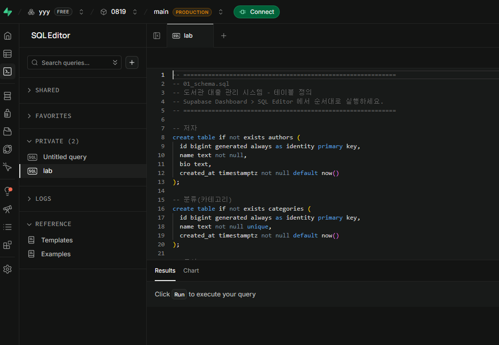
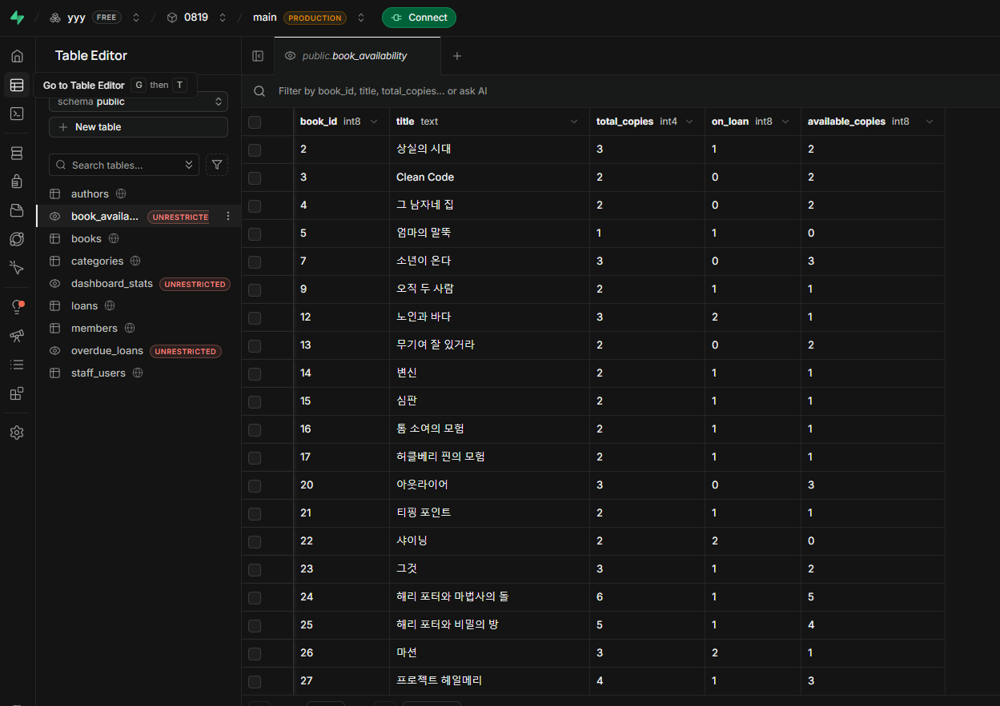
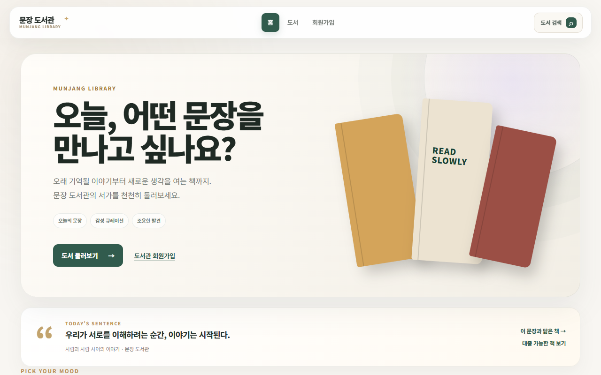
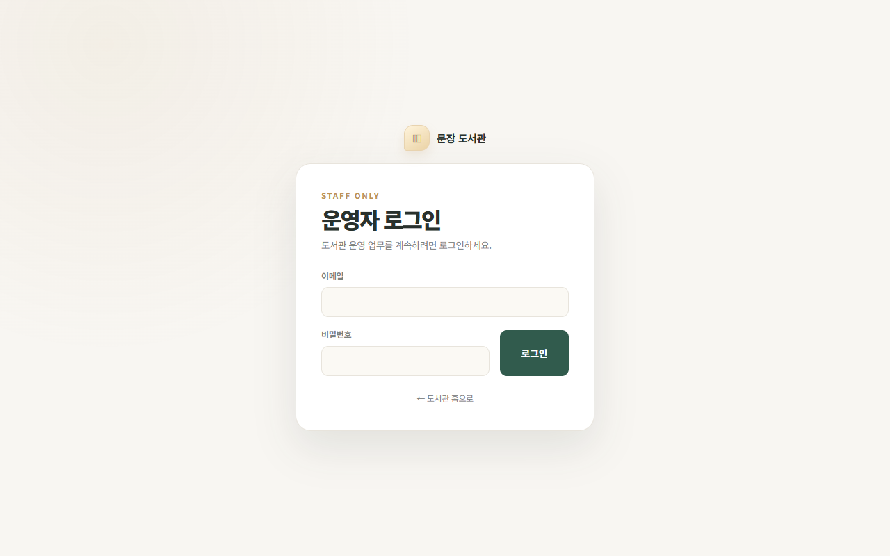
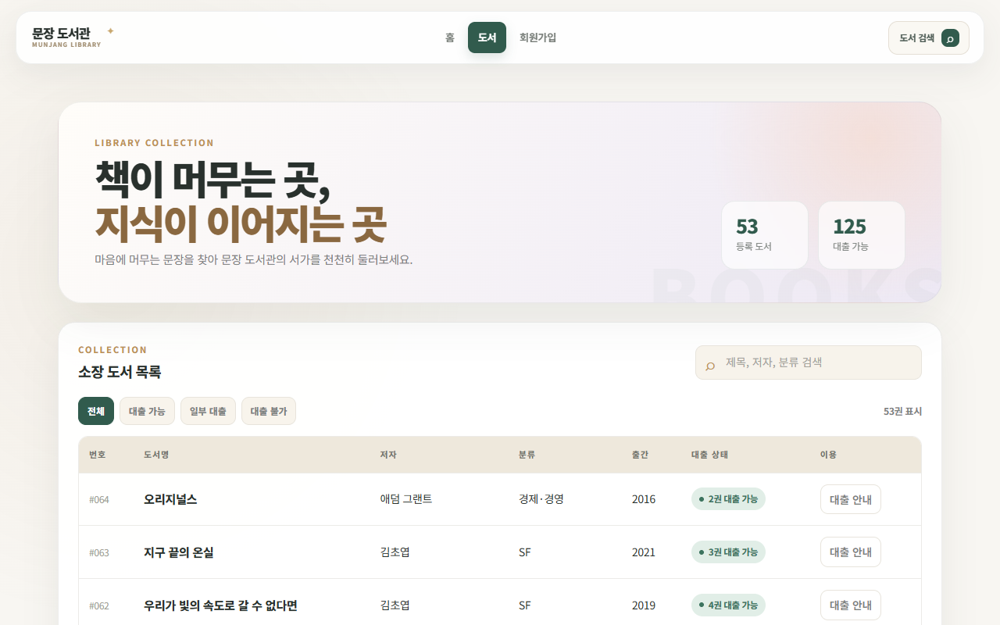
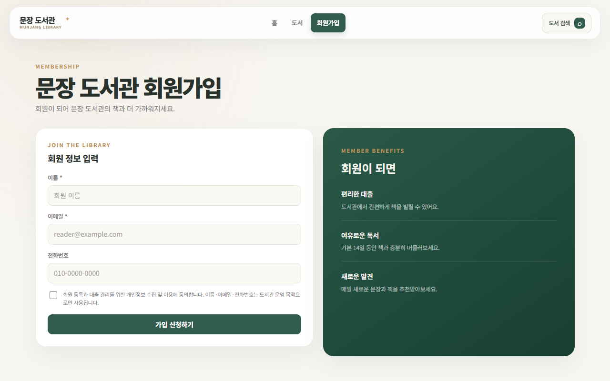

# Supabase와 바닐라 JS 기반 문장 도서관 대출 및 운영 시스템

- 과목: 웹개발 / 데이터베이스
- 날짜: 2026-08-19
- 태그: supabase, postgresql, javascript, html/css, rls

## 설명

이 프로젝트는 별도의 백엔드 서버 없이 Supabase(PostgreSQL)와 순수 HTML/CSS/JavaScript(ES Module)만으로 구현한 문장 도서관 대출 관리 서비스입니다. 일반 사용자는 도서 검색, 분위기별 추천, 대출 여부 확인 및 회원가입을 신청할 수 있고, 인증된 도서관 직원은 전용 대시보드에서 도서·저자·분류·회원 관리 및 대출/반납 처리를 수행할 수 있습니다. 데이터베이스 레벨에서는 DDL 테이블 설계부터 통계용 SQL 뷰, Row Level Security(RLS) 정책, 마이그레이션 및 중복 정리 SQL 스크립트를 체계적으로 구축하였습니다. 또한 Node.js 기반 읽기 전용 DB 상태 점검 스크립트(audit-remote.mjs)와 디테일한 반응형 CSS 스타일까지 포함되어 있습니다.

## 원본 파일

업로드한 프로젝트의 원본 파일 33개가 폴더 구조 그대로 [source/](./source/)에 보관되어 있습니다.

- [README.md](./source/README.md)
- [supabase/01_schema.sql](./source/supabase/01_schema.sql)
- [supabase/02_views.sql](./source/supabase/02_views.sql)
- [supabase/03_policies.sql](./source/supabase/03_policies.sql)
- [supabase/04_seed.sql](./source/supabase/04_seed.sql)
- [supabase/05_cleanup_and_constraints.sql](./source/supabase/05_cleanup_and_constraints.sql)
- [supabase/06_merge_fiction_categories.sql](./source/supabase/06_merge_fiction_categories.sql)
- [supabase/audit-remote.mjs](./source/supabase/audit-remote.mjs)
- [web/admin.html](./source/web/admin.html)
- [web/authors.html](./source/web/authors.html)
- [web/books.html](./source/web/books.html)
- [web/categories.html](./source/web/categories.html)
- [web/css/style.css](./source/web/css/style.css)
- [web/index.html](./source/web/index.html)
- [web/js/admin-guard.js](./source/web/js/admin-guard.js)
- [web/js/admin.js](./source/web/js/admin.js)
- [web/js/authors.js](./source/web/js/authors.js)
- [web/js/books.js](./source/web/js/books.js)
- [web/js/categories.js](./source/web/js/categories.js)
- [web/js/config.js](./source/web/js/config.js)
- [web/js/index.js](./source/web/js/index.js)
- [web/js/loans.js](./source/web/js/loans.js)
- [web/js/login.js](./source/web/js/login.js)
- [web/js/manage-books.js](./source/web/js/manage-books.js)
- [web/js/manage-members.js](./source/web/js/manage-members.js)
- [web/js/member-register.js](./source/web/js/member-register.js)
- [web/js/nav.js](./source/web/js/nav.js)
- [web/js/supabaseClient.js](./source/web/js/supabaseClient.js)
- [web/loans.html](./source/web/loans.html)
- [web/login.html](./source/web/login.html)
- [web/manage-books.html](./source/web/manage-books.html)
- [web/manage-members.html](./source/web/manage-members.html)
- [web/members.html](./source/web/members.html)

## 코드

<details>
<summary><strong>web/admin.html</strong> — 도서관 운영 직원 전용 대시보드 HTML로, 주요 통계 요약, 연체 도서 목록 및 도서/회원/대출 관리 빠른 링크를 제공합니다.</summary>

```html
<!doctype html>
<html lang="ko">
<head>
  <meta charset="UTF-8" />
  <meta name="viewport" content="width=device-width, initial-scale=1" />
  <title>운영 센터 — 문장 도서관</title>
  <link rel="stylesheet" href="css/style.css" />
</head>
<body class="auth-pending">
  <header class="topnav" id="topnav"></header>
  <main>
    <section class="page-intro">
      <div><p class="eyebrow">LIBRARY OPERATIONS</p><h1>도서관 운영</h1><p class="subtitle">오늘의 소장 도서와 회원, 대출 현황을 한눈에 확인하세요.</p></div>
    </section>
    <div id="error-box"></div>

    <div class="stat-grid" id="admin-stats">
      <div class="stat-card"><div class="num">—</div><div class="label">등록 도서</div></div>
      <div class="stat-card"><div class="num">—</div><div class="label">전체 보유 권수</div></div>
      <div class="stat-card"><div class="num">—</div><div class="label">등록 회원</div></div>
      <div class="stat-card"><div class="num">—</div><div class="label">대출 중</div></div>
      <div class="stat-card"><div class="num">—</div><div class="label">반납 지연</div></div>
    </div>

    <div class="card">
      <span class="section-kicker">RETURN STATUS</span><h2>반납이 늦어진 대출</h2>
      <div class="table-wrap"><table><thead><tr><th>도서</th><th>회원</th><th>연락 이메일</th><th>대출일</th><th>반납 예정</th><th>지연</th></tr></thead><tbody id="overdue-body"><tr class="empty-row"><td colspan="6">불러오는 중...</td></tr></tbody></table></div>
    </div>

    <div class="card">
      <span class="section-kicker">QUICK MANAGEMENT</span><h2>빠른 관리</h2>
      <nav class="quick-links">
        <a class="quick-link" href="manage-books.html"><strong>도서 관리</strong><span>도서 등록과 재고 확인</span></a>
        <a class="quick-link" href="authors.html"><strong>저자 관리</strong><span>저자 정보 등록</span></a>
        <a class="quick-link" href="categories.html"><strong>분류 관리</strong><span>서가 분류 정리</span></a>
        <a class="quick-link" href="manage-members.html"><strong>회원 관리</strong><span>회원 정보 확인</span></a>
        <a class="quick-link" href="loans.html"><strong>대출 관리</strong><span>대출과 반납 처리</span></a>
      </nav>
    </div>
  </main>
  <script type="module" src="js/nav.js"></script><script type="module" src="js/admin-guard.js"></script>
  <script type="module" src="js/admin.js"></script>
</body>
</html>
```

</details>

<details>
<summary><strong>web/authors.html</strong> — 직원 전용 저자 관리 페이지 HTML로, 새 저자 등록 폼과 기존에 등록된 저자 목록 조회 및 삭제 기능을 제공합니다.</summary>

```html
<!doctype html>
<html lang="ko">
<head>
  <meta charset="UTF-8" />
  <meta name="viewport" content="width=device-width, initial-scale=1" />
  <title>저자 아카이브 — 문장 도서관</title>
  <link rel="stylesheet" href="css/style.css" />
</head>
<body class="auth-pending">
  <header class="topnav" id="topnav"></header>
  <main>
    <section class="page-intro"><div><p class="eyebrow">Author Archive</p><h1>저자 아카이브</h1><p class="subtitle">책을 만든 사람들의 이름과 이야기를 기록합니다.</p></div></section>
    <div id="error-box"></div>
    <div class="content-grid">
    <div class="card"><span class="section-kicker">New author</span><h2>새 저자 등록</h2>
      <form class="inline-form" id="author-form">
        <div class="field">
          <label>이름 *</label>
          <input type="text" id="name" placeholder="저자 이름" required />
        </div>
        <div class="field">
          <label>소개</label>
          <input type="text" id="bio" placeholder="짧은 소개나 주요 작품" />
        </div>
        <button type="submit">저자 등록</button>
      </form>
    </div>

    <div class="card"><span class="section-kicker">Archive</span><h2>등록된 저자</h2>
      <div class="table-wrap">
        <table>
          <thead><tr><th>번호</th><th>이름</th><th>소개</th><th>등록일</th><th>관리</th></tr></thead>
          <tbody id="table-body">
            <tr class="empty-row"><td colspan="5">불러오는 중...</td></tr>
          </tbody>
        </table>
      </div>
    </div></div>
  </main>

  <script type="module" src="js/nav.js"></script>
  <script type="module" src="js/admin-guard.js"></script>
  <script type="module" src="js/authors.js"></script>
</body>
</html>
```

</details>

<details>
<summary><strong>web/books.html</strong> — 일반 이용자용 도서 컬렉션 페이지 HTML로, 검색창, 대출 상태 필터 버튼, 소장 도서 목록 및 대출 안내 팝업을 포함합니다.</summary>

```html
<!doctype html>
<html lang="ko">
<head>
  <meta charset="UTF-8" />
  <meta name="viewport" content="width=device-width, initial-scale=1" />
  <title>도서 컬렉션 — 문장 도서관</title>
  <link rel="stylesheet" href="css/style.css" />
</head>
<body>
  <header class="topnav" id="topnav"></header>
  <main>
    <section class="library-hero">
      <div>
        <p class="eyebrow">Library Collection</p>
        <h1>책이 머무는 곳,<br><span class="accent">지식이 이어지는 곳</span></h1>
        <p class="subtitle">마음에 머무는 문장을 찾아 문장 도서관의 서가를 천천히 둘러보세요.</p>
      </div>
      <div class="hero-meta" aria-label="도서 현황">
        <div class="mini-stat"><strong id="book-count">—</strong><span>등록 도서</span></div>
        <div class="mini-stat"><strong id="available-count">—</strong><span>대출 가능</span></div>
      </div>
    </section>
    <div id="error-box"></div>

    <div class="card">
      <div class="card-header">
        <div><span class="section-kicker">Collection</span><h2>소장 도서 목록</h2></div>
        <label class="search-box"><input type="search" id="book-search" placeholder="제목, 저자, 분류 검색" aria-label="도서 검색" /></label>
      </div>
      <div class="toolbar">
        <div class="filter-group" aria-label="대출 상태 필터">
          <button type="button" class="filter-chip active" data-filter="all">전체</button>
          <button type="button" class="filter-chip" data-filter="available">대출 가능</button>
          <button type="button" class="filter-chip" data-filter="low">일부 대출</button>
          <button type="button" class="filter-chip" data-filter="out">대출 불가</button>
        </div>
        <span class="result-count" id="result-count">0권 표시</span>
      </div>
      <div class="table-wrap">
        <table>
          <thead>
            <tr><th>번호</th><th>도서명</th><th>저자</th><th>분류</th><th>출간</th><th>대출 상태</th><th>이용</th></tr>
          </thead>
          <tbody id="table-body">
            <tr class="empty-row"><td colspan="7">불러오는 중...</td></tr>
          </tbody>
        </table>
      </div>
    </div>
    <dialog class="loan-dialog" id="loan-dialog"><button class="dialog-close" type="button" aria-label="닫기">×</button><p class="eyebrow">BORROWING GUIDE</p><h2 id="dialog-book-title">도서 대출 안내</h2><p id="dialog-book-status"></p><div class="dialog-actions"><a class="primary-link" href="members.html">회원가입</a><button type="button" class="ghost dialog-confirm">확인</button></div></dialog>
  </main>

  <script type="module" src="js/nav.js"></script>
  <script type="module" src="js/books.js"></script>
</body>
</html>
```

</details>

<details>
<summary><strong>web/categories.html</strong> — 직원 전용 서가 분류 관리 HTML 페이지로, 신규 카테고리 추가 폼과 기존 분류 목록 확인 및 삭제 인터페이스를 구성합니다.</summary>

```html
<!doctype html>
<html lang="ko">
<head>
  <meta charset="UTF-8" />
  <meta name="viewport" content="width=device-width, initial-scale=1" />
  <title>분류 관리 - 도서관 대출 관리</title>
  <link rel="stylesheet" href="css/style.css" />
</head>
<body class="auth-pending">
  <header class="topnav" id="topnav"></header>
  <main>
    <section class="page-intro"><div><p class="eyebrow">Curated Shelves</p><h1>서가 분류</h1><p class="subtitle">컬렉션을 더 쉽게 발견할 수 있도록 도서의 주제와 장르를 정리합니다.</p></div></section>
    <div id="error-box"></div>
    <div class="content-grid"><div class="card"><span class="section-kicker">New category</span><h2>새 분류 만들기</h2>
      <form class="inline-form" id="category-form">
        <div class="field">
          <label>분류명 *</label><input type="text" id="name" placeholder="예: 한국문학, 과학, 에세이" required />
        </div>
        <button type="submit">분류 추가</button>
      </form>
    </div>

    <div class="card"><span class="section-kicker">Shelves</span><h2>등록된 분류</h2>
      <div class="table-wrap">
        <table>
          <thead><tr><th>번호</th><th>분류명</th><th>등록일</th><th>관리</th></tr></thead>
          <tbody id="table-body">
            <tr class="empty-row"><td colspan="4">불러오는 중...</td></tr>
          </tbody>
        </table>
      </div>
    </div></div>
  </main>

  <script type="module" src="js/nav.js"></script>
  <script type="module" src="js/admin-guard.js"></script>
  <script type="module" src="js/categories.js"></script>
</body>
</html>
```

</details>

<details>
<summary><strong>web/index.html</strong> — 문장 도서관 메인 홈 랜딩 페이지로, 오늘의 문장, 기분별/분류별 추천 서가 및 최신 입고 도서 목록을 시각적으로 보여줍니다.</summary>

```html
<!doctype html>
<html lang="ko">
<head>
  <meta charset="UTF-8" />
  <meta name="viewport" content="width=device-width, initial-scale=1" />
  <title>문장 도서관 — 책과 머무는 시간</title>
  <link rel="stylesheet" href="css/style.css" />
</head>
<body>
  <header class="topnav" id="topnav"></header>
  <main class="home-main">
    <div id="error-box"></div>
    <section class="home-hero">
      <div class="home-hero-copy">
        <p class="eyebrow">MUNJANG LIBRARY</p>
        <h1>오늘, 어떤 문장을<br>만나고 싶나요?</h1>
        <p>오래 기억될 이야기부터 새로운 생각을 여는 책까지.<br>문장 도서관의 서가를 천천히 둘러보세요.</p>
        <div class="hero-tags"><span>오늘의 문장</span><span>감성 큐레이션</span><span>조용한 발견</span></div>
        <div class="hero-actions">
          <a class="primary-link" href="books.html">도서 둘러보기 <span>→</span></a>
          <a class="text-link" href="members.html">도서관 회원가입</a>
        </div>
      </div>
      <div class="book-art" aria-hidden="true">
        <span class="book book-one"></span><span class="book book-two"></span><span class="book book-three"></span>
        <span class="book-quote">READ<br>SLOWLY</span>
      </div>
    </section>

    <section class="daily-sentence">
      <div class="sentence-mark">“</div>
      <div class="sentence-copy"><p class="eyebrow">TODAY'S SENTENCE</p><blockquote id="daily-quote">좋은 문장은 마음속에 작은 방 하나를 만든다.</blockquote><span id="daily-theme">오늘의 문장 · 문장 도서관</span></div>
      <div class="sentence-actions"><a id="quote-books-link" href="books.html">이 문장과 닮은 책 →</a><a href="books.html?filter=available">대출 가능한 책 보기</a></div>
    </section>

    <section class="mood-section">
      <div class="section-heading"><div><p class="eyebrow">PICK YOUR MOOD</p><h2>오늘 마음은 어떤가요?</h2></div><span class="heading-note">기분에 맞는 서가를 골라보세요</span></div>
      <div class="mood-grid">
        <a class="mood-card peach" href="books.html?q=한국문학"><span class="mood-icon">☁</span><div><strong>마음이 몽글몽글</strong><small>다정한 한국문학</small></div><b>→</b></a>
        <a class="mood-card sage" href="books.html?q=에세이"><span class="mood-icon">✿</span><div><strong>잠시 쉬고 싶어</strong><small>천천히 읽는 에세이</small></div><b>→</b></a>
        <a class="mood-card lilac" href="books.html?q=SF"><span class="mood-icon">✦</span><div><strong>새로운 세계로</strong><small>상상력을 여는 SF</small></div><b>→</b></a>
        <a class="mood-card butter" href="books.html?q=과학"><span class="mood-icon">◌</span><div><strong>궁금한 게 많아</strong><small>세상을 읽는 과학</small></div><b>→</b></a>
      </div>
    </section>

    <section class="home-section">
      <div class="section-heading"><div><p class="eyebrow">NEW ON THE SHELF</p><h2>새로 들어온 책</h2></div><a href="books.html">전체 보기 →</a></div>
      <div class="book-grid" id="featured-books"><div class="loading-card">책을 고르는 중...</div></div>
    </section>

    <section class="home-banner">
      <div><p class="eyebrow">A QUIET PLACE FOR EVERYONE</p><h2>좋은 책은, 좋은 질문을 남깁니다.</h2><p>문장 도서관에서 당신의 다음 질문을 찾아보세요.</p></div>
      <a class="light-link" href="members.html">회원 등록하기 →</a>
    </section>
  </main>
  <script type="module" src="js/nav.js"></script>
  <script type="module" src="js/index.js"></script>
</body>
</html>
```

</details>

<details>
<summary><strong>web/loans.html</strong> — 직원 전용 대출·반납 데스크 페이지로, 도서 및 회원을 선택하여 대출을 접수하고 대출 이력 조회 및 반납/삭제 처리를 진행합니다.</summary>

```html
<!doctype html>
<html lang="ko">
<head>
  <meta charset="UTF-8" />
  <meta name="viewport" content="width=device-width, initial-scale=1" />
  <title>대출 데스크 — 문장 도서관</title>
  <link rel="stylesheet" href="css/style.css" />
</head>
<body class="auth-pending">
  <header class="topnav" id="topnav"></header>
  <main>
    <section class="page-intro"><div><p class="eyebrow">Circulation Desk</p><h1>대출 · 반납 데스크</h1><p class="subtitle">책과 회원을 연결하고, 대출에서 반납까지의 흐름을 기록합니다.</p></div></section>
    <div id="error-box"></div>
    <div class="card"><span class="section-kicker">New checkout</span><h2>새 대출 접수</h2>
      <form class="inline-form" id="loan-form">
        <div class="field">
          <label>도서 *</label>
          <select id="book_id" required></select>
        </div>
        <div class="field">
          <label>회원 *</label>
          <select id="member_id" required></select>
        </div>
        <div class="field">
          <label>대출일 *</label>
          <input type="date" id="loan_date" required />
        </div>
        <div class="field">
          <label>반납예정일 *</label>
          <input type="date" id="due_date" required />
        </div>
        <button type="submit">대출 시작</button>
      </form>
    </div>

    <div class="card">
      <span class="section-kicker">Circulation history</span><h2>대출 기록</h2>
      <div class="table-wrap">
        <table>
          <thead>
            <tr><th>번호</th><th>도서</th><th>회원</th><th>대출일</th><th>반납 예정</th><th>반납일</th><th>상태</th><th>관리</th></tr>
          </thead>
          <tbody id="table-body">
            <tr class="empty-row"><td colspan="8">불러오는 중...</td></tr>
          </tbody>
        </table>
      </div>
    </div>
  </main>

  <script type="module" src="js/nav.js"></script>
  <script type="module" src="js/admin-guard.js"></script>
  <script type="module" src="js/loans.js"></script>
</body>
</html>
```

</details>

<details>
<summary><strong>web/login.html</strong> — 도서관 운영자 전용 로그인 페이지 HTML로, Supabase Auth 기반의 이메일 및 비밀번호 로그인 폼을 제공합니다.</summary>

```html
<!doctype html><html lang="ko"><head><meta charset="UTF-8"/><meta name="viewport" content="width=device-width,initial-scale=1"/><title>운영자 로그인 — 문장 도서관</title><link rel="stylesheet" href="css/style.css"/></head>
<body class="login-page"><main class="login-shell"><a class="login-brand" href="index.html"><span class="brand-mark">▥</span><strong>문장 도서관</strong></a><section class="login-card"><p class="eyebrow">STAFF ONLY</p><h1>운영자 로그인</h1><p>도서관 운영 업무를 계속하려면 로그인하세요.</p><div id="error-box"></div><form id="login-form"><div class="field"><label>이메일</label><input id="login-email" type="email" autocomplete="username" required/></div><div class="field"><label>비밀번호</label><input id="login-password" type="password" autocomplete="current-password" required/></div><button type="submit">로그인</button></form><a class="back-home" href="index.html">← 도서관 홈으로</a></section></main><script type="module" src="js/login.js"></script></body></html>
```

</details>

<details>
<summary><strong>web/manage-books.html</strong> — 직원용 도서 등록 및 소장 목록 관리 HTML 페이지로, 도서명, ISBN, 저자, 분류, 보유 권수 등을 입력하여 도서를 관리합니다.</summary>

```html
<!doctype html><html lang="ko"><head><meta charset="UTF-8"/><meta name="viewport" content="width=device-width,initial-scale=1"/><title>도서 관리 — 문장 도서관</title><link rel="stylesheet" href="css/style.css"/></head><body class="auth-pending"><header class="topnav" id="topnav"></header><main><section class="page-intro"><div><p class="eyebrow">COLLECTION MANAGEMENT</p><h1>도서 관리</h1><p class="subtitle">새 도서를 등록하고 소장 목록을 관리합니다.</p></div></section><div id="error-box"></div><div class="card"><span class="section-kicker">NEW BOOK</span><h2>도서 등록</h2><form class="inline-form" id="manage-book-form"><div class="field"><label>도서명 *</label><input id="manage-title" required/></div><div class="field"><label>ISBN</label><input id="manage-isbn"/></div><div class="field"><label>저자</label><select id="manage-author"></select></div><div class="field"><label>분류</label><select id="manage-category"></select></div><div class="field"><label>출간연도</label><input id="manage-year" type="number" min="0" max="2100"/></div><div class="field"><label>보유 권수</label><input id="manage-copies" type="number" min="0" value="1" required/></div><button>도서 등록</button></form></div><div class="card"><span class="section-kicker">COLLECTION</span><h2>소장 목록</h2><div class="table-wrap"><table><thead><tr><th>도서명</th><th>저자</th><th>분류</th><th>출간</th><th>보유</th><th>관리</th></tr></thead><tbody id="manage-book-body"><tr class="empty-row"><td colspan="6">불러오는 중...</td></tr></tbody></table></div></div></main><script type="module" src="js/nav.js"></script><script type="module" src="js/admin-guard.js"></script><script type="module" src="js/manage-books.js"></script></body></html>
```

</details>

<details>
<summary><strong>web/manage-members.html</strong> — 직원용 회원 관리 HTML 페이지로, 등록된 전체 도서관 회원 정보를 조회하고 필요시 회원 삭제를 수행할 수 있습니다.</summary>

```html
<!doctype html><html lang="ko"><head><meta charset="UTF-8"/><meta name="viewport" content="width=device-width,initial-scale=1"/><title>회원 관리 — 문장 도서관</title><link rel="stylesheet" href="css/style.css"/></head><body class="auth-pending"><header class="topnav" id="topnav"></header><main><section class="page-intro"><div><p class="eyebrow">MEMBER MANAGEMENT</p><h1>회원 관리</h1><p class="subtitle">등록된 회원 정보를 확인하고 관리합니다.</p></div></section><div id="error-box"></div><div class="card"><span class="section-kicker">REGISTERED MEMBERS</span><h2>전체 회원</h2><div class="table-wrap"><table><thead><tr><th>번호</th><th>이름</th><th>이메일</th><th>전화번호</th><th>가입일</th><th>관리</th></tr></thead><tbody id="table-body"><tr class="empty-row"><td colspan="6">불러오는 중...</td></tr></tbody></table></div></div></main><script type="module" src="js/nav.js"></script><script type="module" src="js/admin-guard.js"></script><script type="module" src="js/manage-members.js"></script></body></html>
```

</details>

<details>
<summary><strong>web/members.html</strong> — 일반 이용자용 회원가입 HTML 페이지로, 이름, 이메일, 전화번호와 개인정보 동의를 받아 신규 도서관 회원가입 신청을 받습니다.</summary>

```html
<!doctype html>
<html lang="ko">
<head>
  <meta charset="UTF-8" />
  <meta name="viewport" content="width=device-width, initial-scale=1" />
  <title>회원 라운지 — 문장 도서관</title>
  <link rel="stylesheet" href="css/style.css" />
</head>
<body>
  <header class="topnav" id="topnav"></header>
  <main>
    <section class="page-intro"><div><p class="eyebrow">MEMBERSHIP</p><h1>문장 도서관 회원가입</h1><p class="subtitle">회원이 되어 문장 도서관의 책과 더 가까워지세요.</p></div></section>
    <div id="error-box"></div>
    <div id="success-box"></div>
    <div class="membership-layout"><div class="card"><span class="section-kicker">JOIN THE LIBRARY</span><h2>회원 정보 입력</h2>
      <form class="inline-form" id="member-form">
        <div class="field">
          <label>이름 *</label>
          <input type="text" id="name" placeholder="회원 이름" required />
        </div>
        <div class="field">
          <label>이메일 *</label><input type="email" id="email" placeholder="reader@example.com" required />
        </div>
        <div class="field">
          <label>전화번호</label>
          <input type="tel" id="phone" placeholder="010-0000-0000" pattern="010-[0-9]{4}-[0-9]{4}" inputmode="tel" />
        </div>
        <label class="consent-check"><input type="checkbox" id="privacy-consent" required /><span>회원 등록과 대출 관리를 위한 개인정보 수집 및 이용에 동의합니다. 이름·이메일·전화번호는 도서관 운영 목적으로만 사용됩니다.</span></label>
        <button type="submit">가입 신청하기</button>
      </form>
    </div>
    <aside class="membership-benefits"><p class="eyebrow">MEMBER BENEFITS</p><h2>회원이 되면</h2><ul><li><strong>편리한 대출</strong><span>도서관에서 간편하게 책을 빌릴 수 있어요.</span></li><li><strong>여유로운 독서</strong><span>기본 14일 동안 책과 충분히 머물러보세요.</span></li><li><strong>새로운 발견</strong><span>매일 새로운 문장과 책을 추천받아보세요.</span></li></ul></aside></div>
  </main>

  <script type="module" src="js/nav.js"></script>
  <script type="module" src="js/member-register.js"></script>
</body>
</html>
```

</details>

<details>
<summary><strong>web/js/admin-guard.js</strong> — 관리자 페이지 접근 시 Supabase 로그인 세션 및 staff_users 테이블 등록 여부를 검증하여 무권한 사용자를 로그인 페이지로 차단/이동시키는 가드 모듈입니다.</summary>

```javascript
import { supabase } from "./supabaseClient.js";
const { data } = await supabase.auth.getSession();
if (!data.session) {
  location.replace(`login.html?next=${encodeURIComponent(location.pathname.split("/").pop() || "admin.html")}`);
} else {
  const { data: staff, error } = await supabase
    .from("staff_users")
    .select("user_id")
    .eq("user_id", data.session.user.id)
    .maybeSingle();
  if (error || !staff) {
    await supabase.auth.signOut();
    location.replace("login.html?error=not_staff");
    throw new Error("운영자 권한이 없는 계정입니다.");
  }
  document.body.classList.remove("auth-pending");
  const nav = document.querySelector("#topnav nav");
  if (nav) {
    const logout = document.createElement("button"); logout.className = "logout-button"; logout.textContent = "로그아웃";
    logout.addEventListener("click", async () => { await supabase.auth.signOut(); location.replace("index.html"); });
    nav.append(logout);
  }
}
```

</details>

<details>
<summary><strong>web/js/admin.js</strong> — 운영 대시보드 페이지용 JavaScript로, dashboard_stats 뷰와 overdue_loans 뷰를 호출하여 수량 통계 및 연체 현황을 화면에 렌더링합니다.</summary>

```javascript
import { supabase, showError, escapeHTML } from "./supabaseClient.js";

async function loadAdmin() {
  const [{ data: stats, error: statsError }, { data: overdue, error: overdueError }] = await Promise.all([
    supabase.from("dashboard_stats").select("*").single(),
    supabase.from("overdue_loans").select("*").order("days_overdue", { ascending: false }),
  ]);
  if (statsError || overdueError) { showError(`관리 데이터를 불러오지 못했습니다: ${(statsError || overdueError).message}`); return; }
  [stats.total_books, stats.total_copies, stats.total_members, stats.active_loans, stats.overdue_count].forEach((value, index) => {
    document.querySelectorAll("#admin-stats .num")[index].textContent = Number(value).toLocaleString("ko-KR");
  });
  const body = document.getElementById("overdue-body");
  body.innerHTML = overdue.length ? overdue.map((row) => `<tr><td><span class="book-title">${escapeHTML(row.book_title)}</span></td><td>${escapeHTML(row.member_name)}</td><td>${escapeHTML(row.member_email)}</td><td>${row.loan_date}</td><td>${row.due_date}</td><td><span class="badge danger">${row.days_overdue}일</span></td></tr>`).join("") : `<tr class="empty-row"><td colspan="6">연체 데이터가 없습니다.</td></tr>`;
}
loadAdmin();
```

</details>

<details>
<summary><strong>web/js/authors.js</strong> — 저자 관리 동작을 담당하는 Script로, 등록된 저자 목록을 조회하고 중복 검사 후 신규 저자 등록 및 기존 저자 삭제를 수행합니다.</summary>

```javascript
import { supabase, showError, escapeHTML } from "./supabaseClient.js";

const form = document.getElementById("author-form");
const tbody = document.getElementById("table-body");

async function load() {
  showError("");
  const { data, error } = await supabase
    .from("authors")
    .select("*")
    .order("id", { ascending: false });

  if (error) {
    showError(`목록 조회 실패: ${error.message}`);
    return;
  }
  if (!data.length) {
    tbody.innerHTML = `<tr class="empty-row"><td colspan="5">등록된 저자가 없습니다.</td></tr>`;
    return;
  }
  tbody.innerHTML = data
    .map(
      (a) => `
    <tr>
      <td>${a.id}</td>
      <td>${escapeHTML(a.name)}</td>
      <td>${escapeHTML(a.bio ?? "-")}</td>
      <td>${new Date(a.created_at).toLocaleDateString()}</td>
      <td><button class="danger" data-id="${a.id}">삭제</button></td>
    </tr>`
    )
    .join("");
}

form.addEventListener("submit", async (e) => {
  e.preventDefault();
  showError("");
  const name = document.getElementById("name").value.trim();
  const bio = document.getElementById("bio").value.trim() || null;
  if (!name) return;

  const { data: duplicate } = await supabase.from("authors").select("id").ilike("name", name).maybeSingle();
  if (duplicate) {
    showError("이미 등록된 저자입니다.");
    return;
  }
  const { error } = await supabase.from("authors").insert({ name, bio });
  if (error) {
    showError(`추가 실패: ${error.message}`);
    return;
  }
  form.reset();
  load();
});

tbody.addEventListener("click", async (e) => {
  const btn = e.target.closest("button[data-id]");
  if (!btn) return;
  if (!confirm("이 저자를 삭제할까요? (해당 저자의 도서는 author_id가 NULL로 바뀝니다)")) return;
  const { error } = await supabase.from("authors").delete().eq("id", btn.dataset.id);
  if (error) {
    showError(`삭제 실패: ${error.message}`);
    return;
  }
  load();
});

load();
```

</details>

<details>
<summary><strong>web/js/books.js</strong> — 공개 도서 목록 페이지 동작을 담당하며, 검색어와 필터 칩 상태에 따라 도서 목록과 실시간 대출 가능 권수를 계산 및 렌더링합니다.</summary>

```javascript
import { supabase, showError, escapeHTML } from "./supabaseClient.js";

const tbody = document.getElementById("table-body");
const searchInput = document.getElementById("book-search");
const filterButtons = document.querySelectorAll(".filter-chip[data-filter]");
const resultCount = document.getElementById("result-count");
let books = [];
let availability = new Map();
let currentFilter = "all";

function render(rows) {
  resultCount.textContent = `${rows.length.toLocaleString("ko-KR")}권 표시`;
  tbody.innerHTML = rows.length ? rows.map((book) => {
    const available = Number(availability.get(book.id)?.available_copies ?? book.total_copies);
    const badgeClass = available <= 0 ? "danger" : available < book.total_copies ? "warn" : "ok";
    const label = available <= 0 ? "대출 중" : `${available}권 대출 가능`;
    return `<tr><td><span class="book-id">#${String(book.id).padStart(3,"0")}</span></td><td><span class="book-title">${escapeHTML(book.title)}</span></td><td>${escapeHTML(book.authors?.name ?? "미상")}</td><td>${escapeHTML(book.categories?.name ?? "미분류")}</td><td>${book.published_year ?? "—"}</td><td><span class="badge ${badgeClass}">${label}</span></td><td><button class="ghost borrow-guide" data-book-id="${book.id}">대출 안내</button></td></tr>`;
  }).join("") : `<tr class="empty-row"><td colspan="7">조건에 맞는 도서가 없습니다.</td></tr>`;
}

function applyFilters() {
  const query = searchInput.value.trim().toLowerCase();
  render(books.filter((book) => {
    const available = Number(availability.get(book.id)?.available_copies ?? book.total_copies);
    const textMatch = [book.title, book.authors?.name, book.categories?.name].some((value) => value?.toLowerCase().includes(query));
    const stateMatch = currentFilter === "all" || (currentFilter === "available" && available === Number(book.total_copies)) || (currentFilter === "low" && available > 0 && available < Number(book.total_copies)) || (currentFilter === "out" && available <= 0);
    return textMatch && stateMatch;
  }));
}

async function load() {
  const [{ data: bookRows, error }, { data: stock }] = await Promise.all([
    supabase.from("books").select("*, authors(name), categories(name)").order("id", { ascending:false }),
    supabase.from("book_availability").select("*"),
  ]);
  if (error) { showError(`도서를 불러오지 못했습니다: ${error.message}`); return; }
  books = bookRows;
  availability = new Map((stock ?? []).map((row) => [row.book_id, row]));
  document.getElementById("book-count").textContent = books.length.toLocaleString("ko-KR");
  document.getElementById("available-count").textContent = books.reduce((sum, book) => sum + Number(availability.get(book.id)?.available_copies ?? book.total_copies), 0).toLocaleString("ko-KR");
  const requested = new URLSearchParams(location.search).get("q");
  const requestedFilter = new URLSearchParams(location.search).get("filter");
  if (requested) searchInput.value = requested;
  if (["all","available","low","out"].includes(requestedFilter)) {
    currentFilter = requestedFilter;
    filterButtons.forEach((item) => item.classList.toggle("active", item.dataset.filter === currentFilter));
  }
  applyFilters();
}

searchInput.addEventListener("input", applyFilters);
filterButtons.forEach((button) => button.addEventListener("click", () => {
  currentFilter = button.dataset.filter;
  filterButtons.forEach((item) => item.classList.toggle("active", item === button));
  applyFilters();
}));
load();

const dialog = document.getElementById("loan-dialog");
tbody.addEventListener("click", (event) => {
  const button = event.target.closest(".borrow-guide"); if (!button) return;
  const book = books.find((item) => String(item.id) === button.dataset.bookId); const available = Number(availability.get(book.id)?.available_copies ?? book.total_copies);
  document.getElementById("dialog-book-title").textContent = book.title;
  document.getElementById("dialog-book-status").textContent = available > 0 ? `현재 ${available}권을 대출할 수 있습니다. 회원증을 지참해 도서관 데스크를 방문해주세요.` : "현재 모든 도서가 대출 중입니다. 반납 후 다시 이용해주세요.";
  dialog.showModal();
});
dialog.querySelectorAll(".dialog-close,.dialog-confirm").forEach((button) => button.addEventListener("click", () => dialog.close()));
```

</details>

<details>
<summary><strong>web/js/categories.js</strong> — 서가 분류 관리 기능을 수행하는 Script로, Supabase categories 테이블에서 목록을 불러오고 새 분류 추가 및 삭제 처리 동작을 제어합니다.</summary>

```javascript
import { supabase, showError, escapeHTML } from "./supabaseClient.js";

const form = document.getElementById("category-form");
const tbody = document.getElementById("table-body");

async function load() {
  showError("");
  const { data, error } = await supabase
    .from("categories")
    .select("*")
    .order("id", { ascending: false });

  if (error) {
    showError(`목록 조회 실패: ${error.message}`);
    return;
  }
  if (!data.length) {
    tbody.innerHTML = `<tr class="empty-row"><td colspan="4">등록된 분류가 없습니다.</td></tr>`;
    return;
  }
  tbody.innerHTML = data
    .map(
      (c) => `
    <tr>
      <td>${c.id}</td>
      <td>${escapeHTML(c.name)}</td>
      <td>${new Date(c.created_at).toLocaleDateString()}</td>
      <td><button class="danger" data-id="${c.id}">삭제</button></td>
    </tr>`
    )
    .join("");
}

form.addEventListener("submit", async (e) => {
  e.preventDefault();
  showError("");
  const name = document.getElementById("name").value.trim();
  if (!name) return;

  const { error } = await supabase.from("categories").insert({ name });
  if (error) {
    showError(`추가 실패: ${error.message} (분류명이 중복되지 않았는지 확인하세요)`);
    return;
  }
  form.reset();
  load();
});

tbody.addEventListener("click", async (e) => {
  const btn = e.target.closest("button[data-id]");
  if (!btn) return;
  if (!confirm("이 분류를 삭제할까요? (해당 분류의 도서는 category_id가 NULL로 바뀝니다)")) return;
  const { error } = await supabase.from("categories").delete().eq("id", btn.dataset.id);
  if (error) {
    showError(`삭제 실패: ${error.message}`);
    return;
  }
  load();
});

load();
```

</details>

<details>
<summary><strong>web/js/config.js</strong> — Supabase 프로젝트 접속 정보 파일로, SUPABASE_URL 및 SUPABASE_ANON_KEY 상수를 exported 설정값으로 보관합니다.</summary>

```javascript
// Supabase 프로젝트 정보
// Supabase Dashboard > Project Settings > API 에서 확인할 수 있습니다.
export const SUPABASE_URL = "https://kvqguwnregapwsqasckw.supabase.co";
export const SUPABASE_ANON_KEY = "sb_publishable_9AqYTdTqZsY5u44747OEjw_SEKAgErb";
```

</details>

<details>
<summary><strong>web/js/index.js</strong> — 메인 페이지용 Script로, 날짜 기반 오늘의 문장 및 키워드를 바인딩하고 최신 입고 도서 4건을 Supabase에서 조회해 표출합니다.</summary>

```javascript
import { supabase, showError, escapeHTML } from "./supabaseClient.js";

const sentences = [
  { quote:"좋은 문장은 마음속에 작은 방 하나를 만든다.", theme:"천천히 머무는 독서", query:"에세이" },
  { quote:"멀리 가는 사람은 자주 자신의 마음을 펼쳐 본다.", theme:"새로운 세계를 향한 마음", query:"세계문학" },
  { quote:"우리가 서로를 이해하려는 순간, 이야기는 시작된다.", theme:"사람과 사람 사이의 이야기", query:"한국문학" },
  { quote:"질문 하나가 어제와 다른 세계의 문을 연다.", theme:"생각을 넓히는 발견", query:"인문" },
  { quote:"상상력은 아직 오지 않은 내일을 먼저 비춘다.", theme:"미래를 그리는 이야기", query:"SF" },
  { quote:"조용히 읽은 한 페이지가 오래 삶을 움직인다.", theme:"일상을 바꾸는 작은 시작", query:"자기계발" },
];
const sentence = sentences[Math.floor(Date.now()/86400000) % sentences.length];
document.getElementById("daily-quote").textContent = sentence.quote;
document.getElementById("daily-theme").textContent = `${sentence.theme} · 문장 도서관`;
document.getElementById("quote-books-link").href = `books.html?q=${encodeURIComponent(sentence.query)}`;

async function loadHome() {
  const { data: books, error: booksError } = await supabase
    .from("books")
    .select("id, title, published_year, authors(name), categories(name)")
    .order("created_at", { ascending: false })
    .limit(4);

  if (booksError) {
    showError(`도서관 정보를 불러오지 못했습니다: ${booksError.message}`);
    document.getElementById("featured-books").innerHTML = `<div class="loading-card">새로 들어온 책을 잠시 불러오지 못했습니다.</div>`;
    return;
  }

  const palette = ["sage", "sand", "clay", "ink"];
  document.getElementById("featured-books").innerHTML = books.map((book, index) => `
    <a class="featured-book" href="books.html?q=${encodeURIComponent(book.title)}" aria-label="${escapeHTML(book.title)} 도서 보기">
      <div class="book-cover ${palette[index % palette.length]}">
        <span>${escapeHTML(book.categories?.name ?? "문장 도서관")}</span><strong>${escapeHTML(book.title)}</strong><small>MUNJANG LIBRARY</small>
      </div>
      <div class="featured-meta"><strong>${escapeHTML(book.title)}</strong><span>${escapeHTML(book.authors?.name ?? "작자 미상")} · ${book.published_year ?? "연도 미상"}</span></div>
    </a>
  `).join("");
}

loadHome();
```

</details>

<details>
<summary><strong>web/js/loans.js</strong> — 대출·반납 데스크 동작 모듈로, 대출 가능한 도서와 회원 옵션을 불러와 새 대출을 등록하거나 반납 및 대출 기록 삭제를 수행합니다.</summary>

```javascript
import { supabase, showError, escapeHTML } from "./supabaseClient.js";

const form = document.getElementById("loan-form");
const tbody = document.getElementById("table-body");
const bookSelect = document.getElementById("book_id");
const memberSelect = document.getElementById("member_id");
const loanDateInput = document.getElementById("loan_date");
const dueDateInput = document.getElementById("due_date");

function today() {
  return new Date().toISOString().slice(0, 10);
}
function plusDays(dateStr, days) {
  const d = new Date(dateStr);
  d.setDate(d.getDate() + days);
  return d.toISOString().slice(0, 10);
}

loanDateInput.value = today();
dueDateInput.value = plusDays(today(), 14);
loanDateInput.addEventListener("change", () => {
  dueDateInput.value = plusDays(loanDateInput.value, 14);
});

async function loadOptions() {
  const [{ data: books, error: e1 }, { data: members, error: e2 }] = await Promise.all([
    supabase.from("book_availability").select("*").order("title"),
    supabase.from("members").select("id, name, email").order("name"),
  ]);
  if (e1 || e2) {
    showError(`옵션 조회 실패: ${(e1 || e2).message}`);
    return;
  }
  bookSelect.innerHTML = books
    .map(
      (b) =>
        `<option value="${b.book_id}" ${b.available_copies <= 0 ? "disabled" : ""}>
          ${escapeHTML(b.title)} (대출가능 ${b.available_copies}/${b.total_copies})
        </option>`
    )
    .join("");
  memberSelect.innerHTML = members
    .map((m) => `<option value="${m.id}">${escapeHTML(m.name)} (${escapeHTML(m.email)})</option>`)
    .join("");
}

async function loadLoans() {
  showError("");
  const { data, error } = await supabase
    .from("loans")
    .select("*, books(title), members(name)")
    .order("id", { ascending: false });

  if (error) {
    showError(`목록 조회 실패: ${error.message}`);
    return;
  }
  if (!data.length) {
    tbody.innerHTML = `<tr class="empty-row"><td colspan="8">등록된 대출이 없습니다.</td></tr>`;
    return;
  }

  const todayStr = today();
  tbody.innerHTML = data
    .map((l) => {
      let status = `<span class="badge ok">대출중</span>`;
      if (l.return_date) {
        status = `<span class="badge muted">반납완료</span>`;
      } else if (l.due_date < todayStr) {
        status = `<span class="badge danger">연체</span>`;
      }
      const returnBtn = l.return_date
        ? ""
        : `<button data-id="${l.id}" data-action="return">반납 처리</button>`;
      return `
      <tr>
        <td>${l.id}</td>
        <td>${escapeHTML(l.books?.title ?? "-")}</td>
        <td>${escapeHTML(l.members?.name ?? "-")}</td>
        <td>${l.loan_date}</td>
        <td>${l.due_date}</td>
        <td>${l.return_date ?? "-"}</td>
        <td>${status}</td>
        <td style="display:flex; gap:6px;">
          ${returnBtn}
          <button class="danger" data-id="${l.id}" data-action="delete">삭제</button>
        </td>
      </tr>`;
    })
    .join("");
}

form.addEventListener("submit", async (e) => {
  e.preventDefault();
  showError("");
  const book_id = bookSelect.value;
  const member_id = memberSelect.value;
  const loan_date = loanDateInput.value;
  const due_date = dueDateInput.value;
  if (!book_id || !member_id) {
    showError("도서와 회원을 선택하세요.");
    return;
  }

  // 등록 직전에 다시 한 번 재고 확인 (동시 대출 대비)
  const { data: av, error: avErr } = await supabase
    .from("book_availability")
    .select("available_copies")
    .eq("book_id", book_id)
    .single();
  if (avErr) {
    showError(`재고 확인 실패: ${avErr.message}`);
    return;
  }
  if (av.available_copies <= 0) {
    showError("이 도서는 현재 대출 가능한 재고가 없습니다.");
    return;
  }

  const { error } = await supabase
    .from("loans")
    .insert({ book_id, member_id, loan_date, due_date });

  if (error) {
    showError(`대출 등록 실패: ${error.message}`);
    return;
  }
  loanDateInput.value = today();
  dueDateInput.value = plusDays(today(), 14);
  await Promise.all([loadOptions(), loadLoans()]);
});

tbody.addEventListener("click", async (e) => {
  const btn = e.target.closest("button[data-id]");
  if (!btn) return;
  const id = btn.dataset.id;

  if (btn.dataset.action === "return") {
    const { error } = await supabase
      .from("loans")
      .update({ return_date: today() })
      .eq("id", id);
    if (error) {
      showError(`반납 처리 실패: ${error.message}`);
      return;
    }
  } else if (btn.dataset.action === "delete") {
    if (!confirm("이 대출 기록을 삭제할까요?")) return;
    const { error } = await supabase.from("loans").delete().eq("id", id);
    if (error) {
      showError(`삭제 실패: ${error.message}`);
      return;
    }
  }
  await Promise.all([loadOptions(), loadLoans()]);
});

loadOptions();
loadLoans();
```

</details>

<details>
<summary><strong>web/js/login.js</strong> — 운영자 로그인 처리 Script로, Supabase signInWithPassword를 사용해 사용자 인증을 시도하고 성공 시 관리자 페이지로 이동시킵니다.</summary>

```javascript
import { supabase, showError } from "./supabaseClient.js";
const { data } = await supabase.auth.getSession();
if (data.session) location.replace(new URLSearchParams(location.search).get("next") || "admin.html");
if (new URLSearchParams(location.search).get("error") === "not_staff") {
  showError("운영자로 등록된 계정만 접근할 수 있습니다.");
}
document.getElementById("login-form").addEventListener("submit", async (event) => {
  event.preventDefault(); showError("");
  const button = event.currentTarget.querySelector("button"); button.disabled = true; button.textContent = "확인 중...";
  const { error } = await supabase.auth.signInWithPassword({ email:document.getElementById("login-email").value.trim(), password:document.getElementById("login-password").value });
  if (error) { showError("이메일 또는 비밀번호를 확인해주세요."); button.disabled = false; button.textContent = "로그인"; return; }
  location.replace(new URLSearchParams(location.search).get("next") || "admin.html");
});
```

</details>

<details>
<summary><strong>web/js/manage-books.js</strong> — 직원용 도서 관리 모듈로, 저자/분류 선택 옵션을 로드하고 중복 도서 체크 후 신규 도서 등록 및 기존 도서 삭제를 처리합니다.</summary>

```javascript
import { supabase, showError, escapeHTML } from "./supabaseClient.js";

const form = document.getElementById("manage-book-form");
const tableBody = document.getElementById("manage-book-body");
const authorSelect = document.getElementById("manage-author");
const categorySelect = document.getElementById("manage-category");

async function loadOptions() {
  const [{ data: authors, error: authorError }, { data: categories, error: categoryError }] =
    await Promise.all([
      supabase.from("authors").select("id, name").order("name"),
      supabase.from("categories").select("id, name").order("name"),
    ]);

  if (authorError || categoryError) {
    showError(`선택 항목을 불러오지 못했습니다: ${(authorError || categoryError).message}`);
    return;
  }

  authorSelect.innerHTML = `<option value="">저자 미상</option>` +
    authors.map((author) => `<option value="${author.id}">${escapeHTML(author.name)}</option>`).join("");
  categorySelect.innerHTML = `<option value="">미분류</option>` +
    categories.map((category) => `<option value="${category.id}">${escapeHTML(category.name)}</option>`).join("");
}

async function loadBooks() {
  const { data: books, error } = await supabase
    .from("books")
    .select("*, authors(name), categories(name)")
    .order("id", { ascending: false });

  if (error) {
    showError(`도서를 불러오지 못했습니다: ${error.message}`);
    return;
  }

  tableBody.innerHTML = books.length
    ? books.map((book) => `
      <tr>
        <td><span class="book-title">${escapeHTML(book.title)}</span></td>
        <td>${escapeHTML(book.authors?.name ?? "미상")}</td>
        <td>${escapeHTML(book.categories?.name ?? "미분류")}</td>
        <td>${book.published_year ?? "—"}</td>
        <td>${book.total_copies}권</td>
        <td><button class="danger" data-id="${book.id}">삭제</button></td>
      </tr>`).join("")
    : `<tr class="empty-row"><td colspan="6">등록된 도서가 없습니다.</td></tr>`;
}

form.addEventListener("submit", async (event) => {
  event.preventDefault();
  showError("");

  const title = document.getElementById("manage-title").value.trim();
  const isbn = document.getElementById("manage-isbn").value.trim() || null;
  const authorId = authorSelect.value || null;
  const categoryId = categorySelect.value || null;

  const duplicateQuery = supabase.from("books").select("id").ilike("title", title);
  const { data: sameTitleBooks } = authorId
    ? await duplicateQuery.eq("author_id", authorId)
    : await duplicateQuery.is("author_id", null);

  if (sameTitleBooks?.length) {
    showError("같은 제목과 저자의 도서가 이미 등록되어 있습니다.");
    return;
  }

  const { error } = await supabase.from("books").insert({
    title,
    isbn,
    author_id: authorId,
    category_id: categoryId,
    published_year: document.getElementById("manage-year").value || null,
    total_copies: Number(document.getElementById("manage-copies").value),
  });

  if (error) {
    showError(`등록하지 못했습니다: ${error.message}`);
    return;
  }

  form.reset();
  document.getElementById("manage-copies").value = 1;
  loadBooks();
});

tableBody.addEventListener("click", async (event) => {
  const button = event.target.closest("button[data-id]");
  if (!button || !confirm("이 도서를 삭제할까요? 관련 대출 기록도 함께 삭제됩니다.")) return;

  const { error } = await supabase.from("books").delete().eq("id", button.dataset.id);
  if (error) {
    showError(`삭제하지 못했습니다: ${error.message}`);
    return;
  }
  loadBooks();
});

loadOptions();
loadBooks();
```

</details>

<details>
<summary><strong>web/js/manage-members.js</strong> — 직원용 회원 관리 모듈로, 등록된 회원 전체 목록을 Supabase에서 불러와 조회하고 개별 회원을 삭제하는 동작을 제어합니다.</summary>

```javascript
import { supabase, showError, escapeHTML } from "./supabaseClient.js";
const tbody = document.getElementById("table-body");
async function load() {
  const { data, error } = await supabase.from("members").select("*").order("id", { ascending:false });
  if (error) { showError(`회원을 불러오지 못했습니다: ${error.message}`); return; }
  tbody.innerHTML = data.length ? data.map((member) => `<tr><td><span class="book-id">#${member.id}</span></td><td><strong>${escapeHTML(member.name)}</strong></td><td>${escapeHTML(member.email)}</td><td>${escapeHTML(member.phone ?? "—")}</td><td>${member.joined_at}</td><td><button class="danger" data-id="${member.id}">삭제</button></td></tr>`).join("") : `<tr class="empty-row"><td colspan="6">등록된 회원이 없습니다.</td></tr>`;
}
tbody.addEventListener("click", async (event) => {
  const button = event.target.closest("button[data-id]"); if (!button || !confirm("이 회원과 관련 대출 기록을 삭제할까요?")) return;
  const { error } = await supabase.from("members").delete().eq("id", button.dataset.id);
  if (error) { showError(`삭제하지 못했습니다: ${error.message}`); return; } load();
});
load();
```

</details>

<details>
<summary><strong>web/js/member-register.js</strong> — 공개 회원가입 처리 모듈로, 폼 입력 데이터를 받아 members 테이블에 추가하고 이메일 중복 시 예외 메시지를 표시합니다.</summary>

```javascript
import { supabase, showError } from "./supabaseClient.js";
const form = document.getElementById("member-form");
form.addEventListener("submit", async (event) => {
  event.preventDefault();
  showError("");
  const success = document.getElementById("success-box");
  success.style.display = "none";
  const name = document.getElementById("name").value.trim();
  const email = document.getElementById("email").value.trim();
  const phone = document.getElementById("phone").value.trim() || null;
  const button = form.querySelector("button"); button.disabled = true; button.textContent = "가입 처리 중...";
  const { error } = await supabase.from("members").insert({ name, email, phone });
  if (error) { showError(error.code === "23505" ? "이미 가입된 이메일입니다." : `가입 처리 중 문제가 생겼습니다: ${error.message}`); button.disabled = false; button.textContent = "가입 신청하기"; return; }
  form.reset();
  success.textContent = `${name}님, 문장 도서관 회원이 되신 것을 환영합니다.`;
  success.style.display = "block";
  button.disabled = false; button.textContent = "가입 신청하기";
});
```

</details>

<details>
<summary><strong>web/js/nav.js</strong> — 모든 페이지 공통 상단 네비게이션 및 푸터를 동적으로 렌더링하고, 로그인 상태에 따라 로그아웃 버튼을 생성하는 공용 모듈입니다.</summary>

```javascript
// 모든 페이지 공통 상단 네비게이션
const LINKS = [
  { href: "index.html", label: "홈" },
  { href: "books.html", label: "도서" },
  { href: "members.html", label: "회원가입" },
];

export function renderNav() {
  const mount = document.getElementById("topnav");
  if (!mount) return;
  const current = (location.pathname.split("/").pop() || "index").replace(".html", "");
  mount.innerHTML = `
    <a class="brand" href="index.html" aria-label="문장 도서관 홈">
      <span class="brand-wordmark"><strong>문장 도서관</strong><small>MUNJANG LIBRARY</small></span><i>✦</i>
    </a>
    <nav>
      ${LINKS.map(
        (l) =>
          `<a href="${l.href}" class="${l.href.replace(".html", "") === current ? "active" : ""}">${l.label}</a>`
      ).join("")}
    </nav>
    <a class="header-cta" href="books.html"><span>도서 검색</span><b>⌕</b></a>
  `;
  const staffPages = ["admin", "manage-books", "manage-members", "authors", "categories", "loans"];
  if (!staffPages.includes(current) && current !== "login") {
    document.body.insertAdjacentHTML("beforeend", `<footer class="site-footer"><span>© 문장 도서관</span><a href="login.html">직원 로그인</a></footer>`);
  }
}

renderNav();
```

</details>

<details>
<summary><strong>web/js/supabaseClient.js</strong> — Supabase 라이브러리를 통해 공용 클라이언트 객체를 생성하고, 에러 메시지 출력 및 HTML 문자열 이스케이프 헬퍼 함수를 제공합니다.</summary>

```javascript
import { createClient } from "https://esm.sh/@supabase/supabase-js@2";
import { SUPABASE_URL, SUPABASE_ANON_KEY } from "./config.js";

if (SUPABASE_URL.includes("YOUR-PROJECT-REF")) {
  // config.js를 아직 채우지 않은 경우 눈에 띄게 알려준다.
  console.warn(
    "[config.js] SUPABASE_URL / SUPABASE_ANON_KEY를 아직 설정하지 않았습니다."
  );
}

export const supabase = createClient(SUPABASE_URL, SUPABASE_ANON_KEY);

// 화면 상단에 에러 메시지를 띄우는 공용 헬퍼
export function showError(message) {
  const box = document.getElementById("error-box");
  if (!box) return;
  box.textContent = message;
  box.style.display = message ? "block" : "none";
}

export function fmtDate(d) {
  if (!d) return "-";
  return d;
}

export function escapeHTML(value) {
  return String(value ?? "").replace(/[&<>'"]/g, (char) => ({ "&":"&amp;", "<":"&lt;", ">":"&gt;", "'":"&#39;", '"':"&quot;" }[char]));
}
```

</details>

<details>
<summary><strong>web/css/style.css</strong> — 서비스 전체의 디자인을 정의하는 CSS 파일로, 커스텀 변수 기반 컬러 시스템, 헤더, 대시보드, 테이블 및 반응형 레이아웃을 정의합니다.</summary>

```css
@import url('https://fonts.googleapis.com/css2?family=Noto+Sans+KR:wght@400;500;600;700;800;900&display=swap');
:root { --paper:#f8f6f2; --surface:rgba(255,255,255,.97); --ink:#29312d; --muted:#7b817d; --line:#e8e4dc; --forest:#315b4d; --forest-light:#4d7b69; --gold:#bc9256; --blush:#f5ddd5; --lilac:#e7e0f3; --sage:#dce9df; --butter:#f4e8bd; --danger:#a8483f; --success:#3d745f; --warning:#b5742f; --radius:22px; --shadow:0 18px 45px rgba(43,55,48,.075); }
* { box-sizing:border-box; }
html { scroll-behavior:smooth; }
:focus-visible { outline:3px solid rgba(181,138,75,.55); outline-offset:3px; }
body { margin:0; min-height:100vh; font-family:"Noto Sans KR",sans-serif; background:radial-gradient(circle at 12% 8%,rgba(181,138,75,.075),transparent 28rem),var(--paper); color:var(--ink); font-size:15px; line-height:1.65; letter-spacing:-.025em; text-rendering:optimizeLegibility; }
header.topnav { position:sticky; top:14px; z-index:20; width:min(calc(100% - 28px),1240px); min-height:68px; margin:14px auto 0; padding:0 18px 0 20px; display:flex; align-items:center; justify-content:space-between; gap:28px; border:1px solid rgba(40,58,49,.075); border-radius:20px; background:rgba(255,255,255,.9); box-shadow:0 12px 38px rgba(40,51,44,.075); backdrop-filter:blur(18px); }
.brand { display:flex; align-items:center; gap:8px; padding:0!important; color:var(--ink)!important; background:transparent!important; box-shadow:none!important; white-space:nowrap; text-decoration:none; }
.brand-wordmark { display:flex; flex-direction:column; gap:0; }.brand-wordmark strong{font-size:1.02rem;font-weight:900;line-height:1.15;letter-spacing:-.06em}.brand-wordmark small{color:#a08d70;font-size:.48rem;font-weight:800;line-height:1.4;letter-spacing:.13em}.brand i{align-self:flex-start;margin-top:-2px;color:#c8a76e;font-size:.62rem;font-style:normal}
.brand-mark { display:grid; width:37px; height:37px; place-items:center; border:1px solid #e8d3af; border-radius:13px 13px 13px 4px; color:#72552f; background:linear-gradient(145deg,#fff4dc,#ead2a5); box-shadow:0 7px 15px rgba(172,126,65,.13); font-size:.9rem; }
header.topnav nav { display:flex; gap:4px; align-items:center; }
header.topnav a { color:#777d78; text-decoration:none; padding:9px 13px; border-radius:9px; font-size:.82rem; font-weight:650; transition:.2s ease; }
header.topnav a:hover { color:var(--ink); background:#f3f2ed; }
header.topnav a.active { color:#fff; background:var(--forest); box-shadow:0 6px 14px rgba(33,77,62,.15); }
.header-cta { display:inline-flex; align-items:center; gap:9px; padding:9px 12px 9px 14px!important; border:1px solid #e5dfd5; border-radius:12px!important; color:#53615a!important; background:#faf8f3!important; font-size:.73rem!important; font-weight:750!important; box-shadow:none!important; }.header-cta:hover{border-color:#d5c7ae;background:#fffaf0!important}.header-cta b{display:grid;width:23px;height:23px;place-items:center;border-radius:8px;color:#fff;background:var(--forest);font-size:.94rem;font-weight:500}
main { max-width:1180px; margin:0 auto; padding:48px 24px 72px; }
.page-intro { display:flex; justify-content:space-between; align-items:flex-end; gap:30px; margin-bottom:28px; }
.page-intro h1 { font-size:clamp(2rem,4vw,3rem); }
.page-intro .subtitle { max-width:620px; margin:0; }
.schema-pill { flex:0 0 auto; display:inline-flex; align-items:center; gap:8px; padding:9px 13px; border:1px solid rgba(49,112,90,.2); border-radius:999px; color:var(--forest-light); background:rgba(255,253,248,.68); font-family:inherit; font-size:.72rem; font-weight:800; line-height:1; letter-spacing:.04em; }
.schema-pill::before { content:""; width:7px; height:7px; border-radius:50%; background:#56a17f; box-shadow:0 0 0 4px rgba(86,161,127,.12); }
.db-note { display:grid; grid-template-columns:auto 1fr; gap:14px; align-items:center; padding:15px 18px; margin-bottom:20px; border:1px solid rgba(189,138,61,.18); border-radius:14px; background:rgba(240,228,205,.58); color:#66583f; font-size:.81rem; }
.db-note code { padding:4px 7px; border-radius:6px; background:rgba(255,255,255,.55); color:var(--forest); }
.db-icon { display:grid; place-items:center; width:35px; height:35px; border-radius:10px; background:#e7d2aa; color:#735326; font-weight:900; }
.content-grid { display:grid; grid-template-columns:minmax(0,.78fr) minmax(0,1.45fr); gap:20px; align-items:start; }
.content-grid .card { margin:0; }
.content-grid .inline-form { grid-template-columns:1fr; }
.content-grid .field:first-child { grid-column:auto; }
.wide-card { grid-column:1/-1; }
.quick-links { display:grid; grid-template-columns:repeat(5,1fr); gap:10px; }
.quick-link { display:flex; flex-direction:column; gap:6px; padding:17px; color:var(--ink); text-decoration:none; border:1px solid rgba(99,87,68,.13); border-radius:13px; background:#f8f4ec; transition:.2s ease; }
.quick-link:hover { transform:translateY(-2px); border-color:rgba(189,138,61,.45); background:#fffaf0; }
.quick-link strong { font-family:inherit; font-size:.9rem; font-weight:800; }
.quick-link span { color:var(--muted); font-size:.72rem; }
.page-heading { margin-bottom:27px; }
.eyebrow,.section-kicker { color:var(--gold); font-size:.71rem; font-weight:800; letter-spacing:.15em; text-transform:uppercase; }
.eyebrow { margin:0 0 7px; }
.section-kicker { display:block; margin-bottom:3px; }
h1 { margin:0 0 7px; font-family:inherit; font-size:clamp(2rem,4vw,3.3rem); font-weight:850; line-height:1.12; letter-spacing:-.065em; }
h1 .accent { color:var(--forest-light); }
p.subtitle { color:var(--muted); margin:0 0 22px; font-size:.93rem; }
.library-hero { position:relative; overflow:hidden; display:grid; grid-template-columns:1.35fr .65fr; gap:28px; padding:42px 46px; margin-bottom:24px; border:1px solid rgba(49,65,56,.07); border-radius:30px; color:var(--ink); background:radial-gradient(circle at 92% 18%,rgba(244,221,213,.85),transparent 13rem),linear-gradient(125deg,#fffdf9 0%,#ede8f4 100%); box-shadow:0 22px 55px rgba(45,52,47,.075); }
.library-hero::after { content:"BOOKS"; position:absolute; right:-18px; bottom:-38px; color:rgba(49,91,77,.035); font-family:inherit; font-size:6.2rem; font-weight:900; line-height:1; letter-spacing:.08em; }
.library-hero h1 { color:#29312d; max-width:640px; }
.library-hero h1 .accent { color:#8a6840; }
.library-hero .subtitle { color:#7b817d; max-width:570px; margin:0; }
.hero-meta { align-self:end; display:flex; justify-content:flex-end; gap:12px; position:relative; z-index:1; }
.mini-stat { min-width:112px; padding:17px 18px; border:1px solid rgba(49,91,77,.09); border-radius:17px; background:rgba(255,255,255,.66); backdrop-filter:blur(8px); }
.mini-stat strong { display:block; color:var(--forest); font-size:1.55rem; font-weight:850; line-height:1.1; letter-spacing:-.04em; }
.mini-stat span { font-size:.75rem; color:var(--muted); }
.card { background:var(--surface); border:1px solid rgba(75,78,70,.1); border-radius:var(--radius); padding:25px; margin-bottom:20px; box-shadow:var(--shadow); }
.card-header { display:flex; justify-content:space-between; align-items:center; gap:16px; margin-bottom:18px; }
.card h2 { font-family:inherit; font-size:1.15rem; font-weight:800; margin:0 0 16px; letter-spacing:-.04em; }
.card-header h2 { margin:0; }
form.inline-form { display:grid; grid-template-columns:repeat(6,minmax(115px,1fr)); gap:12px; align-items:end; }
.field { display:flex; flex-direction:column; gap:6px; }
.field:first-child { grid-column:span 2; }
.field label { font-size:.76rem; color:var(--muted); font-weight:700; }
input,select { width:100%; min-height:42px; padding:9px 12px; border:1px solid var(--line); border-radius:10px; font:inherit; font-size:.88rem; background:#fbf9f4; color:var(--ink); transition:.2s ease; }
input::placeholder { color:#a3a299; }
input:focus,select:focus { outline:none; border-color:var(--gold); box-shadow:0 0 0 3px rgba(189,138,61,.13); background:#fff; }
button { cursor:pointer; min-height:42px; border:0; border-radius:10px; padding:10px 17px; font:inherit; font-size:.86rem; font-weight:750; background:var(--forest); color:#fff; transition:.18s ease; }
button:hover { transform:translateY(-1px); background:var(--forest-light); box-shadow:0 8px 18px rgba(23,63,50,.15); }
button.danger { min-height:auto; padding:7px 11px; color:var(--danger); background:#f6e8e4; }
button.danger:hover { background:#eed7d1; box-shadow:none; }
button.ghost { min-height:auto; background:transparent; color:var(--muted); border:1px solid var(--line); font-weight:600; padding:7px 11px; }
button.ghost:hover { background:#f4f0e7; color:var(--ink); box-shadow:none; }
.search-box { position:relative; width:min(290px,100%); }
.search-box input { padding-left:38px; background:#f7f3eb; }
.search-box::before { content:"⌕"; position:absolute; z-index:1; left:13px; top:5px; color:var(--gold); font-size:1.35rem; }
.table-wrap { overflow-x:auto; border:1px solid rgba(99,87,68,.12); border-radius:13px; }
table { width:100%; border-collapse:collapse; font-size:.88rem; background:rgba(255,255,255,.42); }
th,td { text-align:left; padding:14px 13px; border-bottom:1px solid rgba(99,87,68,.12); white-space:nowrap; }
th { background:#eee8dc; color:#74756e; font-size:.68rem; font-weight:800; text-transform:uppercase; letter-spacing:.09em; }
tbody tr { transition:background .15s ease; }
tbody tr:last-child td { border-bottom:0; }
tbody tr:hover { background:rgba(241,235,222,.72); }
.book-title { font-family:inherit; font-size:.95rem; font-weight:750; color:var(--ink); }
.book-id { color:#a09c92; font-size:.76rem; }
.badge { display:inline-flex; align-items:center; gap:6px; padding:5px 10px; border-radius:999px; font-size:.72rem; font-weight:750; }
.badge::before { content:""; width:6px; height:6px; border-radius:50%; background:currentColor; }
.badge.ok { background:#e1eee7; color:var(--success); }
.badge.warn { background:#f5ead8; color:var(--warning); }
.badge.danger { background:#f4e1de; color:var(--danger); }
.badge.muted { background:#eceae4; color:var(--muted); }
#error-box { display:none; background:#f5e2df; color:var(--danger); border:1px solid #e8c5bf; padding:11px 14px; border-radius:10px; margin-bottom:16px; font-size:.86rem; }
.stat-grid { display:grid; grid-template-columns:repeat(auto-fit,minmax(160px,1fr)); gap:14px; margin-bottom:22px; }
.stat-card { background:var(--surface); border:1px solid rgba(99,87,68,.15); border-radius:var(--radius); padding:21px; box-shadow:var(--shadow); }
.stat-card .num { color:var(--forest); font-size:2rem; font-weight:850; line-height:1; letter-spacing:-.05em; }
.nav-meta { display:flex; align-items:center; gap:8px; color:#8a8f8b; font-size:.66rem; font-weight:700; letter-spacing:.04em; white-space:nowrap; }
.nav-meta::before { content:""; width:6px; height:6px; border-radius:50%; background:#70c59f; box-shadow:0 0 0 4px rgba(112,197,159,.1); }
.toolbar { display:flex; align-items:center; justify-content:space-between; gap:12px; margin-bottom:14px; }
.filter-group { display:flex; gap:7px; flex-wrap:wrap; }
.filter-chip { min-height:auto; padding:7px 11px; color:var(--muted); border:1px solid var(--line); background:#f8f4ec; font-size:.74rem; }
.filter-chip:hover,.filter-chip.active { color:#fff; background:var(--forest); border-color:var(--forest); box-shadow:none; transform:none; }
.result-count { color:var(--muted); font-size:.76rem; font-weight:650; }
.table-actions { display:flex; gap:6px; }
.home-main { max-width:1240px; padding-top:32px; }
.home-hero { min-height:510px; display:grid; grid-template-columns:1.08fr .92fr; align-items:center; overflow:hidden; position:relative; padding:64px 68px; border:1px solid rgba(49,65,56,.07); border-radius:34px; background:radial-gradient(circle at 88% 12%,rgba(231,224,243,.75),transparent 15rem),linear-gradient(125deg,#fffdf9 0%,#f2eee5 100%); color:var(--ink); box-shadow:0 24px 60px rgba(45,52,47,.075); }
.home-hero::before { content:""; position:absolute; width:420px; height:420px; right:-90px; top:-160px; border-radius:50%; border:1px solid rgba(33,77,62,.08); box-shadow:0 0 0 70px rgba(33,77,62,.022),0 0 0 140px rgba(33,77,62,.014); }
.home-hero-copy { position:relative; z-index:2; }
.home-hero .eyebrow { color:#a87a38; }
.home-hero h1 { margin:10px 0 22px; color:#1f2a24; font-size:clamp(2.75rem,5.2vw,4.8rem); line-height:1.07; }
.home-hero-copy>p:not(.eyebrow) { margin:0; color:#747a75; font-size:1.02rem; line-height:1.8; }
.hero-actions { display:flex; align-items:center; gap:24px; margin-top:34px; }
.hero-tags { display:flex; flex-wrap:wrap; gap:7px; margin-top:24px; }.hero-tags span{padding:6px 10px;border:1px solid rgba(49,91,77,.1);border-radius:999px;color:#6f7c75;background:rgba(255,255,255,.62);font-size:.67rem;font-weight:650}
.primary-link,.light-link { display:inline-flex; align-items:center; justify-content:center; gap:22px; padding:13px 18px; border-radius:11px; color:#fff; background:var(--forest); text-decoration:none; font-size:.86rem; font-weight:800; transition:.2s ease; }
.primary-link:hover,.light-link:hover { transform:translateY(-2px); background:#30624f; }
.text-link { color:var(--forest); font-size:.84rem; font-weight:700; text-underline-offset:5px; }
.book-art { position:relative; z-index:1; height:350px; align-self:end; }
.book { position:absolute; bottom:10px; display:block; border-radius:5px 12px 12px 5px; box-shadow:14px 16px 30px rgba(0,0,0,.2); transform-origin:bottom center; }
.book::before { content:""; position:absolute; left:13px; top:0; bottom:0; width:2px; background:rgba(0,0,0,.13); }
.book-one { width:145px; height:310px; left:16%; background:#d4a45a; transform:rotate(-9deg); }
.book-two { width:150px; height:345px; left:40%; background:#ece3d1; transform:rotate(4deg); }
.book-three { width:132px; height:285px; left:65%; background:#9b4f45; transform:rotate(12deg); }
.book-quote { position:absolute; z-index:2; left:49%; top:94px; color:#173f32; font-size:1.1rem; font-weight:900; line-height:1.15; letter-spacing:.05em; transform:rotate(4deg); }
.public-stats { display:grid; grid-template-columns:repeat(4,1fr); margin:18px 0 78px; padding:22px 0; border-bottom:1px solid var(--line); }
.daily-sentence { display:grid; grid-template-columns:auto 1fr auto; align-items:center; gap:24px; margin:22px 0 0; padding:25px 30px; border:1px solid rgba(47,71,59,.08); border-radius:22px; background:linear-gradient(110deg,#fff 0%,#fffaf1 100%); box-shadow:0 12px 32px rgba(45,52,47,.05); }
.sentence-mark { color:#c3a46d; font-size:4rem; font-weight:900; line-height:.8; }
.sentence-copy .eyebrow { margin-bottom:2px; font-size:.61rem; }
.sentence-copy blockquote { margin:0 0 2px; color:#28332d; font-size:1.08rem; font-weight:750; letter-spacing:-.04em; }
.sentence-copy span { color:var(--muted); font-size:.69rem; }
.sentence-actions { display:flex; flex-direction:column; align-items:flex-end; gap:7px; }
.sentence-actions a { color:var(--forest); font-size:.74rem; font-weight:750; text-decoration:none; }
#success-box { display:none; margin-bottom:18px; padding:13px 15px; border:1px solid #bcd8c8; border-radius:11px; color:#29644f; background:#e7f2eb; font-size:.86rem; }
.membership-layout { display:grid; grid-template-columns:1.05fr .95fr; gap:20px; align-items:stretch; }
.membership-layout .inline-form { grid-template-columns:1fr; }
.membership-layout .field:first-child { grid-column:auto; }
.membership-benefits { padding:38px; border-radius:var(--radius); color:#f9f6ef; background:linear-gradient(145deg,#2a5948,#173f32); box-shadow:var(--shadow); }
.membership-benefits h2 { margin:4px 0 24px; font-size:1.5rem; }
.membership-benefits ul { display:grid; gap:20px; margin:0; padding:0; list-style:none; }
.membership-benefits li { display:flex; flex-direction:column; gap:4px; padding-bottom:18px; border-bottom:1px solid rgba(255,255,255,.12); }
.membership-benefits li:last-child { border:0; }.membership-benefits strong{font-size:.88rem}.membership-benefits span{color:rgba(255,255,255,.6);font-size:.77rem}
.consent-check { display:grid; grid-template-columns:auto 1fr; gap:9px; align-items:start; margin:3px 0; color:var(--muted); font-size:.7rem; line-height:1.55; cursor:pointer; }.consent-check input{width:16px;min-height:16px;margin-top:2px;accent-color:var(--forest)}
.auth-pending main { visibility:hidden; }
.logout-button { min-height:auto; padding:8px 11px; color:#8a5a51; border:1px solid #eadbd6; background:#fff7f5; font-size:.72rem; }
.login-page { display:grid; min-height:100vh; place-items:center; }
.login-shell { width:min(100% - 28px,430px); padding:0; }
.login-brand { display:flex; align-items:center; justify-content:center; gap:10px; margin-bottom:18px; color:var(--ink); text-decoration:none; }
.login-card { padding:36px; border:1px solid var(--line); border-radius:22px; background:#fff; box-shadow:0 24px 60px rgba(41,50,44,.11); }
.login-card h1 { font-size:2rem; }.login-card>p:not(.eyebrow){margin:0 0 24px;color:var(--muted);font-size:.84rem}.login-card form{display:grid;gap:15px}.login-card button{margin-top:4px}.back-home{display:block;margin-top:22px;color:var(--muted);font-size:.75rem;text-align:center;text-decoration:none}
.loan-dialog { width:min(calc(100% - 30px),460px); padding:34px; border:1px solid var(--line); border-radius:20px; color:var(--ink); background:#fff; box-shadow:0 30px 80px rgba(25,35,29,.25); }
.loan-dialog::backdrop { background:rgba(19,30,24,.45); backdrop-filter:blur(4px); }.loan-dialog h2{margin:5px 0 10px;font-size:1.4rem}.loan-dialog>p:not(.eyebrow){color:var(--muted);font-size:.86rem}.dialog-close{position:absolute;right:16px;top:14px;min-height:auto;padding:4px 9px;color:var(--muted);background:transparent;font-size:1.25rem}.dialog-actions{display:flex;align-items:center;gap:9px;margin-top:24px}.dialog-actions .primary-link{padding:10px 16px}
.site-footer { width:min(calc(100% - 48px),1180px); margin:0 auto; padding:28px 0 34px; display:flex; justify-content:space-between; border-top:1px solid var(--line); color:#9a9e9a; font-size:.68rem; }.site-footer a{color:#9a9e9a;text-decoration:none}.site-footer a:hover{color:var(--ink)}
.public-stats>div { display:flex; flex-direction:column; align-items:center; gap:3px; border-right:1px solid var(--line); }
.public-stats>div:last-child { border:0; }
.public-stats .num { color:var(--forest); font-size:1.75rem; font-weight:850; letter-spacing:-.05em; }
.public-stats .label { color:var(--muted); font-size:.75rem; }
.home-section { margin-bottom:82px; }
.mood-section { margin-bottom:78px; }.heading-note{color:var(--muted);font-size:.72rem}.mood-grid{display:grid;grid-template-columns:repeat(4,1fr);gap:13px}.mood-card{min-height:136px;display:flex;flex-direction:column;justify-content:space-between;padding:20px;border:1px solid rgba(50,60,54,.055);border-radius:21px;color:var(--ink);text-decoration:none;transition:.22s ease;box-shadow:0 9px 20px rgba(45,52,47,.035)}.mood-card:hover{transform:translateY(-4px) rotate(-.4deg);box-shadow:0 17px 28px rgba(45,52,47,.09)}.mood-card.peach{background:#f4ddd5}.mood-card.sage{background:#dce9df}.mood-card.lilac{background:#e7e0f3}.mood-card.butter{background:#f4e8bd}.mood-icon{font-size:1.35rem;color:rgba(45,55,49,.52)}.mood-card div{display:flex;flex-direction:column;gap:2px}.mood-card strong{font-size:.88rem;font-weight:850}.mood-card small{color:rgba(41,49,45,.55);font-size:.68rem}.mood-card b{align-self:flex-end;font-size:.85rem}
.section-heading { display:flex; align-items:flex-end; justify-content:space-between; margin-bottom:24px; }
.section-heading h2,.home-banner h2 { margin:2px 0 0; font-size:1.8rem; font-weight:850; letter-spacing:-.05em; }
.section-heading a { color:var(--forest); font-size:.8rem; font-weight:750; text-decoration:none; }
.book-grid { display:grid; grid-template-columns:repeat(4,1fr); gap:22px; }
.featured-book { min-width:0; color:inherit; text-decoration:none; }
.book-cover { position:relative; aspect-ratio:3/4.1; display:flex; flex-direction:column; justify-content:space-between; overflow:hidden; padding:24px 21px; border-radius:4px 16px 16px 4px; box-shadow:0 16px 30px rgba(35,41,36,.11); transition:.25s ease; }
.featured-book:hover .book-cover { transform:translateY(-6px) rotate(-1deg); box-shadow:0 24px 38px rgba(35,41,36,.18); }
.book-cover::before { content:"✦"; position:absolute; right:18px; top:17px; font-size:.9rem; opacity:.32; }.book-cover::after{content:"";position:absolute;left:9px;top:0;bottom:0;width:1px;background:rgba(0,0,0,.1)}
.book-cover span { font-size:.66rem; font-weight:800; letter-spacing:.1em; opacity:.65; }
.book-cover strong { max-width:90%; font-size:1.35rem; font-weight:850; line-height:1.3; letter-spacing:-.055em; }
.book-cover small { font-size:.55rem; font-weight:750; letter-spacing:.12em; opacity:.55; }
.book-cover.sage { color:#31483e; background:#bfd2c5; }.book-cover.sand { color:#4b4032; background:#ead7af; }.book-cover.clay { color:#5e403b; background:#edc9c1; }.book-cover.ink { color:#4a4356; background:#d7cfe5; }
.featured-meta { display:flex; flex-direction:column; gap:3px; padding:14px 3px 0; }
.featured-meta strong { overflow:hidden; text-overflow:ellipsis; white-space:nowrap; font-size:.9rem; font-weight:800; }
.featured-meta span { color:var(--muted); font-size:.73rem; }
.loading-card { grid-column:1/-1; padding:50px; text-align:center; color:var(--muted); }
.home-banner { position:relative; overflow:hidden; display:flex; align-items:flex-end; justify-content:space-between; gap:30px; padding:46px 50px; border:1px solid rgba(49,91,77,.08); border-radius:25px; color:#29463b; background:linear-gradient(120deg,#e5eee7,#d6e5db); box-shadow:0 16px 36px rgba(49,91,77,.07); }
.home-banner::after { content:"✦"; position:absolute; right:32%; top:26px; color:rgba(49,91,77,.15); font-size:2.1rem; }.home-banner .eyebrow { color:#6d8a7c; }.home-banner p:last-child { margin:8px 0 0; color:#718078; }.home-banner .light-link { position:relative; z-index:1; flex:0 0 auto; color:#fff; background:#315b4d; }.home-banner .light-link:hover{background:#24483c}
.stat-card .label { color:var(--muted); font-size:.78rem; margin-top:8px; }
.empty-row td { color:var(--muted); text-align:center; padding:34px; }
@media(max-width:900px) { header.topnav{padding:10px 12px;gap:10px} header.topnav nav{flex:1;justify-content:flex-end;overflow-x:auto;padding-bottom:1px} header.topnav a{white-space:nowrap;padding:8px 10px}.brand-wordmark small,.brand i,.header-cta span{display:none}.brand-wordmark strong{font-size:.9rem}.header-cta{padding:7px!important}.header-cta b{width:25px;height:25px} main{padding-top:30px}.library-hero{grid-template-columns:1fr;padding:30px}.hero-meta{justify-content:flex-start} form.inline-form{grid-template-columns:repeat(2,minmax(0,1fr))}.field:first-child{grid-column:span 2} }
@media(max-width:900px) { .content-grid{grid-template-columns:1fr}.page-intro{align-items:flex-start;flex-direction:column}.quick-links{grid-template-columns:repeat(2,1fr)} }
@media(max-width:900px) { .nav-meta{display:none}.home-hero{grid-template-columns:1fr;padding:48px 38px}.book-art{display:none}.public-stats{grid-template-columns:repeat(2,1fr);row-gap:20px}.public-stats>div:nth-child(2){border:0}.book-grid{grid-template-columns:repeat(2,1fr)} }
@media(max-width:900px) { .mood-grid{grid-template-columns:repeat(2,1fr)} }
@media(max-width:900px) { .daily-sentence{grid-template-columns:auto 1fr}.sentence-actions{grid-column:2;align-items:flex-start;flex-direction:row;gap:18px}.membership-layout{grid-template-columns:1fr} }
@media(max-width:560px) { main{padding:22px 14px 48px}.library-hero{padding:27px 22px;border-radius:20px}.hero-meta{display:grid;grid-template-columns:1fr 1fr}.mini-stat{min-width:0}.card{padding:18px}.card-header{align-items:stretch;flex-direction:column}.search-box{width:100%}form.inline-form{grid-template-columns:1fr}.field:first-child{grid-column:auto} }
@media(max-width:560px) { .quick-links{grid-template-columns:1fr}.schema-pill{white-space:normal}.db-note{grid-template-columns:1fr}.db-icon{display:none} }
@media(max-width:560px) { .home-main{padding-top:14px}.home-hero{min-height:500px;padding:42px 24px;border-radius:20px}.home-hero h1{font-size:2.65rem}.hero-actions{align-items:flex-start;flex-direction:column;gap:15px}.public-stats{margin-bottom:52px}.book-grid{gap:12px}.book-cover{padding:18px 15px}.book-cover strong{font-size:1.05rem}.home-banner{align-items:flex-start;flex-direction:column;padding:32px 25px} }
@media(max-width:560px) { .daily-sentence{grid-template-columns:1fr;padding:22px}.sentence-mark{display:none}.sentence-actions{grid-column:1;flex-direction:column}.public-stats .num{font-size:1.45rem} }
@media(max-width:560px) { .mood-grid{gap:9px}.mood-card{min-height:120px;padding:16px}.heading-note{display:none} }
@media(prefers-reduced-motion:reduce) { *,*::before,*::after{scroll-behavior:auto!important;transition:none!important;animation:none!important} }
```

</details>

<details>
<summary><strong>supabase/01_schema.sql</strong> — 저자, 분류, 도서, 회원, 대출, 운영자 테이블 구조와 외래키 제약조건 및 자주 조회되는 컬럼의 인덱스를 정의하는 SQL 스크립트입니다.</summary>

```sql
-- ============================================================
-- 01_schema.sql
-- 도서관 대출 관리 시스템 - 테이블 정의
-- Supabase Dashboard > SQL Editor 에서 순서대로 실행하세요.
-- ============================================================

-- 저자
create table if not exists authors (
  id bigint generated always as identity primary key,
  name text not null,
  bio text,
  created_at timestamptz not null default now()
);

-- 분류(카테고리)
create table if not exists categories (
  id bigint generated always as identity primary key,
  name text not null unique,
  created_at timestamptz not null default now()
);

-- 도서
create table if not exists books (
  id bigint generated always as identity primary key,
  title text not null,
  isbn text unique,
  author_id bigint references authors(id) on delete set null,
  category_id bigint references categories(id) on delete set null,
  published_year int,
  total_copies int not null default 1 check (total_copies >= 0),
  created_at timestamptz not null default now()
);

-- 회원
create table if not exists members (
  id bigint generated always as identity primary key,
  name text not null,
  email text not null unique,
  phone text,
  joined_at date not null default current_date
);

-- 대출
create table if not exists loans (
  id bigint generated always as identity primary key,
  book_id bigint not null references books(id) on delete cascade,
  member_id bigint not null references members(id) on delete cascade,
  loan_date date not null default current_date,
  due_date date not null,
  return_date date,
  created_at timestamptz not null default now(),
  constraint due_after_loan check (due_date >= loan_date),
  constraint return_after_loan check (return_date is null or return_date >= loan_date)
);

-- 운영자 허용 목록 (Supabase Auth 사용자와 연결)
create table if not exists staff_users (
  user_id uuid primary key references auth.users(id) on delete cascade,
  display_name text not null,
  created_at timestamptz not null default now()
);

-- 자주 조회하는 컬럼에 인덱스
create index if not exists idx_books_author on books(author_id);
create index if not exists idx_books_category on books(category_id);
create index if not exists idx_loans_book on loans(book_id);
create index if not exists idx_loans_member on loans(member_id);
create index if not exists idx_loans_open on loans(book_id) where return_date is null;
create unique index if not exists uq_authors_name_normalized on authors (lower(btrim(name)));
create unique index if not exists uq_books_title_author_normalized
  on books (lower(btrim(title)), coalesce(author_id, 0));
```

</details>

<details>
<summary><strong>supabase/02_views.sql</strong> — 도서별 대출 가능 수량(book_availability), 연체 도서 목록(overdue_loans), 대시보드 요약 통계(dashboard_stats)를 제공하는 PostgreSQL 뷰 생성 SQL입니다.</summary>

```sql
-- ============================================================
-- 02_views.sql
-- 도서 대여 가능 수량 / 연체 목록 뷰
-- ============================================================

-- 도서별 대여 가능 수량 (전체 보유 수 - 현재 대출 중인 수)
create or replace view book_availability as
select
  b.id as book_id,
  b.title,
  b.total_copies,
  count(l.id) filter (where l.return_date is null) as on_loan,
  b.total_copies - count(l.id) filter (where l.return_date is null) as available_copies
from books b
left join loans l on l.book_id = b.id
group by b.id, b.title, b.total_copies;

-- 연체 대출 목록 (반납 안 했는데 반납예정일이 지난 건)
create or replace view overdue_loans as
select
  l.id as loan_id,
  b.title as book_title,
  m.name as member_name,
  m.email as member_email,
  l.loan_date,
  l.due_date,
  current_date - l.due_date as days_overdue
from loans l
join books b on b.id = l.book_id
join members m on m.id = l.member_id
where l.return_date is null
  and l.due_date < current_date;

-- 대시보드용 요약 통계
create or replace view dashboard_stats as
select
  (select count(*) from books) as total_books,
  (select coalesce(sum(total_copies), 0) from books) as total_copies,
  (select count(*) from members) as total_members,
  (select count(*) from loans where return_date is null) as active_loans,
  (select count(*) from overdue_loans) as overdue_count;
```

</details>

<details>
<summary><strong>supabase/03_policies.sql</strong> — 테이블별 Row Level Security(RLS)를 활성화하고 익명/인증 사용자의 조회 및 직원 전용 데이터 CUD 권한 정책을 설정하는 보안 SQL입니다.</summary>

```sql
-- 문장 도서관 접근 정책
-- 공개 사용자는 도서 정보를 조회하고 회원가입을 신청할 수 있습니다.
-- 로그인한 운영자만 관리 데이터의 추가·수정·삭제가 가능합니다.

create table if not exists staff_users (
  user_id uuid primary key references auth.users(id) on delete cascade,
  display_name text not null,
  created_at timestamptz not null default now()
);

alter table authors enable row level security;
alter table categories enable row level security;
alter table books enable row level security;
alter table members enable row level security;
alter table loans enable row level security;
alter table staff_users enable row level security;

drop policy if exists "anon full access - authors" on authors;
drop policy if exists "anon full access - categories" on categories;
drop policy if exists "anon full access - books" on books;
drop policy if exists "anon full access - members" on members;
drop policy if exists "anon full access - loans" on loans;

drop policy if exists "public read authors" on authors;
drop policy if exists "public read categories" on categories;
drop policy if exists "public read books" on books;
drop policy if exists "public join members" on members;
drop policy if exists "staff manage authors" on authors;
drop policy if exists "staff manage categories" on categories;
drop policy if exists "staff manage books" on books;
drop policy if exists "staff manage members" on members;
drop policy if exists "staff manage loans" on loans;
drop policy if exists "staff read own profile" on staff_users;

create policy "public read authors" on authors for select to anon, authenticated using (true);
create policy "public read categories" on categories for select to anon, authenticated using (true);
create policy "public read books" on books for select to anon, authenticated using (true);
create policy "public join members" on members for insert to anon with check (true);

create policy "staff read own profile" on staff_users
  for select to authenticated using (user_id = auth.uid());

create policy "staff manage authors" on authors for all to authenticated
  using (exists (select 1 from staff_users s where s.user_id = auth.uid()))
  with check (exists (select 1 from staff_users s where s.user_id = auth.uid()));
create policy "staff manage categories" on categories for all to authenticated
  using (exists (select 1 from staff_users s where s.user_id = auth.uid()))
  with check (exists (select 1 from staff_users s where s.user_id = auth.uid()));
create policy "staff manage books" on books for all to authenticated
  using (exists (select 1 from staff_users s where s.user_id = auth.uid()))
  with check (exists (select 1 from staff_users s where s.user_id = auth.uid()));
create policy "staff manage members" on members for all to authenticated
  using (exists (select 1 from staff_users s where s.user_id = auth.uid()))
  with check (exists (select 1 from staff_users s where s.user_id = auth.uid()));
create policy "staff manage loans" on loans for all to authenticated
  using (exists (select 1 from staff_users s where s.user_id = auth.uid()))
  with check (exists (select 1 from staff_users s where s.user_id = auth.uid()));

grant select on book_availability, dashboard_stats to anon, authenticated;
revoke all on overdue_loans from anon;
grant select on overdue_loans to authenticated;
grant select on staff_users to authenticated;
```

</details>

<details>
<summary><strong>supabase/04_seed.sql</strong> — 관계형 DB 학습 및 테스트를 위한 저자, 카테고리, 도서, 회원 초기 샘플 데이터를 중복 없이 안전하게 삽입하는 SQL 스크립트입니다.</summary>

```sql
-- ============================================================
-- 04_seed.sql
-- 관계형 DB 학습을 위한 풍부한 샘플 데이터
-- 여러 번 실행해도 저자/도서/회원이 중복되지 않도록 작성했습니다.
-- ============================================================

-- 저자: 이름을 기준으로 중복 방지
insert into authors (name, bio)
select v.name, v.bio
from (values
  ('한강', '인간의 존엄과 폭력을 섬세한 문장으로 탐구하는 한국 소설가'),
  ('김영하', '도시적 감수성과 날카로운 서사로 잘 알려진 한국 소설가'),
  ('정세랑', '다정한 상상력으로 오늘의 삶을 그리는 한국 소설가'),
  ('최은영', '관계의 미세한 감정을 깊이 들여다보는 한국 소설가'),
  ('이청준', '한국 현대문학을 대표하는 소설가'),
  ('무라카미 하루키', '현실과 비현실의 경계를 넘나드는 일본 소설가'),
  ('조지 오웰', '사회와 권력을 날카롭게 비판한 영국 작가'),
  ('유발 하라리', '인류의 역사와 미래를 연구하는 역사학자'),
  ('칼 세이건', '과학의 경이로움을 대중에게 전한 천문학자'),
  ('로버트 마틴', '소프트웨어 장인정신과 Clean Code의 저자'),
  ('마틴 파울러', '리팩터링과 소프트웨어 설계 분야의 권위자'),
  ('제임스 클리어', '습관과 행동 변화에 관해 쓰는 작가'),
  ('김초엽', '과학적 상상력과 인간적 온기를 결합하는 SF 작가'),
  ('애덤 그랜트', '조직심리학과 동기 부여를 연구하는 심리학자')
) as v(name, bio)
where not exists (select 1 from authors a where a.name = v.name);

insert into categories (name) values
  ('한국문학'), ('세계문학'), ('과학'), ('인문·사회'), ('컴퓨터·IT'),
  ('자기계발'), ('에세이'), ('SF'), ('경제·경영'), ('예술')
on conflict (name) do nothing;

-- 도서: ISBN을 자연키처럼 사용하여 저자/분류 ID를 이름으로 조회
insert into books (title, isbn, author_id, category_id, published_year, total_copies)
select v.title, v.isbn, a.id, c.id, v.year, v.copies
from (values
  ('소년이 온다', '9788936434120', '한강', '한국문학', 2014, 4),
  ('채식주의자', '9788936433598', '한강', '한국문학', 2007, 3),
  ('여행의 이유', '9788954655972', '김영하', '에세이', 2019, 3),
  ('살인자의 기억법', '9788954622035', '김영하', '한국문학', 2013, 2),
  ('피프티 피플', '9788936434243', '정세랑', '한국문학', 2016, 3),
  ('시선으로부터,', '9788954672214', '정세랑', '한국문학', 2020, 4),
  ('쇼코의 미소', '9788936434267', '최은영', '한국문학', 2016, 3),
  ('밝은 밤', '9788954681179', '최은영', '한국문학', 2021, 4),
  ('당신들의 천국', '9788936434090', '이청준', '한국문학', 1976, 2),
  ('노르웨이의 숲', '9788937463105', '무라카미 하루키', '세계문학', 1987, 4),
  ('해변의 카프카', '9788937463761', '무라카미 하루키', '세계문학', 2002, 3),
  ('1984', '9788937460777', '조지 오웰', '세계문학', 1949, 5),
  ('동물농장', '9788937460050', '조지 오웰', '세계문학', 1945, 4),
  ('사피엔스', '9788934972464', '유발 하라리', '인문·사회', 2015, 5),
  ('호모 데우스', '9788934977841', '유발 하라리', '인문·사회', 2017, 3),
  ('코스모스', '9788983711892', '칼 세이건', '과학', 2006, 4),
  ('창백한 푸른 점', '9788983719201', '칼 세이건', '과학', 2001, 2),
  ('Clean Code', '9780132350884', '로버트 마틴', '컴퓨터·IT', 2008, 4),
  ('클린 아키텍처', '9788966262472', '로버트 마틴', '컴퓨터·IT', 2019, 3),
  ('리팩터링', '9788966263508', '마틴 파울러', '컴퓨터·IT', 2020, 4),
  ('아주 작은 습관의 힘', '9788965965046', '제임스 클리어', '자기계발', 2019, 5),
  ('우리가 빛의 속도로 갈 수 없다면', '9789668571002', '김초엽', 'SF', 2019, 4),
  ('지구 끝의 온실', '9788954681154', '김초엽', 'SF', 2021, 3),
  ('오리지널스', '9788947540672', '애덤 그랜트', '경제·경영', 2016, 2)
) as v(title, isbn, author_name, category_name, year, copies)
join authors a on a.name = v.author_name
join categories c on c.name = v.category_name
on conflict (isbn) do nothing;

insert into members (name, email, phone, joined_at) values
  ('김민준', 'minjun@example.com', '010-1111-2201', current_date - 320),
  ('박서연', 'seoyeon@example.com', '010-2222-2202', current_date - 280),
  ('이도윤', 'doyun@example.com', '010-3333-2203', current_date - 240),
  ('최지우', 'jiwoo@example.com', '010-4444-2204', current_date - 190),
  ('정하준', 'hajun@example.com', '010-5555-2205', current_date - 150),
  ('윤서아', 'seoa@example.com', '010-6666-2206', current_date - 120),
  ('강예준', 'yejun@example.com', '010-7777-2207', current_date - 90),
  ('한수빈', 'subin@example.com', '010-8888-2208', current_date - 65),
  ('오지호', 'jiho@example.com', '010-9999-2209', current_date - 45),
  ('송다은', 'daeun@example.com', '010-1212-2210', current_date - 25),
  ('임현우', 'hyunwoo@example.com', '010-3434-2211', current_date - 12),
  ('배유나', 'yuna@example.com', '010-5656-2212', current_date - 3)
on conflict (email) do nothing;

-- 대출 이력: 정상 대출, 연체, 반납 완료를 모두 확인할 수 있음
insert into loans (book_id, member_id, loan_date, due_date, return_date)
select b.id, m.id, v.loan_date, v.due_date, v.return_date
from (values
  ('9788936434120', 'minjun@example.com', current_date-28, current_date-14, null::date),
  ('9788937463105', 'seoyeon@example.com', current_date-20, current_date-6, null::date),
  ('9780132350884', 'doyun@example.com', current_date-8, current_date+6, null::date),
  ('9788934972464', 'jiwoo@example.com', current_date-5, current_date+9, null::date),
  ('9788983711892', 'hajun@example.com', current_date-3, current_date+11, null::date),
  ('9788954681154', 'seoa@example.com', current_date-2, current_date+12, null::date),
  ('9788937460777', 'yejun@example.com', current_date-40, current_date-26, current_date-25),
  ('9788965965046', 'subin@example.com', current_date-33, current_date-19, current_date-20),
  ('9788954672214', 'jiho@example.com', current_date-25, current_date-11, current_date-9),
  ('9788966263508', 'daeun@example.com', current_date-18, current_date-4, current_date-4),
  ('9789668571002', 'hyunwoo@example.com', current_date-15, current_date-1, current_date-2),
  ('9788937460050', 'yuna@example.com', current_date-1, current_date+13, null::date)
) as v(isbn, email, loan_date, due_date, return_date)
join books b on b.isbn = v.isbn
join members m on m.email = v.email
where not exists (
  select 1 from loans l
  where l.book_id = b.id and l.member_id = m.id and l.loan_date = v.loan_date
);
```

</details>

<details>
<summary><strong>supabase/05_cleanup_and_constraints.sql</strong> — CTE(WITH) 구문을 활용하여 중복 카테고리, 저자, 도서 데이터를 병합 및 정제하고 중복 방지 고유 인덱스를 추가하는 SQL 마이그레이션 스크립트입니다.</summary>

```sql
-- ============================================================
-- 기존 데이터 정리 및 중복 방지 제약조건 (temp table 미사용 버전)
-- Supabase SQL Editor는 커넥션 풀링 때문에 TEMPORARY TABLE이 문장 사이에서
-- 사라질 수 있어, CTE(WITH)로 매번 다시 계산하는 방식으로 작성했습니다.
-- 각 문장은 독립적으로 안전하게 재실행 가능합니다 (idempotent).
-- ============================================================

-- 1. 표기만 다른 분류를 하나로 통합
insert into categories (name) values ('컴퓨터·IT'), ('경제·경영')
on conflict (name) do nothing;

update books
set category_id = (select id from categories where name = '컴퓨터·IT')
where category_id in (select id from categories where name in ('컴퓨터/IT', '컴퓨터 · IT'));

update books
set category_id = (select id from categories where name = '경제·경영')
where category_id in (select id from categories where name in ('경제/경영', '경제 · 경영'));

delete from categories where name in ('컴퓨터/IT', '컴퓨터 · IT', '경제/경영', '경제 · 경영');

-- 2. 이름이 같은 저자를 최신 행 하나로 통합
with merge_map as (
  select id as duplicate_id,
         max(id) over (partition by lower(btrim(name))) as keep_id
  from authors
)
update books b
set author_id = m.keep_id
from merge_map m
where b.author_id = m.duplicate_id and m.duplicate_id <> m.keep_id;

with merge_map as (
  select id as duplicate_id,
         max(id) over (partition by lower(btrim(name))) as keep_id
  from authors
)
delete from authors a
using merge_map m
where a.id = m.duplicate_id and m.duplicate_id <> m.keep_id;

-- 3. 제목과 저자가 같은 도서를 최신 행 하나로 통합
--    기존 대출은 대표 도서로 옮겨 기록을 보존합니다.
with merge_map as (
  select id as duplicate_id,
         max(id) over (partition by lower(btrim(title)), coalesce(author_id, 0)) as keep_id
  from books
)
update loans l
set book_id = m.keep_id
from merge_map m
where l.book_id = m.duplicate_id and m.duplicate_id <> m.keep_id;

-- 중복 행 중 가장 큰 보유 권수를 대표 행에 반영합니다.
with merge_map as (
  select id as duplicate_id,
         max(id) over (partition by lower(btrim(title)), coalesce(author_id, 0)) as keep_id
  from books
),
dup_stats as (
  select m.keep_id, max(b.total_copies) as max_copies
  from merge_map m
  join books b on b.id = m.duplicate_id
  group by m.keep_id
)
update books keep_book
set total_copies = greatest(
  dup_stats.max_copies,
  (select count(*)::int from loans l where l.book_id = keep_book.id and l.return_date is null)
)
from dup_stats
where keep_book.id = dup_stats.keep_id;

with merge_map as (
  select id as duplicate_id,
         max(id) over (partition by lower(btrim(title)), coalesce(author_id, 0)) as keep_id
  from books
)
delete from books b
using merge_map m
where b.id = m.duplicate_id and m.duplicate_id <> m.keep_id;

-- 4. 이후 같은 데이터가 다시 들어오지 않도록 DB에서 차단
create unique index if not exists uq_authors_name_normalized
  on authors (lower(btrim(name)));

create unique index if not exists uq_books_title_author_normalized
  on books (lower(btrim(title)), coalesce(author_id, 0));
```

</details>

<details>
<summary><strong>supabase/06_merge_fiction_categories.sql</strong> — '인문·사회' 카테고리를 '인문학'으로 변경하고 '소설' 카테고리를 저자 국적에 따라 '한국문학' 및 '세계문학'으로 재분류·통합하는 SQL 스크립트입니다.</summary>

```sql
-- ============================================================
-- 06_merge_fiction_categories.sql
-- 의미가 겹치는 분류를 최종 통합합니다.
--   인문·사회 -> 인문학
--   소설      -> 한국문학 / 세계문학 (저자 국적 기준으로 재배정)
-- ============================================================

-- 인문·사회 -> 인문학
update books
set category_id = (select id from categories where name = '인문학')
where category_id = (select id from categories where name = '인문·사회');

delete from categories where name = '인문·사회';

-- 소설 -> 한국문학 (한국 작가) / 세계문학 (그 외 나머지)
update books b
set category_id = (select id from categories where name = '한국문학')
where b.category_id = (select id from categories where name = '소설')
  and b.author_id in (select id from authors where name in ('정유정', '김영하', '한강', '박완서'));

update books b
set category_id = (select id from categories where name = '세계문학')
where b.category_id = (select id from categories where name = '소설');

delete from categories where name = '소설';
```

</details>

<details>
<summary><strong>supabase/audit-remote.mjs</strong> — Node.js 기반의 읽기 전용 DB 상태 감사 스크립트로, 원격 Supabase DB의 데이터 건수, 중복 여부 및 익명 사용자의 데이터 노출 상태를 점검합니다.</summary>

```javascript
import { SUPABASE_URL, SUPABASE_ANON_KEY } from "../web/js/config.js";

const headers = {
  apikey: SUPABASE_ANON_KEY,
  Authorization: `Bearer ${SUPABASE_ANON_KEY}`,
};

async function read(path) {
  const response = await fetch(`${SUPABASE_URL}/rest/v1/${path}`, { headers });
  const text = await response.text();
  return { status: response.status, data: text ? JSON.parse(text) : [] };
}

const [authors, categories, books, members, overdue] = await Promise.all([
  read("authors?select=id,name"),
  read("categories?select=id,name"),
  read("books?select=id,title,author_id,isbn"),
  read("members?select=id&limit=1"),
  read("overdue_loans?select=loan_id&limit=1"),
]);

function duplicateGroups(rows, key) {
  const counts = new Map();
  for (const row of rows) {
    const value = key(row);
    counts.set(value, (counts.get(value) ?? 0) + 1);
  }
  return [...counts.entries()].filter(([, count]) => count > 1);
}

console.log({
  counts: {
    authors: authors.data.length,
    categories: categories.data.length,
    books: books.data.length,
  },
  duplicateAuthors: duplicateGroups(authors.data, (row) => row.name.trim().toLowerCase()),
  duplicateBooks: duplicateGroups(books.data, (row) => `${row.title.trim().toLowerCase()}::${row.author_id ?? 0}`),
  categoryNames: categories.data.map((row) => row.name),
  anonymousAccess: {
    members: members.status,
    overdueLoans: overdue.status,
  },
});
```

</details>

## 코드 파일

- [admin.html](./code/1787123823486-183192100.html)
- [authors.html](./code/1787123823486-576143305.html)
- [books.html](./code/1787123823487-161221812.html)
- [categories.html](./code/1787123823488-398469431.html)
- [index.html](./code/1787123823489-303914310.html)
- [loans.html](./code/1787123823490-479036369.html)
- [login.html](./code/1787123823491-511183704.html)
- [manage-books.html](./code/1787123823491-409903355.html)
- [manage-members.html](./code/1787123823492-894902594.html)
- [members.html](./code/1787123823493-449328899.html)
- [admin-guard.js](./code/1787123823494-148488723.js)
- [admin.js](./code/1787123823495-933911529.js)
- [authors.js](./code/1787123823495-313811970.js)
- [books.js](./code/1787123823496-806254797.js)
- [categories.js](./code/1787123823497-579662089.js)
- [config.js](./code/1787123823497-814071362.js)
- [index.js](./code/1787123823498-822202037.js)
- [loans.js](./code/1787123823500-970473883.js)
- [login.js](./code/1787123823501-274318269.js)
- [manage-books.js](./code/1787123823501-931575336.js)
- [manage-members.js](./code/1787123823502-517694256.js)
- [member-register.js](./code/1787123823503-896616287.js)
- [nav.js](./code/1787123823503-738996489.js)
- [supabaseClient.js](./code/1787123823504-921632373.js)
- [style.css](./code/1787123823505-591435761.css)
- [01_schema.sql](./code/1787123823506-237784177.sql)
- [02_views.sql](./code/1787123823507-898488200.sql)
- [03_policies.sql](./code/1787123823507-988159793.sql)
- [04_seed.sql](./code/1787123823508-392144620.sql)
- [05_cleanup_and_constraints.sql](./code/1787123823509-3803324.sql)
- [06_merge_fiction_categories.sql](./code/1787123823509-992809248.sql)
- [audit-remote.mjs](./code/1787123823510-288456525.mjs)

## 이미지




## 실행 결과

```
python -m http.server 5500 실행 후 http://localhost:5500 접속 시 메인 페이지 및 도서 검색/회원가입 화면이 정상 출력되며, 직원 계정 로그인 성공 시 관리자 대시보드와 대출/반납/도서/회원 관리 기능이 Supabase DB와 연동되어 실시간으로 동작합니다.
```









## 첨부파일

- [README.md](./attachments/1787123823485-920963792.md)

## 배운 점

Supabase Auth 및 Row Level Security(RLS) 정책을 조합하여 프론트엔드 중심 환경에서 역할 기반 접근 제어를 안전하게 구현하는 방법을 배웠습니다. 또한 PostgreSQL에서 CTE(WITH) 구문 및 조건부 인덱스를 활용하여 idempotent(재실행 안전) 데이터 정리 스크립트와 뷰(View)를 작성하는 데이터베이스 설계 기법을 익혔습니다.

## 어려웠던 점

익명 사용자에게 민감한 연체/회원 데이터가 노출되지 않도록 RLS 정책과 클라이언트 측 라우트 가드(admin-guard.js)를 누락 없이 적용하고, Connection Pooling 환경에서도 유효하게 동작하도록 임시 테이블 대신 CTE로 중복 데이터를 병합 및 정리하는 부분이 다소 까다로웠습니다.

---
_Study Archive에서 자동 생성됨 · 마지막 수정: 2026-08-19T07:17:03.545Z_