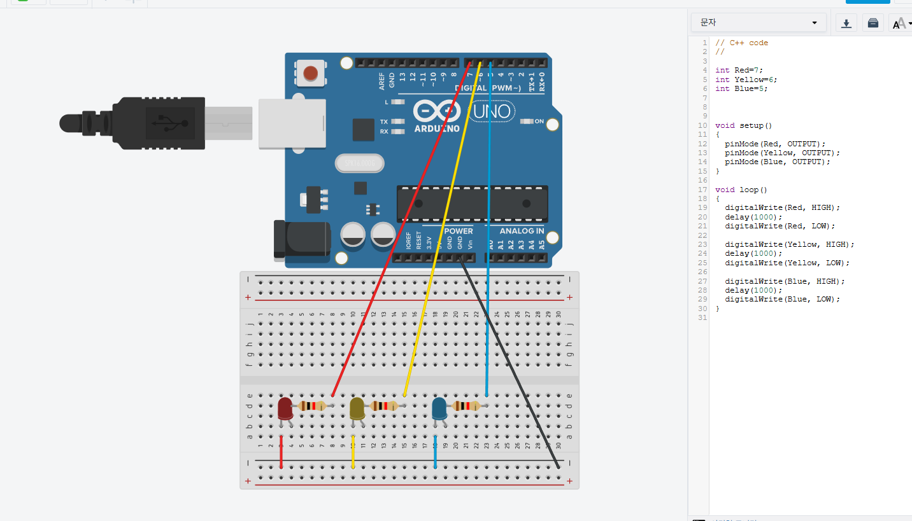
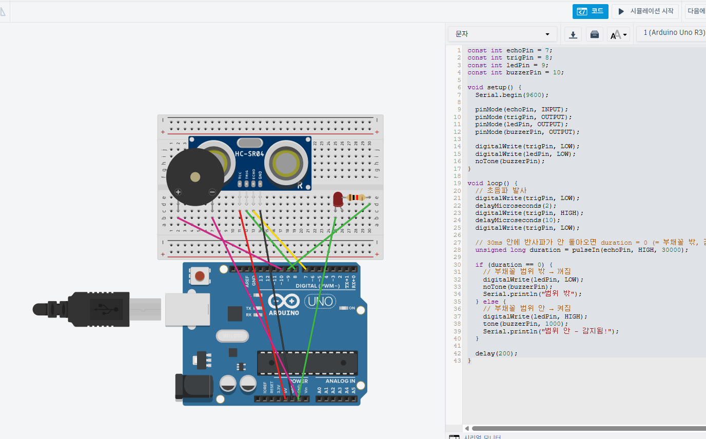
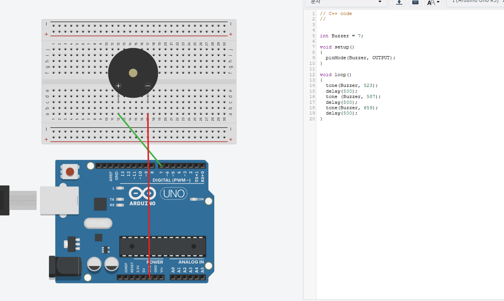
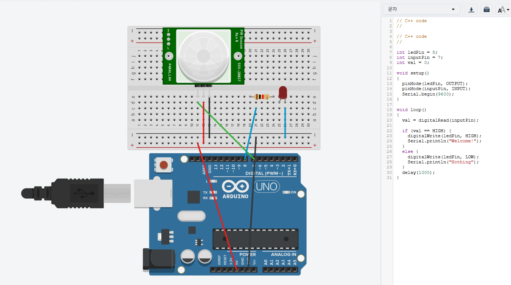

# 아두이노 실습

- 과목: 아두이노
- 날짜: 2026-08-20
- 태그: cpp, arduino, led, digitalwrite, delay

## 설명

아두이노 디지털 핀에 연결된 빨간색, 노란색, 파란색 LED를 1초 간격으로 순차적으로 켜고 끄는 기본 제어 코드입니다. setup()에서 핀 출력을 설정하고 loop()를 통해 점등 패턴을 무한 반복합니다.

## 원본 파일

업로드한 프로젝트의 원본 파일 4개가 폴더 구조 그대로 [source/](./source/)에 보관되어 있습니다.

- [1.png](./source/1.png)
- [11.png](./source/11.png)
- [4.png](./source/4.png)
- [9.png](./source/9.png)

## 코드

1번

```
// C++ code
//

int Red=7;
int Yellow=6;
int Blue=5;


void setup()
{
  pinMode(Red, OUTPUT);
  pinMode(Yellow, OUTPUT);
  pinMode(Blue, OUTPUT);
}

void loop()
{
  digitalWrite(Red, HIGH);
  delay(1000);
  digitalWrite(Red, LOW);

  digitalWrite(Yellow, HIGH);
  delay(1000);
  digitalWrite(Yellow, LOW);

  digitalWrite(Blue, HIGH);
  delay(1000);
  digitalWrite(Blue, LOW);
}
```

4번

```
// C++ code
//


int Buzzer = 7;

void setup()
{
  pinMode(Buzzer, OUTPUT);
}

void loop()
{
  tone(Buzzer, 523);
  delay(500);
  tone (Buzzer, 587);
  delay(500);
  tone(Buzzer, 659);
  delay(500);
}
```

9번

```
// C++ code
//

// C++ code
//

int ledPin = 8;
int inputPin = 7;
int val = 0;

void setup()
{
  pinMode(ledPin, OUTPUT);
  pinMode(inputPin, INPUT);
  Serial.begin(9600);
}

void loop()
{
  val = digitalRead(inputPin);

  if (val == HIGH) {
    digitalWrite(ledPin, HIGH);
    Serial.println("Welcome!");
  }
  else {
    digitalWrite(ledPin, LOW);
    Serial.println("Nothing");
  }
  delay(1000);
}
```

11번

```
const int echoPin = 7;
const int trigPin = 8;
const int ledPin = 9;
const int buzzerPin = 10;

void setup() {
  Serial.begin(9600);

  pinMode(echoPin, INPUT);
  pinMode(trigPin, OUTPUT);
  pinMode(ledPin, OUTPUT);
  pinMode(buzzerPin, OUTPUT);

  digitalWrite(trigPin, LOW);
  digitalWrite(ledPin, LOW);
  noTone(buzzerPin);
}

void loop() {
  // 초음파 발사
  digitalWrite(trigPin, LOW);
  delayMicroseconds(2);
  digitalWrite(trigPin, HIGH);
  delayMicroseconds(10);
  digitalWrite(trigPin, LOW);

  // 30ms 안에 반사파가 안 돌아오면 duration = 0 (= 부채꼴 밖, 감지 실패)
  unsigned long duration = pulseIn(echoPin, HIGH, 30000);

  if (duration == 0) {
    // 부채꼴 범위 밖 → 꺼짐
    digitalWrite(ledPin, LOW);
    noTone(buzzerPin);
    Serial.println("범위 밖");
  } else {
    // 부채꼴 범위 안 → 켜짐
    digitalWrite(ledPin, HIGH);
    tone(buzzerPin, 1000);
    Serial.println("범위 안 - 감지됨!");
  }

  delay(200);
}
```

## 이미지

 (대표)




## 실행 결과

```
별도의 텍스트 출력은 없으며, 하드웨어 상에서 7번(Red), 6번(Yellow), 5번(Blue) 핀에 연결된 LED가 1초씩 순차적으로 켜졌다 꺼지는 동작을 반복합니다.
```

## 배운 점

pinMode() 함수를 사용한 핀 출력 설정 방법과 digitalWrite(), delay() 함수를 이용한 기본 하드웨어 제어 흐름을 학습할 수 있습니다.

## 어려웠던 점

delay() 함수를 사용할 때 제어 흐름이 멈추는 블로킹 현상과 핀 번호 및 디지털 신호(HIGH/LOW) 매핑 개념을 이해하는 과정이 필요합니다.

---
_Study Archive에서 자동 생성됨 · 마지막 수정: 2026-08-20T07:49:37.503Z_