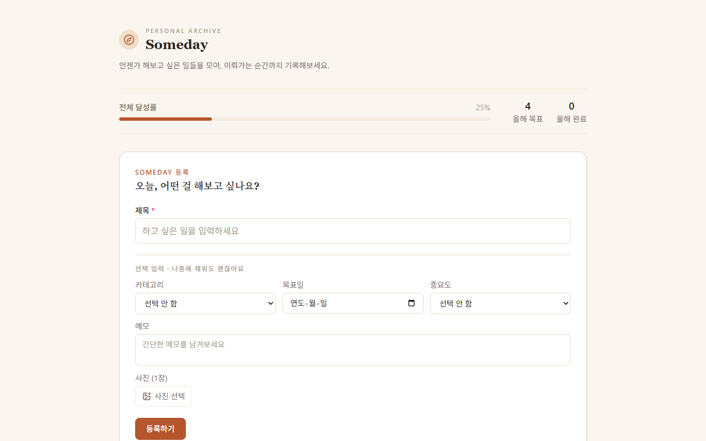

# Someday - React와 TypeScript 기반 개인 버킷리스트 아카이브

- 과목: React / TypeScript
- 날짜: 2026-08-14
- 태그: react, typescript, tailwindcss, vite, bucketlist, localstorage

## 설명

Someday 프로젝트는 사용자가 하고 싶은 경험과 목표를 등록하고 관리하는 개인 버킷리스트 아카이브 웹 애플리케이션입니다. React, TypeScript, Vite 및 Tailwind CSS를 활용해 구축되었으며, 서버 없이 localStorage를 사용하여 데이터를 클라이언트에 지속적으로 관리합니다. 버킷 항목의 등록, 수정, 삭제, 완료 처리와 더불어 목표일 기반 D-Day 계산, 다중 필터링, 검색, 정렬 기능 등을 제공합니다. 감성적인 웜톤 커스텀 테마 디자인과 함께 완료 후기 및 달성 통계를 제공하여 목표를 체계적으로 기록하고 추억을 돌아볼 수 있도록 돕습니다.

## 코드

**Someday/.oxlintrc.json**

Oxlint 린터의 설정 파일로, React 규칙과 TypeScript 플러그인을 활성화하여 코드 품질 규칙을 정의합니다.

```json
{
  "$schema": "./node_modules/oxlint/configuration_schema.json",
  "plugins": ["react", "typescript", "oxc"],
  "rules": {
    "react/rules-of-hooks": "error",
    "react/only-export-components": ["warn", { "allowConstantExport": true }]
  }
}
```

**Someday/index.html**

웹 애플리케이션의 HTML 엔트리 포인트 파일로, 메타 태그 설정과 React 앱이 마운트될 루트 엘리먼트를 포함합니다.

```html
<!doctype html>
<html lang="ko">
  <head>
    <meta charset="UTF-8" />
    <meta name="viewport" content="width=device-width, initial-scale=1.0" />
    <title>Someday</title>
  </head>
  <body>
    <div id="root"></div>
    <script type="module" src="/src/main.tsx"></script>
  </body>
</html>
```

**Someday/package.json**

프로젝트의 의존성 패키지(React, Tailwind CSS, date-fns 등)와 실행 스크립트를 정의한 메타데이터 파일입니다.

```json
{
  "name": "someday",
  "private": true,
  "version": "0.0.0",
  "type": "module",
  "scripts": {
    "dev": "vite",
    "build": "tsc -b && vite build",
    "lint": "oxlint",
    "preview": "vite preview"
  },
  "dependencies": {
    "@tailwindcss/vite": "^4.3.3",
    "date-fns": "^4.4.0",
    "lucide-react": "^1.29.0",
    "react": "^19.2.8",
    "react-dom": "^19.2.8",
    "tailwindcss": "^4.3.3"
  },
  "devDependencies": {
    "@types/node": "^24.13.3",
    "@types/react": "^19.2.17",
    "@types/react-dom": "^19.2.3",
    "@vitejs/plugin-react": "^6.0.4",
    "oxlint": "^1.75.0",
    "typescript": "~6.0.2",
    "vite": "^8.2.0"
  }
}
```

**Someday/tsconfig.app.json**

애플리케이션 소스 코드 컴파일을 위한 상세 TypeScript 설정 및 타입 검사 규칙을 담고 있습니다.

```json
{
  "compilerOptions": {
    "tsBuildInfoFile": "./node_modules/.tmp/tsconfig.app.tsbuildinfo",
    "target": "es2023",
    "lib": ["ES2023", "DOM"],
    "module": "esnext",
    "types": ["vite/client"],
    "allowArbitraryExtensions": true,
    "skipLibCheck": true,

    /* Bundler mode */
    "moduleResolution": "bundler",
    "allowImportingTsExtensions": true,
    "verbatimModuleSyntax": true,
    "moduleDetection": "force",
    "noEmit": true,
    "jsx": "react-jsx",

    /* Linting */
    "noUnusedLocals": true,
    "noUnusedParameters": true,
    "erasableSyntaxOnly": true,
    "noFallthroughCasesInSwitch": true
  },
  "include": ["src"]
}
```

**Someday/tsconfig.json**

앱과 노드 환경용 TS 구성 파일들을 종합하여 참조하는 TypeScript 루트 설정 파일입니다.

```json
{
  "files": [],
  "references": [
    { "path": "./tsconfig.app.json" },
    { "path": "./tsconfig.node.json" }
  ]
}
```

**Someday/tsconfig.node.json**

vite.config.ts 등 Node.js 개발 환경에서 실행되는 도구용 TypeScript 컴파일 옵션 파일입니다.

```json
{
  "compilerOptions": {
    "tsBuildInfoFile": "./node_modules/.tmp/tsconfig.node.tsbuildinfo",
    "target": "es2023",
    "lib": ["ES2023"],
    "types": ["node"],
    "skipLibCheck": true,

    /* Bundler mode */
    "module": "nodenext",
    "allowImportingTsExtensions": true,
    "verbatimModuleSyntax": true,
    "moduleDetection": "force",
    "noEmit": true,

    /* Linting */
    "noUnusedLocals": true,
    "noUnusedParameters": true,
    "erasableSyntaxOnly": true,
    "noFallthroughCasesInSwitch": true
  },
  "include": ["vite.config.ts"]
}
```

**Someday/vite.config.ts**

Vite 번들러 설정 파일로, React 및 Tailwind CSS 플러그인 연결과 포트 설정을 담당합니다.

```typescript
import { defineConfig } from 'vite'
import react from '@vitejs/plugin-react'
import tailwindcss from '@tailwindcss/vite'

// https://vite.dev/config/
export default defineConfig({
  plugins: [react(), tailwindcss()],
  server: {
    // 로컬 미리보기 도구가 5173을 다른 프로세스가 점유했을 때 PORT 환경변수로
    // 대체 포트를 지정할 수 있도록 한다. 지정이 없으면 기본값 5173을 사용한다.
    port: Number(process.env.PORT) || 5173,
  },
})
```

**Someday/src/App.tsx**

애플리케이션의 최상위 컴포넌트로, 버킷리스트 상태 관리, 데모 데이터 생성, 필터/정렬 상태 조합 및 주요 UI 구조를 오케스트레이션합니다.

```typescript
import { Compass } from "lucide-react";
import { useEffect, useMemo, useState } from "react";
import BucketCard from "./components/BucketCard";
import BucketForm from "./components/BucketForm";
import FilterBar from "./components/FilterBar";
import SummaryBar from "./components/SummaryBar";
import { loadBuckets, saveBuckets } from "./storage/bucketStorage";
import type { Bucket, BucketCategory, BucketStatus } from "./types/bucket";
import { filterBuckets, sortBuckets, type SortOption } from "./utils/filterSort";

// 더미 데이터의 사진 필드용 예시 이미지. Picsum(무료 플레이스홀더 사진 서비스)의
// 고정 시드 URL을 사용해 새로고침해도 항상 같은 사진이 보이도록 한다.
// 데모 데이터에 한해서만 쓰는 외부 링크이며, 실제 사진 첨부 기능은 FileReader로
// 읽어 base64로 저장하므로 계속 완전히 로컬에서 동작한다.
function demoPhoto(seed: string): string {
  return `https://picsum.photos/seed/${seed}/600/400`;
}

// localStorage가 비어있는 첫 방문 상태에서 화면 구성을 바로 확인할 수 있도록 넣는 예시 데이터.
// 실제 사용자가 한 건이라도 등록 · 삭제하면 그 이후로는 이 시드가 다시 채워지지 않는다.
function createDemoBuckets(): Bucket[] {
  const now = new Date().toISOString();
  return [
    {
      id: crypto.randomUUID(),
      title: "홋카이도 눈축제 가기",
      category: "여행",
      targetDate: "2027-02-05",
      importance: "상",
      memo: "삿포로 눈축제 시즌에 맞춰 다녀오기",
      status: "계획 중",
      favorite: true,
      photo: demoPhoto("hokkaido-snow-festival"),
      createdAt: now,
      updatedAt: now,
    },
    {
      id: crypto.randomUUID(),
      title: "하프 마라톤 완주하기",
      category: "운동",
      targetDate: "2026-10-18",
      importance: "중",
      memo: "매주 3회 이상 5km 러닝 연습",
      status: "진행 중",
      favorite: false,
      photo: demoPhoto("half-marathon-run"),
      createdAt: now,
      updatedAt: now,
    },
    {
      id: crypto.randomUUID(),
      title: "손글씨로 편지 쓰기",
      category: "취미",
      importance: "하",
      status: "완료",
      favorite: false,
      completedAt: now,
      review: "오랜만에 손으로 편지를 쓰니 생각보다 마음이 차분해졌다.",
      photo: demoPhoto("handwritten-letter"),
      createdAt: now,
      updatedAt: now,
    },
    {
      id: crypto.randomUUID(),
      title: "번지점프 도전하기",
      category: "도전",
      targetDate: "2026-08-12",
      importance: "상",
      memo: "고소공포증부터 극복하고 뛰어보기",
      status: "계획 중",
      favorite: true,
      photo: demoPhoto("bungee-jump"),
      createdAt: now,
      updatedAt: now,
    },
    {
      id: crypto.randomUUID(),
      title: "기타 연주 배우기",
      category: "학습",
      targetDate: "2026-12-20",
      importance: "중",
      memo: "온라인 강의로 좋아하는 노래 코드 3개 익히기",
      status: "진행 중",
      favorite: false,
      photo: demoPhoto("guitar-lesson"),
      createdAt: now,
      updatedAt: now,
    },
    {
      id: crypto.randomUUID(),
      title: "오마카세 먹어보기",
      category: "음식",
      importance: "하",
      status: "완료",
      favorite: false,
      completedAt: now,
      review: "가격은 부담스러웠지만 그만한 값어치가 있었다.",
      photo: demoPhoto("omakase-sushi"),
      createdAt: now,
      updatedAt: now,
    },
    {
      id: crypto.randomUUID(),
      title: "동네 도서관 회원증 만들기",
      category: "기타",
      memo: "산책 겸 걸어가서 만들고 책 한 권 빌려오기",
      status: "계획 중",
      favorite: false,
      photo: demoPhoto("library-books"),
      createdAt: now,
      updatedAt: now,
    },
    {
      id: crypto.randomUUID(),
      title: "국토 자전거 종주하기",
      category: "여행",
      targetDate: "2026-07-20",
      importance: "중",
      memo: "4대강 종주 코스 완주 인증하기",
      status: "진행 중",
      favorite: false,
      photo: demoPhoto("cycling-korea"),
      createdAt: now,
      updatedAt: now,
    },
  ];
}

/**
 * 전체 화면 구성 및 상태 관리 시작점.
 * buckets 배열은 localStorage(bucketStorage)와 동기화되어 새로고침해도 유지된다.
 * 등록 · 상태 변경 · 완료 후기 · 수정 · 삭제 · 즐겨찾기 · 검색/필터/정렬을 모두 여기서 오케스트레이션한다.
 */
function App() {
  const [buckets, setBuckets] = useState<Bucket[]>(() => {
    const stored = loadBuckets();
    return stored.length > 0 ? stored : createDemoBuckets();
  });
  const [editingBucket, setEditingBucket] = useState<Bucket | null>(null);

  const [search, setSearch] = useState("");
  const [categoryFilter, setCategoryFilter] = useState<BucketCategory | "전체">("전체");
  const [statusFilter, setStatusFilter] = useState<BucketStatus | "전체">("전체");
  const [favoriteOnly, setFavoriteOnly] = useState(false);
  const [sortOption, setSortOption] = useState<SortOption>("createdAt");

  // buckets가 바뀔 때마다(등록 · 수정 · 삭제 · 상태 변경 등) localStorage에 반영한다.
  useEffect(() => {
    saveBuckets(buckets);
  }, [buckets]);

  const handleAddBucket = (bucket: Bucket) => {
    setBuckets((prev) => [...prev, bucket]);
  };

  const handleUpdateBucket = (updated: Bucket) => {
    setBuckets((prev) => prev.map((bucket) => (bucket.id === updated.id ? updated : bucket)));
    setEditingBucket(null);
  };

  const handleStatusChange = (id: string, status: BucketStatus) => {
    const now = new Date().toISOString();
    setBuckets((prev) =>
      prev.map((bucket) => {
        if (bucket.id !== id) return bucket;
        if (status === "완료") {
          return { ...bucket, status, completedAt: bucket.completedAt ?? now, updatedAt: now };
        }
        // 완료에서 되돌리면 완료 날짜는 지우되, 이미 작성한 후기는 그대로 둔다.
        return { ...bucket, status, completedAt: undefined, updatedAt: now };
      }),
    );
  };

  const handleToggleFavorite = (id: string) => {
    const now = new Date().toISOString();
    setBuckets((prev) =>
      prev.map((bucket) => (bucket.id === id ? { ...bucket, favorite: !bucket.favorite, updatedAt: now } : bucket)),
    );
  };

  const handleSaveReview = (id: string, review: string) => {
    const now = new Date().toISOString();
    setBuckets((prev) =>
      prev.map((bucket) => {
        if (bucket.id !== id) return bucket;
        const next = { ...bucket, updatedAt: now };
        if (review) next.review = review;
        else delete next.review;
        return next;
      }),
    );
  };

  const handleDelete = (id: string) => {
    setBuckets((prev) => prev.filter((bucket) => bucket.id !== id));
    if (editingBucket?.id === id) setEditingBucket(null);
  };

  const visibleBuckets = useMemo(() => {
    const filtered = filterBuckets(buckets, { search, category: categoryFilter, status: statusFilter, favoriteOnly });
    return sortBuckets(filtered, sortOption);
  }, [buckets, search, categoryFilter, statusFilter, favoriteOnly, sortOption]);

  const hasAnyBuckets = buckets.length > 0;
  const hasVisibleBuckets = visibleBuckets.length > 0;

  return (
    <div className="min-h-screen bg-paper">
      <div className="mx-auto flex max-w-4xl flex-col gap-8 px-4 py-10 sm:px-6 sm:py-12">
        <header className="flex flex-col gap-3">
          <div className="flex items-center gap-3">
            <span className="flex h-9 w-9 shrink-0 items-center justify-center rounded-full bg-accent-soft text-accent">
              <Compass className="h-5 w-5" />
            </span>
            <div>
              <p className="text-[11px] font-medium uppercase tracking-[0.2em] text-ink-faint">
                Personal Archive
              </p>
              <h1 className="font-serif text-2xl font-semibold text-ink">Someday</h1>
            </div>
          </div>
          <p className="text-sm text-ink-soft">
            언젠가 해보고 싶은 일들을 모아, 이뤄가는 순간까지 기록해보세요.
          </p>
        </header>

        {/* 등록된 버킷이 없을 때는 통계보다 첫 등록 행동이 먼저 보이도록 요약 영역을 숨긴다. */}
        {hasAnyBuckets && <SummaryBar buckets={buckets} />}

        <BucketForm
          onAdd={handleAddBucket}
          onUpdate={handleUpdateBucket}
          editingBucket={editingBucket}
          onCancelEdit={() => setEditingBucket(null)}
        />

        <FilterBar
          search={search}
          onSearchChange={setSearch}
          category={categoryFilter}
          onCategoryChange={setCategoryFilter}
          status={statusFilter}
          onStatusChange={setStatusFilter}
          sort={sortOption}
          onSortChange={setSortOption}
          favoriteOnly={favoriteOnly}
          onToggleFavoriteOnly={() => setFavoriteOnly((prev) => !prev)}
        />

        {!hasAnyBuckets && (
          <section className="flex flex-col items-center gap-2 rounded-2xl bg-surface-soft px-6 py-14 text-center">
            <Compass className="h-6 w-6 text-accent" />
            <p className="text-base font-medium text-ink">아직 남긴 Someday가 없어요.</p>
            <p className="text-sm text-ink-soft">
              위에서 제목만 적어도 괜찮아요 — 첫 번째 버킷을 남겨보세요.
            </p>
          </section>
        )}

        {hasAnyBuckets && !hasVisibleBuckets && (
          <section className="flex flex-col items-center gap-2 rounded-2xl bg-surface-soft px-6 py-14 text-center">
            <p className="text-base font-medium text-ink">조건에 맞는 버킷이 없어요.</p>
            <p className="text-sm text-ink-soft">검색어나 필터를 확인해보세요.</p>
          </section>
        )}

        {hasVisibleBuckets && (
          <div className="grid grid-cols-1 items-stretch gap-5 sm:grid-cols-2">
            {visibleBuckets.map((bucket) => (
              <BucketCard
                key={bucket.id}
                bucket={bucket}
                onStatusChange={handleStatusChange}
                onToggleFavorite={handleToggleFavorite}
                onEdit={setEditingBucket}
                onDelete={handleDelete}
                onSaveReview={handleSaveReview}
              />
            ))}
          </div>
        )}
      </div>
    </div>
  );
}

export default App;
```

**Someday/src/index.css**

Tailwind CSS v4의 @theme 기능을 활용해 따뜻한 감성의 커스텀 색상 토큰(paper, ink, accent 등)을 정의한 메인 CSS 파일입니다.

```css
@import "tailwindcss";

/*
 * Someday 디자인 토큰.
 * "따뜻하고 감성적이지만 과하지 않은 개인 라이프 아카이브" 톤을 위해
 * 회색/보라 위주 팔레트 대신 종이 질감의 웜톤 + 테라코타 포인트를 사용한다.
 * Tailwind v4의 CSS 기반 테마 방식(@theme)으로 선언하면
 * bg-paper, text-ink, border-line 같은 유틸리티 클래스가 자동으로 생성된다.
 */
@theme {
  --color-paper: #faf6ef; /* 페이지 배경 */
  --color-surface: #ffffff; /* 등록 폼 · 카드 등 주요 콘텐츠 표면 */
  --color-surface-soft: #f2ebdf; /* 요약 · 필터 등 보조 영역 표면 */
  --color-ink: #2b241e; /* 기본 텍스트 */
  --color-ink-soft: #77695c; /* 보조 텍스트 */
  --color-ink-faint: #a89a8a; /* placeholder, 비활성 텍스트 */
  --color-line: #e7dbc8; /* 테두리 */
  --color-accent: #b5562f; /* 포인트 색상(등록 버튼, 강조) */
  --color-accent-soft: #f3ddcb; /* 카테고리 배지 등 포인트 배경 */
  --color-progress: #4f7585; /* "진행 중" 상태 */
  --color-progress-soft: #e1e9ea;
  --color-done: #5f7d4c; /* "완료" 상태 */
  --color-done-soft: #e4ead9;
}

body {
  margin: 0;
  background-color: var(--color-paper);
  color: var(--color-ink);
}
```

**Someday/src/main.tsx**

React 19 클라이언트 루트를 생성하고 App 컴포넌트를 StrictMode로 감싸 DOM에 렌더링하는 엔트리 스크립트입니다.

```typescript
import { StrictMode } from 'react'
import { createRoot } from 'react-dom/client'
import './index.css'
import App from './App.tsx'

createRoot(document.getElementById('root')!).render(
  <StrictMode>
    <App />
  </StrictMode>,
)
```

**Someday/src/utils/date.ts**

date-fns를 활용해 버킷의 목표일과 오늘 날짜를 비교하고 'D-Day', 'D-N', '목표일 지남' 배지 상태를 계산하는 유틸리티입니다.

```typescript
import { differenceInCalendarDays, parseISO } from "date-fns";
import type { Bucket } from "../types/bucket";

export type DDayDisplay =
  | { tone: "overdue"; label: "목표일 지남" }
  | { tone: "urgent" | "normal"; label: string };

/**
 * 버킷의 목표일 기반 D-Day 표시를 계산한다.
 * - 목표일이 없으면 null (표시하지 않음)
 * - 완료된 버킷은 "목표일 지남" 경고를 보여줄 필요가 없으므로 null
 * - 시각(시·분·초)이 아니라 로컬 달력 날짜 기준으로 차이를 계산한다.
 */
export function getDDayDisplay(bucket: Bucket): DDayDisplay | null {
  if (!bucket.targetDate || bucket.status === "완료") return null;

  const diff = differenceInCalendarDays(parseISO(bucket.targetDate), new Date());

  if (diff < 0) return { tone: "overdue", label: "목표일 지남" };
  if (diff === 0) return { tone: "urgent", label: "D-Day" };
  return { tone: diff <= 7 ? "urgent" : "normal", label: `D-${diff}` };
}
```

**Someday/src/utils/filterSort.ts**

검색어, 카테고리, 완료 상태에 따른 버킷 filtering 및 목표일/중요도/등록순 sorting 로직을 처리하는 유틸리티 모듈입니다.

```typescript
import type { Bucket, BucketCategory, BucketStatus } from "../types/bucket";

export type SortOption = "createdAt" | "targetDate" | "importance";
export type CategoryFilter = BucketCategory | "전체";
export type StatusFilter = BucketStatus | "전체";

interface FilterOptions {
  search: string;
  category: CategoryFilter;
  status: StatusFilter;
  favoriteOnly: boolean;
}

/** 검색어(제목 · 카테고리) · 카테고리 필터 · 상태 필터 · 즐겨찾기 필터를 동시에 적용한다. */
export function filterBuckets(buckets: Bucket[], { search, category, status, favoriteOnly }: FilterOptions): Bucket[] {
  const query = search.trim().toLowerCase();

  return buckets.filter((bucket) => {
    if (query) {
      const inTitle = bucket.title.toLowerCase().includes(query);
      const inCategory = (bucket.category ?? "").toLowerCase().includes(query);
      if (!inTitle && !inCategory) return false;
    }
    if (category !== "전체" && bucket.category !== category) return false;
    if (status !== "전체" && bucket.status !== status) return false;
    if (favoriteOnly && !bucket.favorite) return false;
    return true;
  });
}

const IMPORTANCE_ORDER: Record<string, number> = { 상: 0, 중: 1, 하: 2 };

/**
 * 목표일순 · 중요도순 · 등록순 정렬.
 * - 목표일순: 목표일이 없는 항목은 뒤로 보낸다.
 * - 중요도순: 상 → 중 → 하 → 미설정 순서로 정렬한다.
 * - 등록순: createdAt(ISO 문자열) 오름차순 — 원본 배열을 바꾸지 않는다.
 */
export function sortBuckets(buckets: Bucket[], option: SortOption): Bucket[] {
  const sorted = [...buckets];

  if (option === "targetDate") {
    return sorted.sort((a, b) => {
      if (!a.targetDate && !b.targetDate) return 0;
      if (!a.targetDate) return 1;
      if (!b.targetDate) return -1;
      return a.targetDate.localeCompare(b.targetDate);
    });
  }

  if (option === "importance") {
    return sorted.sort((a, b) => {
      const aValue = a.importance ? IMPORTANCE_ORDER[a.importance] : 3;
      const bValue = b.importance ? IMPORTANCE_ORDER[b.importance] : 3;
      return aValue - bValue;
    });
  }

  return sorted.sort((a, b) => a.createdAt.localeCompare(b.createdAt));
}
```

**Someday/src/utils/image.ts**

```typescript
// 사진 첨부(추가 기능)에서 사용하는 이미지 처리 유틸.
// FileReader로 파일을 읽고, canvas로 리사이즈해 localStorage 용량 문제를 줄인다.

const MAX_DIMENSION = 800; // 가로/세로 중 긴 쪽을 이 값 이하로 축소한다.
const JPEG_QUALITY = 0.75;

/**
 * 이미지 파일을 읽어 긴 변 기준 MAX_DIMENSION 이하로 축소한 뒤,
 * base64 JPEG 데이터 URL로 변환한다. 원본이 이미 작으면 그대로 축소 없이 반환한다.
 */
export function readAndResizeImage(file: File): Promise<string> {
  return new Promise((resolve, reject) => {
    const reader = new FileReader();

    reader.onerror = () => reject(new Error("이미지 파일을 읽지 못했습니다."));
    reader.onload = () => {
      const img = new Image();

      img.onerror = () => reject(new Error("이미지를 불러오지 못했습니다."));
      img.onload = () => {
        const scale = Math.min(1, MAX_DIMENSION / Math.max(img.width, img.height));
        const targetWidth = Math.round(img.width * scale);
        const targetHeight = Math.round(img.height * scale);

        const canvas = document.createElement("canvas");
        canvas.width = targetWidth;
        canvas.height = targetHeight;

        const ctx = canvas.getContext("2d");
        if (!ctx) {
          reject(new Error("이미지를 처리할 수 없습니다."));
          return;
        }

        ctx.drawImage(img, 0, 0, targetWidth, targetHeight);
        resolve(canvas.toDataURL("image/jpeg", JPEG_QUALITY));
      };

      img.src = reader.result as string;
    };

    reader.readAsDataURL(file);
  });
}
```

**Someday/src/types/bucket.ts**

```typescript
// 버킷 데이터 타입 정의 (PROJECT_PLAN.md 11. 데이터 구조 기준)

export type BucketCategory =
  | "여행"
  | "취미"
  | "도전"
  | "학습"
  | "운동"
  | "음식"
  | "기타";

export type BucketImportance = "상" | "중" | "하";

export type BucketStatus = "계획 중" | "진행 중" | "완료";

export interface Bucket {
  id: string; // 버킷을 구분하는 고유 식별자 (항상 존재, 등록 시 crypto.randomUUID()로 생성)
  title: string; // 하고 싶은 일 제목 (필수 입력, 항상 존재)
  category?: BucketCategory; // 카테고리 (선택 입력)
  targetDate?: string; // 목표일 (선택 입력) — YYYY-MM-DD 형식
  importance?: BucketImportance; // 중요도 (선택 입력)
  memo?: string; // 메모 (선택 입력)
  status: BucketStatus; // 상태 (등록 시 "계획 중"으로 자동 설정, 항상 존재)
  completedAt?: string; // 완료 처리 시 기록되는 날짜/시간 (완료 상태일 때만 값 존재), ISO 8601 형식
  review?: string; // 완료 후 후기 (선택 작성)
  photo?: string; // 사진 데이터 (base64 문자열) — 추가 기능에서만 사용
  favorite: boolean; // 즐겨찾기 여부 (항상 존재, 기본값 false)
  createdAt: string; // 생성 시각 (항상 존재), ISO 8601 형식
  updatedAt: string; // 마지막 수정 시각 (항상 존재), ISO 8601 형식
}

// 카테고리 필터 등에서 사용할 전체 카테고리 목록
export const BUCKET_CATEGORIES: BucketCategory[] = [
  "여행",
  "취미",
  "도전",
  "학습",
  "운동",
  "음식",
  "기타",
];

// 중요도 선택 목록
export const BUCKET_IMPORTANCES: BucketImportance[] = ["상", "중", "하"];

// 상태 선택 목록
export const BUCKET_STATUSES: BucketStatus[] = ["계획 중", "진행 중", "완료"];
```

**Someday/src/storage/bucketStorage.ts**

```typescript
import type { Bucket } from "../types/bucket";

// localStorage에 버킷 목록을 저장할 때 사용하는 키
const STORAGE_KEY = "someday:buckets";

/**
 * localStorage에 저장된 버킷 목록을 불러온다.
 * 저장된 값이 없거나 형식이 올바르지 않으면 빈 배열을 반환한다.
 */
export function loadBuckets(): Bucket[] {
  try {
    const raw = localStorage.getItem(STORAGE_KEY);
    if (!raw) return [];

    const parsed = JSON.parse(raw);
    return Array.isArray(parsed) ? (parsed as Bucket[]) : [];
  } catch (error) {
    console.error("버킷 목록을 불러오지 못했습니다.", error);
    return [];
  }
}

/**
 * 버킷 목록 전체를 localStorage에 저장한다.
 * 등록 · 수정 · 삭제 · 상태 변경 등으로 buckets 배열이 바뀔 때마다
 * App.tsx에서 호출해 localStorage와 동기화한다.
 */
export function saveBuckets(buckets: Bucket[]): void {
  try {
    localStorage.setItem(STORAGE_KEY, JSON.stringify(buckets));
  } catch (error) {
    console.error("버킷 목록을 저장하지 못했습니다.", error);
  }
}
```

**Someday/src/components/BucketCard.tsx**

```typescript
import { Calendar, CheckCircle2, Heart, Pencil, Star, Trash2 } from "lucide-react";
import { useEffect, useState } from "react";
import type { Bucket, BucketImportance, BucketStatus } from "../types/bucket";
import { BUCKET_STATUSES } from "../types/bucket";
import { getDDayDisplay } from "../utils/date";

interface BucketCardProps {
  bucket: Bucket;
  onStatusChange: (id: string, status: BucketStatus) => void;
  onToggleFavorite: (id: string) => void;
  onEdit: (bucket: Bucket) => void;
  onDelete: (id: string) => void;
  onSaveReview: (id: string, review: string) => void;
}

// 상태별 배지 스타일 (13단계에서 최종 디자인을 다시 다듬을 예정)
const STATUS_BADGE_STYLE: Record<BucketStatus, string> = {
  "계획 중": "bg-surface-soft text-ink-soft",
  "진행 중": "bg-progress-soft text-progress",
  완료: "bg-done-soft text-done",
};

// 카드 배경도 상태에 따라 아주 옅게 톤을 다르게 준다.
const CARD_SURFACE_STYLE: Record<BucketStatus, string> = {
  "계획 중": "bg-surface border-line",
  "진행 중": "bg-surface border-progress/30",
  완료: "bg-done-soft/40 border-done/30",
};

const DDAY_TEXT_STYLE: Record<"urgent" | "normal" | "overdue", string> = {
  urgent: "text-accent",
  normal: "text-ink-soft",
  overdue: "text-rose-600",
};

// 중요도(상 · 중 · 하)를 별 3개 중 몇 개를 채울지로 표현한다.
const IMPORTANCE_LEVEL: Record<BucketImportance, number> = { 상: 3, 중: 2, 하: 1 };

/** 완료된 버킷의 후기를 입력 · 저장하는 카드 내부 인라인 편집기. */
function ReviewEditor({ bucket, onSave }: { bucket: Bucket; onSave: (id: string, review: string) => void }) {
  const [text, setText] = useState(bucket.review ?? "");

  useEffect(() => {
    setText(bucket.review ?? "");
  }, [bucket.id, bucket.review]);

  return (
    <div className="flex flex-col gap-2 rounded-lg bg-done-soft p-3">
      <textarea
        value={text}
        onChange={(event) => setText(event.target.value)}
        placeholder="완료 후기를 남겨보세요 (예: 생각보다 훨씬 재밌었다)"
        rows={2}
        className="resize-none rounded-md border border-done/30 bg-surface px-2 py-1.5 text-sm text-ink placeholder:text-ink-faint focus:border-done focus:outline-none"
      />
      <button
        type="button"
        onClick={() => onSave(bucket.id, text.trim())}
        className="self-start rounded-md bg-done px-3 py-1 text-xs font-medium text-white hover:bg-done/90"
      >
        후기 저장
      </button>
    </div>
  );
}

/**
 * 버킷 한 건을 카드 형태로 보여주는 컴포넌트.
 * 상태 변경 · 즐겨찾기 · 수정 · 삭제 · 후기 저장을 모두 이 카드에서 처리한다.
 */
function BucketCard({ bucket, onStatusChange, onToggleFavorite, onEdit, onDelete, onSaveReview }: BucketCardProps) {
  const dDay = getDDayDisplay(bucket);

  return (
    <div className={`flex h-full flex-col gap-3 rounded-2xl border p-5 shadow-sm ${CARD_SURFACE_STYLE[bucket.status]}`}>
      <div className="flex items-start justify-between gap-2">
        <div className="flex flex-col gap-1.5">
          {bucket.category && (
            <span className="w-fit rounded-full bg-accent-soft px-2 py-0.5 text-xs font-medium text-accent">
              {bucket.category}
            </span>
          )}
          <h3 className="flex items-center gap-1.5 font-serif text-base font-semibold leading-snug text-ink">
            {bucket.status === "완료" && <CheckCircle2 className="h-4 w-4 shrink-0 text-done" />}
            {bucket.title}
          </h3>
        </div>
        <button
          type="button"
          onClick={() => onToggleFavorite(bucket.id)}
          aria-label="즐겨찾기"
          aria-pressed={bucket.favorite}
          className={`shrink-0 ${bucket.favorite ? "text-accent" : "text-ink-faint hover:text-accent"}`}
        >
          <Heart className="h-5 w-5" fill={bucket.favorite ? "currentColor" : "none"} />
        </button>
      </div>

      {bucket.photo && (
        
      )}

      <div className="flex flex-wrap items-center gap-x-3 gap-y-1.5 text-sm text-ink-soft">
        <select
          value={bucket.status}
          onChange={(event) => onStatusChange(bucket.id, event.target.value as BucketStatus)}
          className={`rounded-full border-none px-2 py-0.5 text-xs font-medium focus:outline-none ${STATUS_BADGE_STYLE[bucket.status]}`}
        >
          {BUCKET_STATUSES.map((status) => (
            <option key={status} value={status}>
              {status}
            </option>
          ))}
        </select>

        {bucket.importance && (
          <span className="inline-flex items-center gap-0.5" aria-label={`중요도 ${bucket.importance}`}>
            {[1, 2, 3].map((level) => (
              <Star
                key={level}
                className={`h-3.5 w-3.5 ${
                  level <= IMPORTANCE_LEVEL[bucket.importance!] ? "fill-accent text-accent" : "text-line"
                }`}
              />
            ))}
          </span>
        )}

        {bucket.targetDate && (
          <span className="inline-flex items-center gap-1">
            <Calendar className="h-3.5 w-3.5" />
            {bucket.targetDate}
          </span>
        )}

        {dDay && <span className={`text-xs font-semibold ${DDAY_TEXT_STYLE[dDay.tone]}`}>{dDay.label}</span>}
      </div>

      {bucket.memo && <p className="text-sm leading-relaxed text-ink-soft">{bucket.memo}</p>}

      {bucket.status === "완료" && (
        <div className="flex flex-col gap-2">
          {bucket.completedAt && (
            <p className="text-xs font-medium text-done">
              완료일 {bucket.completedAt.slice(0, 10)}
            </p>
          )}
          <ReviewEditor bucket={bucket} onSave={onSaveReview} />
        </div>
      )}

      {/* 내용 길이가 카드마다 달라도 액션 영역은 항상 하단에 고정된다. */}
      <div className="mt-auto flex justify-end gap-4 pt-2 text-sm text-ink-faint">
        <button
          type="button"
          onClick={() => onEdit(bucket)}
          className="inline-flex items-center gap-1 hover:text-ink"
        >
          <Pencil className="h-4 w-4" />
          수정
        </button>
        <button
          type="button"
          onClick={() => {
            if (window.confirm(`"${bucket.title}"을(를) 삭제할까요?`)) {
              onDelete(bucket.id);
            }
          }}
          className="inline-flex items-center gap-1 hover:text-rose-600"
        >
          <Trash2 className="h-4 w-4" />
          삭제
        </button>
      </div>
    </div>
  );
}

export default BucketCard;
```

**Someday/src/components/BucketForm.tsx**

```typescript
import { ImagePlus, X } from "lucide-react";
import { useEffect, useRef, useState, type ChangeEvent, type FormEvent } from "react";
import {
  BUCKET_CATEGORIES,
  BUCKET_IMPORTANCES,
  type Bucket,
  type BucketCategory,
  type BucketImportance,
} from "../types/bucket";
import { readAndResizeImage } from "../utils/image";

interface BucketFormProps {
  /** 새로 생성된 버킷을 상위(App)로 전달한다. localStorage 반영은 App의 useEffect가 담당한다. */
  onAdd: (bucket: Bucket) => void;
  /** 수정 모드에서 저장 버튼을 눌렀을 때 호출된다. */
  onUpdate: (bucket: Bucket) => void;
  /** 수정 중인 버킷. null이면 등록 모드로 동작한다. */
  editingBucket: Bucket | null;
  /** 수정을 취소하고 등록 모드로 되돌린다. */
  onCancelEdit: () => void;
}

/**
 * 버킷 등록 · 수정 폼. editingBucket이 있으면 그 값으로 필드를 채우고
 * 제출 시 onUpdate를, 없으면 onAdd를 호출한다(같은 폼을 그대로 재사용).
 * 제목만 필수로 입력받고, 나머지 항목은 선택 입력으로 둔다.
 */
function BucketForm({ onAdd, onUpdate, editingBucket, onCancelEdit }: BucketFormProps) {
  const [title, setTitle] = useState("");
  const [category, setCategory] = useState<BucketCategory | "">("");
  const [targetDate, setTargetDate] = useState("");
  const [importance, setImportance] = useState<BucketImportance | "">("");
  const [memo, setMemo] = useState("");
  const [photo, setPhoto] = useState("");
  const [photoError, setPhotoError] = useState("");
  const [isProcessingPhoto, setIsProcessingPhoto] = useState(false);
  const [error, setError] = useState("");
  const fileInputRef = useRef<HTMLInputElement>(null);

  const isEditing = editingBucket !== null;

  // 수정 대상이 바뀌면 폼 필드를 그 값으로 채우고, 취소되면 등록 모드로 비운다.
  useEffect(() => {
    if (editingBucket) {
      setTitle(editingBucket.title);
      setCategory(editingBucket.category ?? "");
      setTargetDate(editingBucket.targetDate ?? "");
      setImportance(editingBucket.importance ?? "");
      setMemo(editingBucket.memo ?? "");
      setPhoto(editingBucket.photo ?? "");
      setPhotoError("");
      setError("");
    } else {
      setTitle("");
      setCategory("");
      setTargetDate("");
      setImportance("");
      setMemo("");
      setPhoto("");
      setPhotoError("");
      setError("");
    }
    if (fileInputRef.current) fileInputRef.current.value = "";
  }, [editingBucket]);

  // 사진 파일을 선택하면 읽어서 축소한 뒤 미리보기(base64)로 저장한다.
  const handlePhotoChange = async (event: ChangeEvent<HTMLInputElement>) => {
    const file = event.target.files?.[0];
    if (!file) return;

    if (!file.type.startsWith("image/")) {
      setPhotoError("이미지 파일만 첨부할 수 있어요.");
      event.target.value = "";
      return;
    }

    setPhotoError("");
    setIsProcessingPhoto(true);
    try {
      const resized = await readAndResizeImage(file);
      setPhoto(resized);
    } catch {
      setPhotoError("사진을 처리하지 못했어요. 다른 사진으로 시도해주세요.");
    } finally {
      setIsProcessingPhoto(false);
      event.target.value = "";
    }
  };

  const handleRemovePhoto = () => {
    setPhoto("");
    setPhotoError("");
    if (fileInputRef.current) fileInputRef.current.value = "";
  };

  const handleSubmit = (event: FormEvent<HTMLFormElement>) => {
    event.preventDefault();

    const trimmedTitle = title.trim();
    if (!trimmedTitle) {
      setError("제목을 입력해주세요.");
      return;
    }

    const now = new Date().toISOString();
    const trimmedMemo = memo.trim();

    if (isEditing && editingBucket) {
      const updated: Bucket = {
        ...editingBucket,
        title: trimmedTitle,
        updatedAt: now,
      };
      delete updated.category;
      delete updated.targetDate;
      delete updated.importance;
      delete updated.memo;
      delete updated.photo;

      onUpdate({
        ...updated,
        ...(category && { category }),
        ...(targetDate && { targetDate }),
        ...(importance && { importance }),
        ...(trimmedMemo && { memo: trimmedMemo }),
        ...(photo && { photo }),
      });
      return;
    }

    const newBucket: Bucket = {
      id: crypto.randomUUID(),
      title: trimmedTitle,
      status: "계획 중",
      favorite: false,
      createdAt: now,
      updatedAt: now,
      ...(category && { category }),
      ...(targetDate && { targetDate }),
      ...(importance && { importance }),
      ...(trimmedMemo && { memo: trimmedMemo }),
      ...(photo && { photo }),
    };

    onAdd(newBucket);

    setTitle("");
    setCategory("");
    setTargetDate("");
    setImportance("");
    setMemo("");
    setPhoto("");
    setPhotoError("");
    setError("");
    if (fileInputRef.current) fileInputRef.current.value = "";
  };

  return (
    <form
      onSubmit={handleSubmit}
      className="flex flex-col gap-5 rounded-2xl border border-line bg-surface p-5 shadow-sm sm:p-7"
    >
      <div>
        <p className="text-xs font-medium uppercase tracking-[0.15em] text-accent">
          {isEditing ? "Someday 수정" : "Someday 등록"}
        </p>
        <h2 className="mt-1 font-serif text-lg font-semibold text-ink">
          {isEditing ? "버킷 내용을 고쳐볼까요?" : "오늘, 어떤 걸 해보고 싶나요?"}
        </h2>
      </div>

      <div className="flex flex-col gap-1">
        <label htmlFor="title" className="text-sm font-medium text-ink">
          제목 <span className="text-rose-500">*</span>
        </label>
        <input
          id="title"
          type="text"
          value={title}
          onChange={(event) => {
            setTitle(event.target.value);
            if (error) setError("");
          }}
          placeholder="하고 싶은 일을 입력하세요"
          className={`rounded-lg border px-3 py-2.5 text-base text-ink placeholder:text-ink-faint focus:outline-none ${
            error ? "border-rose-400 focus:border-rose-400" : "border-line focus:border-accent"
          }`}
        />
        {error && <p className="text-xs text-rose-500">{error}</p>}
      </div>

      <div className="flex flex-col gap-3 border-t border-line pt-4">
        <p className="text-xs font-medium uppercase tracking-[0.1em] text-ink-faint">
          선택 입력 · 나중에 채워도 괜찮아요
        </p>

        <div className="grid grid-cols-1 gap-3 sm:grid-cols-3">
          <div className="flex flex-col gap-1">
            <label htmlFor="category" className="text-sm text-ink-soft">
              카테고리
            </label>
            <select
              id="category"
              value={category}
              onChange={(event) => setCategory(event.target.value as BucketCategory | "")}
              className="rounded-lg border border-line bg-surface px-3 py-2 text-sm text-ink focus:border-accent focus:outline-none"
            >
              <option value="">선택 안 함</option>
              {BUCKET_CATEGORIES.map((item) => (
                <option key={item} value={item}>
                  {item}
                </option>
              ))}
            </select>
          </div>

          <div className="flex flex-col gap-1">
            <label htmlFor="targetDate" className="text-sm text-ink-soft">
              목표일
            </label>
            <input
              id="targetDate"
              type="date"
              value={targetDate}
              onChange={(event) => setTargetDate(event.target.value)}
              className="rounded-lg border border-line bg-surface px-3 py-2 text-sm text-ink focus:border-accent focus:outline-none"
            />
          </div>

          <div className="flex flex-col gap-1">
            <label htmlFor="importance" className="text-sm text-ink-soft">
              중요도
            </label>
            <select
              id="importance"
              value={importance}
              onChange={(event) => setImportance(event.target.value as BucketImportance | "")}
              className="rounded-lg border border-line bg-surface px-3 py-2 text-sm text-ink focus:border-accent focus:outline-none"
            >
              <option value="">선택 안 함</option>
              {BUCKET_IMPORTANCES.map((item) => (
                <option key={item} value={item}>
                  {item}
                </option>
              ))}
            </select>
          </div>
        </div>

        <div className="flex flex-col gap-1">
          <label htmlFor="memo" className="text-sm text-ink-soft">
            메모
          </label>
          <textarea
            id="memo"
            value={memo}
            onChange={(event) => setMemo(event.target.value)}
            placeholder="간단한 메모를 남겨보세요"
            rows={2}
            className="resize-none rounded-lg border border-line bg-surface px-3 py-2 text-sm text-ink placeholder:text-ink-faint focus:border-accent focus:outline-none"
          />
        </div>

        <div className="flex flex-col gap-1">
          <label htmlFor="photo" className="text-sm text-ink-soft">
            사진 (1장)
          </label>

          {photo ? (
            <div className="flex items-center gap-3">
              
              <button
                type="button"
                onClick={handleRemovePhoto}
                className="inline-flex items-center gap-1 rounded-lg border border-line px-3 py-1.5 text-xs font-medium text-ink-soft hover:bg-surface-soft"
              >
                <X className="h-3.5 w-3.5" />
                사진 제거
              </button>
            </div>
          ) : (
            <label
              htmlFor="photo"
              className="flex w-fit cursor-pointer items-center gap-1.5 rounded-lg border border-dashed border-line px-3 py-2 text-sm text-ink-soft hover:border-accent hover:text-accent"
            >
              <ImagePlus className="h-4 w-4" />
              {isProcessingPhoto ? "처리 중..." : "사진 선택"}
            </label>
          )}

          <input
            id="photo"
            ref={fileInputRef}
            type="file"
            accept="image/*"
            onChange={handlePhotoChange}
            disabled={isProcessingPhoto}
            className="hidden"
          />
          {photoError && <p className="text-xs text-rose-500">{photoError}</p>}
        </div>
      </div>

      <div className="flex gap-2">
        <button
          type="submit"
          className="rounded-lg bg-accent px-5 py-2.5 text-sm font-medium text-white hover:bg-accent/90"
        >
          {isEditing ? "수정하기" : "등록하기"}
        </button>
        {isEditing && (
          <button
            type="button"
            onClick={onCancelEdit}
            className="rounded-lg border border-line px-5 py-2.5 text-sm font-medium text-ink-soft hover:bg-surface-soft"
          >
            취소
          </button>
        )}
      </div>
    </form>
  );
}

export default BucketForm;
```

**Someday/src/components/FilterBar.tsx**

```typescript
import { Heart, Search } from "lucide-react";
import { BUCKET_CATEGORIES, BUCKET_STATUSES, type BucketCategory, type BucketStatus } from "../types/bucket";

interface FilterBarProps {
  search: string;
  onSearchChange: (value: string) => void;
  category: BucketCategory | "전체";
  onCategoryChange: (value: BucketCategory | "전체") => void;
  status: BucketStatus | "전체";
  onStatusChange: (value: BucketStatus | "전체") => void;
  sort: "createdAt" | "targetDate" | "importance";
  onSortChange: (value: "createdAt" | "targetDate" | "importance") => void;
  favoriteOnly: boolean;
  onToggleFavoriteOnly: () => void;
}

const CONTROL_STYLE =
  "rounded-lg border border-line bg-surface px-3 py-2 text-sm text-ink focus:border-accent focus:outline-none";

/**
 * 검색 · 카테고리 필터 · 상태 필터 · 정렬 · 즐겨찾기만 보기 · "이룬 것들" 보기를 담는 영역.
 * "이룬 것들"은 별도 로직 없이 상태 필터를 "완료"로 설정하는 방식으로 재사용한다.
 */
function FilterBar({
  search,
  onSearchChange,
  category,
  onCategoryChange,
  status,
  onStatusChange,
  sort,
  onSortChange,
  favoriteOnly,
  onToggleFavoriteOnly,
}: FilterBarProps) {
  const showingCompletedOnly = status === "완료";

  return (
    <section className="flex flex-col gap-3 rounded-xl bg-surface-soft/60 p-4 sm:flex-row sm:flex-wrap sm:items-center">
      <div className="relative flex-1 sm:min-w-[200px]">
        <Search className="pointer-events-none absolute left-3 top-1/2 h-4 w-4 -translate-y-1/2 text-ink-faint" />
        <input
          type="text"
          value={search}
          onChange={(event) => onSearchChange(event.target.value)}
          placeholder="제목 또는 카테고리 검색"
          className={`w-full py-2 pl-9 pr-3 ${CONTROL_STYLE}`}
        />
      </div>

      <select
        value={category}
        onChange={(event) => onCategoryChange(event.target.value as BucketCategory | "전체")}
        className={CONTROL_STYLE}
      >
        <option value="전체">전체 카테고리</option>
        {BUCKET_CATEGORIES.map((item) => (
          <option key={item} value={item}>
            {item}
          </option>
        ))}
      </select>

      <select
        value={status}
        onChange={(event) => onStatusChange(event.target.value as BucketStatus | "전체")}
        className={CONTROL_STYLE}
      >
        <option value="전체">전체 상태</option>
        {BUCKET_STATUSES.map((item) => (
          <option key={item} value={item}>
            {item}
          </option>
        ))}
      </select>

      <select
        value={sort}
        onChange={(event) => onSortChange(event.target.value as "createdAt" | "targetDate" | "importance")}
        className={CONTROL_STYLE}
      >
        <option value="createdAt">등록순</option>
        <option value="targetDate">목표일순</option>
        <option value="importance">중요도순</option>
      </select>

      <button
        type="button"
        onClick={onToggleFavoriteOnly}
        aria-pressed={favoriteOnly}
        className={`inline-flex items-center gap-1 rounded-lg border px-3 py-2 text-sm font-medium ${
          favoriteOnly ? "border-accent bg-accent-soft text-accent" : "border-line bg-surface text-ink-soft"
        }`}
      >
        <Heart className="h-4 w-4" fill={favoriteOnly ? "currentColor" : "none"} />
        즐겨찾기만
      </button>

      <button
        type="button"
        onClick={() => onStatusChange(showingCompletedOnly ? "전체" : "완료")}
        aria-pressed={showingCompletedOnly}
        className={`rounded-lg border px-3 py-2 text-sm font-medium ${
          showingCompletedOnly ? "border-accent bg-accent-soft text-accent" : "border-line bg-surface text-ink-soft"
        }`}
      >
        이룬 것들
      </button>
    </section>
  );
}

export default FilterBar;
```

**Someday/src/components/SummaryBar.tsx**

```typescript
import type { Bucket } from "../types/bucket";

interface SummaryBarProps {
  buckets: Bucket[];
}

/**
 * 전체 달성률 · 올해 목표 현황을 보여주는 요약 영역.
 * 버킷 카드 · 등록 폼이 화면의 주요 콘텐츠이므로, 이 영역은 흰 카드가 아닌
 * 얇은 보조 영역으로 표현한다.
 */
function SummaryBar({ buckets }: SummaryBarProps) {
  const total = buckets.length;
  const completedCount = buckets.filter((bucket) => bucket.status === "완료").length;
  const achievementRate = total > 0 ? Math.round((completedCount / total) * 100) : 0;

  const currentYear = new Date().getFullYear();
  const yearGoals = buckets.filter(
    (bucket) => bucket.targetDate && Number(bucket.targetDate.slice(0, 4)) === currentYear,
  );
  const yearCompleted = yearGoals.filter((bucket) => bucket.status === "완료").length;

  return (
    <section className="flex flex-col gap-4 border-y border-line/70 py-4 sm:flex-row sm:items-center sm:justify-between">
      <div className="flex flex-1 flex-col gap-2">
        <div className="flex items-center justify-between text-sm">
          <span className="font-medium text-ink-soft">전체 달성률</span>
          <span className="text-ink-faint">{achievementRate}%</span>
        </div>
        <div className="h-1.5 w-full overflow-hidden rounded-full bg-surface-soft">
          <div className="h-full rounded-full bg-accent" style={{ width: `${achievementRate}%` }} />
        </div>
      </div>

      <div className="flex items-center gap-6 text-sm text-ink-soft sm:pl-6">
        <div className="flex flex-col items-center">
          <span className="text-lg font-semibold text-ink">{yearGoals.length}</span>
          <span>올해 목표</span>
        </div>
        <div className="flex flex-col items-center">
          <span className="text-lg font-semibold text-ink">{yearCompleted}</span>
          <span>올해 완료</span>
        </div>
      </div>
    </section>
  );
}

export default SummaryBar;
```

## 코드 파일

- [.oxlintrc.json](./code/1786692174071-645200725.json)
- [index.html](./code/1786692174072-74524657.html)
- [package.json](./code/1786692174073-538338095.json)
- [tsconfig.app.json](./code/1786692174074-586514002.json)
- [tsconfig.json](./code/1786692174075-699655017.json)
- [tsconfig.node.json](./code/1786692174075-405326517.json)
- [vite.config.ts](./code/1786692174076-131387944.ts)
- [App.tsx](./code/1786692174077-229528962.tsx)
- [index.css](./code/1786692174078-95929505.css)
- [main.tsx](./code/1786692174078-447662391.tsx)
- [date.ts](./code/1786692174079-274928114.ts)
- [filterSort.ts](./code/1786692174080-567089396.ts)
- [image.ts](./code/1786692174081-876031782.ts)
- [bucket.ts](./code/1786692174081-563580856.ts)
- [bucketStorage.ts](./code/1786692174082-994121379.ts)
- [BucketCard.tsx](./code/1786692174083-612324709.tsx)
- [BucketForm.tsx](./code/1786692174083-132638247.tsx)
- [FilterBar.tsx](./code/1786692174085-722796204.tsx)
- [SummaryBar.tsx](./code/1786692174086-511151803.tsx)

## 실행 결과

```
개발 서버 실행 시(npm run dev) 브라우저에 'Someday' 버킷리스트 웹페이지가 렌더링됩니다. 초기 방문 시 홋카이도 눈축제, 하프 마라톤, 오마카세 체험 등 샘플 데모 카드들이 표시되며, 사용자는 신규 버킷을 추가하거나 상태 변경, 완료 후기 작성, 검색 및 필터링을 실시간으로 수행할 수 있습니다.
```



## 첨부파일

- [.gitignore](./attachments/1786692174065-694768166)
- [AGENTS.md](./attachments/1786692174066-122049290.md)
- [PROJECT_PLAN.md](./attachments/1786692174067-777357032.md)
- [README.md](./attachments/1786692174071-578548705.md)

## 배운 점

React와 TypeScript 환경에서 localStorage를 활용해 데이터를 영속적으로 관리하는 클라이언트 사이드 CRUD 로직을 배울 수 있습니다. 또한 date-fns를 활용한 날짜 계산 유틸리티 작성과 검색·필터·정렬 조건이 결합된 데이터 가공 로직 구현 방식을 학습할 수 있습니다.

## 어려웠던 점

목표일 유무, 완수 여부, 중요도(상·중·하) 등 복합적인 상태 조건에 따라 버킷 항목을 정렬하고 D-Day 상태(목표일 지남, D-Day, 일반)를 유연하게 계산 및 시각화하는 로직 처리가 다소 복잡할 수 있습니다.

---
_Study Archive에서 자동 생성됨 · 마지막 수정: 2026-08-14T07:22:54.088Z_